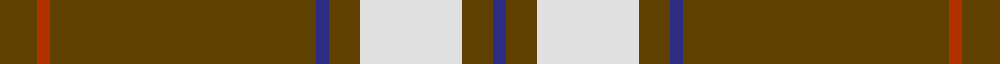
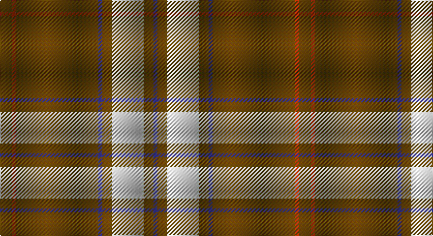

This page is one **sett** — a single exact thread-count. It belongs to the [tartan](/setts/dy6r2dy42db2dy5w16dy5db2/)
(the same proportion at any scale), whose colour order is pattern [BGWGBGRG](/stripes/bgwgbgrg/).

Part of the [Glenlivet Dress](/tartans/glenlivet-dress/) tartan — the named design grouping this sett with its other cloths.

Sourced from tartans-authority.  It is a [8 stripe tartan](/stripes/stripes8/).

Original link http://www.tartansauthority.com/tartan-ferret/display/3941/

## Also known as

This cloth is also recorded under:

- Glenlivet Dress Reproduction

## Register references

External register numbers recorded for this tartan.

- Scottish Tartans Authority (ITI): 3941

## Thread count
T/12 R4 T84 DB4 T10 LN32 T10 DB/4

One full sett is **304 threads**.

## Palette

Palette: <strong>Tartan Register</strong>
<table><thead><tr><th>Colour</th><th>Threads</th><th>Shade</th><th>Base</th><th>OKLCh</th></tr></thead><tbody><tr><td>T/</td><td style="text-align:right;font-variant-numeric:tabular-nums">12</td><td><code style="background-color:#604000;">#604000</code> <small style="color:#888">#604000</small></td><td>G <code style="background-color:#006100;">#006100</code></td><td><small style="color:#888">oklch(39.8% 0.083 76.8)</small></td></tr><tr><td>R</td><td style="text-align:right;font-variant-numeric:tabular-nums">4</td><td><code style="background-color:#B03000;">#B03000</code> <small style="color:#888">#B03000</small></td><td>R <code style="background-color:#CC0000;">#CC0000</code></td><td><small style="color:#888">oklch(50.3% 0.171 36.3)</small></td></tr><tr><td>T</td><td style="text-align:right;font-variant-numeric:tabular-nums">84</td><td><code style="background-color:#604000;">#604000</code> <small style="color:#888">#604000</small></td><td>G <code style="background-color:#006100;">#006100</code></td><td><small style="color:#888">oklch(39.8% 0.083 76.8)</small></td></tr><tr><td>DB</td><td style="text-align:right;font-variant-numeric:tabular-nums">4</td><td><code style="background-color:#2C2C80;">#2C2C80</code> <small style="color:#888">#2C2C80</small></td><td>B <code style="background-color:#2A418A;">#2A418A</code></td><td><small style="color:#888">oklch(35.0% 0.138 276.6)</small></td></tr><tr><td>T</td><td style="text-align:right;font-variant-numeric:tabular-nums">10</td><td><code style="background-color:#604000;">#604000</code> <small style="color:#888">#604000</small></td><td>G <code style="background-color:#006100;">#006100</code></td><td><small style="color:#888">oklch(39.8% 0.083 76.8)</small></td></tr><tr><td>LN</td><td style="text-align:right;font-variant-numeric:tabular-nums">32</td><td><code style="background-color:#E0E0E0;">#E0E0E0</code> <small style="color:#888">#E0E0E0</small></td><td>W <code style="background-color:#F7F7F7;">#F7F7F7</code></td><td><small style="color:#888">oklch(90.7% 0.000 89.9)</small></td></tr><tr><td>T</td><td style="text-align:right;font-variant-numeric:tabular-nums">10</td><td><code style="background-color:#604000;">#604000</code> <small style="color:#888">#604000</small></td><td>G <code style="background-color:#006100;">#006100</code></td><td><small style="color:#888">oklch(39.8% 0.083 76.8)</small></td></tr><tr><td>DB/</td><td style="text-align:right;font-variant-numeric:tabular-nums">4</td><td><code style="background-color:#2C2C80;">#2C2C80</code> <small style="color:#888">#2C2C80</small></td><td>B <code style="background-color:#2A418A;">#2A418A</code></td><td><small style="color:#888">oklch(35.0% 0.138 276.6)</small></td></tr></tbody></table>

# Sample pattern

## Compared to the master

This cloth is one sett of its design; the master sett (the exemplar the design is anchored on) is below for comparison.

<figure style="margin:0"><figcaption style="color:#888;font-size:smaller">this sett</figcaption></figure>
<figure style="margin:0"><figcaption style="color:#888;font-size:smaller"><a href="/setts/w16dy5db2dy42r2dy6r2dy42db2dy5w16dy5db2dy5/">master sett →</a></figcaption></figure>

## Nearest tartans

The nearest existing variants by ΔTartan distance, with this tartan at the top so the swatches line up against it.

ΔTartan

Tartan

Sett

—

<a href="/ttd/edit/#slug=dy6r2dy42db2dy5w16dy5db2~x2">Glenlivet Dress Reproduction (Corp)</a> <a class="nn-out" href="/variants/s8/dy6r2dy42db2dy5w16dy5db2~x2/" title="open its dictionary page">↗</a>

1.14

<a href="/ttd/edit/#slug=w16dy5db2dy42r2dy6r2dy42db2dy5w16dy5db2dy5~x2&amp;base=dy6r2dy42db2dy5w16dy5db2~x2">Glenlivet Dress Reproduction</a> <a class="nn-out" href="/variants/s14/w16dy5db2dy42r2dy6r2dy42db2dy5w16dy5db2dy5~x2/" title="open its dictionary page">↗</a>

1.32

<a href="/ttd/edit/#slug=w3k5lo3r3lo32k2lo3~x2&amp;base=dy6r2dy42db2dy5w16dy5db2~x2">Bro-Dreger</a> <a class="nn-out" href="/variants/s7/w3k5lo3r3lo32k2lo3~x2/" title="open its dictionary page">↗</a>

1.34

<a href="/ttd/edit/#slug=ly5k9ly2k7lo35r4lo35k4~x2&amp;base=dy6r2dy42db2dy5w16dy5db2~x2">Wilbers</a> <a class="nn-out" href="/variants/s8/ly5k9ly2k7lo35r4lo35k4~x2/" title="open its dictionary page">↗</a>

1.44

<a href="/ttd/edit/#slug=y24y1k9y1y9y2w2db2~x2&amp;base=dy6r2dy42db2dy5w16dy5db2~x2">Gairloch</a> <a class="nn-out" href="/variants/s8/y24y1k9y1y9y2w2db2~x2/" title="open its dictionary page">↗</a>

1.44

<a href="/ttd/edit/#slug=o12lb1k2o1r1~x8&amp;base=dy6r2dy42db2dy5w16dy5db2~x2">Lochcarron Camel</a> <a class="nn-out" href="/variants/s5/o12lb1k2o1r1~x8/" title="open its dictionary page">↗</a>

1.53

<a href="/ttd/edit/#slug=dg3r6dg2r1dg2r1dg16w1dg2w3~x4&amp;base=dy6r2dy42db2dy5w16dy5db2~x2">Prince of Wales (Fashion)</a> <a class="nn-out" href="/variants/s10/dg3r6dg2r1dg2r1dg16w1dg2w3~x4/" title="open its dictionary page">↗</a>

1.56

<a href="/ttd/edit/#slug=lo49db16k2w3db2w2db3lo2~x2&amp;base=dy6r2dy42db2dy5w16dy5db2~x2">Irn Bru Corporate Tartan</a> <a class="nn-out" href="/variants/s8/lo49db16k2w3db2w2db3lo2~x2/" title="open its dictionary page">↗</a>

1.57

<a href="/ttd/edit/#slug=w7dy7w7dy40r3~x2&amp;base=dy6r2dy42db2dy5w16dy5db2~x2">Coca Cola</a> <a class="nn-out" href="/variants/s5/w7dy7w7dy40r3~x2/" title="open its dictionary page">↗</a>

1.60

<a href="/ttd/edit/#slug=w15dy15w15dy80r6&amp;base=dy6r2dy42db2dy5w16dy5db2~x2">Coca Cola (Corporate)</a> <a class="nn-out" href="/variants/s5/w15dy15w15dy80r6/" title="open its dictionary page">↗</a>

1.61

<a href="/ttd/edit/#slug=dg4r16dg4r2dg3r2dg32w2dg2w3~x2&amp;base=dy6r2dy42db2dy5w16dy5db2~x2">Rothesay Hunting Family Tartan</a> <a class="nn-out" href="/variants/s10/dg4r16dg4r2dg3r2dg32w2dg2w3~x2/" title="open its dictionary page">↗</a>

## Neighbour map

Every grey dot is one of 14360 variants placed by the first two principal components of the ΔTartan feature space (44% of its variance). Red is this tartan; blue dots are its nearest — click one to open its page.

<svg viewBox="0 0 640 380" role="img" style="max-width:100%;height:auto;border:1px solid #e0e0e0;border-radius:4px;display:block" xmlns="http://www.w3.org/2000/svg"><image href="/nn/cloud.v1.png" width="640" height="380"/><a href="/variants/s14/w16dy5db2dy42r2dy6r2dy42db2dy5w16dy5db2dy5~x2/"><circle cx="436.5" cy="114.4" r="4" fill="#3465a4"><title>Glenlivet Dress Reproduction</title></circle></a><a href="/variants/s7/w3k5lo3r3lo32k2lo3~x2/"><circle cx="467.8" cy="144.4" r="4" fill="#3465a4"><title>Bro-Dreger</title></circle></a><a href="/variants/s8/ly5k9ly2k7lo35r4lo35k4~x2/"><circle cx="398.5" cy="150.5" r="4" fill="#3465a4"><title>Wilbers</title></circle></a><a href="/variants/s8/y24y1k9y1y9y2w2db2~x2/"><circle cx="470.3" cy="147.3" r="4" fill="#3465a4"><title>Gairloch</title></circle></a><a href="/variants/s5/o12lb1k2o1r1~x8/"><circle cx="466.1" cy="174.0" r="4" fill="#3465a4"><title>Lochcarron Camel</title></circle></a><a href="/variants/s10/dg3r6dg2r1dg2r1dg16w1dg2w3~x4/"><circle cx="416.2" cy="166.9" r="4" fill="#3465a4"><title>Prince of Wales (Fashion)</title></circle></a><a href="/variants/s8/lo49db16k2w3db2w2db3lo2~x2/"><circle cx="412.4" cy="102.8" r="4" fill="#3465a4"><title>Irn Bru Corporate Tartan</title></circle></a><a href="/variants/s5/w7dy7w7dy40r3~x2/"><circle cx="454.2" cy="197.0" r="4" fill="#3465a4"><title>Coca Cola</title></circle></a><a href="/variants/s5/w15dy15w15dy80r6/"><circle cx="444.0" cy="198.1" r="4" fill="#3465a4"><title>Coca Cola (Corporate)</title></circle></a><a href="/variants/s10/dg4r16dg4r2dg3r2dg32w2dg2w3~x2/"><circle cx="413.0" cy="158.2" r="4" fill="#3465a4"><title>Rothesay Hunting Family Tartan</title></circle></a><circle cx="451.4" cy="136.5" r="5" fill="#c00000"/></svg>

ID: /variants/s8/dy6r2dy42db2dy5w16dy5db2~x2/
