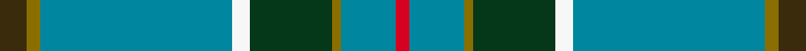

This is one **variant** — a specific cloth: this exact thread count and colourway, with its own
provenance below. It is one weaving of the [sett](/tartans/g/gl/glasgow-high/) (the scale-free proportion — the
same cloth at any scale or shade), whose colour order is pattern [GGBWGGBR](/stripes/ggbwggbr/).

Part of the [Glasgow High](/tartans/g/gl/glasgow-high/) tartan — the named design grouping this sett with its other cloths.

Sourced from tartans-authority.  It is a [8 stripe tartan](/stripes/stripes8/).

Original link <code>http://www.tartansauthority.com/tartan-ferret/display/7480/</code> — retired · [Internet Archive copy](https://web.archive.org/web/*/http://www.tartansauthority.com/tartan-ferret/display/7480/*)

2 attestations — the source records this cloth was collapsed from (oldest owns this page)

<ul>
<li>July 2007 — Glasgow High (School) (tartans-authority, <a href="https://web.archive.org/web/*/http://www.tartansauthority.com/tartan-ferret/display/7480/*">record</a>)  <em>The High School of Glasgow is a private, fee-paying school in the City and this tartan is used as part of the pupils' uniform. Woven sample from Lochcarron.</em></li>
<li>undated — Glasgow High School (register-of-tartans, <a href="https://www.tartanregister.gov.uk/tartanDetails.aspx?ref=5522">record</a>)  <em>The High School of Glasgow is a private, fee-paying school in the City and this tartan is used as part of the pupils' uniform. Woven sample from Lochcarron.</em></li>
</ul>

Dataset <small>— provenance for this record, inherited from the source manifest</small>

<dl class="dataset-prov">
<dt>source</dt><dd><a href="/sources/tartans-authority/">Scottish Tartans Authority</a></dd>
<dt>data captured from</dt><dd><a href="https://github.com/thetartan/tartan-database/blob/master/data/tartans-authority/data.csv">https://github.com/thetartan/tartan-database/blob/master/data/tartans-authority/data.csv</a></dd>
<dt>data date</dt><dd>July 2007 <small>(this record)</small></dd>
<dt>licence</dt><dd><a href="https://creativecommons.org/licenses/by-nc-nd/4.0/">CC BY-NC-ND 4.0</a></dd>
</dl>

Capture chain <small>— the hands this data passed through, oldest first; each capture carries its own licence</small>

<ol class="capture-chain">
<li><a href="https://www.tartansauthority.com/">Scottish Tartans Authority</a> <small>the heritage body’s archive — its tartan-ferret record browser is retired; dead record links are shown unlinked, with an Internet Archive copy (ITI numbers are not SRT references)</small></li>
<li><a href="https://github.com/thetartan/tartan-database">thetartan/tartan-database</a> <small>2016-2017</small> · <a href="https://creativecommons.org/licenses/by-nc-nd/4.0/">CC BY-NC-ND 4.0</a> <small>Levko Kravets's frozen compilation — the capture we vendored, and where its CC licence text came from</small></li>
<li>this dictionary <small>captured 2026-06-10 · commit 5bf86c7566</small> <small>each re-capture is a git commit to data/sources</small></li>
</ol>

## Register references

External register numbers recorded for this tartan.

- Scottish Register of Tartans: [5522](https://www.tartanregister.gov.uk/tartanDetails.aspx?ref=5522)
- Scottish Tartans Authority (ITI): 7480

## Thread count
DY/12 Y6 T84 W8 DG36 Y4 T24 R/6

One full sett is **342 threads**.

## Palette
<table><thead><tr><th>Colour</th><th>Shade</th><th>OKLCh</th></tr></thead><tbody><tr><td>DG</td><td><code style="background-color:#053819;">#053819</code> <small style="color:#888">#053819</small></td><td><small style="color:#888">oklch(30.0% 0.075 151.3)</small></td></tr><tr><td>W</td><td><code style="background-color:#F7F7F7;">#F7F7F7</code> <small style="color:#888">#F7F7F7</small></td><td><small style="color:#888">oklch(97.6% 0.000 89.9)</small></td></tr><tr><td>T</td><td><code style="background-color:#00879F;">#00879F</code> <small style="color:#888">#00879F</small></td><td><small style="color:#888">oklch(57.4% 0.102 216.1)</small></td></tr><tr><td>R</td><td><code style="background-color:#D60020;">#D60020</code> <small style="color:#888">#D60020</small></td><td><small style="color:#888">oklch(55.2% 0.224 25.5)</small></td></tr><tr><td>DY</td><td><code style="background-color:#3A2B0D;">#3A2B0D</code> <small style="color:#888">#3A2B0D</small></td><td><small style="color:#888">oklch(30.0% 0.049 82.0)</small></td></tr><tr><td>Y</td><td><code style="background-color:#8B6E00;">#8B6E00</code> <small style="color:#888">#8B6E00</small></td><td><small style="color:#888">oklch(55.1% 0.113 90.4)</small></td></tr></tbody></table>

# Sample pattern

## Nearest tartan variants

The nearest existing variants by ΔTartan distance, with this cloth at the top so the swatches line up against it.

ΔTartan

Threads

Variant

Sett

—

342

<a href="/variants/s8/dy6y3t42w4dg18y2t12r3~x2/">Glasgow High (School)</a>

<a href="/ttd/edit/#slug=t33w2r3w2db14ri3g15t20r2t3~x2~r5221030-ri6914021&amp;base=dy6y3t42w4dg18y2t12r3~x2" title="compare in the TTD">1.82</a>

316

<a href="/variants/s10/t33w2r3w2db14ri3g15t20r2t3~x2~r5221030-ri6914021/">Kansai St Andrews Society (Corp)</a>

<a href="/ttd/edit/#slug=k3t2g13w2t24dr3~x4~t5912243-g6019141&amp;base=dy6y3t42w4dg18y2t12r3~x2" title="compare in the TTD">1.94</a>

352

<a href="/variants/s6/k3t2g13w2t24dr3~x4~t5912243-g6019141/">Vance</a>

<a href="/ttd/edit/#slug=db5r3g2r3dg12t34g2w2~x2&amp;base=dy6y3t42w4dg18y2t12r3~x2" title="compare in the TTD">2.05</a>

238

<a href="/variants/s8/db5r3g2r3dg12t34g2w2~x2/">Moran (Wedding) (Personal)</a>

<a href="/ttd/edit/#slug=db3lb3g30db25dp4r3y2dp1~x2~dp3717327-r5221021&amp;base=dy6y3t42w4dg18y2t12r3~x2" title="compare in the TTD">2.22</a>

276

<a href="/variants/s8/db3lb3g30db25dp4r3y2dp1~x2~dp3717327-r5221021/">Young</a>

<a href="/ttd/edit/#slug=db3lb3g30db25dp4r3y2dp1~x2&amp;base=dy6y3t42w4dg18y2t12r3~x2" title="compare in the TTD">2.22</a>

276

<a href="/variants/s8/db3lb3g30db25dp4r3y2dp1~x2/">Young (Clan)</a>

<a href="/ttd/edit/#slug=n18y1n2y1n2db6w4o1g6~x2&amp;base=dy6y3t42w4dg18y2t12r3~x2" title="compare in the TTD">2.60</a>

116

<a href="/variants/s9/n18y1n2y1n2db6w4o1g6~x2/">Nickel Lodge, Centennial</a>

<a href="/ttd/edit/#slug=db5r3g2r3dg12t34g2w2~x2~dg4410159&amp;base=dy6y3t42w4dg18y2t12r3~x2" title="compare in the TTD">2.65</a>

238

<a href="/variants/s8/db5r3g2r3dg12t34g2w2~x2~dg4410159/">Moran (Drummond) Personal Tartan</a>

<a href="/ttd/edit/#slug=db23w1r3w1db12y9g40dp3~x2&amp;base=dy6y3t42w4dg18y2t12r3~x2" title="compare in the TTD">2.71</a>

316

<a href="/variants/s8/db23w1r3w1db12y9g40dp3~x2/">Pictou County</a>

<a href="/ttd/edit/#slug=r5w4dbi6db2g43db2dbi4r3~x2~dbi3514276-db2911276&amp;base=dy6y3t42w4dg18y2t12r3~x2" title="compare in the TTD">2.88</a>

260

<a href="/variants/s8/r5w4dbi6db2g43db2dbi4r3~x2~dbi3514276-db2911276/">Mullikin (2013)</a>

<a href="/ttd/edit/#slug=t48dp4t8lr2t4r3t4dg14dr7t2dr4r2~x2&amp;base=dy6y3t42w4dg18y2t12r3~x2" title="compare in the TTD">2.88</a>

308

<a href="/variants/s12/t48dp4t8lr2t4r3t4dg14dr7t2dr4r2~x2/">Louth, County</a>

## Neighbour map

Every grey dot is one of 13662 variants placed by the first two principal components of the ΔTartan feature space (42% of its variance). Red is this tartan; blue dots are its nearest — click one to open its page. The map is a flat projection of a many-dimensional space — [how to read it](/posts/neighbourhood-maps/).

<svg viewBox="0 0 640 380" role="img" style="max-width:100%;height:auto;border:1px solid #e0e0e0;border-radius:4px;display:block" xmlns="http://www.w3.org/2000/svg"><image href="/nn/cloud.v1.png" width="640" height="380"/><a href="/variants/s10/t33w2r3w2db14ri3g15t20r2t3~x2~r5221030-ri6914021/"><circle cx="317.9" cy="152.2" r="4" fill="#3465a4"><title>Kansai St Andrews Society (Corp)</title></circle></a><a href="/variants/s6/k3t2g13w2t24dr3~x4~t5912243-g6019141/"><circle cx="274.8" cy="172.5" r="4" fill="#3465a4"><title>Vance</title></circle></a><a href="/variants/s8/db5r3g2r3dg12t34g2w2~x2/"><circle cx="302.4" cy="137.1" r="4" fill="#3465a4"><title>Moran (Wedding) (Personal)</title></circle></a><a href="/variants/s8/db3lb3g30db25dp4r3y2dp1~x2~dp3717327-r5221021/"><circle cx="260.1" cy="117.2" r="4" fill="#3465a4"><title>Young</title></circle></a><a href="/variants/s8/db3lb3g30db25dp4r3y2dp1~x2/"><circle cx="259.5" cy="117.3" r="4" fill="#3465a4"><title>Young (Clan)</title></circle></a><a href="/variants/s9/n18y1n2y1n2db6w4o1g6~x2/"><circle cx="293.1" cy="140.5" r="4" fill="#3465a4"><title>Nickel Lodge, Centennial</title></circle></a><a href="/variants/s8/db5r3g2r3dg12t34g2w2~x2~dg4410159/"><circle cx="332.8" cy="149.2" r="4" fill="#3465a4"><title>Moran (Drummond) Personal Tartan</title></circle></a><a href="/variants/s8/db23w1r3w1db12y9g40dp3~x2/"><circle cx="278.2" cy="121.1" r="4" fill="#3465a4"><title>Pictou County</title></circle></a><a href="/variants/s8/r5w4dbi6db2g43db2dbi4r3~x2~dbi3514276-db2911276/"><circle cx="360.6" cy="121.1" r="4" fill="#3465a4"><title>Mullikin (2013)</title></circle></a><a href="/variants/s12/t48dp4t8lr2t4r3t4dg14dr7t2dr4r2~x2/"><circle cx="398.0" cy="105.5" r="4" fill="#3465a4"><title>Louth, County</title></circle></a><circle cx="346.8" cy="142.3" r="5" fill="#c00000"/><text x="320" y="376" text-anchor="middle" font-size="11" fill="#999">ground</text><text x="11" y="190" text-anchor="middle" font-size="11" fill="#999" transform="rotate(-90 11 190)">complexity</text></svg>

ID: /variants/s8/dy6y3t42w4dg18y2t12r3~x2/
