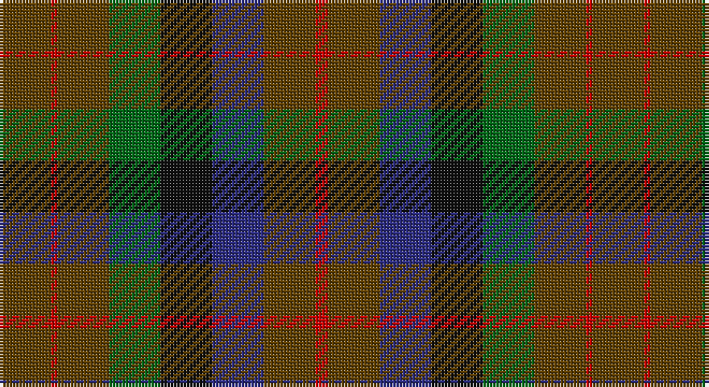

This page is one **sett** — a single exact thread-count. It belongs to the [tartan](/setts/dy8r1dy8g8k8db8dy8r2/)
(the same proportion at any scale), whose colour order is pattern [GRGGKBGR](/stripes/grggkbgr/).

Part of the [MacDuff Hunting](/tartans/macduff-hunting/) tartan — the named design grouping this sett with its other cloths.

Sourced from house-of-tartan.  It is a [8 stripe tartan](/stripes/stripes8/).

Original link http://www.house-of-tartan.scotland.net/house/TartanViewjs.asp?colr=Def&tnam=1654

## Provenance

Earliest known date: 1906 STS records (sic) 'Sett may be quite wrong. (S.S. May 86)'

## Also known as

This cloth is also recorded under:

- MacDuff Htg
- MacDuff, hunting

## Thread count
T/16 R2 T16 G16 K16 DB16 T16 R/4

One full sett is **184 threads**.

## Palette

Palette: <strong>Tartan Register</strong>
<table><thead><tr><th>Colour</th><th>Threads</th><th>Shade</th><th>Base</th><th>OKLCh</th></tr></thead><tbody><tr><td>T/</td><td style="text-align:right;font-variant-numeric:tabular-nums">16</td><td><code style="background-color:#604000;">#604000</code> <small style="color:#888">#604000</small></td><td>G <code style="background-color:#006100;">#006100</code></td><td><small style="color:#888">oklch(39.8% 0.083 76.8)</small></td></tr><tr><td>R</td><td style="text-align:right;font-variant-numeric:tabular-nums">2</td><td><code style="background-color:#C80000;">#C80000</code> <small style="color:#888">#C80000</small></td><td>R <code style="background-color:#CC0000;">#CC0000</code></td><td><small style="color:#888">oklch(52.3% 0.215 29.2)</small></td></tr><tr><td>T</td><td style="text-align:right;font-variant-numeric:tabular-nums">16</td><td><code style="background-color:#604000;">#604000</code> <small style="color:#888">#604000</small></td><td>G <code style="background-color:#006100;">#006100</code></td><td><small style="color:#888">oklch(39.8% 0.083 76.8)</small></td></tr><tr><td>G</td><td style="text-align:right;font-variant-numeric:tabular-nums">16</td><td><code style="background-color:#006818;">#006818</code> <small style="color:#888">#006818</small></td><td>G <code style="background-color:#006100;">#006100</code></td><td><small style="color:#888">oklch(45.0% 0.142 145.0)</small></td></tr><tr><td>K</td><td style="text-align:right;font-variant-numeric:tabular-nums">16</td><td><code style="background-color:#101010;">#101010</code> <small style="color:#888">#101010</small></td><td>K <code style="background-color:#000000;">#000000</code></td><td><small style="color:#888">oklch(17.3% 0.000 89.9)</small></td></tr><tr><td>DB</td><td style="text-align:right;font-variant-numeric:tabular-nums">16</td><td><code style="background-color:#2C2C80;">#2C2C80</code> <small style="color:#888">#2C2C80</small></td><td>B <code style="background-color:#2A418A;">#2A418A</code></td><td><small style="color:#888">oklch(35.0% 0.138 276.6)</small></td></tr><tr><td>T</td><td style="text-align:right;font-variant-numeric:tabular-nums">16</td><td><code style="background-color:#604000;">#604000</code> <small style="color:#888">#604000</small></td><td>G <code style="background-color:#006100;">#006100</code></td><td><small style="color:#888">oklch(39.8% 0.083 76.8)</small></td></tr><tr><td>R/</td><td style="text-align:right;font-variant-numeric:tabular-nums">4</td><td><code style="background-color:#C80000;">#C80000</code> <small style="color:#888">#C80000</small></td><td>R <code style="background-color:#CC0000;">#CC0000</code></td><td><small style="color:#888">oklch(52.3% 0.215 29.2)</small></td></tr></tbody></table>

# Sample pattern

## Compared to the master

This cloth is one sett of its design; the master sett (the exemplar the design is anchored on) is below for comparison.

<figure style="margin:0"><figcaption style="color:#888;font-size:smaller">this sett</figcaption></figure>
<figure style="margin:0"><figcaption style="color:#888;font-size:smaller"><a href="/setts/do10r2do10g17k12db9do9r2/">master sett →</a></figcaption></figure>

## Nearest tartans

The nearest existing variants by ΔTartan distance, with this tartan at the top so the swatches line up against it.

ΔTartan

Tartan

Sett

—

<a href="/ttd/edit/#slug=dy8r1dy8g8k8db8dy8r2~x2">MacDuff Hunting Clan Tartan</a> <a class="nn-out" href="/variants/s8/dy8r1dy8g8k8db8dy8r2~x2/" title="open its dictionary page">↗</a>

0.87

<a href="/ttd/edit/#slug=do10r2do10g17k12db9do9r2~x2&amp;base=dy8r1dy8g8k8db8dy8r2~x2">MacDuff Hunting</a> <a class="nn-out" href="/variants/s8/do10r2do10g17k12db9do9r2~x2/" title="open its dictionary page">↗</a>

1.03

<a href="/ttd/edit/#slug=r1dy7db7k7g7dy7r1~x4&amp;base=dy8r1dy8g8k8db8dy8r2~x2">Tennant Family Tartan</a> <a class="nn-out" href="/variants/s7/r1dy7db7k7g7dy7r1~x4/" title="open its dictionary page">↗</a>

1.10

<a href="/ttd/edit/#slug=o16dg29n19g8n19dg29o16r4~x2&amp;base=dy8r1dy8g8k8db8dy8r2~x2">Styrian</a> <a class="nn-out" href="/variants/s8/o16dg29n19g8n19dg29o16r4~x2/" title="open its dictionary page">↗</a>

1.22

<a href="/ttd/edit/#slug=do10r3do10g14k12db12do14r4~x2&amp;base=dy8r1dy8g8k8db8dy8r2~x2">Wcwm 1310</a> <a class="nn-out" href="/variants/s8/do10r3do10g14k12db12do14r4~x2/" title="open its dictionary page">↗</a>

1.23

<a href="/ttd/edit/#slug=dy7r3dy9g15db19dy14r4~x2&amp;base=dy8r1dy8g8k8db8dy8r2~x2">Dorward/Dogwood</a> <a class="nn-out" href="/variants/s7/dy7r3dy9g15db19dy14r4~x2/" title="open its dictionary page">↗</a>

1.30

<a href="/ttd/edit/#slug=r1dy7g7k7b7dy7r1~x4&amp;base=dy8r1dy8g8k8db8dy8r2~x2">Tennant (Clan)</a> <a class="nn-out" href="/variants/s7/r1dy7g7k7b7dy7r1~x4/" title="open its dictionary page">↗</a>

1.36

<a href="/ttd/edit/#slug=dr5g6dy1g6dr5db6dr1~x2&amp;base=dy8r1dy8g8k8db8dy8r2~x2">Gleneagles Group Corporate Tartan</a> <a class="nn-out" href="/variants/s7/dr5g6dy1g6dr5db6dr1~x2/" title="open its dictionary page">↗</a>

1.40

<a href="/ttd/edit/#slug=r2dy15dg12dy2dt12dy2dg12dy15o2~x4&amp;base=dy8r1dy8g8k8db8dy8r2~x2">Amazing Union (Personal)</a> <a class="nn-out" href="/variants/s9/r2dy15dg12dy2dt12dy2dg12dy15o2~x4/" title="open its dictionary page">↗</a>

1.41

<a href="/variants/s10/dy2lr1dy5k4do5o1~x4/">Huntly #3</a>

1.47

<a href="/ttd/edit/#slug=o13ly3o13g23dy16dr13o23r5~x2&amp;base=dy8r1dy8g8k8db8dy8r2~x2">Unidentified 2</a> <a class="nn-out" href="/variants/s8/o13ly3o13g23dy16dr13o23r5~x2/" title="open its dictionary page">↗</a>

## Neighbour map

Every grey dot is one of 14360 variants placed by the first two principal components of the ΔTartan feature space (44% of its variance). Red is this tartan; blue dots are its nearest — click one to open its page.

<svg viewBox="0 0 640 380" role="img" style="max-width:100%;height:auto;border:1px solid #e0e0e0;border-radius:4px;display:block" xmlns="http://www.w3.org/2000/svg"><image href="/nn/cloud.v1.png" width="640" height="380"/><a href="/variants/s8/do10r2do10g17k12db9do9r2~x2/"><circle cx="191.6" cy="249.8" r="4" fill="#3465a4"><title>MacDuff Hunting</title></circle></a><a href="/variants/s7/r1dy7db7k7g7dy7r1~x4/"><circle cx="167.7" cy="262.2" r="4" fill="#3465a4"><title>Tennant Family Tartan</title></circle></a><a href="/variants/s8/o16dg29n19g8n19dg29o16r4~x2/"><circle cx="195.1" cy="267.6" r="4" fill="#3465a4"><title>Styrian</title></circle></a><a href="/variants/s8/do10r3do10g14k12db12do14r4~x2/"><circle cx="175.0" cy="294.8" r="4" fill="#3465a4"><title>Wcwm 1310</title></circle></a><a href="/variants/s7/dy7r3dy9g15db19dy14r4~x2/"><circle cx="229.6" cy="280.8" r="4" fill="#3465a4"><title>Dorward/Dogwood</title></circle></a><a href="/variants/s7/r1dy7g7k7b7dy7r1~x4/"><circle cx="151.6" cy="254.5" r="4" fill="#3465a4"><title>Tennant (Clan)</title></circle></a><a href="/variants/s7/dr5g6dy1g6dr5db6dr1~x2/"><circle cx="212.9" cy="284.6" r="4" fill="#3465a4"><title>Gleneagles Group Corporate Tartan</title></circle></a><a href="/variants/s9/r2dy15dg12dy2dt12dy2dg12dy15o2~x4/"><circle cx="270.8" cy="243.2" r="4" fill="#3465a4"><title>Amazing Union (Personal)</title></circle></a><a href="/variants/s10/dy2lr1dy5k4do5o1~x4/"><circle cx="167.3" cy="261.3" r="4" fill="#3465a4"><title>Huntly #3</title></circle></a><a href="/variants/s8/o13ly3o13g23dy16dr13o23r5~x2/"><circle cx="184.5" cy="233.1" r="4" fill="#3465a4"><title>Unidentified 2</title></circle></a><circle cx="215.7" cy="264.8" r="5" fill="#c00000"/></svg>

ID: /variants/s8/dy8r1dy8g8k8db8dy8r2~x2/
