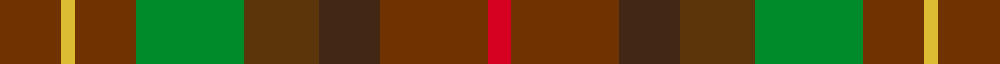

This page is one **sett** — a single exact thread-count. It belongs to the [tartan](/setts/dyi13ly3dyi13g23dy16do13dyi23r5/)
(the same proportion at any scale), whose colour order is pattern [GYGGGBGR](/stripes/gygggbgr/).

Sourced from register-of-tartans.  It is a [8 stripe tartan](/stripes/stripes8/).

Original link https://www.tartanregister.gov.uk/tartanDetails.aspx?ref=4241

Dataset <small>— provenance for this record, inherited from the source manifest</small>

<dl class="dataset-prov">
<dt>source</dt><dd><a href="/sources/register-of-tartans/">Scottish Register of Tartans</a></dd>
<dt>data captured from</dt><dd><a href="https://github.com/thetartan/tartan-database/blob/master/data/register-of-tartans/data.csv">https://github.com/thetartan/tartan-database/blob/master/data/register-of-tartans/data.csv</a></dd>
<dt>data date</dt><dd>2017-01-06 <small>(dataset default)</small></dd>
<dt>licence</dt><dd><a href="https://www.tartanregister.gov.uk/copyright">Crown copyright</a></dd>
</dl>

Capture chain <small>— the hands this data passed through, oldest first; each capture carries its own licence</small>

<ol class="capture-chain">
<li><a href="https://www.tartanregister.gov.uk/">Scottish Register of Tartans</a> · <a href="https://www.tartanregister.gov.uk/copyright">Crown copyright</a> <small>the living register — still published by National Records of Scotland</small></li>
<li><a href="https://github.com/thetartan/tartan-database">thetartan/tartan-database</a> <small>2016-2017</small> · <a href="https://creativecommons.org/licenses/by-nc-nd/4.0/">CC BY-NC-ND 4.0</a> <small>Levko Kravets's frozen compilation — the capture we vendored, and where its CC licence text came from</small></li>
<li>this dictionary <small>captured 2026-06-10 · commit 5bf86c7566</small> <small>each re-capture is a git commit to data/sources</small></li>
</ol>

## Register references

External register numbers recorded for this tartan.

- Scottish Register of Tartans: [4241](https://www.tartanregister.gov.uk/tartanDetails.aspx?ref=4241)
- Scottish Tartans World Register: 1664

## Thread count
DYi/26 LY6 DYi26 G46 DY32 DO26 DYi46 R/10

One full sett is **400 threads**.

## Palette
<table><thead><tr><th>Colour</th><th>Shade</th><th>OKLCh</th></tr></thead><tbody><tr><td>G</td><td><code style="background-color:#008B2A;">#008B2A</code> <small style="color:#888">#008B2A</small></td><td><small style="color:#888">oklch(55.4% 0.170 145.9)</small></td></tr><tr><td>DO</td><td><code style="background-color:#412714;">#412714</code> <small style="color:#888">#412714</small></td><td><small style="color:#888">oklch(30.1% 0.050 55.7)</small></td></tr><tr><td>R</td><td><code style="background-color:#D60020;">#D60020</code> <small style="color:#888">#D60020</small></td><td><small style="color:#888">oklch(55.2% 0.224 25.5)</small></td></tr><tr><td>DY</td><td><code style="background-color:#703200;">#703200</code> <small style="color:#888">#703200</small></td><td><small style="color:#888">oklch(39.5% 0.103 50.8)</small></td></tr><tr><td>DY</td><td><code style="background-color:#5B360B;">#5B360B</code> <small style="color:#888">#5B360B</small></td><td><small style="color:#888">oklch(37.0% 0.076 64.4)</small></td></tr><tr><td>LY</td><td><code style="background-color:#DCBC32;">#DCBC32</code> <small style="color:#888">#DCBC32</small></td><td><small style="color:#888">oklch(80.0% 0.150 95.2)</small></td></tr></tbody></table>

# Sample pattern

## Nearest tartan variants

The nearest existing variants by ΔTartan distance, with this cloth at the top so the swatches line up against it.

ΔTartan

Threads

Variant

Sett

—

400

<a href="/variants/s8/dyi13ly3dyi13g23dy16do13dyi23r5~x2~dyi1604058-dy1503057/">Unidentified #40</a>

<a href="/ttd/edit/#slug=dr20lo4dr20g35do20dy16dr28r8~dr1305012-r1606028&amp;base=dyi13ly3dyi13g23dy16do13dyi23r5~x2~dyi1604058-dy1503057" title="compare in the TTD">3.71</a>

274

<a href="/variants/s8/dr20lo4dr20g35do20dy16dr28r8~dr1305012-r1606028/">Leighton (Personal)</a>

<a href="/ttd/edit/#slug=dr5lo1dr5g9do5dy4dr7r2~x4~dr1305012-r1606028&amp;base=dyi13ly3dyi13g23dy16do13dyi23r5~x2~dyi1604058-dy1503057" title="compare in the TTD">3.77</a>

276

<a href="/variants/s8/dr5lo1dr5g9do5dy4dr7r2~x4~dr1305012-r1606028/">Leighton (Personal)</a>

## Neighbour map

Every grey dot is one of 13620 variants placed by the first two principal components of the ΔTartan feature space (42% of its variance). Red is this tartan; blue dots are its nearest — click one to open its page.

<svg viewBox="0 0 640 380" role="img" style="max-width:100%;height:auto;border:1px solid #e0e0e0;border-radius:4px;display:block" xmlns="http://www.w3.org/2000/svg"><image href="/nn/cloud.v1.png" width="640" height="380"/><a href="/variants/s8/dr20lo4dr20g35do20dy16dr28r8~dr1305012-r1606028/"><circle cx="227.4" cy="238.6" r="4" fill="#3465a4"><title>Leighton (Personal)</title></circle></a><a href="/variants/s8/dr5lo1dr5g9do5dy4dr7r2~x4~dr1305012-r1606028/"><circle cx="226.7" cy="236.3" r="4" fill="#3465a4"><title>Leighton (Personal)</title></circle></a><circle cx="263.8" cy="260.5" r="5" fill="#c00000"/><text x="320" y="376" text-anchor="middle" font-size="11" fill="#999">ground</text><text x="11" y="190" text-anchor="middle" font-size="11" fill="#999" transform="rotate(-90 11 190)">complexity</text></svg>

ID: /variants/s8/dyi13ly3dyi13g23dy16do13dyi23r5~x2~dyi1604058-dy1503057/
