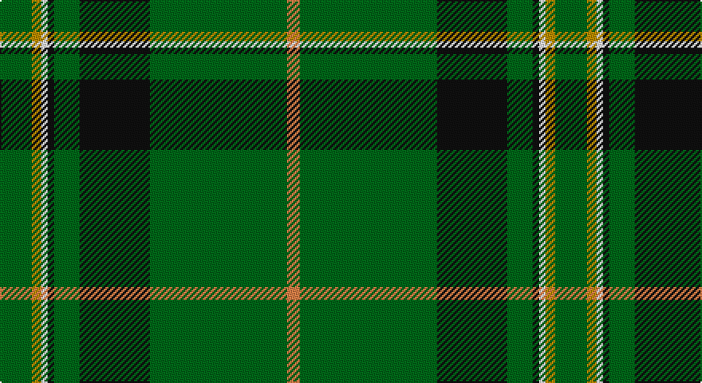

This page is one **sett** — a single exact thread-count. It belongs to the [tartan](/setts/g10loi3w2k2g8k22g43lo4/)
(the same proportion at any scale), whose colour order is pattern [GYWKGKGY](/stripes/gywkgkgy/).

Sourced from register-of-tartans.  It is a [8 stripe tartan](/stripes/stripes8/).

Original link https://www.tartanregister.gov.uk/tartanDetails.aspx?ref=607

2 attestations — the source records this cloth was collapsed from (oldest owns this page)

<ul>
<li>01/05/2004 — Celtic Pride (register-of-tartans, <a href="https://www.tartanregister.gov.uk/tartanDetails.aspx?ref=607">record</a>)</li>
<li>May 2004 — Celtic Pride (Fashion) (tartans-authority, <a href="http://www.tartansauthority.com/tartan-ferret/display/6267/">record</a>)</li>
</ul>

## Register references

External register numbers recorded for this tartan.

- Scottish Register of Tartans: [607](https://www.tartanregister.gov.uk/tartanDetails.aspx?ref=607)
- Scottish Tartans Authority (ITI): 6267

## Thread count
G/20 DY6 W4 K4 G16 K44 G86 O/8

One full sett is **348 threads**.

## Palette

Palette: <strong>Tartan Register</strong>
<table><thead><tr><th>Colour</th><th>Threads</th><th>Shade</th><th>Base</th><th>OKLCh</th></tr></thead><tbody><tr><td>G/</td><td style="text-align:right;font-variant-numeric:tabular-nums">20</td><td><code style="background-color:#006818;">#006818</code> <small style="color:#888">#006818</small></td><td>G <code style="background-color:#006100;">#006100</code></td><td><small style="color:#888">oklch(45.0% 0.142 145.0)</small></td></tr><tr><td>DY</td><td style="text-align:right;font-variant-numeric:tabular-nums">6</td><td><code style="background-color:#BC8C00;">#BC8C00</code> <small style="color:#888">#BC8C00</small></td><td>Y <code style="background-color:#F2BF00;">#F2BF00</code></td><td><small style="color:#888">oklch(66.8% 0.137 84.1)</small></td></tr><tr><td>W</td><td style="text-align:right;font-variant-numeric:tabular-nums">4</td><td><code style="background-color:#FCFCFC;">#FCFCFC</code> <small style="color:#888">#FCFCFC</small></td><td>W <code style="background-color:#F7F7F7;">#F7F7F7</code></td><td><small style="color:#888">oklch(99.1% 0.000 89.9)</small></td></tr><tr><td>K</td><td style="text-align:right;font-variant-numeric:tabular-nums">4</td><td><code style="background-color:#101010;">#101010</code> <small style="color:#888">#101010</small></td><td>K <code style="background-color:#000000;">#000000</code></td><td><small style="color:#888">oklch(17.3% 0.000 89.9)</small></td></tr><tr><td>G</td><td style="text-align:right;font-variant-numeric:tabular-nums">16</td><td><code style="background-color:#006818;">#006818</code> <small style="color:#888">#006818</small></td><td>G <code style="background-color:#006100;">#006100</code></td><td><small style="color:#888">oklch(45.0% 0.142 145.0)</small></td></tr><tr><td>K</td><td style="text-align:right;font-variant-numeric:tabular-nums">44</td><td><code style="background-color:#101010;">#101010</code> <small style="color:#888">#101010</small></td><td>K <code style="background-color:#000000;">#000000</code></td><td><small style="color:#888">oklch(17.3% 0.000 89.9)</small></td></tr><tr><td>G</td><td style="text-align:right;font-variant-numeric:tabular-nums">86</td><td><code style="background-color:#006818;">#006818</code> <small style="color:#888">#006818</small></td><td>G <code style="background-color:#006100;">#006100</code></td><td><small style="color:#888">oklch(45.0% 0.142 145.0)</small></td></tr><tr><td>O/</td><td style="text-align:right;font-variant-numeric:tabular-nums">8</td><td><code style="background-color:#EC8048;">#EC8048</code> <small style="color:#888">#EC8048</small></td><td>Y <code style="background-color:#F2BF00;">#F2BF00</code></td><td><small style="color:#888">oklch(71.0% 0.150 46.4)</small></td></tr></tbody></table>

# Sample pattern

## Nearest tartans

The nearest existing variants by ΔTartan distance, with this tartan at the top so the swatches line up against it.

ΔTartan

Tartan

Sett

—

<a href="/ttd/edit/#slug=g10loi3w2k2g8k22g43lo4~x2">Celtic Pride</a> <a class="nn-out" href="/variants/s8/g10loi3w2k2g8k22g43lo4~x2/" title="open its dictionary page">↗</a>

0.63

<a href="/ttd/edit/#slug=k3g2k3g18r2db2lo1~x4&amp;base=g10loi3w2k2g8k22g43lo4~x2">Selvon-Bruce (Personal)</a> <a class="nn-out" href="/variants/s7/k3g2k3g18r2db2lo1~x4/" title="open its dictionary page">↗</a>

0.89

<a href="/ttd/edit/#slug=k2w2db8k4g33r2g16w2~x2&amp;base=g10loi3w2k2g8k22g43lo4~x2">Sarros (Personal) XX</a> <a class="nn-out" href="/variants/s8/k2w2db8k4g33r2g16w2~x2/" title="open its dictionary page">↗</a>

1.00

<a href="/ttd/edit/#slug=db6w3r3g55k10r3~x4&amp;base=g10loi3w2k2g8k22g43lo4~x2">Military Medical Memorial (USA)</a> <a class="nn-out" href="/variants/s6/db6w3r3g55k10r3~x4/" title="open its dictionary page">↗</a>

1.06

<a href="/ttd/edit/#slug=g40db2w2db2ly2db23g32r2~x2&amp;base=g10loi3w2k2g8k22g43lo4~x2">Marshall, Fields</a> <a class="nn-out" href="/variants/s8/g40db2w2db2ly2db23g32r2~x2/" title="open its dictionary page">↗</a>

1.19

<a href="/ttd/edit/#slug=w1db6g4db1g16k1g4k6ly1~x4&amp;base=g10loi3w2k2g8k22g43lo4~x2">Henderson/MacKendrick</a> <a class="nn-out" href="/variants/s9/w1db6g4db1g16k1g4k6ly1~x4/" title="open its dictionary page">↗</a>

1.19

<a href="/ttd/edit/#slug=w1db6g4db1g16k1g4k6ly1~x2&amp;base=g10loi3w2k2g8k22g43lo4~x2">MacKendrick</a> <a class="nn-out" href="/variants/s9/w1db6g4db1g16k1g4k6ly1~x2/" title="open its dictionary page">↗</a>

1.21

<a href="/ttd/edit/#slug=db17r3g55db3g4db3g4ly3w5~x2&amp;base=g10loi3w2k2g8k22g43lo4~x2">Bundanoon (District)</a> <a class="nn-out" href="/variants/s9/db17r3g55db3g4db3g4ly3w5~x2/" title="open its dictionary page">↗</a>

1.22

<a href="/ttd/edit/#slug=g4lb1db2r1g1r1db2lb1g14lo1~x4&amp;base=g10loi3w2k2g8k22g43lo4~x2">Seattle (District)</a> <a class="nn-out" href="/variants/s10/g4lb1db2r1g1r1db2lb1g14lo1~x4/" title="open its dictionary page">↗</a>

1.25

<a href="/ttd/edit/#slug=k17y4gi51ly3g4ly3gi51y4k17db6~x2&amp;base=g10loi3w2k2g8k22g43lo4~x2">U.S. Army</a> <a class="nn-out" href="/variants/s10/k17y4gi51ly3g4ly3gi51y4k17db6~x2/" title="open its dictionary page">↗</a>

1.28

<a href="/ttd/edit/#slug=dg32w1k3w1g14dg7k3m3w1~x2&amp;base=g10loi3w2k2g8k22g43lo4~x2">Leach, Leech, Leitch, hunting</a> <a class="nn-out" href="/variants/s9/dg32w1k3w1g14dg7k3m3w1~x2/" title="open its dictionary page">↗</a>

## Neighbour map

Every grey dot is one of 14360 variants placed by the first two principal components of the ΔTartan feature space (44% of its variance). Red is this tartan; blue dots are its nearest — click one to open its page.

<svg viewBox="0 0 640 380" role="img" style="max-width:100%;height:auto;border:1px solid #e0e0e0;border-radius:4px;display:block" xmlns="http://www.w3.org/2000/svg"><image href="/nn/cloud.v1.png" width="640" height="380"/><a href="/variants/s7/k3g2k3g18r2db2lo1~x4/"><circle cx="378.6" cy="155.1" r="4" fill="#3465a4"><title>Selvon-Bruce (Personal)</title></circle></a><a href="/variants/s8/k2w2db8k4g33r2g16w2~x2/"><circle cx="405.8" cy="156.2" r="4" fill="#3465a4"><title>Sarros (Personal) XX</title></circle></a><a href="/variants/s6/db6w3r3g55k10r3~x4/"><circle cx="410.7" cy="150.4" r="4" fill="#3465a4"><title>Military Medical Memorial (USA)</title></circle></a><a href="/variants/s8/g40db2w2db2ly2db23g32r2~x2/"><circle cx="389.6" cy="148.9" r="4" fill="#3465a4"><title>Marshall, Fields</title></circle></a><a href="/variants/s9/w1db6g4db1g16k1g4k6ly1~x4/"><circle cx="326.6" cy="166.2" r="4" fill="#3465a4"><title>Henderson/MacKendrick</title></circle></a><a href="/variants/s9/w1db6g4db1g16k1g4k6ly1~x2/"><circle cx="326.6" cy="166.2" r="4" fill="#3465a4"><title>MacKendrick</title></circle></a><a href="/variants/s9/db17r3g55db3g4db3g4ly3w5~x2/"><circle cx="385.2" cy="128.0" r="4" fill="#3465a4"><title>Bundanoon (District)</title></circle></a><a href="/variants/s10/g4lb1db2r1g1r1db2lb1g14lo1~x4/"><circle cx="382.3" cy="139.5" r="4" fill="#3465a4"><title>Seattle (District)</title></circle></a><a href="/variants/s10/k17y4gi51ly3g4ly3gi51y4k17db6~x2/"><circle cx="353.8" cy="143.8" r="4" fill="#3465a4"><title>U.S. Army</title></circle></a><a href="/variants/s9/dg32w1k3w1g14dg7k3m3w1~x2/"><circle cx="367.5" cy="124.7" r="4" fill="#3465a4"><title>Leach, Leech, Leitch, hunting</title></circle></a><circle cx="382.5" cy="151.4" r="5" fill="#c00000"/></svg>

ID: /variants/s8/g10loi3w2k2g8k22g43lo4~x2/
