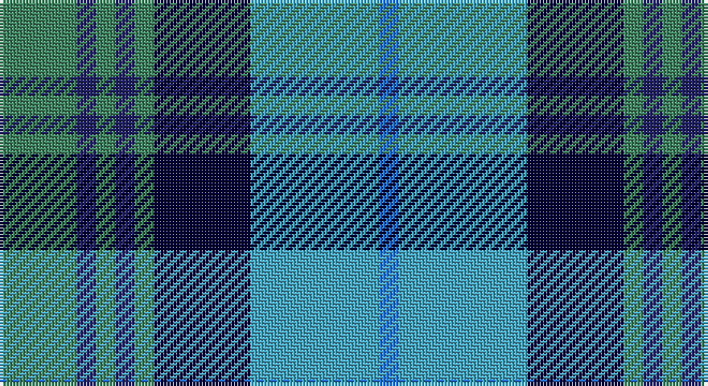

This page is one **sett** — a single exact thread-count. It belongs to the [tartan](/setts/g12db3g3db3g3k15lg20b3/)
(the same proportion at any scale), whose colour order is pattern [BYKGBGBG](/stripes/bykgbgbg/).

Part of the [Lemania](/tartans/lemania/) tartan — the named design grouping this sett with its other cloths.

Sourced from register-of-tartans.  It is a [8 stripe tartan](/stripes/stripes8/).

Original link https://www.tartanregister.gov.uk/tartanDetails.aspx?ref=10816

## Register references

External register numbers recorded for this tartan.

- Scottish Register of Tartans: [10816](https://www.tartanregister.gov.uk/tartanDetails.aspx?ref=10816)

## Thread count
G/24 DBa6 G6 DBa6 G6 DB30 B40 Ba/6

One full sett is **218 threads**.

## Palette

Palette: <strong>Tartan Register</strong> <small style="color:#888">(4 of 5 colours)</small>
<table><thead><tr><th>Colour</th><th>Threads</th><th>Shade</th><th>Base</th><th>OKLCh</th></tr></thead><tbody><tr><td>G/</td><td style="text-align:right;font-variant-numeric:tabular-nums">24</td><td><code style="background-color:#408060;">#408060</code> <small style="color:#888">#408060</small></td><td>G <code style="background-color:#006100;">#006100</code></td><td><small style="color:#888">oklch(54.8% 0.084 160.1)</small></td></tr><tr><td>DBa</td><td style="text-align:right;font-variant-numeric:tabular-nums">6</td><td><code style="background-color:#202060;">#202060</code> <small style="color:#888">#202060</small></td><td>B <code style="background-color:#2A418A;">#2A418A</code></td><td><small style="color:#888">oklch(28.9% 0.111 276.9)</small></td></tr><tr><td>G</td><td style="text-align:right;font-variant-numeric:tabular-nums">6</td><td><code style="background-color:#408060;">#408060</code> <small style="color:#888">#408060</small></td><td>G <code style="background-color:#006100;">#006100</code></td><td><small style="color:#888">oklch(54.8% 0.084 160.1)</small></td></tr><tr><td>DBa</td><td style="text-align:right;font-variant-numeric:tabular-nums">6</td><td><code style="background-color:#202060;">#202060</code> <small style="color:#888">#202060</small></td><td>B <code style="background-color:#2A418A;">#2A418A</code></td><td><small style="color:#888">oklch(28.9% 0.111 276.9)</small></td></tr><tr><td>G</td><td style="text-align:right;font-variant-numeric:tabular-nums">6</td><td><code style="background-color:#408060;">#408060</code> <small style="color:#888">#408060</small></td><td>G <code style="background-color:#006100;">#006100</code></td><td><small style="color:#888">oklch(54.8% 0.084 160.1)</small></td></tr><tr><td>DB</td><td style="text-align:right;font-variant-numeric:tabular-nums">30</td><td><code style="background-color:#000033;">#000033</code> <small style="color:#888">#000033</small></td><td>K <code style="background-color:#000000;">#000000</code></td><td><small style="color:#888">oklch(14.5% 0.101 264.1)</small></td></tr><tr><td>B</td><td style="text-align:right;font-variant-numeric:tabular-nums">40</td><td><code style="background-color:#48A4C0;">#48A4C0</code> <small style="color:#888">#48A4C0</small></td><td>Y <code style="background-color:#F2BF00;">#F2BF00</code></td><td><small style="color:#888">oklch(67.5% 0.096 221.0)</small></td></tr><tr><td>Ba/</td><td style="text-align:right;font-variant-numeric:tabular-nums">6</td><td><code style="background-color:#2474E8;">#2474E8</code> <small style="color:#888">#2474E8</small></td><td>B <code style="background-color:#2A418A;">#2A418A</code></td><td><small style="color:#888">oklch(57.8% 0.192 258.7)</small></td></tr></tbody></table>

# Sample pattern

## Nearest tartans

The nearest existing variants by ΔTartan distance, with this tartan at the top so the swatches line up against it.

ΔTartan

Tartan

Sett

—

<a href="/ttd/edit/#slug=g12db3g3db3g3k15lg20b3~x2">Lemania</a> <a class="nn-out" href="/variants/s8/g12db3g3db3g3k15lg20b3~x2/" title="open its dictionary page">↗</a>

1.03

<a href="/ttd/edit/#slug=b4ly2b16db15g16w3g3w4~x2&amp;base=g12db3g3db3g3k15lg20b3~x2">Business Air</a> <a class="nn-out" href="/variants/s8/b4ly2b16db15g16w3g3w4~x2/" title="open its dictionary page">↗</a>

1.11

<a href="/ttd/edit/#slug=g5t2g16t10k2w3db6t14w2db4w2~x2&amp;base=g12db3g3db3g3k15lg20b3~x2">Scottish Motor Trade Assoc. (Corp)</a> <a class="nn-out" href="/variants/s11/g5t2g16t10k2w3db6t14w2db4w2~x2/" title="open its dictionary page">↗</a>

1.13

<a href="/ttd/edit/#slug=dg12b8db4ly2r1ly1db6~x4&amp;base=g12db3g3db3g3k15lg20b3~x2">F.I.A.T.A. Congress of 1990</a> <a class="nn-out" href="/variants/s7/dg12b8db4ly2r1ly1db6~x4/" title="open its dictionary page">↗</a>

1.15

<a href="/ttd/edit/#slug=k2y10g4o5g2o3g2o5g4k15lb2~x2&amp;base=g12db3g3db3g3k15lg20b3~x2">Elwyn Glen (Scottish Borders)</a> <a class="nn-out" href="/variants/s11/k2y10g4o5g2o3g2o5g4k15lb2~x2/" title="open its dictionary page">↗</a>

1.22

<a href="/ttd/edit/#slug=r2g8w1k8b8k1b1~x6&amp;base=g12db3g3db3g3k15lg20b3~x2">Colquhoun #2</a> <a class="nn-out" href="/variants/s7/r2g8w1k8b8k1b1~x6/" title="open its dictionary page">↗</a>

1.26

<a href="/ttd/edit/#slug=r7k4t28k24ti24k4t4~x2&amp;base=g12db3g3db3g3k15lg20b3~x2">MacCorquodale</a> <a class="nn-out" href="/variants/s7/r7k4t28k24ti24k4t4~x2/" title="open its dictionary page">↗</a>

1.27

<a href="/ttd/edit/#slug=w3t2n14lr8t14db16n13t2w3~x2&amp;base=g12db3g3db3g3k15lg20b3~x2">Caitriot</a> <a class="nn-out" href="/variants/s9/w3t2n14lr8t14db16n13t2w3~x2/" title="open its dictionary page">↗</a>

1.30

<a href="/ttd/edit/#slug=r2t2r2t21lg11k17lb2~x2&amp;base=g12db3g3db3g3k15lg20b3~x2">Loch Ness (Fashion)</a> <a class="nn-out" href="/variants/s7/r2t2r2t21lg11k17lb2~x2/" title="open its dictionary page">↗</a>

1.32

<a href="/ttd/edit/#slug=t4n16k2n2k2n2k13o20w4~x2&amp;base=g12db3g3db3g3k15lg20b3~x2">Royal College of Surgeons of Edinburgh, The</a> <a class="nn-out" href="/variants/s9/t4n16k2n2k2n2k13o20w4~x2/" title="open its dictionary page">↗</a>

1.35

<a href="/ttd/edit/#slug=ly4k2b20k10g15k2r3~x2&amp;base=g12db3g3db3g3k15lg20b3~x2">Green MacLeod</a> <a class="nn-out" href="/variants/s7/ly4k2b20k10g15k2r3~x2/" title="open its dictionary page">↗</a>

## Neighbour map

Every grey dot is one of 14360 variants placed by the first two principal components of the ΔTartan feature space (44% of its variance). Red is this tartan; blue dots are its nearest — click one to open its page.

<svg viewBox="0 0 640 380" role="img" style="max-width:100%;height:auto;border:1px solid #e0e0e0;border-radius:4px;display:block" xmlns="http://www.w3.org/2000/svg"><image href="/nn/cloud.v1.png" width="640" height="380"/><a href="/variants/s8/b4ly2b16db15g16w3g3w4~x2/"><circle cx="95.1" cy="182.7" r="4" fill="#3465a4"><title>Business Air</title></circle></a><a href="/variants/s11/g5t2g16t10k2w3db6t14w2db4w2~x2/"><circle cx="143.1" cy="180.0" r="4" fill="#3465a4"><title>Scottish Motor Trade Assoc. (Corp)</title></circle></a><a href="/variants/s7/dg12b8db4ly2r1ly1db6~x4/"><circle cx="148.7" cy="190.0" r="4" fill="#3465a4"><title>F.I.A.T.A. Congress of 1990</title></circle></a><a href="/variants/s11/k2y10g4o5g2o3g2o5g4k15lb2~x2/"><circle cx="93.7" cy="177.6" r="4" fill="#3465a4"><title>Elwyn Glen (Scottish Borders)</title></circle></a><a href="/variants/s7/r2g8w1k8b8k1b1~x6/"><circle cx="125.0" cy="199.6" r="4" fill="#3465a4"><title>Colquhoun #2</title></circle></a><a href="/variants/s7/r7k4t28k24ti24k4t4~x2/"><circle cx="149.9" cy="221.9" r="4" fill="#3465a4"><title>MacCorquodale</title></circle></a><a href="/variants/s9/w3t2n14lr8t14db16n13t2w3~x2/"><circle cx="113.8" cy="194.8" r="4" fill="#3465a4"><title>Caitriot</title></circle></a><a href="/variants/s7/r2t2r2t21lg11k17lb2~x2/"><circle cx="169.2" cy="171.4" r="4" fill="#3465a4"><title>Loch Ness (Fashion)</title></circle></a><a href="/variants/s9/t4n16k2n2k2n2k13o20w4~x2/"><circle cx="133.6" cy="166.0" r="4" fill="#3465a4"><title>Royal College of Surgeons of Edinburgh, The</title></circle></a><a href="/variants/s7/ly4k2b20k10g15k2r3~x2/"><circle cx="148.2" cy="189.3" r="4" fill="#3465a4"><title>Green MacLeod</title></circle></a><circle cx="110.3" cy="198.5" r="5" fill="#c00000"/></svg>

ID: /variants/s8/g12db3g3db3g3k15lg20b3~x2/
