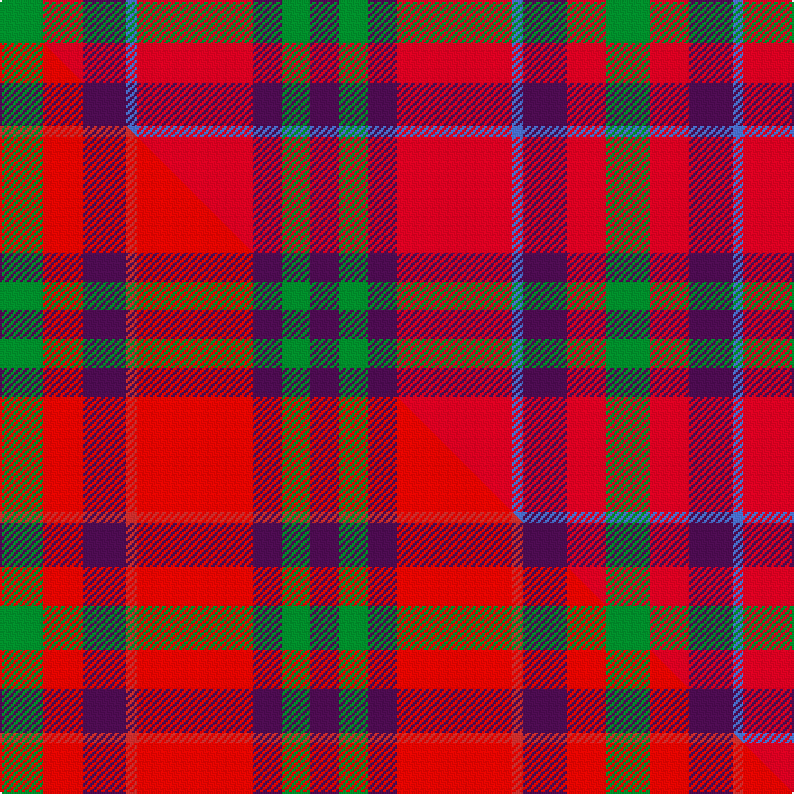

This is one **variant** — a specific cloth: this exact thread count and colourway, with its own
provenance below. It is one weaving of the [sett](/tartans/f/fi/fiddes-3/) (the scale-free proportion — the
same cloth at any scale or shade), whose colour order is pattern [BGBRBBRG](/stripes/bgbrbbrg/).

Part of the [Fiddes](/tartans/f/fi/fiddes-3/) tartan — the named design grouping this sett with its other cloths.

Sourced from weddslist.  It is a [8 stripe tartan](/stripes/stripes8/).

Original link [http://www.weddslist.com/cgi-bin/tartans/pg.pl?source=sts](http://www.weddslist.com/cgi-bin/tartans/pg.pl?source=sts)

Dataset <small>— provenance for this record, inherited from the source manifest</small>

<dl class="dataset-prov">
<dt>source</dt><dd><a href="/sources/weddslist/">Weddslist</a></dd>
<dt>data captured from</dt><dd><a href="https://github.com/thetartan/tartan-database/blob/master/data/weddslist/data.csv">https://github.com/thetartan/tartan-database/blob/master/data/weddslist/data.csv</a></dd>
<dt>data date</dt><dd>2016-11-17 <small>(dataset default)</small></dd>
<dt>licence</dt><dd><a href="https://creativecommons.org/licenses/by-nc-nd/4.0/">CC BY-NC-ND 4.0</a></dd>
</dl>

Capture chain <small>— the hands this data passed through, oldest first; each capture carries its own licence</small>

<ol class="capture-chain">
<li><a href="https://www.weddslist.com/tartans/">Weddslist</a> <small>the living privately compiled reference</small></li>
<li><a href="https://github.com/thetartan/tartan-database">thetartan/tartan-database</a> <small>2016-2017</small> · <a href="https://creativecommons.org/licenses/by-nc-nd/4.0/">CC BY-NC-ND 4.0</a> <small>Levko Kravets's frozen compilation — the capture we vendored, and where its CC licence text came from</small></li>
<li>this dictionary <small>captured 2026-06-10 · commit 5bf86c7566</small> <small>each re-capture is a git commit to data/sources</small></li>
</ol>

## Thread count
G/24 R22 DP24 B6 R64 DP16 G16 DP/16

One full sett is **336 threads**.

## Palette
<table><thead><tr><th>Colour</th><th>Shade</th><th>OKLCh</th></tr></thead><tbody><tr><td>G</td><td><code style="background-color:#008B2A;">#008B2A</code> <small style="color:#888">#008B2A</small></td><td><small style="color:#888">oklch(55.4% 0.170 145.9)</small></td></tr><tr><td>DP</td><td><code style="background-color:#4B0B4F;">#4B0B4F</code> <small style="color:#888">#4B0B4F</small></td><td><small style="color:#888">oklch(30.1% 0.125 325.4)</small></td></tr><tr><td>B</td><td><code style="background-color:#466CC8;">#466CC8</code> <small style="color:#888">#466CC8</small></td><td><small style="color:#888">oklch(55.1% 0.149 265.0)</small></td></tr><tr><td>R</td><td><code style="background-color:#D60020;">#D60020</code> <small style="color:#888">#D60020</small></td><td><small style="color:#888">oklch(55.2% 0.224 25.5)</small></td></tr></tbody></table>

# Sample pattern

[Sample sheet (PDF)](swatch.pdf) — the woven sample, thread count and palette on one printable A4, rendered on demand (the same sheet the TTD print page downloads).

## Compared to the master

This cloth is one sett of its design; the master sett (the exemplar the design is anchored on) is below for comparison.

Its **ΔTartan distance** from the master is **2.22** — the same measure the nearest-tartans table ranks by (0 is identical; a re-scale of the same cloth is near 0, a recolour or a different proportion further).

<figure class="master-compare" style="margin:0">

this sett
master sett ★

<figcaption style="color:#888;font-size:smaller">One weave of this sett against the <a href="/setts/g12ri11dp12r3ri32dp8g8dp8/">master sett ★</a>, split on the diagonal: a shared proportion runs seamlessly across it with only the shades shifting; a different proportion breaks on it.</figcaption>
</figure>

## Nearest tartan variants

The nearest existing variants by ΔTartan distance, with this cloth at the top so the swatches line up against it.

ΔTartan

Threads

Variant

Sett

—

336

<a href="/variants/s8/g12r11dp12b3r32dp8g8dp8~x2/">Fiddes</a>

<a href="/ttd/edit/#slug=g12ri11dp12r3ri32dp8g8dp8~x2~ri5623030-r5419027&amp;base=g12r11dp12b3r32dp8g8dp8~x2" title="compare in the TTD">2.22</a>

336

<a href="/variants/s8/g12ri11dp12r3ri32dp8g8dp8~x2~ri5623030-r5419027/">Fiddes</a>

<a href="/ttd/edit/#slug=db8r8dg17w3r35db10dg15w3~x2&amp;base=g12r11dp12b3r32dp8g8dp8~x2" title="compare in the TTD">2.37</a>

374

<a href="/variants/s8/db8r8dg17w3r35db10dg15w3~x2/">James of Glencarr (Personal)</a>

<a href="/ttd/edit/#slug=r28db12r3dg20lb2dg2r7~x2&amp;base=g12r11dp12b3r32dp8g8dp8~x2" title="compare in the TTD">2.41</a>

226

<a href="/variants/s7/r28db12r3dg20lb2dg2r7~x2/">Carrick (Strathmore) District Tartan</a>

<a href="/ttd/edit/#slug=g3r9lb1g9r1g1r9db9r1~x4&amp;base=g12r11dp12b3r32dp8g8dp8~x2" title="compare in the TTD">2.46</a>

328

<a href="/variants/s9/g3r9lb1g9r1g1r9db9r1~x4/">Convention of the Baronage (Corp)</a>

<a href="/ttd/edit/#slug=r16db6y4db6w1db6y4db6r16db1~x4~db3514276&amp;base=g12r11dp12b3r32dp8g8dp8~x2" title="compare in the TTD">2.49</a>

460

<a href="/variants/s10/r16db6y4db6w1db6y4db6r16db1~x4~db3514276/">Superfast Ferries</a>

<a href="/ttd/edit/#slug=r6g16r4db12r16lb1r2~x2&amp;base=g12r11dp12b3r32dp8g8dp8~x2" title="compare in the TTD">2.50</a>

212

<a href="/variants/s7/r6g16r4db12r16lb1r2~x2/">MacQuarrie #6</a>

<a href="/ttd/edit/#slug=dp28r26w2dp5w2r26g28r5w2r5~x2&amp;base=g12r11dp12b3r32dp8g8dp8~x2" title="compare in the TTD">2.52</a>

450

<a href="/variants/s10/dp28r26w2dp5w2r26g28r5w2r5~x2/">Glenfinnan</a>

<a href="/ttd/edit/#slug=g3r9lb1g9r1g1r8db9r1~x4&amp;base=g12r11dp12b3r32dp8g8dp8~x2" title="compare in the TTD">2.57</a>

320

<a href="/variants/s9/g3r9lb1g9r1g1r8db9r1~x4/">Baronage</a>

<a href="/ttd/edit/#slug=dr6ly3dr20r20dr3r3lb6~x2&amp;base=g12r11dp12b3r32dp8g8dp8~x2" title="compare in the TTD">2.59</a>

220

<a href="/variants/s7/dr6ly3dr20r20dr3r3lb6~x2/">Banff</a>

<a href="/ttd/edit/#slug=r6g16r4db12r16w1r2~x2&amp;base=g12r11dp12b3r32dp8g8dp8~x2" title="compare in the TTD">2.59</a>

212

<a href="/variants/s7/r6g16r4db12r16w1r2~x2/">MacQuarrie LO</a>

## Neighbour map

Every grey dot is one of 13662 variants placed by the first two principal components of the ΔTartan feature space (42% of its variance). Red is this tartan; blue dots are its nearest — click one to open its page. The map is a flat projection of a many-dimensional space — [how to read it](/posts/neighbourhood-maps/).

<svg viewBox="0 0 640 380" role="img" style="max-width:100%;height:auto;border:1px solid #e0e0e0;border-radius:4px;display:block" xmlns="http://www.w3.org/2000/svg"><image href="/nn/cloud.v1.png" width="640" height="380"/><a href="/variants/s8/g12ri11dp12r3ri32dp8g8dp8~x2~ri5623030-r5419027/"><circle cx="258.2" cy="208.6" r="4" fill="#3465a4"><title>Fiddes</title></circle></a><a href="/variants/s8/db8r8dg17w3r35db10dg15w3~x2/"><circle cx="230.3" cy="193.7" r="4" fill="#3465a4"><title>James of Glencarr (Personal)</title></circle></a><a href="/variants/s7/r28db12r3dg20lb2dg2r7~x2/"><circle cx="300.5" cy="182.5" r="4" fill="#3465a4"><title>Carrick (Strathmore) District Tartan</title></circle></a><a href="/variants/s9/g3r9lb1g9r1g1r9db9r1~x4/"><circle cx="245.4" cy="200.8" r="4" fill="#3465a4"><title>Convention of the Baronage (Corp)</title></circle></a><a href="/variants/s10/r16db6y4db6w1db6y4db6r16db1~x4~db3514276/"><circle cx="306.7" cy="182.7" r="4" fill="#3465a4"><title>Superfast Ferries</title></circle></a><a href="/variants/s7/r6g16r4db12r16lb1r2~x2/"><circle cx="274.6" cy="192.6" r="4" fill="#3465a4"><title>MacQuarrie #6</title></circle></a><a href="/variants/s10/dp28r26w2dp5w2r26g28r5w2r5~x2/"><circle cx="269.5" cy="168.0" r="4" fill="#3465a4"><title>Glenfinnan</title></circle></a><a href="/variants/s9/g3r9lb1g9r1g1r8db9r1~x4/"><circle cx="238.7" cy="201.8" r="4" fill="#3465a4"><title>Baronage</title></circle></a><a href="/variants/s7/dr6ly3dr20r20dr3r3lb6~x2/"><circle cx="278.1" cy="217.8" r="4" fill="#3465a4"><title>Banff</title></circle></a><a href="/variants/s7/r6g16r4db12r16w1r2~x2/"><circle cx="271.1" cy="191.5" r="4" fill="#3465a4"><title>MacQuarrie LO</title></circle></a><circle cx="260.6" cy="211.2" r="5" fill="#c00000"/><text x="320" y="376" text-anchor="middle" font-size="11" fill="#999">ground</text><text x="11" y="190" text-anchor="middle" font-size="11" fill="#999" transform="rotate(-90 11 190)">complexity</text></svg>

ID: /variants/s8/g12r11dp12b3r32dp8g8dp8~x2/
