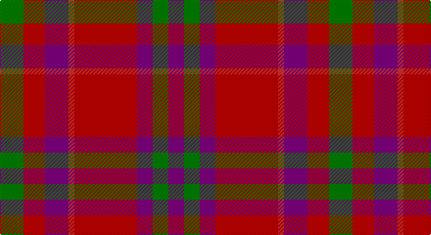

This page is one **sett** — a single exact thread-count. It belongs to the [tartan](/setts/g12ri11p12r3ri32p8g8p8/)
(the same proportion at any scale), whose colour order is pattern [BGBRRBRG](/stripes/bgbrrbrg/).

Sourced from weddslist.  It is a [8 stripe tartan](/stripes/stripes8/).

Original link http://www.weddslist.com/cgi-bin/tartans/pg.pl?source=sts

## Thread count
G/24 Ra22 P24 R6 Ra64 P16 G16 P/16

One full sett is **336 threads**.

## Palette

Palette: <strong>custom</strong>
<table><thead><tr><th>Colour</th><th>Threads</th><th>Shade</th><th>Base</th><th>OKLCh</th></tr></thead><tbody><tr><td>G/</td><td style="text-align:right;font-variant-numeric:tabular-nums">24</td><td><code style="background-color:#008000;">#008000</code> <small style="color:#888">#008000</small></td><td>G <code style="background-color:#006100;">#006100</code></td><td><small style="color:#888">oklch(52.0% 0.177 142.5)</small></td></tr><tr><td>Ra</td><td style="text-align:right;font-variant-numeric:tabular-nums">22</td><td><code style="background-color:#C00000;">#C00000</code> <small style="color:#888">#C00000</small></td><td>R <code style="background-color:#CC0000;">#CC0000</code></td><td><small style="color:#888">oklch(50.7% 0.208 29.2)</small></td></tr><tr><td>P</td><td style="text-align:right;font-variant-numeric:tabular-nums">24</td><td><code style="background-color:#800080;">#800080</code> <small style="color:#888">#800080</small></td><td>B <code style="background-color:#2A418A;">#2A418A</code></td><td><small style="color:#888">oklch(42.1% 0.193 328.4)</small></td></tr><tr><td>R</td><td style="text-align:right;font-variant-numeric:tabular-nums">6</td><td><code style="background-color:#D03030;">#D03030</code> <small style="color:#888">#D03030</small></td><td>R <code style="background-color:#CC0000;">#CC0000</code></td><td><small style="color:#888">oklch(56.4% 0.196 26.2)</small></td></tr><tr><td>Ra</td><td style="text-align:right;font-variant-numeric:tabular-nums">64</td><td><code style="background-color:#C00000;">#C00000</code> <small style="color:#888">#C00000</small></td><td>R <code style="background-color:#CC0000;">#CC0000</code></td><td><small style="color:#888">oklch(50.7% 0.208 29.2)</small></td></tr><tr><td>P</td><td style="text-align:right;font-variant-numeric:tabular-nums">16</td><td><code style="background-color:#800080;">#800080</code> <small style="color:#888">#800080</small></td><td>B <code style="background-color:#2A418A;">#2A418A</code></td><td><small style="color:#888">oklch(42.1% 0.193 328.4)</small></td></tr><tr><td>G</td><td style="text-align:right;font-variant-numeric:tabular-nums">16</td><td><code style="background-color:#008000;">#008000</code> <small style="color:#888">#008000</small></td><td>G <code style="background-color:#006100;">#006100</code></td><td><small style="color:#888">oklch(52.0% 0.177 142.5)</small></td></tr><tr><td>P/</td><td style="text-align:right;font-variant-numeric:tabular-nums">16</td><td><code style="background-color:#800080;">#800080</code> <small style="color:#888">#800080</small></td><td>B <code style="background-color:#2A418A;">#2A418A</code></td><td><small style="color:#888">oklch(42.1% 0.193 328.4)</small></td></tr></tbody></table>

# Sample pattern

## Nearest tartans

The nearest existing variants by ΔTartan distance, with this tartan at the top so the swatches line up against it.

ΔTartan

Tartan

Sett

—

<a href="/ttd/edit/#slug=g12ri11p12r3ri32p8g8p8~x2">Fiddes</a> <a class="nn-out" href="/variants/s8/g12ri11p12r3ri32p8g8p8~x2/" title="open its dictionary page">↗</a>

0.81

<a href="/ttd/edit/#slug=dg12r11dp12ri3r32dp8dg8dp8~x2&amp;base=g12ri11p12r3ri32p8g8p8~x2">Fiddes</a> <a class="nn-out" href="/variants/s8/dg12r11dp12ri3r32dp8dg8dp8~x2/" title="open its dictionary page">↗</a>

1.12

<a href="/ttd/edit/#slug=r16o2r11o6k4w2k4o16~x2&amp;base=g12ri11p12r3ri32p8g8p8~x2">Sidney (Nova Scotia) Canadian Tartan</a> <a class="nn-out" href="/variants/s8/r16o2r11o6k4w2k4o16~x2/" title="open its dictionary page">↗</a>

1.17

<a href="/ttd/edit/#slug=r11db1r11db1w10o11db1o11~x2&amp;base=g12ri11p12r3ri32p8g8p8~x2">St Andrews</a> <a class="nn-out" href="/variants/s8/r11db1r11db1w10o11db1o11~x2/" title="open its dictionary page">↗</a>

1.21

<a href="/ttd/edit/#slug=r2p3ri2r15p3g19p20r15p3ri2r2~x2&amp;base=g12ri11p12r3ri32p8g8p8~x2">Drumlithie, Rock and Wheel</a> <a class="nn-out" href="/variants/s11/r2p3ri2r15p3g19p20r15p3ri2r2~x2/" title="open its dictionary page">↗</a>

1.21

<a href="/ttd/edit/#slug=r8ri1dg4ri1db4~x2&amp;base=g12ri11p12r3ri32p8g8p8~x2">Moray of Abercairney #2</a> <a class="nn-out" href="/variants/s5/r8ri1dg4ri1db4~x2/" title="open its dictionary page">↗</a>

1.21

<a href="/ttd/edit/#slug=dg6r2ri2dg4ri2r12k1~x2&amp;base=g12ri11p12r3ri32p8g8p8~x2">MacNab #3</a> <a class="nn-out" href="/variants/s7/dg6r2ri2dg4ri2r12k1~x2/" title="open its dictionary page">↗</a>

1.22

<a href="/ttd/edit/#slug=r2dp3ri2r15dp3g19dp20r15dp3ri2r2~x2&amp;base=g12ri11p12r3ri32p8g8p8~x2">Drumlithie Rock and Wheel Tartan</a> <a class="nn-out" href="/variants/s11/r2dp3ri2r15dp3g19dp20r15dp3ri2r2~x2/" title="open its dictionary page">↗</a>

1.23

<a href="/ttd/edit/#slug=k2r12db6r3dg12r4db1~x2&amp;base=g12ri11p12r3ri32p8g8p8~x2">MacBean/MacElvain</a> <a class="nn-out" href="/variants/s7/k2r12db6r3dg12r4db1~x2/" title="open its dictionary page">↗</a>

1.23

<a href="/ttd/edit/#slug=r6dg16r4db12r16t1r2~x2&amp;base=g12ri11p12r3ri32p8g8p8~x2">MacQuarrie #6</a> <a class="nn-out" href="/variants/s7/r6dg16r4db12r16t1r2~x2/" title="open its dictionary page">↗</a>

1.28

<a href="/ttd/edit/#slug=r2dp3ri2r15dp2g20dp20r15dp3ri2r2~x2&amp;base=g12ri11p12r3ri32p8g8p8~x2">Drumlithie</a> <a class="nn-out" href="/variants/s11/r2dp3ri2r15dp2g20dp20r15dp3ri2r2~x2/" title="open its dictionary page">↗</a>

## Neighbour map

Every grey dot is one of 14360 variants placed by the first two principal components of the ΔTartan feature space (44% of its variance). Red is this tartan; blue dots are its nearest — click one to open its page.

<svg viewBox="0 0 640 380" role="img" style="max-width:100%;height:auto;border:1px solid #e0e0e0;border-radius:4px;display:block" xmlns="http://www.w3.org/2000/svg"><image href="/nn/cloud.v1.png" width="640" height="380"/><a href="/variants/s8/dg12r11dp12ri3r32dp8dg8dp8~x2/"><circle cx="247.4" cy="198.5" r="4" fill="#3465a4"><title>Fiddes</title></circle></a><a href="/variants/s8/r16o2r11o6k4w2k4o16~x2/"><circle cx="235.6" cy="203.4" r="4" fill="#3465a4"><title>Sidney (Nova Scotia) Canadian Tartan</title></circle></a><a href="/variants/s8/r11db1r11db1w10o11db1o11~x2/"><circle cx="216.9" cy="199.0" r="4" fill="#3465a4"><title>St Andrews</title></circle></a><a href="/variants/s11/r2p3ri2r15p3g19p20r15p3ri2r2~x2/"><circle cx="244.2" cy="174.4" r="4" fill="#3465a4"><title>Drumlithie, Rock and Wheel</title></circle></a><a href="/variants/s5/r8ri1dg4ri1db4~x2/"><circle cx="239.1" cy="232.3" r="4" fill="#3465a4"><title>Moray of Abercairney #2</title></circle></a><a href="/variants/s7/dg6r2ri2dg4ri2r12k1~x2/"><circle cx="296.9" cy="192.1" r="4" fill="#3465a4"><title>MacNab #3</title></circle></a><a href="/variants/s11/r2dp3ri2r15dp3g19dp20r15dp3ri2r2~x2/"><circle cx="250.4" cy="176.9" r="4" fill="#3465a4"><title>Drumlithie Rock and Wheel Tartan</title></circle></a><a href="/variants/s7/k2r12db6r3dg12r4db1~x2/"><circle cx="259.2" cy="199.0" r="4" fill="#3465a4"><title>MacBean/MacElvain</title></circle></a><a href="/variants/s7/r6dg16r4db12r16t1r2~x2/"><circle cx="284.4" cy="191.1" r="4" fill="#3465a4"><title>MacQuarrie #6</title></circle></a><a href="/variants/s11/r2dp3ri2r15dp2g20dp20r15dp3ri2r2~x2/"><circle cx="250.1" cy="174.6" r="4" fill="#3465a4"><title>Drumlithie</title></circle></a><circle cx="264.1" cy="206.3" r="5" fill="#c00000"/></svg>

ID: /variants/s8/g12ri11p12r3ri32p8g8p8~x2/
