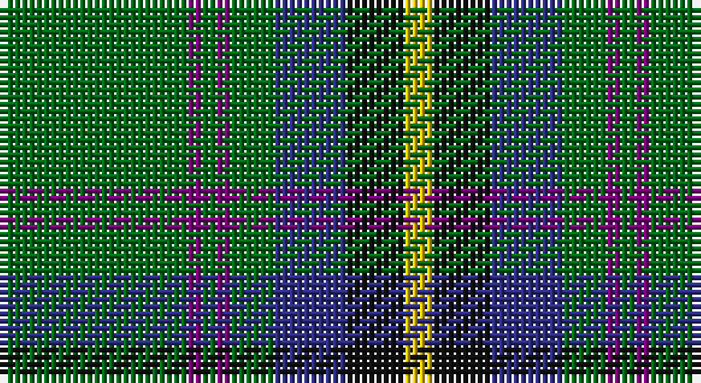

This page is one **sett** — a single exact thread-count. It belongs to the [tartan](/setts/g13dp1g1dp1g3db5k4ly2/)
(the same proportion at any scale), whose colour order is pattern [GBGBGBKY](/stripes/gbgbgbky/).

Part of the [Carrick Hunting](/tartans/carrick-hunting/) tartan — the named design grouping this sett with its other cloths.

Sourced from house-of-tartan.  It is a [8 stripe tartan](/stripes/stripes8/).

Original link http://www.house-of-tartan.scotland.net/house/TartanViewjs.asp?colr=Def&tnam=721

## Provenance

Earliest known date: 1930 This sample comes from the MacGregor-Hastie collection which forms the basis of the cloth archive of the Scottish Tartans Society. Some of the samples, including this one, were unmarked. One can assume that the sample dates between 1930 and 1950.

## Also known as

This cloth is also recorded under:

- Carrick Htg
- Carrick, hunting

## Thread count
G/26 P2 G2 P2 G6 DB10 K8 Y/4

One full sett is **90 threads**.

## Palette

Palette: <strong>Tartan Register</strong>
<table><thead><tr><th>Colour</th><th>Threads</th><th>Shade</th><th>Base</th><th>OKLCh</th></tr></thead><tbody><tr><td>G/</td><td style="text-align:right;font-variant-numeric:tabular-nums">26</td><td><code style="background-color:#006818;">#006818</code> <small style="color:#888">#006818</small></td><td>G <code style="background-color:#006100;">#006100</code></td><td><small style="color:#888">oklch(45.0% 0.142 145.0)</small></td></tr><tr><td>P</td><td style="text-align:right;font-variant-numeric:tabular-nums">2</td><td><code style="background-color:#780078;">#780078</code> <small style="color:#888">#780078</small></td><td>B <code style="background-color:#2A418A;">#2A418A</code></td><td><small style="color:#888">oklch(40.2% 0.185 328.4)</small></td></tr><tr><td>G</td><td style="text-align:right;font-variant-numeric:tabular-nums">2</td><td><code style="background-color:#006818;">#006818</code> <small style="color:#888">#006818</small></td><td>G <code style="background-color:#006100;">#006100</code></td><td><small style="color:#888">oklch(45.0% 0.142 145.0)</small></td></tr><tr><td>P</td><td style="text-align:right;font-variant-numeric:tabular-nums">2</td><td><code style="background-color:#780078;">#780078</code> <small style="color:#888">#780078</small></td><td>B <code style="background-color:#2A418A;">#2A418A</code></td><td><small style="color:#888">oklch(40.2% 0.185 328.4)</small></td></tr><tr><td>G</td><td style="text-align:right;font-variant-numeric:tabular-nums">6</td><td><code style="background-color:#006818;">#006818</code> <small style="color:#888">#006818</small></td><td>G <code style="background-color:#006100;">#006100</code></td><td><small style="color:#888">oklch(45.0% 0.142 145.0)</small></td></tr><tr><td>DB</td><td style="text-align:right;font-variant-numeric:tabular-nums">10</td><td><code style="background-color:#2C2C80;">#2C2C80</code> <small style="color:#888">#2C2C80</small></td><td>B <code style="background-color:#2A418A;">#2A418A</code></td><td><small style="color:#888">oklch(35.0% 0.138 276.6)</small></td></tr><tr><td>K</td><td style="text-align:right;font-variant-numeric:tabular-nums">8</td><td><code style="background-color:#101010;">#101010</code> <small style="color:#888">#101010</small></td><td>K <code style="background-color:#000000;">#000000</code></td><td><small style="color:#888">oklch(17.3% 0.000 89.9)</small></td></tr><tr><td>Y/</td><td style="text-align:right;font-variant-numeric:tabular-nums">4</td><td><code style="background-color:#E8C000;">#E8C000</code> <small style="color:#888">#E8C000</small></td><td>Y <code style="background-color:#F2BF00;">#F2BF00</code></td><td><small style="color:#888">oklch(81.9% 0.168 93.7)</small></td></tr></tbody></table>

# Sample pattern

## Compared to the master

This cloth is one sett of its design; the master sett (the exemplar the design is anchored on) is below for comparison.

<figure style="margin:0"><figcaption style="color:#888;font-size:smaller">this sett</figcaption></figure>
<figure style="margin:0"><figcaption style="color:#888;font-size:smaller"><a href="/setts/g13dp1g1dp1g3b5k4ly2/">master sett →</a></figcaption></figure>

## Nearest tartans

The nearest existing variants by ΔTartan distance, with this tartan at the top so the swatches line up against it.

ΔTartan

Tartan

Sett

—

<a href="/ttd/edit/#slug=g13dp1g1dp1g3db5k4ly2~x2">Carrick Hunting District Tartan</a> <a class="nn-out" href="/variants/s8/g13dp1g1dp1g3db5k4ly2~x2/" title="open its dictionary page">↗</a>

0.73

<a href="/ttd/edit/#slug=w1db6g4db1g16k1g4k6ly1~x4&amp;base=g13dp1g1dp1g3db5k4ly2~x2">Henderson/MacKendrick</a> <a class="nn-out" href="/variants/s9/w1db6g4db1g16k1g4k6ly1~x4/" title="open its dictionary page">↗</a>

0.73

<a href="/ttd/edit/#slug=w1db6g4db1g16k1g4k6ly1~x2&amp;base=g13dp1g1dp1g3db5k4ly2~x2">MacKendrick</a> <a class="nn-out" href="/variants/s9/w1db6g4db1g16k1g4k6ly1~x2/" title="open its dictionary page">↗</a>

0.82

<a href="/ttd/edit/#slug=k17g48ly4r10db12g4&amp;base=g13dp1g1dp1g3db5k4ly2~x2">Asheville Firefighters, The</a> <a class="nn-out" href="/variants/s6/k17g48ly4r10db12g4/" title="open its dictionary page">↗</a>

0.89

<a href="/ttd/edit/#slug=r3g32k4g4k11db3k7r4lb3&amp;base=g13dp1g1dp1g3db5k4ly2~x2">Wardrope (Personal)</a> <a class="nn-out" href="/variants/s9/r3g32k4g4k11db3k7r4lb3/" title="open its dictionary page">↗</a>

0.98

<a href="/ttd/edit/#slug=g13dp1g1dp1g3b5k4ly2~x4&amp;base=g13dp1g1dp1g3db5k4ly2~x2">Carrick Hunting (Personal)</a> <a class="nn-out" href="/variants/s8/g13dp1g1dp1g3b5k4ly2~x4/" title="open its dictionary page">↗</a>

1.00

<a href="/ttd/edit/#slug=dg30db6r2db2ly2db15w2~x2&amp;base=g13dp1g1dp1g3db5k4ly2~x2">Hydesville Tower (Corporate)</a> <a class="nn-out" href="/variants/s7/dg30db6r2db2ly2db15w2~x2/" title="open its dictionary page">↗</a>

1.04

<a href="/ttd/edit/#slug=g4lo1dt1lo1dt2g9r1dt6w1~x4&amp;base=g13dp1g1dp1g3db5k4ly2~x2">Casey of West Virginia (Personal)</a> <a class="nn-out" href="/variants/s9/g4lo1dt1lo1dt2g9r1dt6w1~x4/" title="open its dictionary page">↗</a>

1.07

<a href="/ttd/edit/#slug=g13p1g1p1g3db5k4ly2~x2&amp;base=g13dp1g1dp1g3db5k4ly2~x2">Carrick, hunting</a> <a class="nn-out" href="/variants/s8/g13p1g1p1g3db5k4ly2~x2/" title="open its dictionary page">↗</a>

1.08

<a href="/ttd/edit/#slug=g5db24g7k10g24ly2db2ly2r2~x2&amp;base=g13dp1g1dp1g3db5k4ly2~x2">Maitland Chief</a> <a class="nn-out" href="/variants/s9/g5db24g7k10g24ly2db2ly2r2~x2/" title="open its dictionary page">↗</a>

1.08

<a href="/ttd/edit/#slug=t1dp10k10g12k1g12t2g16w1~x2&amp;base=g13dp1g1dp1g3db5k4ly2~x2">Faskin Family (Aberdeenshire)</a> <a class="nn-out" href="/variants/s9/t1dp10k10g12k1g12t2g16w1~x2/" title="open its dictionary page">↗</a>

## Neighbour map

Every grey dot is one of 14360 variants placed by the first two principal components of the ΔTartan feature space (44% of its variance). Red is this tartan; blue dots are its nearest — click one to open its page.

<svg viewBox="0 0 640 380" role="img" style="max-width:100%;height:auto;border:1px solid #e0e0e0;border-radius:4px;display:block" xmlns="http://www.w3.org/2000/svg"><image href="/nn/cloud.v1.png" width="640" height="380"/><a href="/variants/s9/w1db6g4db1g16k1g4k6ly1~x4/"><circle cx="326.6" cy="166.2" r="4" fill="#3465a4"><title>Henderson/MacKendrick</title></circle></a><a href="/variants/s9/w1db6g4db1g16k1g4k6ly1~x2/"><circle cx="326.6" cy="166.2" r="4" fill="#3465a4"><title>MacKendrick</title></circle></a><a href="/variants/s6/k17g48ly4r10db12g4/"><circle cx="278.3" cy="190.3" r="4" fill="#3465a4"><title>Asheville Firefighters, The</title></circle></a><a href="/variants/s9/r3g32k4g4k11db3k7r4lb3/"><circle cx="268.3" cy="168.5" r="4" fill="#3465a4"><title>Wardrope (Personal)</title></circle></a><a href="/variants/s8/g13dp1g1dp1g3b5k4ly2~x4/"><circle cx="292.8" cy="172.0" r="4" fill="#3465a4"><title>Carrick Hunting (Personal)</title></circle></a><a href="/variants/s7/dg30db6r2db2ly2db15w2~x2/"><circle cx="306.8" cy="164.6" r="4" fill="#3465a4"><title>Hydesville Tower (Corporate)</title></circle></a><a href="/variants/s9/g4lo1dt1lo1dt2g9r1dt6w1~x4/"><circle cx="240.1" cy="181.0" r="4" fill="#3465a4"><title>Casey of West Virginia (Personal)</title></circle></a><a href="/variants/s8/g13p1g1p1g3db5k4ly2~x2/"><circle cx="259.6" cy="159.7" r="4" fill="#3465a4"><title>Carrick, hunting</title></circle></a><a href="/variants/s9/g5db24g7k10g24ly2db2ly2r2~x2/"><circle cx="241.5" cy="173.8" r="4" fill="#3465a4"><title>Maitland Chief</title></circle></a><a href="/variants/s9/t1dp10k10g12k1g12t2g16w1~x2/"><circle cx="317.4" cy="183.0" r="4" fill="#3465a4"><title>Faskin Family (Aberdeenshire)</title></circle></a><circle cx="288.9" cy="173.7" r="5" fill="#c00000"/></svg>

ID: /variants/s8/g13dp1g1dp1g3db5k4ly2~x2/
