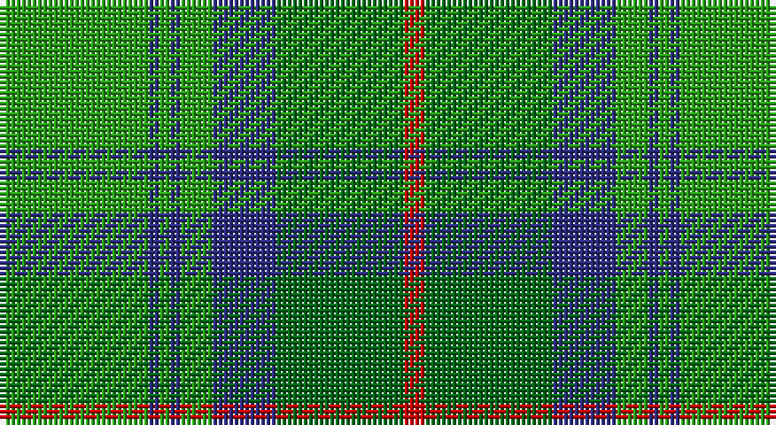

This page is one **sett** — a single exact thread-count. It belongs to the [tartan](/setts/g14db1g1db1g3db6gi12r2/)
(the same proportion at any scale), whose colour order is pattern [GBGBGBGR](/stripes/gbgbgbgr/).

Sourced from house-of-tartan.  It is a [8 stripe tartan](/stripes/stripes8/).

Original link http://www.house-of-tartan.scotland.net/house/TartanViewjs.asp?colr=Def&tnam=706

## Provenance

Earliest known date: 1842 References: The Setts No: 35. W & A K Johnston, 1906. D.C.Stewart (The Setts of the Scottish Tartans, 1950) would have the light green and dark green transposed but this does not correspond to the Vestiarium Scoticum, the only known source for the tartan. The VS version is shown.

## Thread count
Ga/28 DB2 Ga2 DB2 Ga6 DB12 G24 R/4

One full sett is **128 threads**.

## Palette

Palette: <strong>Tartan Register</strong>
<table><thead><tr><th>Colour</th><th>Threads</th><th>Shade</th><th>Base</th><th>OKLCh</th></tr></thead><tbody><tr><td>Ga/</td><td style="text-align:right;font-variant-numeric:tabular-nums">28</td><td><code style="background-color:#289C18;">#289C18</code> <small style="color:#888">#289C18</small></td><td>G <code style="background-color:#006100;">#006100</code></td><td><small style="color:#888">oklch(60.6% 0.191 141.6)</small></td></tr><tr><td>DB</td><td style="text-align:right;font-variant-numeric:tabular-nums">2</td><td><code style="background-color:#2C2C80;">#2C2C80</code> <small style="color:#888">#2C2C80</small></td><td>B <code style="background-color:#2A418A;">#2A418A</code></td><td><small style="color:#888">oklch(35.0% 0.138 276.6)</small></td></tr><tr><td>Ga</td><td style="text-align:right;font-variant-numeric:tabular-nums">2</td><td><code style="background-color:#289C18;">#289C18</code> <small style="color:#888">#289C18</small></td><td>G <code style="background-color:#006100;">#006100</code></td><td><small style="color:#888">oklch(60.6% 0.191 141.6)</small></td></tr><tr><td>DB</td><td style="text-align:right;font-variant-numeric:tabular-nums">2</td><td><code style="background-color:#2C2C80;">#2C2C80</code> <small style="color:#888">#2C2C80</small></td><td>B <code style="background-color:#2A418A;">#2A418A</code></td><td><small style="color:#888">oklch(35.0% 0.138 276.6)</small></td></tr><tr><td>Ga</td><td style="text-align:right;font-variant-numeric:tabular-nums">6</td><td><code style="background-color:#289C18;">#289C18</code> <small style="color:#888">#289C18</small></td><td>G <code style="background-color:#006100;">#006100</code></td><td><small style="color:#888">oklch(60.6% 0.191 141.6)</small></td></tr><tr><td>DB</td><td style="text-align:right;font-variant-numeric:tabular-nums">12</td><td><code style="background-color:#2C2C80;">#2C2C80</code> <small style="color:#888">#2C2C80</small></td><td>B <code style="background-color:#2A418A;">#2A418A</code></td><td><small style="color:#888">oklch(35.0% 0.138 276.6)</small></td></tr><tr><td>G</td><td style="text-align:right;font-variant-numeric:tabular-nums">24</td><td><code style="background-color:#006818;">#006818</code> <small style="color:#888">#006818</small></td><td>G <code style="background-color:#006100;">#006100</code></td><td><small style="color:#888">oklch(45.0% 0.142 145.0)</small></td></tr><tr><td>R/</td><td style="text-align:right;font-variant-numeric:tabular-nums">4</td><td><code style="background-color:#C80000;">#C80000</code> <small style="color:#888">#C80000</small></td><td>R <code style="background-color:#CC0000;">#CC0000</code></td><td><small style="color:#888">oklch(52.3% 0.215 29.2)</small></td></tr></tbody></table>

# Sample pattern

## Nearest tartans

The nearest existing variants by ΔTartan distance, with this tartan at the top so the swatches line up against it.

ΔTartan

Tartan

Sett

—

<a href="/ttd/edit/#slug=g14db1g1db1g3db6gi12r2~x2">Cranstoun Clan Tartan</a> <a class="nn-out" href="/variants/s8/g14db1g1db1g3db6gi12r2~x2/" title="open its dictionary page">↗</a>

0.84

<a href="/ttd/edit/#slug=t4dg26g8t8g8gi3t2~x2&amp;base=g14db1g1db1g3db6gi12r2~x2">Valley, of the Green. (The )</a> <a class="nn-out" href="/variants/s7/t4dg26g8t8g8gi3t2~x2/" title="open its dictionary page">↗</a>

0.87

<a href="/ttd/edit/#slug=gi14db1gi1db1gi3db6g12r2~x2&amp;base=g14db1g1db1g3db6gi12r2~x2">Cranstoun</a> <a class="nn-out" href="/variants/s8/gi14db1gi1db1gi3db6g12r2~x2/" title="open its dictionary page">↗</a>

1.22

<a href="/ttd/edit/#slug=dg70ly6lr28g56lr5g11lr5g11r12&amp;base=g14db1g1db1g3db6gi12r2~x2">Dalwhinnie</a> <a class="nn-out" href="/variants/s9/dg70ly6lr28g56lr5g11lr5g11r12/" title="open its dictionary page">↗</a>

1.24

<a href="/ttd/edit/#slug=dg70ly6o28g56o5g11o5g11lo12&amp;base=g14db1g1db1g3db6gi12r2~x2">Dalwhinnie Trade Tartan</a> <a class="nn-out" href="/variants/s9/dg70ly6o28g56o5g11o5g11lo12/" title="open its dictionary page">↗</a>

1.24

<a href="/ttd/edit/#slug=t4dg26gi8t8gi8g3t2~x2&amp;base=g14db1g1db1g3db6gi12r2~x2">Valley of the Green (The ) Canadian Tartan</a> <a class="nn-out" href="/variants/s7/t4dg26gi8t8gi8g3t2~x2/" title="open its dictionary page">↗</a>

1.30

<a href="/ttd/edit/#slug=dg70ly6y28g56y5g11y5g11lo12&amp;base=g14db1g1db1g3db6gi12r2~x2">Dalwhinnie</a> <a class="nn-out" href="/variants/s9/dg70ly6y28g56y5g11y5g11lo12/" title="open its dictionary page">↗</a>

1.33

<a href="/ttd/edit/#slug=g28r12g4db20ly2db3ly2db3g7~x2&amp;base=g14db1g1db1g3db6gi12r2~x2">Cork</a> <a class="nn-out" href="/variants/s9/g28r12g4db20ly2db3ly2db3g7~x2/" title="open its dictionary page">↗</a>

1.35

<a href="/ttd/edit/#slug=g28r2g2r2g8db24y3r2~x2&amp;base=g14db1g1db1g3db6gi12r2~x2">Leatherneck, U.S.Marine Corps</a> <a class="nn-out" href="/variants/s8/g28r2g2r2g8db24y3r2~x2/" title="open its dictionary page">↗</a>

1.37

<a href="/ttd/edit/#slug=w9dg2g2w3g18k2dg33lo2~x2&amp;base=g14db1g1db1g3db6gi12r2~x2">New World Irish (Fashion)</a> <a class="nn-out" href="/variants/s8/w9dg2g2w3g18k2dg33lo2~x2/" title="open its dictionary page">↗</a>

1.38

<a href="/ttd/edit/#slug=g30k3g3k3g6b32g3b3~x2&amp;base=g14db1g1db1g3db6gi12r2~x2">Holmes (Clan?)</a> <a class="nn-out" href="/variants/s8/g30k3g3k3g6b32g3b3~x2/" title="open its dictionary page">↗</a>

## Neighbour map

Every grey dot is one of 14360 variants placed by the first two principal components of the ΔTartan feature space (44% of its variance). Red is this tartan; blue dots are its nearest — click one to open its page.

<svg viewBox="0 0 640 380" role="img" style="max-width:100%;height:auto;border:1px solid #e0e0e0;border-radius:4px;display:block" xmlns="http://www.w3.org/2000/svg"><image href="/nn/cloud.v1.png" width="640" height="380"/><a href="/variants/s7/t4dg26g8t8g8gi3t2~x2/"><circle cx="252.7" cy="211.3" r="4" fill="#3465a4"><title>Valley, of the Green. (The )</title></circle></a><a href="/variants/s8/gi14db1gi1db1gi3db6g12r2~x2/"><circle cx="280.9" cy="203.8" r="4" fill="#3465a4"><title>Cranstoun</title></circle></a><a href="/variants/s9/dg70ly6lr28g56lr5g11lr5g11r12/"><circle cx="221.8" cy="170.8" r="4" fill="#3465a4"><title>Dalwhinnie</title></circle></a><a href="/variants/s9/dg70ly6o28g56o5g11o5g11lo12/"><circle cx="202.9" cy="162.0" r="4" fill="#3465a4"><title>Dalwhinnie Trade Tartan</title></circle></a><a href="/variants/s7/t4dg26gi8t8gi8g3t2~x2/"><circle cx="278.7" cy="224.7" r="4" fill="#3465a4"><title>Valley of the Green (The ) Canadian Tartan</title></circle></a><a href="/variants/s9/dg70ly6y28g56y5g11y5g11lo12/"><circle cx="206.3" cy="164.8" r="4" fill="#3465a4"><title>Dalwhinnie</title></circle></a><a href="/variants/s9/g28r12g4db20ly2db3ly2db3g7~x2/"><circle cx="273.9" cy="178.4" r="4" fill="#3465a4"><title>Cork</title></circle></a><a href="/variants/s8/g28r2g2r2g8db24y3r2~x2/"><circle cx="340.8" cy="187.4" r="4" fill="#3465a4"><title>Leatherneck, U.S.Marine Corps</title></circle></a><a href="/variants/s8/w9dg2g2w3g18k2dg33lo2~x2/"><circle cx="269.8" cy="150.2" r="4" fill="#3465a4"><title>New World Irish (Fashion)</title></circle></a><a href="/variants/s8/g30k3g3k3g6b32g3b3~x2/"><circle cx="293.5" cy="194.1" r="4" fill="#3465a4"><title>Holmes (Clan?)</title></circle></a><circle cx="265.8" cy="195.1" r="5" fill="#c00000"/></svg>

ID: /variants/s8/g14db1g1db1g3db6gi12r2~x2/
