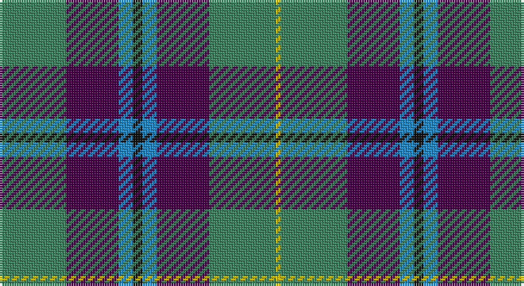

This page is one **sett** — a single exact thread-count. It belongs to the [tartan](/setts/g14dp11t3k2t3dp11g14ly1/)
(the same proportion at any scale), whose colour order is pattern [GBBKBBGY](/stripes/gbbkbbgy/).

Part of the [Wellington](/tartans/wellington/) tartan — the named design grouping this sett with its other cloths.

Sourced from register-of-tartans.  It is a [8 stripe tartan](/stripes/stripes8/).

Original link https://www.tartanregister.gov.uk/tartanDetails.aspx?ref=4587

## Also known as

This cloth is also recorded under:

- Wellington #2

## Register references

External register numbers recorded for this tartan.

- Scottish Register of Tartans: [4587](https://www.tartanregister.gov.uk/tartanDetails.aspx?ref=4587)
- Scottish Tartans Authority (ITI): 1026
- Scottish Tartans World Register: 1026

## Thread count
G/28 DP22 B6 K4 B6 DP22 G28 Y/2

One full sett is **206 threads**.

## Palette

Palette: <strong>Tartan Register</strong>
<table><thead><tr><th>Colour</th><th>Threads</th><th>Shade</th><th>Base</th><th>OKLCh</th></tr></thead><tbody><tr><td>G/</td><td style="text-align:right;font-variant-numeric:tabular-nums">28</td><td><code style="background-color:#408060;">#408060</code> <small style="color:#888">#408060</small></td><td>G <code style="background-color:#006100;">#006100</code></td><td><small style="color:#888">oklch(54.8% 0.084 160.1)</small></td></tr><tr><td>DP</td><td style="text-align:right;font-variant-numeric:tabular-nums">22</td><td><code style="background-color:#440044;">#440044</code> <small style="color:#888">#440044</small></td><td>B <code style="background-color:#2A418A;">#2A418A</code></td><td><small style="color:#888">oklch(27.1% 0.125 328.4)</small></td></tr><tr><td>B</td><td style="text-align:right;font-variant-numeric:tabular-nums">6</td><td><code style="background-color:#2888C4;">#2888C4</code> <small style="color:#888">#2888C4</small></td><td>B <code style="background-color:#2A418A;">#2A418A</code></td><td><small style="color:#888">oklch(60.1% 0.125 241.5)</small></td></tr><tr><td>K</td><td style="text-align:right;font-variant-numeric:tabular-nums">4</td><td><code style="background-color:#101010;">#101010</code> <small style="color:#888">#101010</small></td><td>K <code style="background-color:#000000;">#000000</code></td><td><small style="color:#888">oklch(17.3% 0.000 89.9)</small></td></tr><tr><td>B</td><td style="text-align:right;font-variant-numeric:tabular-nums">6</td><td><code style="background-color:#2888C4;">#2888C4</code> <small style="color:#888">#2888C4</small></td><td>B <code style="background-color:#2A418A;">#2A418A</code></td><td><small style="color:#888">oklch(60.1% 0.125 241.5)</small></td></tr><tr><td>DP</td><td style="text-align:right;font-variant-numeric:tabular-nums">22</td><td><code style="background-color:#440044;">#440044</code> <small style="color:#888">#440044</small></td><td>B <code style="background-color:#2A418A;">#2A418A</code></td><td><small style="color:#888">oklch(27.1% 0.125 328.4)</small></td></tr><tr><td>G</td><td style="text-align:right;font-variant-numeric:tabular-nums">28</td><td><code style="background-color:#408060;">#408060</code> <small style="color:#888">#408060</small></td><td>G <code style="background-color:#006100;">#006100</code></td><td><small style="color:#888">oklch(54.8% 0.084 160.1)</small></td></tr><tr><td>Y/</td><td style="text-align:right;font-variant-numeric:tabular-nums">2</td><td><code style="background-color:#E8C000;">#E8C000</code> <small style="color:#888">#E8C000</small></td><td>Y <code style="background-color:#F2BF00;">#F2BF00</code></td><td><small style="color:#888">oklch(81.9% 0.168 93.7)</small></td></tr></tbody></table>

# Sample pattern

## Compared to the master

This cloth is one sett of its design; the master sett (the exemplar the design is anchored on) is below for comparison.

<figure style="margin:0"><figcaption style="color:#888;font-size:smaller">this sett</figcaption></figure>
<figure style="margin:0"><figcaption style="color:#888;font-size:smaller"><a href="/setts/db1r1db6k6dg6w1/">master sett →</a></figcaption></figure>

## Nearest tartans

The nearest existing variants by ΔTartan distance, with this tartan at the top so the swatches line up against it.

ΔTartan

Tartan

Sett

—

<a href="/ttd/edit/#slug=g14dp11t3k2t3dp11g14ly1~x2">Wellington (Wilson 122)</a> <a class="nn-out" href="/variants/s8/g14dp11t3k2t3dp11g14ly1~x2/" title="open its dictionary page">↗</a>

0.82

<a href="/ttd/edit/#slug=r3ly1db15g16db3r6db6g8db15w3~x2&amp;base=g14dp11t3k2t3dp11g14ly1~x2">Steve Walls</a> <a class="nn-out" href="/variants/s10/r3ly1db15g16db3r6db6g8db15w3~x2/" title="open its dictionary page">↗</a>

0.99

<a href="/ttd/edit/#slug=db10ly3db30ly5k8dg16r4dg16r2~x2&amp;base=g14dp11t3k2t3dp11g14ly1~x2">MacMillan Hunting</a> <a class="nn-out" href="/variants/s9/db10ly3db30ly5k8dg16r4dg16r2~x2/" title="open its dictionary page">↗</a>

1.01

<a href="/ttd/edit/#slug=db2o10db1o1db10r1db10g10w2~x2&amp;base=g14dp11t3k2t3dp11g14ly1~x2">American Soc.of Travel Agents (Corp)</a> <a class="nn-out" href="/variants/s9/db2o10db1o1db10r1db10g10w2~x2/" title="open its dictionary page">↗</a>

1.11

<a href="/ttd/edit/#slug=w4g28db18r4db18ly3~x2&amp;base=g14dp11t3k2t3dp11g14ly1~x2">MacIntyre, Inglis</a> <a class="nn-out" href="/variants/s6/w4g28db18r4db18ly3~x2/" title="open its dictionary page">↗</a>

1.12

<a href="/ttd/edit/#slug=g3db12w1k12g13r2g2~x4&amp;base=g14dp11t3k2t3dp11g14ly1~x2">MacFadzean/MacPhedran</a> <a class="nn-out" href="/variants/s7/g3db12w1k12g13r2g2~x4/" title="open its dictionary page">↗</a>

1.12

<a href="/ttd/edit/#slug=dy2g12k10r1b16r2b16r1~x4&amp;base=g14dp11t3k2t3dp11g14ly1~x2">MacWilliam</a> <a class="nn-out" href="/variants/s8/dy2g12k10r1b16r2b16r1~x4/" title="open its dictionary page">↗</a>

1.16

<a href="/ttd/edit/#slug=b5dy28lb5k20lo5b47lo4~x2&amp;base=g14dp11t3k2t3dp11g14ly1~x2">State Seal of Washington (Fashion)</a> <a class="nn-out" href="/variants/s7/b5dy28lb5k20lo5b47lo4~x2/" title="open its dictionary page">↗</a>

1.17

<a href="/ttd/edit/#slug=w2db16g16t4k4t4g16db16w1~x2&amp;base=g14dp11t3k2t3dp11g14ly1~x2">Douglas</a> <a class="nn-out" href="/variants/s9/w2db16g16t4k4t4g16db16w1~x2/" title="open its dictionary page">↗</a>

1.18

<a href="/ttd/edit/#slug=db12k4y12ly1y12k4db8r3~x2&amp;base=g14dp11t3k2t3dp11g14ly1~x2">Art Pewter Silver</a> <a class="nn-out" href="/variants/s8/db12k4y12ly1y12k4db8r3~x2/" title="open its dictionary page">↗</a>

1.18

<a href="/ttd/edit/#slug=db32k12db12g6r6g18k2ly3~x2&amp;base=g14dp11t3k2t3dp11g14ly1~x2">Gillies</a> <a class="nn-out" href="/variants/s8/db32k12db12g6r6g18k2ly3~x2/" title="open its dictionary page">↗</a>

## Neighbour map

Every grey dot is one of 14360 variants placed by the first two principal components of the ΔTartan feature space (44% of its variance). Red is this tartan; blue dots are its nearest — click one to open its page.

<svg viewBox="0 0 640 380" role="img" style="max-width:100%;height:auto;border:1px solid #e0e0e0;border-radius:4px;display:block" xmlns="http://www.w3.org/2000/svg"><image href="/nn/cloud.v1.png" width="640" height="380"/><a href="/variants/s10/r3ly1db15g16db3r6db6g8db15w3~x2/"><circle cx="246.2" cy="172.5" r="4" fill="#3465a4"><title>Steve Walls</title></circle></a><a href="/variants/s9/db10ly3db30ly5k8dg16r4dg16r2~x2/"><circle cx="218.5" cy="178.2" r="4" fill="#3465a4"><title>MacMillan Hunting</title></circle></a><a href="/variants/s9/db2o10db1o1db10r1db10g10w2~x2/"><circle cx="231.9" cy="188.6" r="4" fill="#3465a4"><title>American Soc.of Travel Agents (Corp)</title></circle></a><a href="/variants/s6/w4g28db18r4db18ly3~x2/"><circle cx="223.6" cy="207.3" r="4" fill="#3465a4"><title>MacIntyre, Inglis</title></circle></a><a href="/variants/s7/g3db12w1k12g13r2g2~x4/"><circle cx="193.7" cy="188.3" r="4" fill="#3465a4"><title>MacFadzean/MacPhedran</title></circle></a><a href="/variants/s8/dy2g12k10r1b16r2b16r1~x4/"><circle cx="274.1" cy="181.4" r="4" fill="#3465a4"><title>MacWilliam</title></circle></a><a href="/variants/s7/b5dy28lb5k20lo5b47lo4~x2/"><circle cx="218.6" cy="177.7" r="4" fill="#3465a4"><title>State Seal of Washington (Fashion)</title></circle></a><a href="/variants/s9/w2db16g16t4k4t4g16db16w1~x2/"><circle cx="217.3" cy="186.4" r="4" fill="#3465a4"><title>Douglas</title></circle></a><a href="/variants/s8/db12k4y12ly1y12k4db8r3~x2/"><circle cx="219.4" cy="216.9" r="4" fill="#3465a4"><title>Art Pewter Silver</title></circle></a><a href="/variants/s8/db32k12db12g6r6g18k2ly3~x2/"><circle cx="221.6" cy="168.7" r="4" fill="#3465a4"><title>Gillies</title></circle></a><circle cx="245.0" cy="190.1" r="5" fill="#c00000"/></svg>

ID: /variants/s8/g14dp11t3k2t3dp11g14ly1~x2/
