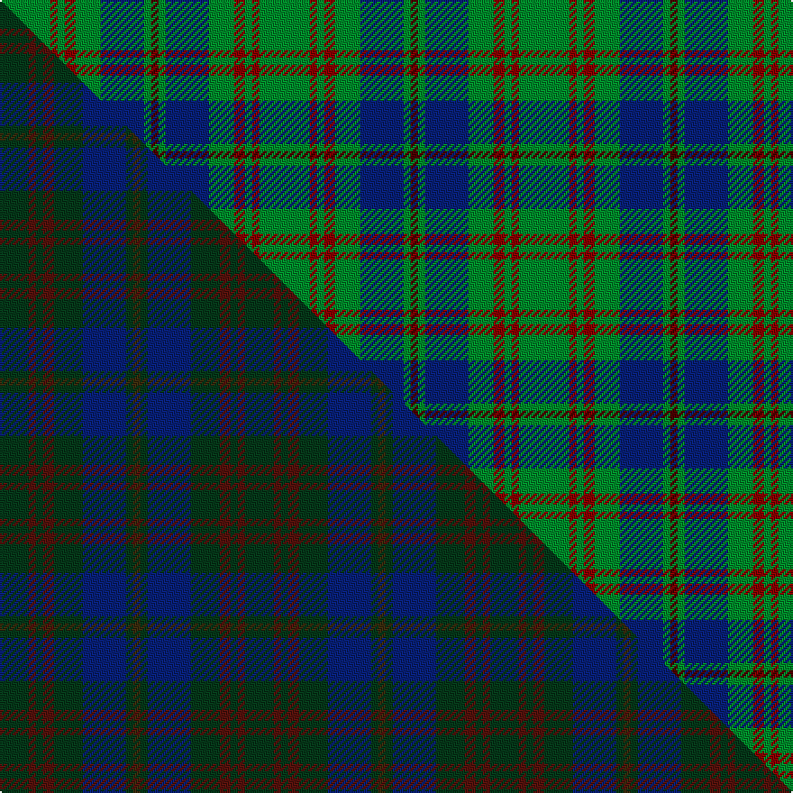

This is one **variant** — a specific cloth: this exact thread count and colourway, with its own
provenance below. It is one weaving of the [sett](/setts/g14r2g2r3g7db12g2dr2/) (the scale-free proportion — the
same cloth at any scale or shade), whose colour order is pattern [BGBGRGRG](/stripes/bgbgrgrg/).

Part of the [Glen Nevis](/tartans/g/gl/glen-nevis-3/) tartan — the named design grouping this sett with its other cloths.

Sourced from register-of-tartans.  It is a [8 stripe tartan](/stripes/stripes8/).

Original link [https://www.tartanregister.gov.uk/tartanDetails.aspx?ref=1391](https://www.tartanregister.gov.uk/tartanDetails.aspx?ref=1391)

2 attestations — the source records this cloth was collapsed from (oldest owns this page)

<ul>
<li>01/01/1994 — Glen Nevis #3 (register-of-tartans, <a href="https://www.tartanregister.gov.uk/tartanDetails.aspx?ref=1391">record</a>)  <em>Uniform worn by employees at Spean Bridge Mill outlet, 1994.</em></li>
<li>1994 — Glen Nevis #3 (Corporate) (tartans-authority, <a href="https://www.tartanregister.gov.uk/tartanDetails.aspx?ref=5018">record</a>)  <em>Uniform worn by employees at Spean Bridge Mill outlet, 1994 .</em></li>
</ul>

Dataset <small>— provenance for this record, inherited from the source manifest</small>

<dl class="dataset-prov">
<dt>source</dt><dd><a href="/sources/register-of-tartans/">Scottish Register of Tartans</a></dd>
<dt>data captured from</dt><dd><a href="https://github.com/thetartan/tartan-database/blob/master/data/register-of-tartans/data.csv">https://github.com/thetartan/tartan-database/blob/master/data/register-of-tartans/data.csv</a></dd>
<dt>data date</dt><dd>1994 <small>(this record)</small></dd>
<dt>licence</dt><dd><a href="https://www.tartanregister.gov.uk/copyright">Crown copyright</a></dd>
</dl>

Capture chain <small>— the hands this data passed through, oldest first; each capture carries its own licence</small>

<ol class="capture-chain">
<li><a href="https://www.tartanregister.gov.uk/">Scottish Register of Tartans</a> · <a href="https://www.tartanregister.gov.uk/copyright">Crown copyright</a> <small>the living register — still published by National Records of Scotland</small></li>
<li><a href="https://github.com/thetartan/tartan-database">thetartan/tartan-database</a> <small>2016-2017</small> · <a href="https://creativecommons.org/licenses/by-nc-nd/4.0/">CC BY-NC-ND 4.0</a> <small>Levko Kravets's frozen compilation — the capture we vendored, and where its CC licence text came from</small></li>
<li>this dictionary <small>captured 2026-06-10 · commit 5bf86c7566</small> <small>each re-capture is a git commit to data/sources</small></li>
</ol>

## Register references

External register numbers recorded for this tartan.

- Scottish Register of Tartans: [1391](https://www.tartanregister.gov.uk/tartanDetails.aspx?ref=1391)
- Scottish Tartans Authority (ITI): 5018

## Thread count
G/28 R4 G4 R6 G14 DB24 G4 DR/4

One full sett is **144 threads**.

## Palette
<table><thead><tr><th>Colour</th><th>Shade</th><th>OKLCh</th></tr></thead><tbody><tr><td>DB</td><td><code style="background-color:#082077;">#082077</code> <small style="color:#888">#082077</small></td><td><small style="color:#888">oklch(30.0% 0.149 265.1)</small></td></tr><tr><td>R</td><td><code style="background-color:#880000;">#880000</code> <small style="color:#888">#880000</small></td><td><small style="color:#888">oklch(39.4% 0.162 29.2)</small></td></tr><tr><td>DR</td><td><code style="background-color:#4C0000;">#4C0000</code> <small style="color:#888">#4C0000</small></td><td><small style="color:#888">oklch(26.2% 0.107 29.2)</small></td></tr><tr><td>G</td><td><code style="background-color:#008B2A;">#008B2A</code> <small style="color:#888">#008B2A</small></td><td><small style="color:#888">oklch(55.4% 0.170 145.9)</small></td></tr></tbody></table>

# Sample pattern

## Compared to the master

This cloth is one sett of its design; the master sett (the exemplar the design is anchored on) is below for comparison.

Its **ΔTartan distance** from the master is **1.26** — the same measure the nearest-tartans table ranks by (0 is identical; a re-scale of the same cloth is near 0, a recolour or a different proportion further).

<figure class="master-compare" style="margin:0">

this sett
master sett ★

<figcaption style="color:#888;font-size:smaller">One weave of this sett against the <a href="/setts/dg8dr2dg2dr3dg8db12dg2dy2/">master sett ★</a>, split on the diagonal: a shared proportion runs seamlessly across it with only the shades shifting; a different proportion breaks on it.</figcaption>
</figure>

## Nearest tartan variants

The nearest existing variants by ΔTartan distance, with this cloth at the top so the swatches line up against it.

ΔTartan

Threads

Variant

Sett

—

144

<a href="/variants/s8/g14r2g2r3g7db12g2dr2~x2~r1606028-dr1004029/">Glen Nevis #3</a>

<a href="/ttd/edit/#slug=g8k2g13r4g12db22g5ly3~x2&amp;base=g14r2g2r3g7db12g2dr2~x2~r1606028-dr1004029" title="compare in the TTD">1.16</a>

254

<a href="/variants/s8/g8k2g13r4g12db22g5ly3~x2/">Taylor</a>

<a href="/ttd/edit/#slug=g10r1g1r2g8db10g1ly1~x4&amp;base=g14r2g2r3g7db12g2dr2~x2~r1606028-dr1004029" title="compare in the TTD">1.20</a>

228

<a href="/variants/s8/g10r1g1r2g8db10g1ly1~x4/">Glen Esk</a>

<a href="/ttd/edit/#slug=g8k2g13b4g12db22g5y3~x2&amp;base=g14r2g2r3g7db12g2dr2~x2~r1606028-dr1004029" title="compare in the TTD">1.50</a>

254

<a href="/variants/s8/g8k2g13b4g12db22g5y3~x2/">Taylor</a>

<a href="/ttd/edit/#slug=r5g20r5g20db24g6y4&amp;base=g14r2g2r3g7db12g2dr2~x2~r1606028-dr1004029" title="compare in the TTD">2.06</a>

159

<a href="/variants/s7/r5g20r5g20db24g6y4/">Cameron of Lochiel (Hunting) Clan/Family Tartan</a>

<a href="/ttd/edit/#slug=g3db8g3k4g15r2~x2&amp;base=g14r2g2r3g7db12g2dr2~x2~r1606028-dr1004029" title="compare in the TTD">2.08</a>

130

<a href="/variants/s6/g3db8g3k4g15r2~x2/">Lauder (Family)</a>

<a href="/ttd/edit/#slug=dg3w5dg3db6dg5db1dg12r1~x2&amp;base=g14r2g2r3g7db12g2dr2~x2~r1606028-dr1004029" title="compare in the TTD">2.12</a>

136

<a href="/variants/s8/dg3w5dg3db6dg5db1dg12r1~x2/">Hasegawa (Akasaka) (Personal)</a>

<a href="/ttd/edit/#slug=g40r3g4r3g12db32lo4r3~x2&amp;base=g14r2g2r3g7db12g2dr2~x2~r1606028-dr1004029" title="compare in the TTD">2.12</a>

318

<a href="/variants/s8/g40r3g4r3g12db32lo4r3~x2/">US Marine Corps</a>

<a href="/ttd/edit/#slug=g2k1g12dr4g3db9lb2~x4&amp;base=g14r2g2r3g7db12g2dr2~x2~r1606028-dr1004029" title="compare in the TTD">2.14</a>

248

<a href="/variants/s7/g2k1g12dr4g3db9lb2~x4/">Lee (Personal)</a>

<a href="/ttd/edit/#slug=dr2dg12k3dg2t8dg2~x2&amp;base=g14r2g2r3g7db12g2dr2~x2~r1606028-dr1004029" title="compare in the TTD">2.17</a>

108

<a href="/variants/s6/dr2dg12k3dg2t8dg2~x2/">Wcwm 1045</a>

<a href="/ttd/edit/#slug=r3g10r3g14db16g3y2~x2&amp;base=g14r2g2r3g7db12g2dr2~x2~r1606028-dr1004029" title="compare in the TTD">2.17</a>

194

<a href="/variants/s7/r3g10r3g14db16g3y2~x2/">Cameron of Lochiel (Hunting)</a>

## Neighbour map

Every grey dot is one of 13621 variants placed by the first two principal components of the ΔTartan feature space (42% of its variance). Red is this tartan; blue dots are its nearest — click one to open its page. The map is a flat projection of a many-dimensional space — [how to read it](/posts/neighbourhood-maps/).

<svg viewBox="0 0 640 380" role="img" style="max-width:100%;height:auto;border:1px solid #e0e0e0;border-radius:4px;display:block" xmlns="http://www.w3.org/2000/svg"><image href="/nn/cloud.v1.png" width="640" height="380"/><a href="/variants/s8/g8k2g13r4g12db22g5ly3~x2/"><circle cx="245.0" cy="185.9" r="4" fill="#3465a4"><title>Taylor</title></circle></a><a href="/variants/s8/g10r1g1r2g8db10g1ly1~x4/"><circle cx="325.0" cy="200.8" r="4" fill="#3465a4"><title>Glen Esk</title></circle></a><a href="/variants/s8/g8k2g13b4g12db22g5y3~x2/"><circle cx="260.5" cy="192.7" r="4" fill="#3465a4"><title>Taylor</title></circle></a><a href="/variants/s7/r5g20r5g20db24g6y4/"><circle cx="273.9" cy="249.4" r="4" fill="#3465a4"><title>Cameron of Lochiel (Hunting) Clan/Family Tartan</title></circle></a><a href="/variants/s6/g3db8g3k4g15r2~x2/"><circle cx="269.4" cy="215.9" r="4" fill="#3465a4"><title>Lauder (Family)</title></circle></a><a href="/variants/s8/dg3w5dg3db6dg5db1dg12r1~x2/"><circle cx="316.9" cy="199.2" r="4" fill="#3465a4"><title>Hasegawa (Akasaka) (Personal)</title></circle></a><a href="/variants/s8/g40r3g4r3g12db32lo4r3~x2/"><circle cx="321.9" cy="177.5" r="4" fill="#3465a4"><title>US Marine Corps</title></circle></a><a href="/variants/s7/g2k1g12dr4g3db9lb2~x4/"><circle cx="232.3" cy="182.1" r="4" fill="#3465a4"><title>Lee (Personal)</title></circle></a><a href="/variants/s6/dr2dg12k3dg2t8dg2~x2/"><circle cx="286.0" cy="236.4" r="4" fill="#3465a4"><title>Wcwm 1045</title></circle></a><a href="/variants/s7/r3g10r3g14db16g3y2~x2/"><circle cx="279.2" cy="231.2" r="4" fill="#3465a4"><title>Cameron of Lochiel (Hunting)</title></circle></a><circle cx="302.0" cy="224.6" r="5" fill="#c00000"/><text x="320" y="376" text-anchor="middle" font-size="11" fill="#999">ground</text><text x="11" y="190" text-anchor="middle" font-size="11" fill="#999" transform="rotate(-90 11 190)">complexity</text></svg>

ID: /variants/s8/g14r2g2r3g7db12g2dr2~x2~r1606028-dr1004029/
