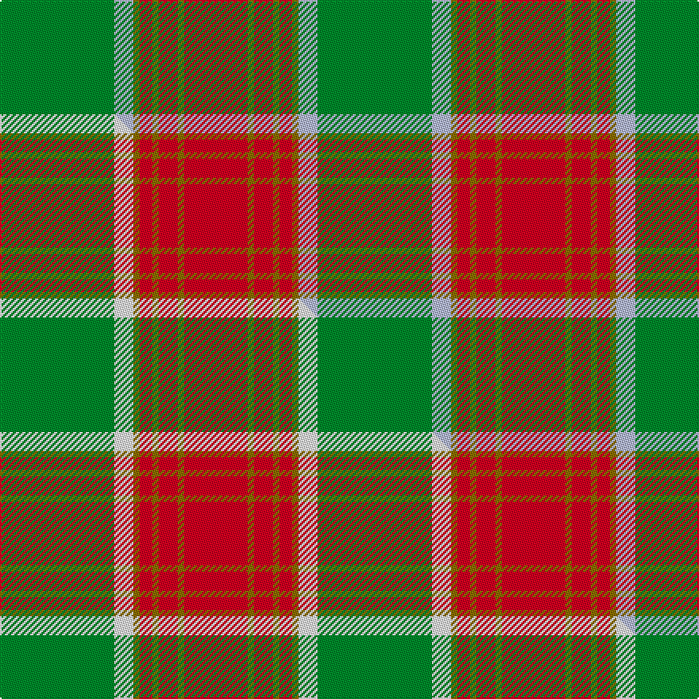

This is one **variant** — a specific cloth: this exact thread count and colourway, with its own
provenance below. It is one weaving of the [sett](/tartans/b/br/brisbane/) (the scale-free proportion — the
same cloth at any scale or shade), whose colour order is pattern [GWGRGRGR](/stripes/gwgrgrgr/).

Part of the [Brisbane](/tartans/b/br/brisbane/) tartan — the named design grouping this sett with its other cloths.

Sourced from tartans-authority.  It is a [8 stripe tartan](/stripes/stripes8/).

Original link <code>http://www.tartansauthority.com/tartan-ferret/display/6308/</code> — retired · [Internet Archive copy](https://web.archive.org/web/*/http://www.tartansauthority.com/tartan-ferret/display/6308/*)

Dataset <small>— provenance for this record, inherited from the source manifest</small>

<dl class="dataset-prov">
<dt>source</dt><dd><a href="/sources/tartans-authority/">Scottish Tartans Authority</a></dd>
<dt>data captured from</dt><dd><a href="https://github.com/thetartan/tartan-database/blob/master/data/tartans-authority/data.csv">https://github.com/thetartan/tartan-database/blob/master/data/tartans-authority/data.csv</a></dd>
<dt>data date</dt><dd>pre 1900 <small>(this record)</small></dd>
<dt>licence</dt><dd><a href="https://creativecommons.org/licenses/by-nc-nd/4.0/">CC BY-NC-ND 4.0</a></dd>
</dl>

Capture chain <small>— the hands this data passed through, oldest first; each capture carries its own licence</small>

<ol class="capture-chain">
<li><a href="https://www.tartansauthority.com/">Scottish Tartans Authority</a> <small>the heritage body’s archive — its tartan-ferret record browser is retired; dead record links are shown unlinked, with an Internet Archive copy (ITI numbers are not SRT references)</small></li>
<li><a href="https://github.com/thetartan/tartan-database">thetartan/tartan-database</a> <small>2016-2017</small> · <a href="https://creativecommons.org/licenses/by-nc-nd/4.0/">CC BY-NC-ND 4.0</a> <small>Levko Kravets's frozen compilation — the capture we vendored, and where its CC licence text came from</small></li>
<li>this dictionary <small>captured 2026-06-10 · commit 5bf86c7566</small> <small>each re-capture is a git commit to data/sources</small></li>
</ol>

## Register references

External register numbers recorded for this tartan.

- Scottish Tartans Authority (ITI): 6308

## Thread count
G/72 LB12 Y4 R8 Y4 R12 Y4 R/40

One full sett is **200 threads**.

## Palette
<table><thead><tr><th>Colour</th><th>Shade</th><th>OKLCh</th></tr></thead><tbody><tr><td>G</td><td><code style="background-color:#008B2A;">#008B2A</code> <small style="color:#888">#008B2A</small></td><td><small style="color:#888">oklch(55.4% 0.170 145.9)</small></td></tr><tr><td>LB</td><td><code style="background-color:#B5BBDE;">#B5BBDE</code> <small style="color:#888">#B5BBDE</small></td><td><small style="color:#888">oklch(79.9% 0.050 277.6)</small></td></tr><tr><td>R</td><td><code style="background-color:#D60020;">#D60020</code> <small style="color:#888">#D60020</small></td><td><small style="color:#888">oklch(55.2% 0.224 25.5)</small></td></tr><tr><td>Y</td><td><code style="background-color:#8B6E00;">#8B6E00</code> <small style="color:#888">#8B6E00</small></td><td><small style="color:#888">oklch(55.1% 0.113 90.4)</small></td></tr></tbody></table>

# Sample pattern

## Compared to the master

This cloth is one sett of its design; the master sett (the exemplar the design is anchored on) is below for comparison.

Its **ΔTartan distance** from the master is **0.30** — the same measure the nearest-tartans table ranks by (0 is identical; a re-scale of the same cloth is near 0, a recolour or a different proportion further).

<figure class="master-compare" style="margin:0">

this sett
master sett ★

<figcaption style="color:#888;font-size:smaller">One weave of this sett against the <a href="/setts/g18w3y1r2y1r3y1r10/">master sett ★</a>, split on the diagonal: a shared proportion runs seamlessly across it with only the shades shifting; a different proportion breaks on it.</figcaption>
</figure>

## Nearest tartan variants

The nearest existing variants by ΔTartan distance, with this cloth at the top so the swatches line up against it.

ΔTartan

Threads

Variant

Sett

—

200

<a href="/variants/s8/g18lb3y1r2y1r3y1r10~x4/">Brisbane (Artefact)</a>

<a href="/ttd/edit/#slug=g18w3y1r2y1r3y1r10~x4&amp;base=g18lb3y1r2y1r3y1r10~x4" title="compare in the TTD">0.30</a>

200

<a href="/variants/s8/g18w3y1r2y1r3y1r10~x4/">Brisbane (Artefact)</a>

<a href="/ttd/edit/#slug=dp8r3y1r3g14r3y1~x4&amp;base=g18lb3y1r2y1r3y1r10~x4" title="compare in the TTD">2.12</a>

228

<a href="/variants/s7/dp8r3y1r3g14r3y1~x4/">Logan with Yellow</a>

<a href="/ttd/edit/#slug=r3g3y1r18w1g21y1g1y3~x2&amp;base=g18lb3y1r2y1r3y1r10~x4" title="compare in the TTD">2.17</a>

196

<a href="/variants/s9/r3g3y1r18w1g21y1g1y3~x2/">MacDonald of Kingsburgh Clan Tartan</a>

<a href="/ttd/edit/#slug=r3g3lo2r18w2g21lo2g2lo3~x2&amp;base=g18lb3y1r2y1r3y1r10~x4" title="compare in the TTD">2.23</a>

212

<a href="/variants/s9/r3g3lo2r18w2g21lo2g2lo3~x2/">MacDonald of Kingsburgh</a>

<a href="/ttd/edit/#slug=g5r4g17lt5r32lt5g17r4g5w2~x2&amp;base=g18lb3y1r2y1r3y1r10~x4" title="compare in the TTD">2.25</a>

370

<a href="/variants/s10/g5r4g17lt5r32lt5g17r4g5w2~x2/">Wilson's No.005</a>

<a href="/ttd/edit/#slug=r2g16ri1r2ri12y1lb1~x2~r4315012-ri5221030&amp;base=g18lb3y1r2y1r3y1r10~x4" title="compare in the TTD">2.29</a>

134

<a href="/variants/s7/r2g16ri1r2ri12y1lb1~x2~r4315012-ri5221030/">Spragg (Name)</a>

<a href="/ttd/edit/#slug=o10lb2g3lb2do24lb4do4o34do2lb3do2~x2&amp;base=g18lb3y1r2y1r3y1r10~x4" title="compare in the TTD">2.55</a>

336

<a href="/variants/s11/o10lb2g3lb2do24lb4do4o34do2lb3do2~x2/">Fort William (Fashion)</a>

<a href="/ttd/edit/#slug=r3o14g8r2g2w2g2r1~x2&amp;base=g18lb3y1r2y1r3y1r10~x4" title="compare in the TTD">2.58</a>

128

<a href="/variants/s8/r3o14g8r2g2w2g2r1~x2/">Scott, hunting</a>

<a href="/ttd/edit/#slug=g5y5g5y35dr44r3dr3~x2~g6019141&amp;base=g18lb3y1r2y1r3y1r10~x4" title="compare in the TTD">2.65</a>

384

<a href="/variants/s7/g5y5g5y35dr44r3dr3~x2~g6019141/">Fernandes Family Tartan</a>

<a href="/ttd/edit/#slug=ri2r1ri10r2g10w1g2~x2~ri5021030-r3715030&amp;base=g18lb3y1r2y1r3y1r10~x4" title="compare in the TTD">2.72</a>

104

<a href="/variants/s7/ri2r1ri10r2g10w1g2~x2~ri5021030-r3715030/">Lennox</a>

## Neighbour map

Every grey dot is one of 13662 variants placed by the first two principal components of the ΔTartan feature space (42% of its variance). Red is this tartan; blue dots are its nearest — click one to open its page. The map is a flat projection of a many-dimensional space — [how to read it](/posts/neighbourhood-maps/).

<svg viewBox="0 0 640 380" role="img" style="max-width:100%;height:auto;border:1px solid #e0e0e0;border-radius:4px;display:block" xmlns="http://www.w3.org/2000/svg"><image href="/nn/cloud.v1.png" width="640" height="380"/><a href="/variants/s8/g18w3y1r2y1r3y1r10~x4/"><circle cx="308.4" cy="161.9" r="4" fill="#3465a4"><title>Brisbane (Artefact)</title></circle></a><a href="/variants/s7/dp8r3y1r3g14r3y1~x4/"><circle cx="261.1" cy="192.5" r="4" fill="#3465a4"><title>Logan with Yellow</title></circle></a><a href="/variants/s9/r3g3y1r18w1g21y1g1y3~x2/"><circle cx="355.8" cy="152.2" r="4" fill="#3465a4"><title>MacDonald of Kingsburgh Clan Tartan</title></circle></a><a href="/variants/s9/r3g3lo2r18w2g21lo2g2lo3~x2/"><circle cx="293.7" cy="179.2" r="4" fill="#3465a4"><title>MacDonald of Kingsburgh</title></circle></a><a href="/variants/s10/g5r4g17lt5r32lt5g17r4g5w2~x2/"><circle cx="294.5" cy="174.3" r="4" fill="#3465a4"><title>Wilson's No.005</title></circle></a><a href="/variants/s7/r2g16ri1r2ri12y1lb1~x2~r4315012-ri5221030/"><circle cx="311.8" cy="164.7" r="4" fill="#3465a4"><title>Spragg (Name)</title></circle></a><a href="/variants/s11/o10lb2g3lb2do24lb4do4o34do2lb3do2~x2/"><circle cx="342.8" cy="153.4" r="4" fill="#3465a4"><title>Fort William (Fashion)</title></circle></a><a href="/variants/s8/r3o14g8r2g2w2g2r1~x2/"><circle cx="300.8" cy="197.7" r="4" fill="#3465a4"><title>Scott, hunting</title></circle></a><a href="/variants/s7/g5y5g5y35dr44r3dr3~x2~g6019141/"><circle cx="361.0" cy="190.8" r="4" fill="#3465a4"><title>Fernandes Family Tartan</title></circle></a><a href="/variants/s7/ri2r1ri10r2g10w1g2~x2~ri5021030-r3715030/"><circle cx="283.2" cy="202.7" r="4" fill="#3465a4"><title>Lennox</title></circle></a><circle cx="328.1" cy="168.5" r="5" fill="#c00000"/><text x="320" y="376" text-anchor="middle" font-size="11" fill="#999">ground</text><text x="11" y="190" text-anchor="middle" font-size="11" fill="#999" transform="rotate(-90 11 190)">complexity</text></svg>

ID: /variants/s8/g18lb3y1r2y1r3y1r10~x4/
