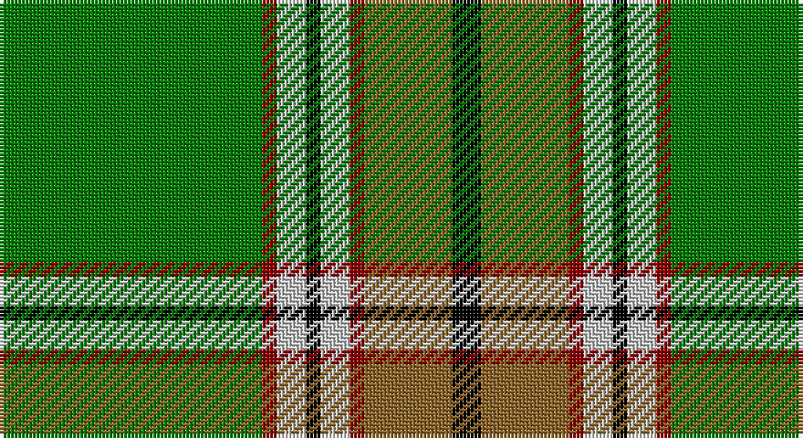

This page is one **sett** — a single exact thread-count. It belongs to the [tartan](/setts/g18r1lb2k1lb2r1o6k2/)
(the same proportion at any scale), whose colour order is pattern [GRWKWRRK](/stripes/grwkwrrk/).

Part of the [Humphries](/tartans/humphries/) tartan — the named design grouping this sett with its other cloths.

Sourced from tartans-authority.  It is a [8 stripe tartan](/stripes/stripes8/).

Original link http://www.tartansauthority.com/tartan-ferret/display/5225/

## Register references

External register numbers recorded for this tartan.

- Scottish Tartans Authority (ITI): 5225

## Thread count
G/72 DR4 N8 K4 N8 DR4 LT24 K/8

One full sett is **184 threads**.

## Palette

Palette: <strong>Tartan Register</strong> <small style="color:#888">(3 of 5 colours)</small>
<table><thead><tr><th>Colour</th><th>Threads</th><th>Shade</th><th>Base</th><th>OKLCh</th></tr></thead><tbody><tr><td>G/</td><td style="text-align:right;font-variant-numeric:tabular-nums">72</td><td><code style="background-color:#007800;">#007800</code> <small style="color:#888">#007800</small></td><td>G <code style="background-color:#006100;">#006100</code></td><td><small style="color:#888">oklch(49.6% 0.169 142.5)</small></td></tr><tr><td>DR</td><td style="text-align:right;font-variant-numeric:tabular-nums">4</td><td><code style="background-color:#8C0000;">#8C0000</code> <small style="color:#888">#8C0000</small></td><td>R <code style="background-color:#CC0000;">#CC0000</code></td><td><small style="color:#888">oklch(40.2% 0.165 29.2)</small></td></tr><tr><td>N</td><td style="text-align:right;font-variant-numeric:tabular-nums">8</td><td><code style="background-color:#C8C8C8;">#C8C8C8</code> <small style="color:#888">#C8C8C8</small></td><td>W <code style="background-color:#F7F7F7;">#F7F7F7</code></td><td><small style="color:#888">oklch(83.3% 0.000 89.9)</small></td></tr><tr><td>K</td><td style="text-align:right;font-variant-numeric:tabular-nums">4</td><td><code style="background-color:#000000;">#000000</code> <small style="color:#888">#000000</small></td><td>K <code style="background-color:#000000;">#000000</code></td><td><small style="color:#888">oklch(0.0% 0.000 0.0)</small></td></tr><tr><td>N</td><td style="text-align:right;font-variant-numeric:tabular-nums">8</td><td><code style="background-color:#C8C8C8;">#C8C8C8</code> <small style="color:#888">#C8C8C8</small></td><td>W <code style="background-color:#F7F7F7;">#F7F7F7</code></td><td><small style="color:#888">oklch(83.3% 0.000 89.9)</small></td></tr><tr><td>DR</td><td style="text-align:right;font-variant-numeric:tabular-nums">4</td><td><code style="background-color:#8C0000;">#8C0000</code> <small style="color:#888">#8C0000</small></td><td>R <code style="background-color:#CC0000;">#CC0000</code></td><td><small style="color:#888">oklch(40.2% 0.165 29.2)</small></td></tr><tr><td>LT</td><td style="text-align:right;font-variant-numeric:tabular-nums">24</td><td><code style="background-color:#8C6428;">#8C6428</code> <small style="color:#888">#8C6428</small></td><td>R <code style="background-color:#CC0000;">#CC0000</code></td><td><small style="color:#888">oklch(53.3% 0.092 74.3)</small></td></tr><tr><td>K/</td><td style="text-align:right;font-variant-numeric:tabular-nums">8</td><td><code style="background-color:#000000;">#000000</code> <small style="color:#888">#000000</small></td><td>K <code style="background-color:#000000;">#000000</code></td><td><small style="color:#888">oklch(0.0% 0.000 0.0)</small></td></tr></tbody></table>

# Sample pattern

## Compared to the master

This cloth is one sett of its design; the master sett (the exemplar the design is anchored on) is below for comparison.

<figure style="margin:0"><figcaption style="color:#888;font-size:smaller">this sett</figcaption></figure>
<figure style="margin:0"><figcaption style="color:#888;font-size:smaller"><a href="/setts/k16ki4k4ki4k6ki14dg17ki2r3ki2dg17ki14k18w4/">master sett →</a></figcaption></figure>

## Nearest tartans

The nearest existing variants by ΔTartan distance, with this tartan at the top so the swatches line up against it.

ΔTartan

Tartan

Sett

—

<a href="/ttd/edit/#slug=g18r1lb2k1lb2r1o6k2~x4">Humphries (Name)</a> <a class="nn-out" href="/variants/s8/g18r1lb2k1lb2r1o6k2~x4/" title="open its dictionary page">↗</a>

0.75

<a href="/ttd/edit/#slug=g12k1r1k1t2k1ly4~x2&amp;base=g18r1lb2k1lb2r1o6k2~x4">Alberta District Tartan</a> <a class="nn-out" href="/variants/s7/g12k1r1k1t2k1ly4~x2/" title="open its dictionary page">↗</a>

0.76

<a href="/ttd/edit/#slug=g13k1r1k1b2k1ly4~x8&amp;base=g18r1lb2k1lb2r1o6k2~x4">Alberta (Province)</a> <a class="nn-out" href="/variants/s7/g13k1r1k1b2k1ly4~x8/" title="open its dictionary page">↗</a>

0.84

<a href="/ttd/edit/#slug=g12k1r1k1b2k1ly4~x8&amp;base=g18r1lb2k1lb2r1o6k2~x4">Alberta (District)</a> <a class="nn-out" href="/variants/s7/g12k1r1k1b2k1ly4~x8/" title="open its dictionary page">↗</a>

0.92

<a href="/ttd/edit/#slug=w6g5r5g45k4o24k4g5~x2&amp;base=g18r1lb2k1lb2r1o6k2~x4">O'Neill</a> <a class="nn-out" href="/variants/s8/w6g5r5g45k4o24k4g5~x2/" title="open its dictionary page">↗</a>

0.99

<a href="/ttd/edit/#slug=ly5g3ly3g53r7db5r13w4~x2&amp;base=g18r1lb2k1lb2r1o6k2~x4">Hall (P.I.E.) (Personal)</a> <a class="nn-out" href="/variants/s8/ly5g3ly3g53r7db5r13w4~x2/" title="open its dictionary page">↗</a>

1.07

<a href="/ttd/edit/#slug=k3w1g29y8r2y2r2y2r8g7k2~x2&amp;base=g18r1lb2k1lb2r1o6k2~x4">Gray, hunting</a> <a class="nn-out" href="/variants/s11/k3w1g29y8r2y2r2y2r8g7k2~x2/" title="open its dictionary page">↗</a>

1.08

<a href="/ttd/edit/#slug=w9dg2g2w3g18k2dg33lo2~x2&amp;base=g18r1lb2k1lb2r1o6k2~x4">New World Irish (Fashion)</a> <a class="nn-out" href="/variants/s8/w9dg2g2w3g18k2dg33lo2~x2/" title="open its dictionary page">↗</a>

1.12

<a href="/ttd/edit/#slug=g71k4r4db9r4db4r36db4w4&amp;base=g18r1lb2k1lb2r1o6k2~x4">Rattray</a> <a class="nn-out" href="/variants/s9/g71k4r4db9r4db4r36db4w4/" title="open its dictionary page">↗</a>

1.13

<a href="/ttd/edit/#slug=k1gi3w3gii15k1gii3gi2k1gi1g1w1~x2&amp;base=g18r1lb2k1lb2r1o6k2~x4">University of North Texas</a> <a class="nn-out" href="/variants/s11/k1gi3w3gii15k1gii3gi2k1gi1g1w1~x2/" title="open its dictionary page">↗</a>

1.14

<a href="/ttd/edit/#slug=t6g2t2g41dg6g2r21ly6&amp;base=g18r1lb2k1lb2r1o6k2~x4">Manitoba</a> <a class="nn-out" href="/variants/s8/t6g2t2g41dg6g2r21ly6/" title="open its dictionary page">↗</a>

## Neighbour map

Every grey dot is one of 14360 variants placed by the first two principal components of the ΔTartan feature space (44% of its variance). Red is this tartan; blue dots are its nearest — click one to open its page.

<svg viewBox="0 0 640 380" role="img" style="max-width:100%;height:auto;border:1px solid #e0e0e0;border-radius:4px;display:block" xmlns="http://www.w3.org/2000/svg"><image href="/nn/cloud.v1.png" width="640" height="380"/><a href="/variants/s7/g12k1r1k1t2k1ly4~x2/"><circle cx="269.8" cy="155.8" r="4" fill="#3465a4"><title>Alberta District Tartan</title></circle></a><a href="/variants/s7/g13k1r1k1b2k1ly4~x8/"><circle cx="290.2" cy="153.1" r="4" fill="#3465a4"><title>Alberta (Province)</title></circle></a><a href="/variants/s7/g12k1r1k1b2k1ly4~x8/"><circle cx="270.2" cy="157.0" r="4" fill="#3465a4"><title>Alberta (District)</title></circle></a><a href="/variants/s8/w6g5r5g45k4o24k4g5~x2/"><circle cx="282.8" cy="159.7" r="4" fill="#3465a4"><title>O'Neill</title></circle></a><a href="/variants/s8/ly5g3ly3g53r7db5r13w4~x2/"><circle cx="344.4" cy="131.8" r="4" fill="#3465a4"><title>Hall (P.I.E.) (Personal)</title></circle></a><a href="/variants/s11/k3w1g29y8r2y2r2y2r8g7k2~x2/"><circle cx="311.9" cy="105.3" r="4" fill="#3465a4"><title>Gray, hunting</title></circle></a><a href="/variants/s8/w9dg2g2w3g18k2dg33lo2~x2/"><circle cx="269.8" cy="150.2" r="4" fill="#3465a4"><title>New World Irish (Fashion)</title></circle></a><a href="/variants/s9/g71k4r4db9r4db4r36db4w4/"><circle cx="297.0" cy="118.6" r="4" fill="#3465a4"><title>Rattray</title></circle></a><a href="/variants/s11/k1gi3w3gii15k1gii3gi2k1gi1g1w1~x2/"><circle cx="282.4" cy="124.6" r="4" fill="#3465a4"><title>University of North Texas</title></circle></a><a href="/variants/s8/t6g2t2g41dg6g2r21ly6/"><circle cx="288.2" cy="127.6" r="4" fill="#3465a4"><title>Manitoba</title></circle></a><circle cx="289.1" cy="129.5" r="5" fill="#c00000"/></svg>

ID: /variants/s8/g18r1lb2k1lb2r1o6k2~x4/
