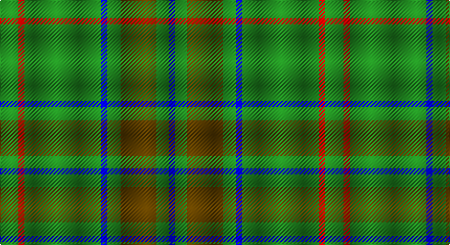

This page is one **sett** — a single exact thread-count. It belongs to the [tartan](/setts/g18r6g75b6g13dy35g12b6/)
(the same proportion at any scale), whose colour order is pattern [BGGGBGRG](/stripes/bgggbgrg/).

Sourced from register-of-tartans.  It is a [8 stripe tartan](/stripes/stripes8/).

Original link https://www.tartanregister.gov.uk/tartanDetails.aspx?ref=1422

## Register references

External register numbers recorded for this tartan.

- Scottish Register of Tartans: [1422](https://www.tartanregister.gov.uk/tartanDetails.aspx?ref=1422)
- Scottish Tartans Authority (ITI): 193
- Scottish Tartans World Register: 193

## Thread count
G/18 R6 G75 B6 G13 T35 G12 B/6

One full sett is **318 threads**.

## Palette

Palette: <strong>Tartan Register</strong> <small style="color:#888">(3 of 4 colours)</small>
<table><thead><tr><th>Colour</th><th>Threads</th><th>Shade</th><th>Base</th><th>OKLCh</th></tr></thead><tbody><tr><td>G/</td><td style="text-align:right;font-variant-numeric:tabular-nums">18</td><td><code style="background-color:#228B22;">#228B22</code> <small style="color:#888">#228B22</small></td><td>G <code style="background-color:#006100;">#006100</code></td><td><small style="color:#888">oklch(55.8% 0.169 142.9)</small></td></tr><tr><td>R</td><td style="text-align:right;font-variant-numeric:tabular-nums">6</td><td><code style="background-color:#FF0000;">#FF0000</code> <small style="color:#888">#FF0000</small></td><td>R <code style="background-color:#CC0000;">#CC0000</code></td><td><small style="color:#888">oklch(62.8% 0.258 29.2)</small></td></tr><tr><td>G</td><td style="text-align:right;font-variant-numeric:tabular-nums">75</td><td><code style="background-color:#228B22;">#228B22</code> <small style="color:#888">#228B22</small></td><td>G <code style="background-color:#006100;">#006100</code></td><td><small style="color:#888">oklch(55.8% 0.169 142.9)</small></td></tr><tr><td>B</td><td style="text-align:right;font-variant-numeric:tabular-nums">6</td><td><code style="background-color:#0000FF;">#0000FF</code> <small style="color:#888">#0000FF</small></td><td>B <code style="background-color:#2A418A;">#2A418A</code></td><td><small style="color:#888">oklch(45.2% 0.313 264.1)</small></td></tr><tr><td>G</td><td style="text-align:right;font-variant-numeric:tabular-nums">13</td><td><code style="background-color:#228B22;">#228B22</code> <small style="color:#888">#228B22</small></td><td>G <code style="background-color:#006100;">#006100</code></td><td><small style="color:#888">oklch(55.8% 0.169 142.9)</small></td></tr><tr><td>T</td><td style="text-align:right;font-variant-numeric:tabular-nums">35</td><td><code style="background-color:#604000;">#604000</code> <small style="color:#888">#604000</small></td><td>G <code style="background-color:#006100;">#006100</code></td><td><small style="color:#888">oklch(39.8% 0.083 76.8)</small></td></tr><tr><td>G</td><td style="text-align:right;font-variant-numeric:tabular-nums">12</td><td><code style="background-color:#228B22;">#228B22</code> <small style="color:#888">#228B22</small></td><td>G <code style="background-color:#006100;">#006100</code></td><td><small style="color:#888">oklch(55.8% 0.169 142.9)</small></td></tr><tr><td>B/</td><td style="text-align:right;font-variant-numeric:tabular-nums">6</td><td><code style="background-color:#0000FF;">#0000FF</code> <small style="color:#888">#0000FF</small></td><td>B <code style="background-color:#2A418A;">#2A418A</code></td><td><small style="color:#888">oklch(45.2% 0.313 264.1)</small></td></tr></tbody></table>

# Sample pattern

## Nearest tartans

The nearest existing variants by ΔTartan distance, with this tartan at the top so the swatches line up against it.

ΔTartan

Tartan

Sett

—

<a href="/ttd/edit/#slug=g18r6g75b6g13dy35g12b6">Glenlivet</a> <a class="nn-out" href="/variants/s8/g18r6g75b6g13dy35g12b6/" title="open its dictionary page">↗</a>

0.58

<a href="/ttd/edit/#slug=g5o9g4w5g30r2g4r2~x2&amp;base=g18r6g75b6g13dy35g12b6">Welsh Assembly (Fashion)</a> <a class="nn-out" href="/variants/s8/g5o9g4w5g30r2g4r2~x2/" title="open its dictionary page">↗</a>

0.63

<a href="/ttd/edit/#slug=g5y9g4w5g30r2g4r2~x2&amp;base=g18r6g75b6g13dy35g12b6">Welsh Assembly</a> <a class="nn-out" href="/variants/s8/g5y9g4w5g30r2g4r2~x2/" title="open its dictionary page">↗</a>

1.04

<a href="/ttd/edit/#slug=db1r3g11r2db5g11ly1~x2&amp;base=g18r6g75b6g13dy35g12b6">MacKintosh, hunting</a> <a class="nn-out" href="/variants/s7/db1r3g11r2db5g11ly1~x2/" title="open its dictionary page">↗</a>

1.13

<a href="/ttd/edit/#slug=g30t8g5lb4g5r2~x4&amp;base=g18r6g75b6g13dy35g12b6">Annapolis Valley</a> <a class="nn-out" href="/variants/s6/g30t8g5lb4g5r2~x4/" title="open its dictionary page">↗</a>

1.23

<a href="/ttd/edit/#slug=r3g22db16g14r2g6ly1~x2&amp;base=g18r6g75b6g13dy35g12b6">Scottish Scouts</a> <a class="nn-out" href="/variants/s7/r3g22db16g14r2g6ly1~x2/" title="open its dictionary page">↗</a>

1.24

<a href="/ttd/edit/#slug=gi6g3gi3g4gi4k5gi3k5gi28r2gi4r2~x2&amp;base=g18r6g75b6g13dy35g12b6">Ross Hunting Clan Tartan</a> <a class="nn-out" href="/variants/s12/gi6g3gi3g4gi4k5gi3k5gi28r2gi4r2~x2/" title="open its dictionary page">↗</a>

1.25

<a href="/ttd/edit/#slug=o9g4w5g30r2g4r2g4r2g30w5g4o9g5~x2&amp;base=g18r6g75b6g13dy35g12b6">Welsh Assembly</a> <a class="nn-out" href="/variants/s14/o9g4w5g30r2g4r2g4r2g30w5g4o9g5~x2/" title="open its dictionary page">↗</a>

1.31

<a href="/ttd/edit/#slug=r1g6ly1g6db1g1db1g1db2r1~x4&amp;base=g18r6g75b6g13dy35g12b6">Ayrton, Laoch</a> <a class="nn-out" href="/variants/s10/r1g6ly1g6db1g1db1g1db2r1~x4/" title="open its dictionary page">↗</a>

1.36

<a href="/ttd/edit/#slug=g4r1g15t5r1w5g4r1~x4&amp;base=g18r6g75b6g13dy35g12b6">McGirr (Letterkenny) David, (Pers.)</a> <a class="nn-out" href="/variants/s8/g4r1g15t5r1w5g4r1~x4/" title="open its dictionary page">↗</a>

1.36

<a href="/ttd/edit/#slug=dg10o1dg1o1lr2dg1o1~x4&amp;base=g18r6g75b6g13dy35g12b6">Green Watch</a> <a class="nn-out" href="/variants/s7/dg10o1dg1o1lr2dg1o1~x4/" title="open its dictionary page">↗</a>

## Neighbour map

Every grey dot is one of 14360 variants placed by the first two principal components of the ΔTartan feature space (44% of its variance). Red is this tartan; blue dots are its nearest — click one to open its page.

<svg viewBox="0 0 640 380" role="img" style="max-width:100%;height:auto;border:1px solid #e0e0e0;border-radius:4px;display:block" xmlns="http://www.w3.org/2000/svg"><image href="/nn/cloud.v1.png" width="640" height="380"/><a href="/variants/s8/g5o9g4w5g30r2g4r2~x2/"><circle cx="433.2" cy="182.1" r="4" fill="#3465a4"><title>Welsh Assembly (Fashion)</title></circle></a><a href="/variants/s8/g5y9g4w5g30r2g4r2~x2/"><circle cx="441.2" cy="186.9" r="4" fill="#3465a4"><title>Welsh Assembly</title></circle></a><a href="/variants/s7/db1r3g11r2db5g11ly1~x2/"><circle cx="364.5" cy="217.9" r="4" fill="#3465a4"><title>MacKintosh, hunting</title></circle></a><a href="/variants/s6/g30t8g5lb4g5r2~x4/"><circle cx="477.5" cy="213.2" r="4" fill="#3465a4"><title>Annapolis Valley</title></circle></a><a href="/variants/s7/r3g22db16g14r2g6ly1~x2/"><circle cx="407.9" cy="202.5" r="4" fill="#3465a4"><title>Scottish Scouts</title></circle></a><a href="/variants/s12/gi6g3gi3g4gi4k5gi3k5gi28r2gi4r2~x2/"><circle cx="435.3" cy="180.0" r="4" fill="#3465a4"><title>Ross Hunting Clan Tartan</title></circle></a><a href="/variants/s14/o9g4w5g30r2g4r2g4r2g30w5g4o9g5~x2/"><circle cx="419.7" cy="160.8" r="4" fill="#3465a4"><title>Welsh Assembly</title></circle></a><a href="/variants/s10/r1g6ly1g6db1g1db1g1db2r1~x4/"><circle cx="355.0" cy="218.7" r="4" fill="#3465a4"><title>Ayrton, Laoch</title></circle></a><a href="/variants/s8/g4r1g15t5r1w5g4r1~x4/"><circle cx="352.6" cy="180.9" r="4" fill="#3465a4"><title>McGirr (Letterkenny) David, (Pers.)</title></circle></a><a href="/variants/s7/dg10o1dg1o1lr2dg1o1~x4/"><circle cx="458.6" cy="214.8" r="4" fill="#3465a4"><title>Green Watch</title></circle></a><circle cx="418.6" cy="200.2" r="5" fill="#c00000"/></svg>

ID: /variants/s8/g18r6g75b6g13dy35g12b6/
