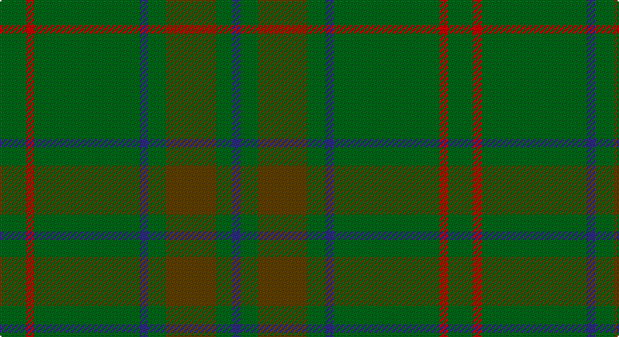

This page is one **sett** — a single exact thread-count. It belongs to the [tartan](/setts/g18r6g75db6g13dy35g12db6/)
(the same proportion at any scale), whose colour order is pattern [BGGGBGRG](/stripes/bgggbgrg/).

Sourced from house-of-tartan.  It is a [8 stripe tartan](/stripes/stripes8/).

Original link http://www.house-of-tartan.scotland.net/house/TartanViewjs.asp?colr=Def&tnam=193

## Provenance

Earliest known date: 1989 Designed for Glenlivet Distilleries Ltd, Strathspey.

## Thread count
G/18 R6 G75 DB6 G13 T35 G12 DB/6

One full sett is **318 threads**.

## Palette

Palette: <strong>Tartan Register</strong>
<table><thead><tr><th>Colour</th><th>Threads</th><th>Shade</th><th>Base</th><th>OKLCh</th></tr></thead><tbody><tr><td>G/</td><td style="text-align:right;font-variant-numeric:tabular-nums">18</td><td><code style="background-color:#006818;">#006818</code> <small style="color:#888">#006818</small></td><td>G <code style="background-color:#006100;">#006100</code></td><td><small style="color:#888">oklch(45.0% 0.142 145.0)</small></td></tr><tr><td>R</td><td style="text-align:right;font-variant-numeric:tabular-nums">6</td><td><code style="background-color:#C80000;">#C80000</code> <small style="color:#888">#C80000</small></td><td>R <code style="background-color:#CC0000;">#CC0000</code></td><td><small style="color:#888">oklch(52.3% 0.215 29.2)</small></td></tr><tr><td>G</td><td style="text-align:right;font-variant-numeric:tabular-nums">75</td><td><code style="background-color:#006818;">#006818</code> <small style="color:#888">#006818</small></td><td>G <code style="background-color:#006100;">#006100</code></td><td><small style="color:#888">oklch(45.0% 0.142 145.0)</small></td></tr><tr><td>DB</td><td style="text-align:right;font-variant-numeric:tabular-nums">6</td><td><code style="background-color:#2C2C80;">#2C2C80</code> <small style="color:#888">#2C2C80</small></td><td>B <code style="background-color:#2A418A;">#2A418A</code></td><td><small style="color:#888">oklch(35.0% 0.138 276.6)</small></td></tr><tr><td>G</td><td style="text-align:right;font-variant-numeric:tabular-nums">13</td><td><code style="background-color:#006818;">#006818</code> <small style="color:#888">#006818</small></td><td>G <code style="background-color:#006100;">#006100</code></td><td><small style="color:#888">oklch(45.0% 0.142 145.0)</small></td></tr><tr><td>T</td><td style="text-align:right;font-variant-numeric:tabular-nums">35</td><td><code style="background-color:#604000;">#604000</code> <small style="color:#888">#604000</small></td><td>G <code style="background-color:#006100;">#006100</code></td><td><small style="color:#888">oklch(39.8% 0.083 76.8)</small></td></tr><tr><td>G</td><td style="text-align:right;font-variant-numeric:tabular-nums">12</td><td><code style="background-color:#006818;">#006818</code> <small style="color:#888">#006818</small></td><td>G <code style="background-color:#006100;">#006100</code></td><td><small style="color:#888">oklch(45.0% 0.142 145.0)</small></td></tr><tr><td>DB/</td><td style="text-align:right;font-variant-numeric:tabular-nums">6</td><td><code style="background-color:#2C2C80;">#2C2C80</code> <small style="color:#888">#2C2C80</small></td><td>B <code style="background-color:#2A418A;">#2A418A</code></td><td><small style="color:#888">oklch(35.0% 0.138 276.6)</small></td></tr></tbody></table>

# Sample pattern

## Nearest tartans

The nearest existing variants by ΔTartan distance, with this tartan at the top so the swatches line up against it.

ΔTartan

Tartan

Sett

—

<a href="/ttd/edit/#slug=g18r6g75db6g13dy35g12db6">Glenlivet Corporate Tartan</a> <a class="nn-out" href="/variants/s8/g18r6g75db6g13dy35g12db6/" title="open its dictionary page">↗</a>

1.12

<a href="/ttd/edit/#slug=g18r6g75db6g13o35g12db6&amp;base=g18r6g75db6g13dy35g12db6">Glenlivet</a> <a class="nn-out" href="/variants/s8/g18r6g75db6g13o35g12db6/" title="open its dictionary page">↗</a>

1.44

<a href="/ttd/edit/#slug=g37o9g3dr9o3~x2&amp;base=g18r6g75db6g13dy35g12db6">Glen Boig</a> <a class="nn-out" href="/variants/s5/g37o9g3dr9o3~x2/" title="open its dictionary page">↗</a>

1.81

<a href="/ttd/edit/#slug=lo3gi15r2gi2r6gi2dg6gi2dg2gi23g2gi2~x2&amp;base=g18r6g75db6g13dy35g12db6">INSEAD</a> <a class="nn-out" href="/variants/s12/lo3gi15r2gi2r6gi2dg6gi2dg2gi23g2gi2~x2/" title="open its dictionary page">↗</a>

1.85

<a href="/ttd/edit/#slug=dg18r6dg75db6dg13dy35dg12db6&amp;base=g18r6g75db6g13dy35g12db6">Gayre Bodyguard</a> <a class="nn-out" href="/variants/s8/dg18r6dg75db6dg13dy35dg12db6/" title="open its dictionary page">↗</a>

1.88

<a href="/ttd/edit/#slug=g27gi14dt2gi2ly2~x4&amp;base=g18r6g75db6g13dy35g12db6">Irving of Bonshaw</a> <a class="nn-out" href="/variants/s5/g27gi14dt2gi2ly2~x4/" title="open its dictionary page">↗</a>

1.92

<a href="/ttd/edit/#slug=dt17g5dt5g17dt4g17k2dy2k2g5~x2&amp;base=g18r6g75db6g13dy35g12db6">Hueg (Hunting) (Personal)</a> <a class="nn-out" href="/variants/s10/dt17g5dt5g17dt4g17k2dy2k2g5~x2/" title="open its dictionary page">↗</a>

1.95

<a href="/ttd/edit/#slug=y36g19y4g31b2r3b2r3g12~x2&amp;base=g18r6g75db6g13dy35g12db6">O'Brien (Scotch Corner)</a> <a class="nn-out" href="/variants/s9/y36g19y4g31b2r3b2r3g12~x2/" title="open its dictionary page">↗</a>

2.00

<a href="/variants/s8/y3dyi3y4k4dy14k3y41g2~x2/">Huntsman</a>

2.00

<a href="/ttd/edit/#slug=gi3lo1gi3r1gi14dg2gi3dg1gi3g1gi2g1gi2g2~x4&amp;base=g18r6g75db6g13dy35g12db6">New South Wales</a> <a class="nn-out" href="/variants/s14/gi3lo1gi3r1gi14dg2gi3dg1gi3g1gi2g1gi2g2~x4/" title="open its dictionary page">↗</a>

2.05

<a href="/ttd/edit/#slug=g3dt1g2r1g3db3g2db2g18dt2~x2&amp;base=g18r6g75db6g13dy35g12db6">Owen Welsh Name Tartan</a> <a class="nn-out" href="/variants/s10/g3dt1g2r1g3db3g2db2g18dt2~x2/" title="open its dictionary page">↗</a>

## Neighbour map

Every grey dot is one of 14360 variants placed by the first two principal components of the ΔTartan feature space (44% of its variance). Red is this tartan; blue dots are its nearest — click one to open its page.

<svg viewBox="0 0 640 380" role="img" style="max-width:100%;height:auto;border:1px solid #e0e0e0;border-radius:4px;display:block" xmlns="http://www.w3.org/2000/svg"><image href="/nn/cloud.v1.png" width="640" height="380"/><a href="/variants/s8/g18r6g75db6g13o35g12db6/"><circle cx="472.1" cy="228.6" r="4" fill="#3465a4"><title>Glenlivet</title></circle></a><a href="/variants/s5/g37o9g3dr9o3~x2/"><circle cx="492.4" cy="271.6" r="4" fill="#3465a4"><title>Glen Boig</title></circle></a><a href="/variants/s12/lo3gi15r2gi2r6gi2dg6gi2dg2gi23g2gi2~x2/"><circle cx="435.2" cy="188.9" r="4" fill="#3465a4"><title>INSEAD</title></circle></a><a href="/variants/s8/dg18r6dg75db6dg13dy35dg12db6/"><circle cx="541.3" cy="270.0" r="4" fill="#3465a4"><title>Gayre Bodyguard</title></circle></a><a href="/variants/s5/g27gi14dt2gi2ly2~x4/"><circle cx="424.6" cy="250.7" r="4" fill="#3465a4"><title>Irving of Bonshaw</title></circle></a><a href="/variants/s10/dt17g5dt5g17dt4g17k2dy2k2g5~x2/"><circle cx="380.8" cy="256.4" r="4" fill="#3465a4"><title>Hueg (Hunting) (Personal)</title></circle></a><a href="/variants/s9/y36g19y4g31b2r3b2r3g12~x2/"><circle cx="410.4" cy="213.0" r="4" fill="#3465a4"><title>O'Brien (Scotch Corner)</title></circle></a><a href="/variants/s8/y3dyi3y4k4dy14k3y41g2~x2/"><circle cx="499.5" cy="192.3" r="4" fill="#3465a4"><title>Huntsman</title></circle></a><a href="/variants/s14/gi3lo1gi3r1gi14dg2gi3dg1gi3g1gi2g1gi2g2~x4/"><circle cx="553.7" cy="208.9" r="4" fill="#3465a4"><title>New South Wales</title></circle></a><a href="/variants/s10/g3dt1g2r1g3db3g2db2g18dt2~x2/"><circle cx="536.1" cy="193.3" r="4" fill="#3465a4"><title>Owen Welsh Name Tartan</title></circle></a><circle cx="498.1" cy="244.0" r="5" fill="#c00000"/></svg>

ID: /variants/s8/g18r6g75db6g13dy35g12db6/
