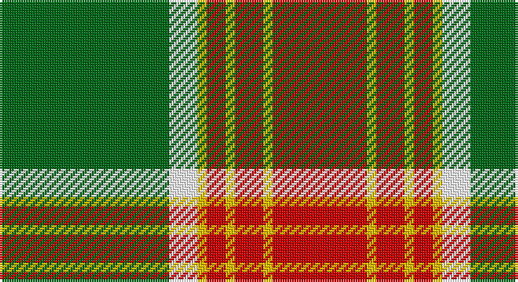

This page is one **sett** — a single exact thread-count. It belongs to the [tartan](/setts/g18w3ly1r2ly1r3ly1r10/)
(the same proportion at any scale), whose colour order is pattern [GWYRYRYR](/stripes/gwyryryr/).

Part of the [Brisbane](/tartans/brisbane/) tartan — the named design grouping this sett with its other cloths.

Sourced from register-of-tartans.  It is a [8 stripe tartan](/stripes/stripes8/).

Original link https://www.tartanregister.gov.uk/tartanDetails.aspx?ref=355

## Register references

External register numbers recorded for this tartan.

- Scottish Register of Tartans: [355](https://www.tartanregister.gov.uk/tartanDetails.aspx?ref=355)
- Scottish Tartans Authority (ITI): 6308

## Thread count
G/72 W12 Y4 R8 Y4 R12 Y4 R/40

One full sett is **200 threads**.

## Palette

Palette: <strong>Tartan Register</strong>
<table><thead><tr><th>Colour</th><th>Threads</th><th>Shade</th><th>Base</th><th>OKLCh</th></tr></thead><tbody><tr><td>G/</td><td style="text-align:right;font-variant-numeric:tabular-nums">72</td><td><code style="background-color:#006818;">#006818</code> <small style="color:#888">#006818</small></td><td>G <code style="background-color:#006100;">#006100</code></td><td><small style="color:#888">oklch(45.0% 0.142 145.0)</small></td></tr><tr><td>W</td><td style="text-align:right;font-variant-numeric:tabular-nums">12</td><td><code style="background-color:#FFFFFF;">#FFFFFF</code> <small style="color:#888">#FFFFFF</small></td><td>W <code style="background-color:#F7F7F7;">#F7F7F7</code></td><td><small style="color:#888">oklch(100.0% 0.000 89.9)</small></td></tr><tr><td>Y</td><td style="text-align:right;font-variant-numeric:tabular-nums">4</td><td><code style="background-color:#E8C000;">#E8C000</code> <small style="color:#888">#E8C000</small></td><td>Y <code style="background-color:#F2BF00;">#F2BF00</code></td><td><small style="color:#888">oklch(81.9% 0.168 93.7)</small></td></tr><tr><td>R</td><td style="text-align:right;font-variant-numeric:tabular-nums">8</td><td><code style="background-color:#C80000;">#C80000</code> <small style="color:#888">#C80000</small></td><td>R <code style="background-color:#CC0000;">#CC0000</code></td><td><small style="color:#888">oklch(52.3% 0.215 29.2)</small></td></tr><tr><td>Y</td><td style="text-align:right;font-variant-numeric:tabular-nums">4</td><td><code style="background-color:#E8C000;">#E8C000</code> <small style="color:#888">#E8C000</small></td><td>Y <code style="background-color:#F2BF00;">#F2BF00</code></td><td><small style="color:#888">oklch(81.9% 0.168 93.7)</small></td></tr><tr><td>R</td><td style="text-align:right;font-variant-numeric:tabular-nums">12</td><td><code style="background-color:#C80000;">#C80000</code> <small style="color:#888">#C80000</small></td><td>R <code style="background-color:#CC0000;">#CC0000</code></td><td><small style="color:#888">oklch(52.3% 0.215 29.2)</small></td></tr><tr><td>Y</td><td style="text-align:right;font-variant-numeric:tabular-nums">4</td><td><code style="background-color:#E8C000;">#E8C000</code> <small style="color:#888">#E8C000</small></td><td>Y <code style="background-color:#F2BF00;">#F2BF00</code></td><td><small style="color:#888">oklch(81.9% 0.168 93.7)</small></td></tr><tr><td>R/</td><td style="text-align:right;font-variant-numeric:tabular-nums">40</td><td><code style="background-color:#C80000;">#C80000</code> <small style="color:#888">#C80000</small></td><td>R <code style="background-color:#CC0000;">#CC0000</code></td><td><small style="color:#888">oklch(52.3% 0.215 29.2)</small></td></tr></tbody></table>

# Sample pattern

## Nearest tartans

The nearest existing variants by ΔTartan distance, with this tartan at the top so the swatches line up against it.

ΔTartan

Tartan

Sett

—

<a href="/ttd/edit/#slug=g18w3ly1r2ly1r3ly1r10~x4">Brisbane (Artefact)</a> <a class="nn-out" href="/variants/s8/g18w3ly1r2ly1r3ly1r10~x4/" title="open its dictionary page">↗</a>

0.51

<a href="/ttd/edit/#slug=g18lb3ly1r2ly1r3ly1r10~x4&amp;base=g18w3ly1r2ly1r3ly1r10~x4">Brisbane (Artefact)</a> <a class="nn-out" href="/variants/s8/g18lb3ly1r2ly1r3ly1r10~x4/" title="open its dictionary page">↗</a>

0.90

<a href="/ttd/edit/#slug=r3g3ly1r18w1g21ly1g1ly3~x2&amp;base=g18w3ly1r2ly1r3ly1r10~x4">MacDonald of Kingsburgh</a> <a class="nn-out" href="/variants/s9/r3g3ly1r18w1g21ly1g1ly3~x2/" title="open its dictionary page">↗</a>

0.91

<a href="/ttd/edit/#slug=r15k1ly2db3r2k1ly15~x6&amp;base=g18w3ly1r2ly1r3ly1r10~x4">Scrymgeour</a> <a class="nn-out" href="/variants/s7/r15k1ly2db3r2k1ly15~x6/" title="open its dictionary page">↗</a>

0.91

<a href="/ttd/edit/#slug=r15k1ly2db3r2k1ly15~x3&amp;base=g18w3ly1r2ly1r3ly1r10~x4">Scrymgeour</a> <a class="nn-out" href="/variants/s7/r15k1ly2db3r2k1ly15~x3/" title="open its dictionary page">↗</a>

1.00

<a href="/ttd/edit/#slug=o15k1ly2db3o2k1ly15~x4&amp;base=g18w3ly1r2ly1r3ly1r10~x4">Scrymgeour Family Tartan</a> <a class="nn-out" href="/variants/s7/o15k1ly2db3o2k1ly15~x4/" title="open its dictionary page">↗</a>

1.03

<a href="/ttd/edit/#slug=t1r1lo1k15lo15r1t1lo1~x4&amp;base=g18w3ly1r2ly1r3ly1r10~x4">Pittsburgh St Andrew's Society</a> <a class="nn-out" href="/variants/s8/t1r1lo1k15lo15r1t1lo1~x4/" title="open its dictionary page">↗</a>

1.08

<a href="/ttd/edit/#slug=w1r1g1r11db6r1g14r1g1w1~x4&amp;base=g18w3ly1r2ly1r3ly1r10~x4">Glen Tilt</a> <a class="nn-out" href="/variants/s10/w1r1g1r11db6r1g14r1g1w1~x4/" title="open its dictionary page">↗</a>

1.09

<a href="/ttd/edit/#slug=r16k3r16g44k3g8k3ly20k4~x2&amp;base=g18w3ly1r2ly1r3ly1r10~x4">MacMillan Society of Glasgow</a> <a class="nn-out" href="/variants/s9/r16k3r16g44k3g8k3ly20k4~x2/" title="open its dictionary page">↗</a>

1.13

<a href="/ttd/edit/#slug=g5ly5g5ly35ri44r3ri3~x2&amp;base=g18w3ly1r2ly1r3ly1r10~x4">Fernandes (Personal)</a> <a class="nn-out" href="/variants/s7/g5ly5g5ly35ri44r3ri3~x2/" title="open its dictionary page">↗</a>

1.13

<a href="/ttd/edit/#slug=r2lb10k15lo36lb2k2lb2~x2&amp;base=g18w3ly1r2ly1r3ly1r10~x4">Unidentified (ex Tony Murray)</a> <a class="nn-out" href="/variants/s7/r2lb10k15lo36lb2k2lb2~x2/" title="open its dictionary page">↗</a>

## Neighbour map

Every grey dot is one of 14360 variants placed by the first two principal components of the ΔTartan feature space (44% of its variance). Red is this tartan; blue dots are its nearest — click one to open its page.

<svg viewBox="0 0 640 380" role="img" style="max-width:100%;height:auto;border:1px solid #e0e0e0;border-radius:4px;display:block" xmlns="http://www.w3.org/2000/svg"><image href="/nn/cloud.v1.png" width="640" height="380"/><a href="/variants/s8/g18lb3ly1r2ly1r3ly1r10~x4/"><circle cx="296.9" cy="146.6" r="4" fill="#3465a4"><title>Brisbane (Artefact)</title></circle></a><a href="/variants/s9/r3g3ly1r18w1g21ly1g1ly3~x2/"><circle cx="324.7" cy="131.2" r="4" fill="#3465a4"><title>MacDonald of Kingsburgh</title></circle></a><a href="/variants/s7/r15k1ly2db3r2k1ly15~x6/"><circle cx="265.9" cy="149.7" r="4" fill="#3465a4"><title>Scrymgeour</title></circle></a><a href="/variants/s7/r15k1ly2db3r2k1ly15~x3/"><circle cx="265.9" cy="149.7" r="4" fill="#3465a4"><title>Scrymgeour</title></circle></a><a href="/variants/s7/o15k1ly2db3o2k1ly15~x4/"><circle cx="266.4" cy="146.3" r="4" fill="#3465a4"><title>Scrymgeour Family Tartan</title></circle></a><a href="/variants/s8/t1r1lo1k15lo15r1t1lo1~x4/"><circle cx="283.0" cy="129.6" r="4" fill="#3465a4"><title>Pittsburgh St Andrew's Society</title></circle></a><a href="/variants/s10/w1r1g1r11db6r1g14r1g1w1~x4/"><circle cx="259.2" cy="144.8" r="4" fill="#3465a4"><title>Glen Tilt</title></circle></a><a href="/variants/s9/r16k3r16g44k3g8k3ly20k4~x2/"><circle cx="236.8" cy="160.3" r="4" fill="#3465a4"><title>MacMillan Society of Glasgow</title></circle></a><a href="/variants/s7/g5ly5g5ly35ri44r3ri3~x2/"><circle cx="283.3" cy="143.7" r="4" fill="#3465a4"><title>Fernandes (Personal)</title></circle></a><a href="/variants/s7/r2lb10k15lo36lb2k2lb2~x2/"><circle cx="291.2" cy="138.2" r="4" fill="#3465a4"><title>Unidentified (ex Tony Murray)</title></circle></a><circle cx="281.7" cy="138.5" r="5" fill="#c00000"/></svg>

ID: /variants/s8/g18w3ly1r2ly1r3ly1r10~x4/
