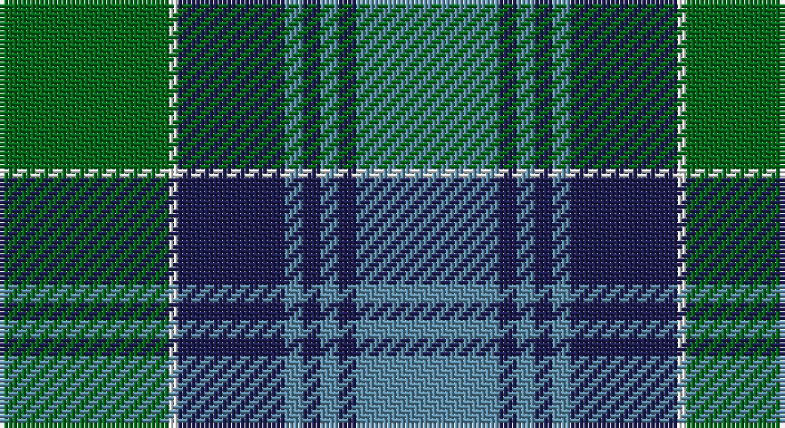

This page is one **sett** — a single exact thread-count. It belongs to the [tartan](/setts/g19w1db12t2db2t2db2t16/)
(the same proportion at any scale), whose colour order is pattern [BBBBBBWG](/stripes/bbbbbbwg/).

Sourced from register-of-tartans.  It is a [8 stripe tartan](/stripes/stripes8/).

Original link https://www.tartanregister.gov.uk/tartanDetails.aspx?ref=3186

## Register references

External register numbers recorded for this tartan.

- Scottish Register of Tartans: [3186](https://www.tartanregister.gov.uk/tartanDetails.aspx?ref=3186)
- Scottish Tartans Authority (ITI): 5560

## Thread count
G/38 W2 DBa24 B4 DBa4 B4 DBa4 B/32

One full sett is **154 threads**.

## Palette

Palette: <strong>Tartan Register</strong>
<table><thead><tr><th>Colour</th><th>Threads</th><th>Shade</th><th>Base</th><th>OKLCh</th></tr></thead><tbody><tr><td>G/</td><td style="text-align:right;font-variant-numeric:tabular-nums">38</td><td><code style="background-color:#006818;">#006818</code> <small style="color:#888">#006818</small></td><td>G <code style="background-color:#006100;">#006100</code></td><td><small style="color:#888">oklch(45.0% 0.142 145.0)</small></td></tr><tr><td>W</td><td style="text-align:right;font-variant-numeric:tabular-nums">2</td><td><code style="background-color:#FCFCFC;">#FCFCFC</code> <small style="color:#888">#FCFCFC</small></td><td>W <code style="background-color:#F7F7F7;">#F7F7F7</code></td><td><small style="color:#888">oklch(99.1% 0.000 89.9)</small></td></tr><tr><td>DBa</td><td style="text-align:right;font-variant-numeric:tabular-nums">24</td><td><code style="background-color:#1C1C50;">#1C1C50</code> <small style="color:#888">#1C1C50</small></td><td>B <code style="background-color:#2A418A;">#2A418A</code></td><td><small style="color:#888">oklch(26.2% 0.093 277.9)</small></td></tr><tr><td>B</td><td style="text-align:right;font-variant-numeric:tabular-nums">4</td><td><code style="background-color:#5C8CA8;">#5C8CA8</code> <small style="color:#888">#5C8CA8</small></td><td>B <code style="background-color:#2A418A;">#2A418A</code></td><td><small style="color:#888">oklch(61.7% 0.067 235.0)</small></td></tr><tr><td>DBa</td><td style="text-align:right;font-variant-numeric:tabular-nums">4</td><td><code style="background-color:#1C1C50;">#1C1C50</code> <small style="color:#888">#1C1C50</small></td><td>B <code style="background-color:#2A418A;">#2A418A</code></td><td><small style="color:#888">oklch(26.2% 0.093 277.9)</small></td></tr><tr><td>B</td><td style="text-align:right;font-variant-numeric:tabular-nums">4</td><td><code style="background-color:#5C8CA8;">#5C8CA8</code> <small style="color:#888">#5C8CA8</small></td><td>B <code style="background-color:#2A418A;">#2A418A</code></td><td><small style="color:#888">oklch(61.7% 0.067 235.0)</small></td></tr><tr><td>DBa</td><td style="text-align:right;font-variant-numeric:tabular-nums">4</td><td><code style="background-color:#1C1C50;">#1C1C50</code> <small style="color:#888">#1C1C50</small></td><td>B <code style="background-color:#2A418A;">#2A418A</code></td><td><small style="color:#888">oklch(26.2% 0.093 277.9)</small></td></tr><tr><td>B/</td><td style="text-align:right;font-variant-numeric:tabular-nums">32</td><td><code style="background-color:#5C8CA8;">#5C8CA8</code> <small style="color:#888">#5C8CA8</small></td><td>B <code style="background-color:#2A418A;">#2A418A</code></td><td><small style="color:#888">oklch(61.7% 0.067 235.0)</small></td></tr></tbody></table>

# Sample pattern

## Nearest tartans

The nearest existing variants by ΔTartan distance, with this tartan at the top so the swatches line up against it.

ΔTartan

Tartan

Sett

—

<a href="/ttd/edit/#slug=g19w1db12t2db2t2db2t16~x2">Norwich No.052</a> <a class="nn-out" href="/variants/s8/g19w1db12t2db2t2db2t16~x2/" title="open its dictionary page">↗</a>

0.76

<a href="/ttd/edit/#slug=r3dg2k1dg20k9t20k1t2r3~x2&amp;base=g19w1db12t2db2t2db2t16~x2">Ayrton</a> <a class="nn-out" href="/variants/s9/r3dg2k1dg20k9t20k1t2r3~x2/" title="open its dictionary page">↗</a>

0.88

<a href="/ttd/edit/#slug=g5k1lo2k1g19k15lo2y20g3~x2&amp;base=g19w1db12t2db2t2db2t16~x2">Maine Acadia</a> <a class="nn-out" href="/variants/s9/g5k1lo2k1g19k15lo2y20g3~x2/" title="open its dictionary page">↗</a>

0.98

<a href="/ttd/edit/#slug=k7t38g7k2g7k2g7lo21k3g4k3~x2&amp;base=g19w1db12t2db2t2db2t16~x2">Chakraa (Fashion)</a> <a class="nn-out" href="/variants/s11/k7t38g7k2g7k2g7lo21k3g4k3~x2/" title="open its dictionary page">↗</a>

1.04

<a href="/ttd/edit/#slug=oi28g2oi4db18g23db2g3o4~x2&amp;base=g19w1db12t2db2t2db2t16~x2">Dalbraith-Eastern Western Motor Group</a> <a class="nn-out" href="/variants/s8/oi28g2oi4db18g23db2g3o4~x2/" title="open its dictionary page">↗</a>

1.06

<a href="/ttd/edit/#slug=w4n1ly2n22dt20w2dt4w2~x2&amp;base=g19w1db12t2db2t2db2t16~x2">Gorman Blue (Personal)</a> <a class="nn-out" href="/variants/s8/w4n1ly2n22dt20w2dt4w2~x2/" title="open its dictionary page">↗</a>

1.06

<a href="/ttd/edit/#slug=t39g3t3g20k3g20k3g3k20r3~x2&amp;base=g19w1db12t2db2t2db2t16~x2">Dunedin Chapter (Corporate)</a> <a class="nn-out" href="/variants/s10/t39g3t3g20k3g20k3g3k20r3~x2/" title="open its dictionary page">↗</a>

1.13

<a href="/ttd/edit/#slug=g19w1db12b2db2b2db2b16~x2&amp;base=g19w1db12t2db2t2db2t16~x2">Unnamed, No 52</a> <a class="nn-out" href="/variants/s8/g19w1db12b2db2b2db2b16~x2/" title="open its dictionary page">↗</a>

1.14

<a href="/ttd/edit/#slug=b12lo1b2lo1b3k5g10lo1g2~x4&amp;base=g19w1db12t2db2t2db2t16~x2">Marie Curie Fields Of Hope</a> <a class="nn-out" href="/variants/s9/b12lo1b2lo1b3k5g10lo1g2~x4/" title="open its dictionary page">↗</a>

1.14

<a href="/ttd/edit/#slug=dg6r2db1r3db16g20w2~x2&amp;base=g19w1db12t2db2t2db2t16~x2">MacCord / McCord (Personal)</a> <a class="nn-out" href="/variants/s7/dg6r2db1r3db16g20w2~x2/" title="open its dictionary page">↗</a>

1.19

<a href="/ttd/edit/#slug=g24ly3g4ly1g17k25t2k2t2k2t22~x2&amp;base=g19w1db12t2db2t2db2t16~x2">Hunting, The</a> <a class="nn-out" href="/variants/s11/g24ly3g4ly1g17k25t2k2t2k2t22~x2/" title="open its dictionary page">↗</a>

## Neighbour map

Every grey dot is one of 14360 variants placed by the first two principal components of the ΔTartan feature space (44% of its variance). Red is this tartan; blue dots are its nearest — click one to open its page.

<svg viewBox="0 0 640 380" role="img" style="max-width:100%;height:auto;border:1px solid #e0e0e0;border-radius:4px;display:block" xmlns="http://www.w3.org/2000/svg"><image href="/nn/cloud.v1.png" width="640" height="380"/><a href="/variants/s9/r3dg2k1dg20k9t20k1t2r3~x2/"><circle cx="236.5" cy="159.5" r="4" fill="#3465a4"><title>Ayrton</title></circle></a><a href="/variants/s9/g5k1lo2k1g19k15lo2y20g3~x2/"><circle cx="252.5" cy="172.8" r="4" fill="#3465a4"><title>Maine Acadia</title></circle></a><a href="/variants/s11/k7t38g7k2g7k2g7lo21k3g4k3~x2/"><circle cx="221.3" cy="147.6" r="4" fill="#3465a4"><title>Chakraa (Fashion)</title></circle></a><a href="/variants/s8/oi28g2oi4db18g23db2g3o4~x2/"><circle cx="231.4" cy="188.8" r="4" fill="#3465a4"><title>Dalbraith-Eastern Western Motor Group</title></circle></a><a href="/variants/s8/w4n1ly2n22dt20w2dt4w2~x2/"><circle cx="277.8" cy="155.6" r="4" fill="#3465a4"><title>Gorman Blue (Personal)</title></circle></a><a href="/variants/s10/t39g3t3g20k3g20k3g3k20r3~x2/"><circle cx="231.2" cy="177.5" r="4" fill="#3465a4"><title>Dunedin Chapter (Corporate)</title></circle></a><a href="/variants/s8/g19w1db12b2db2b2db2b16~x2/"><circle cx="207.8" cy="161.0" r="4" fill="#3465a4"><title>Unnamed, No 52</title></circle></a><a href="/variants/s9/b12lo1b2lo1b3k5g10lo1g2~x4/"><circle cx="254.1" cy="193.5" r="4" fill="#3465a4"><title>Marie Curie Fields Of Hope</title></circle></a><a href="/variants/s7/dg6r2db1r3db16g20w2~x2/"><circle cx="226.2" cy="158.2" r="4" fill="#3465a4"><title>MacCord / McCord (Personal)</title></circle></a><a href="/variants/s11/g24ly3g4ly1g17k25t2k2t2k2t22~x2/"><circle cx="274.8" cy="159.1" r="4" fill="#3465a4"><title>Hunting, The</title></circle></a><circle cx="236.1" cy="176.2" r="5" fill="#c00000"/></svg>

ID: /variants/s8/g19w1db12t2db2t2db2t16~x2/
