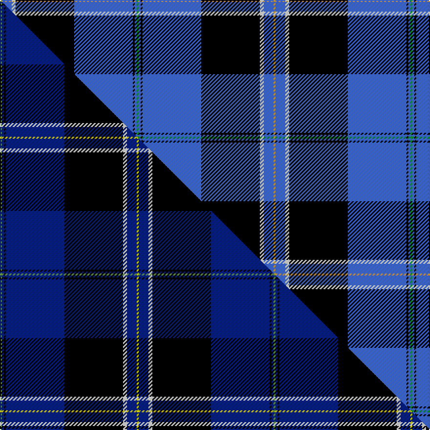

This is one **variant** — a specific cloth: this exact thread count and colourway, with its own
provenance below. It is one weaving of the [sett](/setts/g1b1k1b30k30w2b5lo1/) (the scale-free proportion — the
same cloth at any scale or shade), whose colour order is pattern [GBKBKWBY](/stripes/gbkbkwby/).

Part of the [Binder Wedding](/tartans/b/bi/binder-wedding/) tartan — the named design grouping this sett with its other cloths.

Sourced from tartans-authority.  It is a [8 stripe tartan](/stripes/stripes8/).

Original link [https://www.tartanregister.gov.uk/tartanDetails.aspx?ref=10728](https://www.tartanregister.gov.uk/tartanDetails.aspx?ref=10728)

Dataset <small>— provenance for this record, inherited from the source manifest</small>

<dl class="dataset-prov">
<dt>source</dt><dd><a href="/sources/tartans-authority/">Scottish Tartans Authority</a></dd>
<dt>data captured from</dt><dd><a href="https://github.com/thetartan/tartan-database/blob/master/data/tartans-authority/data.csv">https://github.com/thetartan/tartan-database/blob/master/data/tartans-authority/data.csv</a></dd>
<dt>data date</dt><dd>10/09/2012 <small>(this record)</small></dd>
<dt>licence</dt><dd><a href="https://creativecommons.org/licenses/by-nc-nd/4.0/">CC BY-NC-ND 4.0</a></dd>
</dl>

Capture chain <small>— the hands this data passed through, oldest first; each capture carries its own licence</small>

<ol class="capture-chain">
<li><a href="https://www.tartansauthority.com/">Scottish Tartans Authority</a> <small>the heritage body's archive — its tartan-ferret record browser is retired (links repaired to the SRT, above)</small></li>
<li><a href="https://github.com/thetartan/tartan-database">thetartan/tartan-database</a> <small>2016-2017</small> · <a href="https://creativecommons.org/licenses/by-nc-nd/4.0/">CC BY-NC-ND 4.0</a> <small>Levko Kravets's frozen compilation — the capture we vendored, and where its CC licence text came from</small></li>
<li>this dictionary <small>captured 2026-06-10 · commit 5bf86c7566</small> <small>each re-capture is a git commit to data/sources</small></li>
</ol>

## Register references

External register numbers recorded for this tartan.

- Scottish Register of Tartans: [10728](https://www.tartanregister.gov.uk/tartanDetails?ref=10728)
- Scottish Tartans Authority (ITI): 10728

## Thread count
LO/2 B10 W4 K60 B60 K2 B2 G/2

One full sett is **280 threads**.

## Palette
<table><thead><tr><th>Colour</th><th>Shade</th><th>OKLCh</th></tr></thead><tbody><tr><td>B</td><td><code style="background-color:#466CC8;">#466CC8</code> <small style="color:#888">#466CC8</small></td><td><small style="color:#888">oklch(55.1% 0.149 265.0)</small></td></tr><tr><td>G</td><td><code style="background-color:#008B2A;">#008B2A</code> <small style="color:#888">#008B2A</small></td><td><small style="color:#888">oklch(55.4% 0.170 145.9)</small></td></tr><tr><td>K</td><td><code style="background-color:#000000;">#000000</code> <small style="color:#888">#000000</small></td><td><small style="color:#888">oklch(0.0% 0.000 0.0)</small></td></tr><tr><td>W</td><td><code style="background-color:#F7F7F7;">#F7F7F7</code> <small style="color:#888">#F7F7F7</small></td><td><small style="color:#888">oklch(97.6% 0.000 89.9)</small></td></tr><tr><td>LO</td><td><code style="background-color:#FF9C34;">#FF9C34</code> <small style="color:#888">#FF9C34</small></td><td><small style="color:#888">oklch(77.9% 0.161 61.8)</small></td></tr></tbody></table>

# Sample pattern

## Compared to the master

This cloth is one sett of its design; the master sett (the exemplar the design is anchored on) is below for comparison.

Its **ΔTartan distance** from the master is **0.43** — the same measure the nearest-tartans table ranks by (0 is identical; a re-scale of the same cloth is near 0, a recolour or a different proportion further).

<figure class="master-compare" style="margin:0">

this sett
master sett ★

<figcaption style="color:#888;font-size:smaller">One weave of this sett against the <a href="/setts/y1db1k1db30k30w2db5ly1/">master sett ★</a>, split on the diagonal: a shared proportion runs seamlessly across it with only the shades shifting; a different proportion breaks on it.</figcaption>
</figure>

## Nearest tartan variants

The nearest existing variants by ΔTartan distance, with this cloth at the top so the swatches line up against it.

ΔTartan

Threads

Variant

Sett

—

280

<a href="/variants/s8/g1b1k1b30k30w2b5lo1~x2/">Binder Wedding (Personal)</a>

<a href="/ttd/edit/#slug=g1db1k1db30k30w2db5ly1~x2~g2505139-ly3708101&amp;base=g1b1k1b30k30w2b5lo1~x2" title="compare in the TTD">0.43</a>

280

<a href="/variants/s8/y1db1k1db30k30w2db5ly1~x2~y2505139-ly3708101/">Binder Wedding (Personal)</a>

<a href="/ttd/edit/#slug=lb60k6lb8k2lb8w2dr12k49ly4&amp;base=g1b1k1b30k30w2b5lo1~x2" title="compare in the TTD">2.24</a>

238

<a href="/variants/s9/lb60k6lb8k2lb8w2dr12k49ly4/">Motherwell Football Club. Modern</a>

<a href="/ttd/edit/#slug=r3db2w2db26k22w3db3w3~x2&amp;base=g1b1k1b30k30w2b5lo1~x2" title="compare in the TTD">2.29</a>

244

<a href="/variants/s8/r3db2w2db26k22w3db3w3~x2/">DeCloud-McMasters (Personal)</a>

<a href="/ttd/edit/#slug=r1t1k17t17k1w1~x4&amp;base=g1b1k1b30k30w2b5lo1~x2" title="compare in the TTD">2.34</a>

296

<a href="/variants/s6/r1t1k17t17k1w1~x4/">Sorbie (Name)</a>

<a href="/ttd/edit/#slug=r3g2k9b2k2b24y2b2y1~x2&amp;base=g1b1k1b30k30w2b5lo1~x2" title="compare in the TTD">2.50</a>

180

<a href="/variants/s9/r3g2k9b2k2b24y2b2y1~x2/">Bell of the Borders.</a>

<a href="/ttd/edit/#slug=w3db1k14db2k1g6k1db30ly3~x2&amp;base=g1b1k1b30k30w2b5lo1~x2" title="compare in the TTD">2.51</a>

232

<a href="/variants/s9/w3db1k14db2k1g6k1db30ly3~x2/">Bro-Kerne</a>

<a href="/ttd/edit/#slug=k8ly2dp6ly2k36db84w7&amp;base=g1b1k1b30k30w2b5lo1~x2" title="compare in the TTD">2.53</a>

275

<a href="/variants/s7/k8ly2dp6ly2k36db84w7/">Grahame Laurie Band (Corporate)</a>

<a href="/ttd/edit/#slug=db4dr2db40k11g2w16dr2~x2&amp;base=g1b1k1b30k30w2b5lo1~x2" title="compare in the TTD">2.68</a>

296

<a href="/variants/s7/db4dr2db40k11g2w16dr2~x2/">Jack Sinclair (Personal)</a>

<a href="/ttd/edit/#slug=k3r1k30w1db28r1db1w3~x2&amp;base=g1b1k1b30k30w2b5lo1~x2" title="compare in the TTD">2.73</a>

260

<a href="/variants/s8/k3r1k30w1db28r1db1w3~x2/">Dunlop</a>

<a href="/ttd/edit/#slug=w3db2y1db2y1db31k28r2k2~x2&amp;base=g1b1k1b30k30w2b5lo1~x2" title="compare in the TTD">2.75</a>

278

<a href="/variants/s9/w3db2y1db2y1db31k28r2k2~x2/">Hill (Name)</a>

## Neighbour map

Every grey dot is one of 13621 variants placed by the first two principal components of the ΔTartan feature space (42% of its variance). Red is this tartan; blue dots are its nearest — click one to open its page.

<svg viewBox="0 0 640 380" role="img" style="max-width:100%;height:auto;border:1px solid #e0e0e0;border-radius:4px;display:block" xmlns="http://www.w3.org/2000/svg"><image href="/nn/cloud.v1.png" width="640" height="380"/><a href="/variants/s8/y1db1k1db30k30w2db5ly1~x2~y2505139-ly3708101/"><circle cx="310.8" cy="95.3" r="4" fill="#3465a4"><title>Binder Wedding (Personal)</title></circle></a><a href="/variants/s9/lb60k6lb8k2lb8w2dr12k49ly4/"><circle cx="250.3" cy="90.0" r="4" fill="#3465a4"><title>Motherwell Football Club. Modern</title></circle></a><a href="/variants/s8/r3db2w2db26k22w3db3w3~x2/"><circle cx="235.0" cy="145.5" r="4" fill="#3465a4"><title>DeCloud-McMasters (Personal)</title></circle></a><a href="/variants/s6/r1t1k17t17k1w1~x4/"><circle cx="269.6" cy="146.9" r="4" fill="#3465a4"><title>Sorbie (Name)</title></circle></a><a href="/variants/s9/r3g2k9b2k2b24y2b2y1~x2/"><circle cx="301.0" cy="94.4" r="4" fill="#3465a4"><title>Bell of the Borders.</title></circle></a><a href="/variants/s9/w3db1k14db2k1g6k1db30ly3~x2/"><circle cx="269.9" cy="86.5" r="4" fill="#3465a4"><title>Bro-Kerne</title></circle></a><a href="/variants/s7/k8ly2dp6ly2k36db84w7/"><circle cx="337.2" cy="88.2" r="4" fill="#3465a4"><title>Grahame Laurie Band (Corporate)</title></circle></a><a href="/variants/s7/db4dr2db40k11g2w16dr2~x2/"><circle cx="261.8" cy="117.8" r="4" fill="#3465a4"><title>Jack Sinclair (Personal)</title></circle></a><a href="/variants/s8/k3r1k30w1db28r1db1w3~x2/"><circle cx="294.4" cy="99.5" r="4" fill="#3465a4"><title>Dunlop</title></circle></a><a href="/variants/s9/w3db2y1db2y1db31k28r2k2~x2/"><circle cx="281.7" cy="80.4" r="4" fill="#3465a4"><title>Hill (Name)</title></circle></a><circle cx="284.8" cy="88.2" r="5" fill="#c00000"/><text x="320" y="376" text-anchor="middle" font-size="11" fill="#999">ground</text><text x="11" y="190" text-anchor="middle" font-size="11" fill="#999" transform="rotate(-90 11 190)">complexity</text></svg>

ID: /variants/s8/g1b1k1b30k30w2b5lo1~x2/
