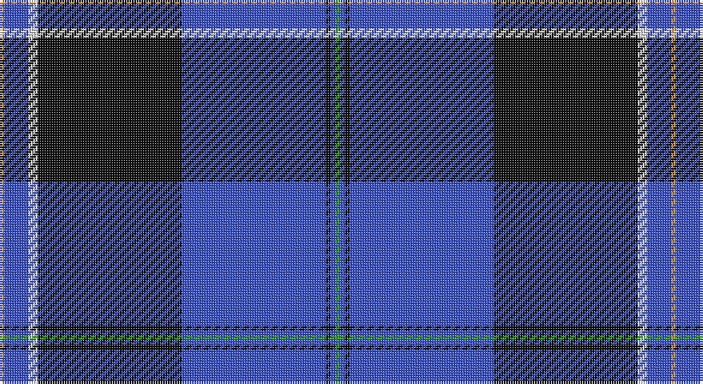

This page is one **sett** — a single exact thread-count. It belongs to the [tartan](/setts/g1b1k1b30k30w2b5lo1/)
(the same proportion at any scale), whose colour order is pattern [GBKBKWBY](/stripes/gbkbkwby/).

Part of the [Binder Wedding](/tartans/binder-wedding/) tartan — the named design grouping this sett with its other cloths.

Sourced from tartans-authority.  It is a [8 stripe tartan](/stripes/stripes8/).

Original link http://www.tartansauthority.com/tartan-ferret/display/10728/

## Register references

External register numbers recorded for this tartan.

- Scottish Register of Tartans: [10728](https://www.tartanregister.gov.uk/tartanDetails?ref=10728)
- Scottish Tartans Authority (ITI): 10728

## Thread count
O/2 B10 LN4 K60 B60 K2 B2 G/2

One full sett is **280 threads**.

## Palette

Palette: <strong>Tartan Register</strong>
<table><thead><tr><th>Colour</th><th>Threads</th><th>Shade</th><th>Base</th><th>OKLCh</th></tr></thead><tbody><tr><td>O/</td><td style="text-align:right;font-variant-numeric:tabular-nums">2</td><td><code style="background-color:#DC943C;">#DC943C</code> <small style="color:#888">#DC943C</small></td><td>Y <code style="background-color:#F2BF00;">#F2BF00</code></td><td><small style="color:#888">oklch(72.3% 0.133 67.9)</small></td></tr><tr><td>B</td><td style="text-align:right;font-variant-numeric:tabular-nums">10</td><td><code style="background-color:#3850C8;">#3850C8</code> <small style="color:#888">#3850C8</small></td><td>B <code style="background-color:#2A418A;">#2A418A</code></td><td><small style="color:#888">oklch(48.8% 0.188 269.4)</small></td></tr><tr><td>LN</td><td style="text-align:right;font-variant-numeric:tabular-nums">4</td><td><code style="background-color:#E0E0E0;">#E0E0E0</code> <small style="color:#888">#E0E0E0</small></td><td>W <code style="background-color:#F7F7F7;">#F7F7F7</code></td><td><small style="color:#888">oklch(90.7% 0.000 89.9)</small></td></tr><tr><td>K</td><td style="text-align:right;font-variant-numeric:tabular-nums">60</td><td><code style="background-color:#101010;">#101010</code> <small style="color:#888">#101010</small></td><td>K <code style="background-color:#000000;">#000000</code></td><td><small style="color:#888">oklch(17.3% 0.000 89.9)</small></td></tr><tr><td>B</td><td style="text-align:right;font-variant-numeric:tabular-nums">60</td><td><code style="background-color:#3850C8;">#3850C8</code> <small style="color:#888">#3850C8</small></td><td>B <code style="background-color:#2A418A;">#2A418A</code></td><td><small style="color:#888">oklch(48.8% 0.188 269.4)</small></td></tr><tr><td>K</td><td style="text-align:right;font-variant-numeric:tabular-nums">2</td><td><code style="background-color:#101010;">#101010</code> <small style="color:#888">#101010</small></td><td>K <code style="background-color:#000000;">#000000</code></td><td><small style="color:#888">oklch(17.3% 0.000 89.9)</small></td></tr><tr><td>B</td><td style="text-align:right;font-variant-numeric:tabular-nums">2</td><td><code style="background-color:#3850C8;">#3850C8</code> <small style="color:#888">#3850C8</small></td><td>B <code style="background-color:#2A418A;">#2A418A</code></td><td><small style="color:#888">oklch(48.8% 0.188 269.4)</small></td></tr><tr><td>G/</td><td style="text-align:right;font-variant-numeric:tabular-nums">2</td><td><code style="background-color:#289C18;">#289C18</code> <small style="color:#888">#289C18</small></td><td>G <code style="background-color:#006100;">#006100</code></td><td><small style="color:#888">oklch(60.6% 0.191 141.6)</small></td></tr></tbody></table>

# Sample pattern

## Compared to the master

This cloth is one sett of its design; the master sett (the exemplar the design is anchored on) is below for comparison.

<figure style="margin:0"><figcaption style="color:#888;font-size:smaller">this sett</figcaption></figure>
<figure style="margin:0"><figcaption style="color:#888;font-size:smaller"><a href="/setts/g1db1k1db30k30w2db5ly1/">master sett →</a></figcaption></figure>

## Nearest tartans

The nearest existing variants by ΔTartan distance, with this tartan at the top so the swatches line up against it.

ΔTartan

Tartan

Sett

—

<a href="/ttd/edit/#slug=g1b1k1b30k30w2b5lo1~x2">Binder Wedding (Personal)</a> <a class="nn-out" href="/variants/s8/g1b1k1b30k30w2b5lo1~x2/" title="open its dictionary page">↗</a>

0.93

<a href="/ttd/edit/#slug=dbi6w2g2w3dbi24r1db35r2~x2&amp;base=g1b1k1b30k30w2b5lo1~x2">Raith Rovers F.C.</a> <a class="nn-out" href="/variants/s8/dbi6w2g2w3dbi24r1db35r2~x2/" title="open its dictionary page">↗</a>

0.95

<a href="/ttd/edit/#slug=k4r2k28b31ly1b2ly1b2w3~x2&amp;base=g1b1k1b30k30w2b5lo1~x2">Hill</a> <a class="nn-out" href="/variants/s9/k4r2k28b31ly1b2ly1b2w3~x2/" title="open its dictionary page">↗</a>

1.02

<a href="/ttd/edit/#slug=g1db1k1db30k30w2db5ly1~x2&amp;base=g1b1k1b30k30w2b5lo1~x2">Binder Wedding (Personal)</a> <a class="nn-out" href="/variants/s8/g1db1k1db30k30w2db5ly1~x2/" title="open its dictionary page">↗</a>

1.08

<a href="/variants/s8/k1db5w2ki30db30ki1db1k1~x2/">Binder Wedding (Personal) Name Tartan</a>

1.09

<a href="/ttd/edit/#slug=w3db2ly1db2ly1db31k28r2k2~x2&amp;base=g1b1k1b30k30w2b5lo1~x2">Hill (Name)</a> <a class="nn-out" href="/variants/s9/w3db2ly1db2ly1db31k28r2k2~x2/" title="open its dictionary page">↗</a>

1.11

<a href="/ttd/edit/#slug=k8ly2dp6ly2k36db84w7&amp;base=g1b1k1b30k30w2b5lo1~x2">Grahame Laurie Band (Corporate)</a> <a class="nn-out" href="/variants/s7/k8ly2dp6ly2k36db84w7/" title="open its dictionary page">↗</a>

1.21

<a href="/ttd/edit/#slug=db20o1db1o1dg8k1w3~x2&amp;base=g1b1k1b30k30w2b5lo1~x2">Chestico</a> <a class="nn-out" href="/variants/s7/db20o1db1o1dg8k1w3~x2/" title="open its dictionary page">↗</a>

1.27

<a href="/ttd/edit/#slug=db21n2w1n2db1r2db1o6~x4&amp;base=g1b1k1b30k30w2b5lo1~x2">Blue Rust</a> <a class="nn-out" href="/variants/s8/db21n2w1n2db1r2db1o6~x4/" title="open its dictionary page">↗</a>

1.27

<a href="/ttd/edit/#slug=k1w1k18db20w1r1lo1~x4&amp;base=g1b1k1b30k30w2b5lo1~x2">Fuller of Hopewell (Personal)</a> <a class="nn-out" href="/variants/s7/k1w1k18db20w1r1lo1~x4/" title="open its dictionary page">↗</a>

1.28

<a href="/ttd/edit/#slug=t14lb1t3lo2t3lb1t4db24r3~x4&amp;base=g1b1k1b30k30w2b5lo1~x2">Musselburgh</a> <a class="nn-out" href="/variants/s9/t14lb1t3lo2t3lb1t4db24r3~x4/" title="open its dictionary page">↗</a>

## Neighbour map

Every grey dot is one of 14360 variants placed by the first two principal components of the ΔTartan feature space (44% of its variance). Red is this tartan; blue dots are its nearest — click one to open its page.

<svg viewBox="0 0 640 380" role="img" style="max-width:100%;height:auto;border:1px solid #e0e0e0;border-radius:4px;display:block" xmlns="http://www.w3.org/2000/svg"><image href="/nn/cloud.v1.png" width="640" height="380"/><a href="/variants/s8/dbi6w2g2w3dbi24r1db35r2~x2/"><circle cx="314.7" cy="122.5" r="4" fill="#3465a4"><title>Raith Rovers F.C.</title></circle></a><a href="/variants/s9/k4r2k28b31ly1b2ly1b2w3~x2/"><circle cx="294.4" cy="96.6" r="4" fill="#3465a4"><title>Hill</title></circle></a><a href="/variants/s8/g1db1k1db30k30w2db5ly1~x2/"><circle cx="358.0" cy="127.7" r="4" fill="#3465a4"><title>Binder Wedding (Personal)</title></circle></a><a href="/variants/s8/k1db5w2ki30db30ki1db1k1~x2/"><circle cx="341.6" cy="126.0" r="4" fill="#3465a4"><title>Binder Wedding (Personal) Name Tartan</title></circle></a><a href="/variants/s9/w3db2ly1db2ly1db31k28r2k2~x2/"><circle cx="337.4" cy="114.0" r="4" fill="#3465a4"><title>Hill (Name)</title></circle></a><a href="/variants/s7/k8ly2dp6ly2k36db84w7/"><circle cx="386.6" cy="118.4" r="4" fill="#3465a4"><title>Grahame Laurie Band (Corporate)</title></circle></a><a href="/variants/s7/db20o1db1o1dg8k1w3~x2/"><circle cx="331.4" cy="139.0" r="4" fill="#3465a4"><title>Chestico</title></circle></a><a href="/variants/s8/db21n2w1n2db1r2db1o6~x4/"><circle cx="382.8" cy="133.9" r="4" fill="#3465a4"><title>Blue Rust</title></circle></a><a href="/variants/s7/k1w1k18db20w1r1lo1~x4/"><circle cx="313.1" cy="144.7" r="4" fill="#3465a4"><title>Fuller of Hopewell (Personal)</title></circle></a><a href="/variants/s9/t14lb1t3lo2t3lb1t4db24r3~x4/"><circle cx="273.4" cy="123.2" r="4" fill="#3465a4"><title>Musselburgh</title></circle></a><circle cx="339.8" cy="117.6" r="5" fill="#c00000"/></svg>

ID: /variants/s8/g1b1k1b30k30w2b5lo1~x2/
