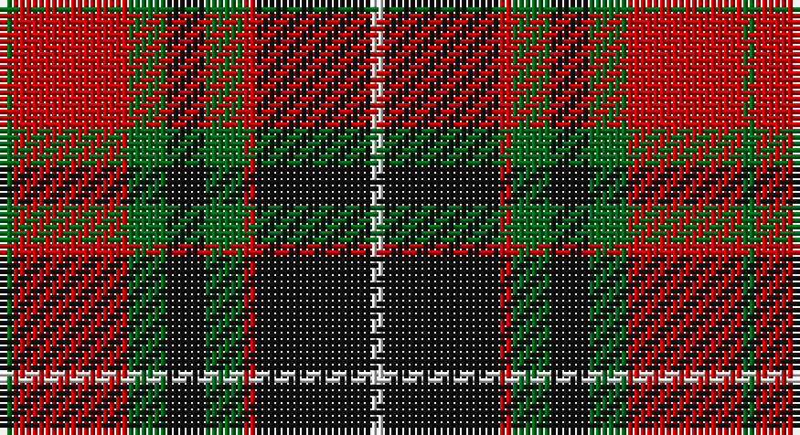

This page is one **sett** — a single exact thread-count. It belongs to the [tartan](/setts/g1r9g3k3g3r1k9w1/)
(the same proportion at any scale), whose colour order is pattern [GRGKGRKW](/stripes/grgkgrkw/).

Part of the [Manson](/tartans/manson/) tartan — the named design grouping this sett with its other cloths.

Sourced from house-of-tartan.  It is a [8 stripe tartan](/stripes/stripes8/).

Original link http://www.house-of-tartan.scotland.net/house/TartanViewjs.asp?colr=Def&tnam=987

## Provenance

Earliest known date: 1983 The official recording of the sett shows the letter G for the dark green stripe. In heraldic terms this means 'Gules' - red. The designer, Hugh Kirkwood Rankine, clearly intended dark green and this is reproduced here.

## Thread count
G/2 R18 G6 K6 G6 R2 K18 LN/2

One full sett is **116 threads**.

## Palette

Palette: <strong>Tartan Register</strong>
<table><thead><tr><th>Colour</th><th>Threads</th><th>Shade</th><th>Base</th><th>OKLCh</th></tr></thead><tbody><tr><td>G/</td><td style="text-align:right;font-variant-numeric:tabular-nums">2</td><td><code style="background-color:#006818;">#006818</code> <small style="color:#888">#006818</small></td><td>G <code style="background-color:#006100;">#006100</code></td><td><small style="color:#888">oklch(45.0% 0.142 145.0)</small></td></tr><tr><td>R</td><td style="text-align:right;font-variant-numeric:tabular-nums">18</td><td><code style="background-color:#C80000;">#C80000</code> <small style="color:#888">#C80000</small></td><td>R <code style="background-color:#CC0000;">#CC0000</code></td><td><small style="color:#888">oklch(52.3% 0.215 29.2)</small></td></tr><tr><td>G</td><td style="text-align:right;font-variant-numeric:tabular-nums">6</td><td><code style="background-color:#006818;">#006818</code> <small style="color:#888">#006818</small></td><td>G <code style="background-color:#006100;">#006100</code></td><td><small style="color:#888">oklch(45.0% 0.142 145.0)</small></td></tr><tr><td>K</td><td style="text-align:right;font-variant-numeric:tabular-nums">6</td><td><code style="background-color:#101010;">#101010</code> <small style="color:#888">#101010</small></td><td>K <code style="background-color:#000000;">#000000</code></td><td><small style="color:#888">oklch(17.3% 0.000 89.9)</small></td></tr><tr><td>G</td><td style="text-align:right;font-variant-numeric:tabular-nums">6</td><td><code style="background-color:#006818;">#006818</code> <small style="color:#888">#006818</small></td><td>G <code style="background-color:#006100;">#006100</code></td><td><small style="color:#888">oklch(45.0% 0.142 145.0)</small></td></tr><tr><td>R</td><td style="text-align:right;font-variant-numeric:tabular-nums">2</td><td><code style="background-color:#C80000;">#C80000</code> <small style="color:#888">#C80000</small></td><td>R <code style="background-color:#CC0000;">#CC0000</code></td><td><small style="color:#888">oklch(52.3% 0.215 29.2)</small></td></tr><tr><td>K</td><td style="text-align:right;font-variant-numeric:tabular-nums">18</td><td><code style="background-color:#101010;">#101010</code> <small style="color:#888">#101010</small></td><td>K <code style="background-color:#000000;">#000000</code></td><td><small style="color:#888">oklch(17.3% 0.000 89.9)</small></td></tr><tr><td>LN/</td><td style="text-align:right;font-variant-numeric:tabular-nums">2</td><td><code style="background-color:#E0E0E0;">#E0E0E0</code> <small style="color:#888">#E0E0E0</small></td><td>W <code style="background-color:#F7F7F7;">#F7F7F7</code></td><td><small style="color:#888">oklch(90.7% 0.000 89.9)</small></td></tr></tbody></table>

# Sample pattern

## Compared to the master

This cloth is one sett of its design; the master sett (the exemplar the design is anchored on) is below for comparison.

<figure style="margin:0"><figcaption style="color:#888;font-size:smaller">this sett</figcaption></figure>
<figure style="margin:0"><figcaption style="color:#888;font-size:smaller"><a href="/setts/dg1r24dg8k8dg8r1k4db16w1/">master sett →</a></figcaption></figure>

## Nearest tartans

The nearest existing variants by ΔTartan distance, with this tartan at the top so the swatches line up against it.

ΔTartan

Tartan

Sett

—

<a href="/ttd/edit/#slug=g1r9g3k3g3r1k9w1~x2">Manson Family Tartan</a> <a class="nn-out" href="/variants/s8/g1r9g3k3g3r1k9w1~x2/" title="open its dictionary page">↗</a>

0.56

<a href="/ttd/edit/#slug=g8r2g12k6g3db6r24k4~x2&amp;base=g1r9g3k3g3r1k9w1~x2">Dickie</a> <a class="nn-out" href="/variants/s8/g8r2g12k6g3db6r24k4~x2/" title="open its dictionary page">↗</a>

0.81

<a href="/ttd/edit/#slug=k10y24r3y3r24dg3y6k6~x2&amp;base=g1r9g3k3g3r1k9w1~x2">Earle's Flame</a> <a class="nn-out" href="/variants/s8/k10y24r3y3r24dg3y6k6~x2/" title="open its dictionary page">↗</a>

0.82

<a href="/ttd/edit/#slug=k3r8k3r8lo19r7dt36r3~x2&amp;base=g1r9g3k3g3r1k9w1~x2">Private SA Club</a> <a class="nn-out" href="/variants/s8/k3r8k3r8lo19r7dt36r3~x2/" title="open its dictionary page">↗</a>

0.84

<a href="/ttd/edit/#slug=g3r20g16k22lo6k3g2~x2&amp;base=g1r9g3k3g3r1k9w1~x2">Wcwm 1062</a> <a class="nn-out" href="/variants/s7/g3r20g16k22lo6k3g2~x2/" title="open its dictionary page">↗</a>

0.85

<a href="/ttd/edit/#slug=b2k2r14dg15k8b7r14k2b2~x2&amp;base=g1r9g3k3g3r1k9w1~x2">Montrose</a> <a class="nn-out" href="/variants/s9/b2k2r14dg15k8b7r14k2b2~x2/" title="open its dictionary page">↗</a>

0.85

<a href="/ttd/edit/#slug=b2k2r14dg15k8b7r14k2b2&amp;base=g1r9g3k3g3r1k9w1~x2">Montrose</a> <a class="nn-out" href="/variants/s9/b2k2r14dg15k8b7r14k2b2/" title="open its dictionary page">↗</a>

0.85

<a href="/ttd/edit/#slug=lb2r12k4r2k2r2k6g5lb2~x2&amp;base=g1r9g3k3g3r1k9w1~x2">O'Neill (District)</a> <a class="nn-out" href="/variants/s9/lb2r12k4r2k2r2k6g5lb2~x2/" title="open its dictionary page">↗</a>

0.85

<a href="/ttd/edit/#slug=k3lo18dg6r17k31dg3~x2&amp;base=g1r9g3k3g3r1k9w1~x2">MacMillan - 2002 (Black - Unofficial</a> <a class="nn-out" href="/variants/s6/k3lo18dg6r17k31dg3~x2/" title="open its dictionary page">↗</a>

0.87

<a href="/ttd/edit/#slug=ly2dg7k6r11k1r1ly2~x4&amp;base=g1r9g3k3g3r1k9w1~x2">Blackstock Red (Dress)</a> <a class="nn-out" href="/variants/s7/ly2dg7k6r11k1r1ly2~x4/" title="open its dictionary page">↗</a>

0.89

<a href="/ttd/edit/#slug=oi3k7oi2w2o12k2o2oi3~x2&amp;base=g1r9g3k3g3r1k9w1~x2">Daks</a> <a class="nn-out" href="/variants/s8/oi3k7oi2w2o12k2o2oi3~x2/" title="open its dictionary page">↗</a>

## Neighbour map

Every grey dot is one of 14360 variants placed by the first two principal components of the ΔTartan feature space (44% of its variance). Red is this tartan; blue dots are its nearest — click one to open its page.

<svg viewBox="0 0 640 380" role="img" style="max-width:100%;height:auto;border:1px solid #e0e0e0;border-radius:4px;display:block" xmlns="http://www.w3.org/2000/svg"><image href="/nn/cloud.v1.png" width="640" height="380"/><a href="/variants/s8/g8r2g12k6g3db6r24k4~x2/"><circle cx="200.1" cy="181.3" r="4" fill="#3465a4"><title>Dickie</title></circle></a><a href="/variants/s8/k10y24r3y3r24dg3y6k6~x2/"><circle cx="225.2" cy="202.4" r="4" fill="#3465a4"><title>Earle's Flame</title></circle></a><a href="/variants/s8/k3r8k3r8lo19r7dt36r3~x2/"><circle cx="229.0" cy="173.9" r="4" fill="#3465a4"><title>Private SA Club</title></circle></a><a href="/variants/s7/g3r20g16k22lo6k3g2~x2/"><circle cx="179.2" cy="197.8" r="4" fill="#3465a4"><title>Wcwm 1062</title></circle></a><a href="/variants/s9/b2k2r14dg15k8b7r14k2b2~x2/"><circle cx="183.7" cy="204.2" r="4" fill="#3465a4"><title>Montrose</title></circle></a><a href="/variants/s9/b2k2r14dg15k8b7r14k2b2/"><circle cx="183.7" cy="204.2" r="4" fill="#3465a4"><title>Montrose</title></circle></a><a href="/variants/s9/lb2r12k4r2k2r2k6g5lb2~x2/"><circle cx="196.5" cy="212.6" r="4" fill="#3465a4"><title>O'Neill (District)</title></circle></a><a href="/variants/s6/k3lo18dg6r17k31dg3~x2/"><circle cx="217.6" cy="211.7" r="4" fill="#3465a4"><title>MacMillan - 2002 (Black - Unofficial</title></circle></a><a href="/variants/s7/ly2dg7k6r11k1r1ly2~x4/"><circle cx="187.8" cy="183.9" r="4" fill="#3465a4"><title>Blackstock Red (Dress)</title></circle></a><a href="/variants/s8/oi3k7oi2w2o12k2o2oi3~x2/"><circle cx="174.2" cy="203.5" r="4" fill="#3465a4"><title>Daks</title></circle></a><circle cx="202.7" cy="193.3" r="5" fill="#c00000"/></svg>

ID: /variants/s8/g1r9g3k3g3r1k9w1~x2/
