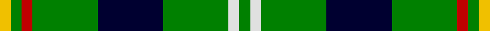
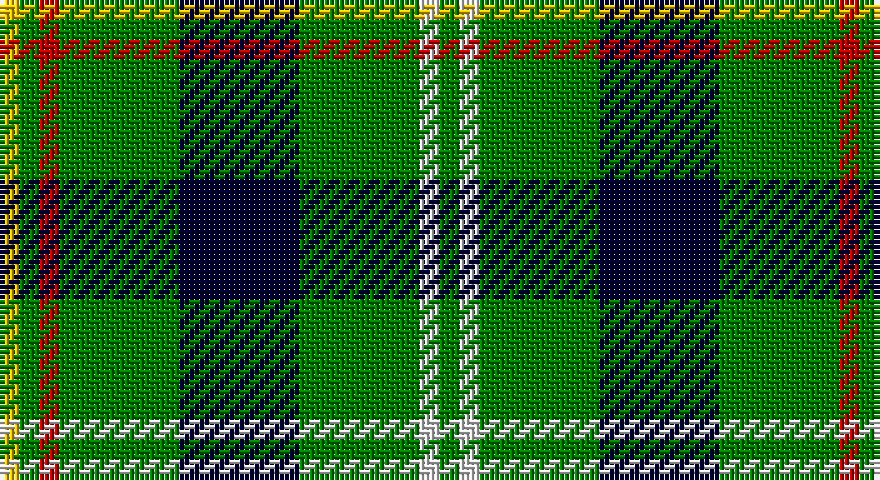

This page is one **sett** — a single exact thread-count. It belongs to the [tartan](/setts/g1w1g6k6g6r1g1ly1/)
(the same proportion at any scale), whose colour order is pattern [GWGKGRGY](/stripes/gwgkgrgy/).

Part of the [Vermont](/tartans/vermont/) tartan — the named design grouping this sett with its other cloths.

Sourced from weddslist.  It is a [8 stripe tartan](/stripes/stripes8/).

Original link http://www.weddslist.com/cgi-bin/tartans/pg.pl?source=sts

## Also known as

This cloth is also recorded under:

- Vermont District USA

## Thread count
Y/4 G4 R4 G24 DB24 G24 LN4 G/4

One full sett is **176 threads**.

## Palette

Palette: <strong>Tartan Dictionary</strong> <small style="color:#888">(1 of 5 colours)</small>
<table><thead><tr><th>Colour</th><th>Threads</th><th>Shade</th><th>Base</th><th>OKLCh</th></tr></thead><tbody><tr><td>Y/</td><td style="text-align:right;font-variant-numeric:tabular-nums">4</td><td><code style="background-color:#F0C000;">#F0C000</code> <small style="color:#888">#F0C000</small></td><td>Y <code style="background-color:#F2BF00;">#F2BF00</code></td><td><small style="color:#888">oklch(82.7% 0.169 90.5)</small></td></tr><tr><td>G</td><td style="text-align:right;font-variant-numeric:tabular-nums">4</td><td><code style="background-color:#008000;">#008000</code> <small style="color:#888">#008000</small></td><td>G <code style="background-color:#006100;">#006100</code></td><td><small style="color:#888">oklch(52.0% 0.177 142.5)</small></td></tr><tr><td>R</td><td style="text-align:right;font-variant-numeric:tabular-nums">4</td><td><code style="background-color:#C00000;">#C00000</code> <small style="color:#888">#C00000</small></td><td>R <code style="background-color:#CC0000;">#CC0000</code></td><td><small style="color:#888">oklch(50.7% 0.208 29.2)</small></td></tr><tr><td>G</td><td style="text-align:right;font-variant-numeric:tabular-nums">24</td><td><code style="background-color:#008000;">#008000</code> <small style="color:#888">#008000</small></td><td>G <code style="background-color:#006100;">#006100</code></td><td><small style="color:#888">oklch(52.0% 0.177 142.5)</small></td></tr><tr><td>DB</td><td style="text-align:right;font-variant-numeric:tabular-nums">24</td><td><code style="background-color:#000030;">#000030</code> <small style="color:#888">#000030</small></td><td>K <code style="background-color:#000000;">#000000</code></td><td><small style="color:#888">oklch(14.0% 0.097 264.1)</small></td></tr><tr><td>G</td><td style="text-align:right;font-variant-numeric:tabular-nums">24</td><td><code style="background-color:#008000;">#008000</code> <small style="color:#888">#008000</small></td><td>G <code style="background-color:#006100;">#006100</code></td><td><small style="color:#888">oklch(52.0% 0.177 142.5)</small></td></tr><tr><td>LN</td><td style="text-align:right;font-variant-numeric:tabular-nums">4</td><td><code style="background-color:#E0E0E0;">#E0E0E0</code> <small style="color:#888">#E0E0E0</small></td><td>W <code style="background-color:#F7F7F7;">#F7F7F7</code></td><td><small style="color:#888">oklch(90.7% 0.000 89.9)</small></td></tr><tr><td>G/</td><td style="text-align:right;font-variant-numeric:tabular-nums">4</td><td><code style="background-color:#008000;">#008000</code> <small style="color:#888">#008000</small></td><td>G <code style="background-color:#006100;">#006100</code></td><td><small style="color:#888">oklch(52.0% 0.177 142.5)</small></td></tr></tbody></table>

# Sample pattern

## Compared to the master

This cloth is one sett of its design; the master sett (the exemplar the design is anchored on) is below for comparison.

<figure style="margin:0"><figcaption style="color:#888;font-size:smaller">this sett</figcaption></figure>
<figure style="margin:0"><figcaption style="color:#888;font-size:smaller"><a href="/setts/g1lb1g6db5dg6r1dg1ly1/">master sett →</a></figcaption></figure>

## Nearest tartans

The nearest existing variants by ΔTartan distance, with this tartan at the top so the swatches line up against it.

ΔTartan

Tartan

Sett

—

<a href="/ttd/edit/#slug=g1w1g6k6g6r1g1ly1~x4">Vermont</a> <a class="nn-out" href="/variants/s8/g1w1g6k6g6r1g1ly1~x4/" title="open its dictionary page">↗</a>

1.42

<a href="/ttd/edit/#slug=r1k6g6ly1g6ly1~x6&amp;base=g1w1g6k6g6r1g1ly1~x4">Moore Caledonian (Personal)</a> <a class="nn-out" href="/variants/s6/r1k6g6ly1g6ly1~x6/" title="open its dictionary page">↗</a>

1.45

<a href="/ttd/edit/#slug=g12k4g12w1b6w1ly4~x4&amp;base=g1w1g6k6g6r1g1ly1~x4">Pinder, Nigel (Personal)</a> <a class="nn-out" href="/variants/s7/g12k4g12w1b6w1ly4~x4/" title="open its dictionary page">↗</a>

1.49

<a href="/ttd/edit/#slug=g13p1g1p1g3db5k4ly2~x2&amp;base=g1w1g6k6g6r1g1ly1~x4">Carrick, hunting</a> <a class="nn-out" href="/variants/s8/g13p1g1p1g3db5k4ly2~x2/" title="open its dictionary page">↗</a>

1.50

<a href="/ttd/edit/#slug=dg14w2db3lg7dg2lg7db3w2dg14t2~x4&amp;base=g1w1g6k6g6r1g1ly1~x4">Manx Ellan Vannin</a> <a class="nn-out" href="/variants/s10/dg14w2db3lg7dg2lg7db3w2dg14t2~x4/" title="open its dictionary page">↗</a>

1.51

<a href="/ttd/edit/#slug=w2g12k3g3k16g3k3g12ly2~x2&amp;base=g1w1g6k6g6r1g1ly1~x4">MacIver Hunting</a> <a class="nn-out" href="/variants/s9/w2g12k3g3k16g3k3g12ly2~x2/" title="open its dictionary page">↗</a>

1.52

<a href="/ttd/edit/#slug=dg8r2lb3ly2dg4lbi4dg14db2lbi2db2~x2&amp;base=g1w1g6k6g6r1g1ly1~x4">Lévesque, Pascal (Personal)</a> <a class="nn-out" href="/variants/s10/dg8r2lb3ly2dg4lbi4dg14db2lbi2db2~x2/" title="open its dictionary page">↗</a>

1.55

<a href="/ttd/edit/#slug=g10db1w1db1ly1db6g8r1~x8&amp;base=g1w1g6k6g6r1g1ly1~x4">Marshall Field</a> <a class="nn-out" href="/variants/s8/g10db1w1db1ly1db6g8r1~x8/" title="open its dictionary page">↗</a>

1.55

<a href="/ttd/edit/#slug=g4lo1dt1lo1dt2g9r1dt6w1~x4&amp;base=g1w1g6k6g6r1g1ly1~x4">Casey of West Virginia (Personal)</a> <a class="nn-out" href="/variants/s9/g4lo1dt1lo1dt2g9r1dt6w1~x4/" title="open its dictionary page">↗</a>

1.55

<a href="/ttd/edit/#slug=r3g24k28g19ly3g3ly3~x2&amp;base=g1w1g6k6g6r1g1ly1~x4">Paton</a> <a class="nn-out" href="/variants/s7/r3g24k28g19ly3g3ly3~x2/" title="open its dictionary page">↗</a>

1.57

<a href="/ttd/edit/#slug=w3r3k4r6g22r4k18g24ly3~x2&amp;base=g1w1g6k6g6r1g1ly1~x4">Brown, George</a> <a class="nn-out" href="/variants/s9/w3r3k4r6g22r4k18g24ly3~x2/" title="open its dictionary page">↗</a>

## Neighbour map

Every grey dot is one of 14360 variants placed by the first two principal components of the ΔTartan feature space (44% of its variance). Red is this tartan; blue dots are its nearest — click one to open its page.

<svg viewBox="0 0 640 380" role="img" style="max-width:100%;height:auto;border:1px solid #e0e0e0;border-radius:4px;display:block" xmlns="http://www.w3.org/2000/svg"><image href="/nn/cloud.v1.png" width="640" height="380"/><a href="/variants/s6/r1k6g6ly1g6ly1~x6/"><circle cx="262.1" cy="244.2" r="4" fill="#3465a4"><title>Moore Caledonian (Personal)</title></circle></a><a href="/variants/s7/g12k4g12w1b6w1ly4~x4/"><circle cx="276.2" cy="196.5" r="4" fill="#3465a4"><title>Pinder, Nigel (Personal)</title></circle></a><a href="/variants/s8/g13p1g1p1g3db5k4ly2~x2/"><circle cx="259.6" cy="159.7" r="4" fill="#3465a4"><title>Carrick, hunting</title></circle></a><a href="/variants/s10/dg14w2db3lg7dg2lg7db3w2dg14t2~x4/"><circle cx="209.6" cy="185.3" r="4" fill="#3465a4"><title>Manx Ellan Vannin</title></circle></a><a href="/variants/s9/w2g12k3g3k16g3k3g12ly2~x2/"><circle cx="273.3" cy="206.0" r="4" fill="#3465a4"><title>MacIver Hunting</title></circle></a><a href="/variants/s10/dg8r2lb3ly2dg4lbi4dg14db2lbi2db2~x2/"><circle cx="227.0" cy="164.0" r="4" fill="#3465a4"><title>Lévesque, Pascal (Personal)</title></circle></a><a href="/variants/s8/g10db1w1db1ly1db6g8r1~x8/"><circle cx="325.8" cy="186.9" r="4" fill="#3465a4"><title>Marshall Field</title></circle></a><a href="/variants/s9/g4lo1dt1lo1dt2g9r1dt6w1~x4/"><circle cx="240.1" cy="181.0" r="4" fill="#3465a4"><title>Casey of West Virginia (Personal)</title></circle></a><a href="/variants/s7/r3g24k28g19ly3g3ly3~x2/"><circle cx="262.5" cy="199.6" r="4" fill="#3465a4"><title>Paton</title></circle></a><a href="/variants/s9/w3r3k4r6g22r4k18g24ly3~x2/"><circle cx="229.9" cy="182.7" r="4" fill="#3465a4"><title>Brown, George</title></circle></a><circle cx="253.9" cy="200.9" r="5" fill="#c00000"/></svg>

ID: /variants/s8/g1w1g6k6g6r1g1ly1~x4/
