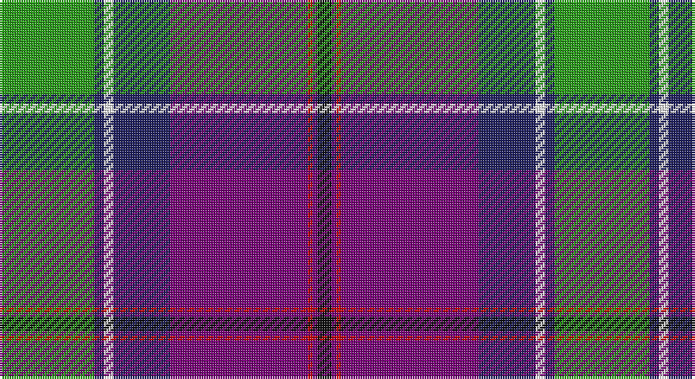

This page is one **sett** — a single exact thread-count. It belongs to the [tartan](/setts/g20db2w2db12dp29r1dp1k3/)
(the same proportion at any scale), whose colour order is pattern [GBWBBRBK](/stripes/gbwbbrbk/).

Sourced from register-of-tartans.  It is a [8 stripe tartan](/stripes/stripes8/).

Original link https://www.tartanregister.gov.uk/tartanDetails.aspx?ref=2202

2 attestations — the source records this cloth was collapsed from (oldest owns this page)

<ul>
<li>01/05/2005 — Longhaugh Primary School (register-of-tartans, <a href="https://www.tartanregister.gov.uk/tartanDetails.aspx?ref=2202">record</a>)</li>
<li>May 2005 — Longhaugh Primary School (Corporate) (tartans-authority, <a href="http://www.tartansauthority.com/tartan-ferret/display/6645/">record</a>)</li>
</ul>

## Register references

External register numbers recorded for this tartan.

- Scottish Register of Tartans: [2202](https://www.tartanregister.gov.uk/tartanDetails.aspx?ref=2202)
- Scottish Tartans Authority (ITI): 6645

## Thread count
G/40 DB4 W4 DB24 P58 R2 P2 K/6

One full sett is **234 threads**.

## Palette

Palette: <strong>Tartan Register</strong>
<table><thead><tr><th>Colour</th><th>Threads</th><th>Shade</th><th>Base</th><th>OKLCh</th></tr></thead><tbody><tr><td>G/</td><td style="text-align:right;font-variant-numeric:tabular-nums">40</td><td><code style="background-color:#289C18;">#289C18</code> <small style="color:#888">#289C18</small></td><td>G <code style="background-color:#006100;">#006100</code></td><td><small style="color:#888">oklch(60.6% 0.191 141.6)</small></td></tr><tr><td>DB</td><td style="text-align:right;font-variant-numeric:tabular-nums">4</td><td><code style="background-color:#202060;">#202060</code> <small style="color:#888">#202060</small></td><td>B <code style="background-color:#2A418A;">#2A418A</code></td><td><small style="color:#888">oklch(28.9% 0.111 276.9)</small></td></tr><tr><td>W</td><td style="text-align:right;font-variant-numeric:tabular-nums">4</td><td><code style="background-color:#FCFCFC;">#FCFCFC</code> <small style="color:#888">#FCFCFC</small></td><td>W <code style="background-color:#F7F7F7;">#F7F7F7</code></td><td><small style="color:#888">oklch(99.1% 0.000 89.9)</small></td></tr><tr><td>DB</td><td style="text-align:right;font-variant-numeric:tabular-nums">24</td><td><code style="background-color:#202060;">#202060</code> <small style="color:#888">#202060</small></td><td>B <code style="background-color:#2A418A;">#2A418A</code></td><td><small style="color:#888">oklch(28.9% 0.111 276.9)</small></td></tr><tr><td>P</td><td style="text-align:right;font-variant-numeric:tabular-nums">58</td><td><code style="background-color:#780078;">#780078</code> <small style="color:#888">#780078</small></td><td>B <code style="background-color:#2A418A;">#2A418A</code></td><td><small style="color:#888">oklch(40.2% 0.185 328.4)</small></td></tr><tr><td>R</td><td style="text-align:right;font-variant-numeric:tabular-nums">2</td><td><code style="background-color:#C80000;">#C80000</code> <small style="color:#888">#C80000</small></td><td>R <code style="background-color:#CC0000;">#CC0000</code></td><td><small style="color:#888">oklch(52.3% 0.215 29.2)</small></td></tr><tr><td>P</td><td style="text-align:right;font-variant-numeric:tabular-nums">2</td><td><code style="background-color:#780078;">#780078</code> <small style="color:#888">#780078</small></td><td>B <code style="background-color:#2A418A;">#2A418A</code></td><td><small style="color:#888">oklch(40.2% 0.185 328.4)</small></td></tr><tr><td>K/</td><td style="text-align:right;font-variant-numeric:tabular-nums">6</td><td><code style="background-color:#101010;">#101010</code> <small style="color:#888">#101010</small></td><td>K <code style="background-color:#000000;">#000000</code></td><td><small style="color:#888">oklch(17.3% 0.000 89.9)</small></td></tr></tbody></table>

# Sample pattern

## Nearest tartans

The nearest existing variants by ΔTartan distance, with this tartan at the top so the swatches line up against it.

ΔTartan

Tartan

Sett

—

<a href="/ttd/edit/#slug=g20db2w2db12dp29r1dp1k3~x2">Longhaugh Primary School</a> <a class="nn-out" href="/variants/s8/g20db2w2db12dp29r1dp1k3~x2/" title="open its dictionary page">↗</a>

0.95

<a href="/ttd/edit/#slug=w5lb7db4lb2db25k13ri1k2ri4r3~x2&amp;base=g20db2w2db12dp29r1dp1k3~x2">Bell Rock Lighthouse 200th Aniversar</a> <a class="nn-out" href="/variants/s10/w5lb7db4lb2db25k13ri1k2ri4r3~x2/" title="open its dictionary page">↗</a>

0.99

<a href="/ttd/edit/#slug=lo3k2o15k10dt23r2dt1w2~x2&amp;base=g20db2w2db12dp29r1dp1k3~x2">Vienna Highlander (Fashion)</a> <a class="nn-out" href="/variants/s8/lo3k2o15k10dt23r2dt1w2~x2/" title="open its dictionary page">↗</a>

1.11

<a href="/ttd/edit/#slug=w5db6r20k6n5k3db26r2ly1r2db3w3~x2&amp;base=g20db2w2db12dp29r1dp1k3~x2">Clinton Wedding</a> <a class="nn-out" href="/variants/s12/w5db6r20k6n5k3db26r2ly1r2db3w3~x2/" title="open its dictionary page">↗</a>

1.13

<a href="/ttd/edit/#slug=w5db6r20k6t5k3db26r2ly1r2db3w3~x2&amp;base=g20db2w2db12dp29r1dp1k3~x2">Clinton Wedding (Personal)</a> <a class="nn-out" href="/variants/s12/w5db6r20k6t5k3db26r2ly1r2db3w3~x2/" title="open its dictionary page">↗</a>

1.13

<a href="/ttd/edit/#slug=dg4t2db18r2k4r6t1w1~x4&amp;base=g20db2w2db12dp29r1dp1k3~x2">Glenn</a> <a class="nn-out" href="/variants/s8/dg4t2db18r2k4r6t1w1~x4/" title="open its dictionary page">↗</a>

1.13

<a href="/ttd/edit/#slug=lb3m14w1k2g2k16t20lb1~x2&amp;base=g20db2w2db12dp29r1dp1k3~x2">Vinther, Niels Christian (Personal)</a> <a class="nn-out" href="/variants/s8/lb3m14w1k2g2k16t20lb1~x2/" title="open its dictionary page">↗</a>

1.14

<a href="/ttd/edit/#slug=dt3db28w2ly2db1dg4dt8w3r4ly10dt2~x2&amp;base=g20db2w2db12dp29r1dp1k3~x2">Colours of Hope</a> <a class="nn-out" href="/variants/s11/dt3db28w2ly2db1dg4dt8w3r4ly10dt2~x2/" title="open its dictionary page">↗</a>

1.14

<a href="/ttd/edit/#slug=lg2dg9k16r2t30lg3dg6w1~x2&amp;base=g20db2w2db12dp29r1dp1k3~x2">Climb, The</a> <a class="nn-out" href="/variants/s8/lg2dg9k16r2t30lg3dg6w1~x2/" title="open its dictionary page">↗</a>

1.14

<a href="/ttd/edit/#slug=db46ly4db4ly4db6k16o66w11r6&amp;base=g20db2w2db12dp29r1dp1k3~x2">Scottish Association for N.S. (Corp)</a> <a class="nn-out" href="/variants/s9/db46ly4db4ly4db6k16o66w11r6/" title="open its dictionary page">↗</a>

1.15

<a href="/ttd/edit/#slug=w3k1db24dbi10o24k1ly3~x2&amp;base=g20db2w2db12dp29r1dp1k3~x2">George Heriot's School</a> <a class="nn-out" href="/variants/s7/w3k1db24dbi10o24k1ly3~x2/" title="open its dictionary page">↗</a>

## Neighbour map

Every grey dot is one of 14360 variants placed by the first two principal components of the ΔTartan feature space (44% of its variance). Red is this tartan; blue dots are its nearest — click one to open its page.

<svg viewBox="0 0 640 380" role="img" style="max-width:100%;height:auto;border:1px solid #e0e0e0;border-radius:4px;display:block" xmlns="http://www.w3.org/2000/svg"><image href="/nn/cloud.v1.png" width="640" height="380"/><a href="/variants/s10/w5lb7db4lb2db25k13ri1k2ri4r3~x2/"><circle cx="193.7" cy="97.2" r="4" fill="#3465a4"><title>Bell Rock Lighthouse 200th Aniversar</title></circle></a><a href="/variants/s8/lo3k2o15k10dt23r2dt1w2~x2/"><circle cx="201.4" cy="119.9" r="4" fill="#3465a4"><title>Vienna Highlander (Fashion)</title></circle></a><a href="/variants/s12/w5db6r20k6n5k3db26r2ly1r2db3w3~x2/"><circle cx="200.8" cy="80.3" r="4" fill="#3465a4"><title>Clinton Wedding</title></circle></a><a href="/variants/s12/w5db6r20k6t5k3db26r2ly1r2db3w3~x2/"><circle cx="210.1" cy="83.3" r="4" fill="#3465a4"><title>Clinton Wedding (Personal)</title></circle></a><a href="/variants/s8/dg4t2db18r2k4r6t1w1~x4/"><circle cx="237.0" cy="128.4" r="4" fill="#3465a4"><title>Glenn</title></circle></a><a href="/variants/s8/lb3m14w1k2g2k16t20lb1~x2/"><circle cx="157.6" cy="115.5" r="4" fill="#3465a4"><title>Vinther, Niels Christian (Personal)</title></circle></a><a href="/variants/s11/dt3db28w2ly2db1dg4dt8w3r4ly10dt2~x2/"><circle cx="198.0" cy="77.4" r="4" fill="#3465a4"><title>Colours of Hope</title></circle></a><a href="/variants/s8/lg2dg9k16r2t30lg3dg6w1~x2/"><circle cx="206.1" cy="101.1" r="4" fill="#3465a4"><title>Climb, The</title></circle></a><a href="/variants/s9/db46ly4db4ly4db6k16o66w11r6/"><circle cx="194.0" cy="111.7" r="4" fill="#3465a4"><title>Scottish Association for N.S. (Corp)</title></circle></a><a href="/variants/s7/w3k1db24dbi10o24k1ly3~x2/"><circle cx="196.2" cy="126.1" r="4" fill="#3465a4"><title>George Heriot's School</title></circle></a><circle cx="228.9" cy="99.4" r="5" fill="#c00000"/></svg>

ID: /variants/s8/g20db2w2db12dp29r1dp1k3~x2/
