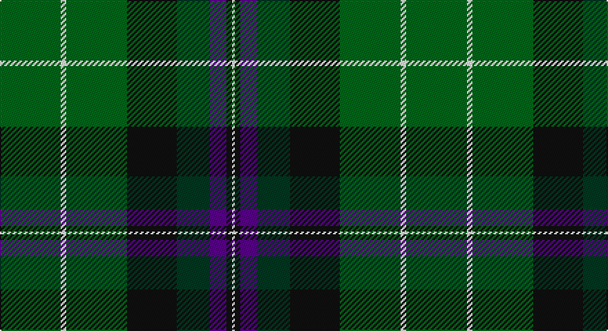

This page is one **sett** — a single exact thread-count. It belongs to the [tartan](/setts/g22w2g22k18dg12dp6k2w1/)
(the same proportion at any scale), whose colour order is pattern [GWGKGBKW](/stripes/gwgkgbkw/).

Part of the [Hibernian Football Club](/tartans/hibernian-football-club/) tartan — the named design grouping this sett with its other cloths.

Sourced from register-of-tartans.  It is a [8 stripe tartan](/stripes/stripes8/).

Original link https://www.tartanregister.gov.uk/tartanDetails.aspx?ref=1701

## Register references

External register numbers recorded for this tartan.

- Scottish Register of Tartans: [1701](https://www.tartanregister.gov.uk/tartanDetails.aspx?ref=1701)
- Scottish Tartans Authority (ITI): 2559
- Scottish Tartans World Register: 2559

## Thread count
G/44 W4 G44 K36 DG24 P12 K4 W/2

One full sett is **294 threads**.

## Palette

Palette: <strong>Tartan Register</strong>
<table><thead><tr><th>Colour</th><th>Threads</th><th>Shade</th><th>Base</th><th>OKLCh</th></tr></thead><tbody><tr><td>G/</td><td style="text-align:right;font-variant-numeric:tabular-nums">44</td><td><code style="background-color:#006818;">#006818</code> <small style="color:#888">#006818</small></td><td>G <code style="background-color:#006100;">#006100</code></td><td><small style="color:#888">oklch(45.0% 0.142 145.0)</small></td></tr><tr><td>W</td><td style="text-align:right;font-variant-numeric:tabular-nums">4</td><td><code style="background-color:#FCFCFC;">#FCFCFC</code> <small style="color:#888">#FCFCFC</small></td><td>W <code style="background-color:#F7F7F7;">#F7F7F7</code></td><td><small style="color:#888">oklch(99.1% 0.000 89.9)</small></td></tr><tr><td>G</td><td style="text-align:right;font-variant-numeric:tabular-nums">44</td><td><code style="background-color:#006818;">#006818</code> <small style="color:#888">#006818</small></td><td>G <code style="background-color:#006100;">#006100</code></td><td><small style="color:#888">oklch(45.0% 0.142 145.0)</small></td></tr><tr><td>K</td><td style="text-align:right;font-variant-numeric:tabular-nums">36</td><td><code style="background-color:#101010;">#101010</code> <small style="color:#888">#101010</small></td><td>K <code style="background-color:#000000;">#000000</code></td><td><small style="color:#888">oklch(17.3% 0.000 89.9)</small></td></tr><tr><td>DG</td><td style="text-align:right;font-variant-numeric:tabular-nums">24</td><td><code style="background-color:#003820;">#003820</code> <small style="color:#888">#003820</small></td><td>G <code style="background-color:#006100;">#006100</code></td><td><small style="color:#888">oklch(30.0% 0.070 158.3)</small></td></tr><tr><td>P</td><td style="text-align:right;font-variant-numeric:tabular-nums">12</td><td><code style="background-color:#5A008C;">#5A008C</code> <small style="color:#888">#5A008C</small></td><td>B <code style="background-color:#2A418A;">#2A418A</code></td><td><small style="color:#888">oklch(37.0% 0.191 306.3)</small></td></tr><tr><td>K</td><td style="text-align:right;font-variant-numeric:tabular-nums">4</td><td><code style="background-color:#101010;">#101010</code> <small style="color:#888">#101010</small></td><td>K <code style="background-color:#000000;">#000000</code></td><td><small style="color:#888">oklch(17.3% 0.000 89.9)</small></td></tr><tr><td>W/</td><td style="text-align:right;font-variant-numeric:tabular-nums">2</td><td><code style="background-color:#FCFCFC;">#FCFCFC</code> <small style="color:#888">#FCFCFC</small></td><td>W <code style="background-color:#F7F7F7;">#F7F7F7</code></td><td><small style="color:#888">oklch(99.1% 0.000 89.9)</small></td></tr></tbody></table>

# Sample pattern

## Nearest tartans

The nearest existing variants by ΔTartan distance, with this tartan at the top so the swatches line up against it.

ΔTartan

Tartan

Sett

—

<a href="/ttd/edit/#slug=g22w2g22k18dg12dp6k2w1~x2">Hibernian Football Club</a> <a class="nn-out" href="/variants/s8/g22w2g22k18dg12dp6k2w1~x2/" title="open its dictionary page">↗</a>

1.08

<a href="/ttd/edit/#slug=dgi20dg11lb6r2dp3lb1~x2&amp;base=g22w2g22k18dg12dp6k2w1~x2">Chiti, Cristiano (Personal)</a> <a class="nn-out" href="/variants/s6/dgi20dg11lb6r2dp3lb1~x2/" title="open its dictionary page">↗</a>

1.21

<a href="/ttd/edit/#slug=k4dg33k18lo10g19lo3dg15k1ly3~x2&amp;base=g22w2g22k18dg12dp6k2w1~x2">Leinster Ancestry</a> <a class="nn-out" href="/variants/s9/k4dg33k18lo10g19lo3dg15k1ly3~x2/" title="open its dictionary page">↗</a>

1.22

<a href="/ttd/edit/#slug=g13dp1g1dp1g3db5k4ly2~x2&amp;base=g22w2g22k18dg12dp6k2w1~x2">Carrick Hunting District Tartan</a> <a class="nn-out" href="/variants/s8/g13dp1g1dp1g3db5k4ly2~x2/" title="open its dictionary page">↗</a>

1.26

<a href="/ttd/edit/#slug=k44ly2dg27ly2dgi16w8dg16w2dg8~x2&amp;base=g22w2g22k18dg12dp6k2w1~x2">Crumlish (2015)</a> <a class="nn-out" href="/variants/s9/k44ly2dg27ly2dgi16w8dg16w2dg8~x2/" title="open its dictionary page">↗</a>

1.26

<a href="/ttd/edit/#slug=k4dg33k18dy10g19dy3dg15k1lo3~x2&amp;base=g22w2g22k18dg12dp6k2w1~x2">Leinster Ancestry (Fashion)</a> <a class="nn-out" href="/variants/s9/k4dg33k18dy10g19dy3dg15k1lo3~x2/" title="open its dictionary page">↗</a>

1.27

<a href="/ttd/edit/#slug=r2db16w1k16g30r1g2~x2&amp;base=g22w2g22k18dg12dp6k2w1~x2">Sinclair Hunting (VS)</a> <a class="nn-out" href="/variants/s7/r2db16w1k16g30r1g2~x2/" title="open its dictionary page">↗</a>

1.27

<a href="/ttd/edit/#slug=r4db15w2n15g30r2g4~x2&amp;base=g22w2g22k18dg12dp6k2w1~x2">Sinclair Green (Personal)</a> <a class="nn-out" href="/variants/s7/r4db15w2n15g30r2g4~x2/" title="open its dictionary page">↗</a>

1.28

<a href="/ttd/edit/#slug=dg23r7g25ly5dg17k5ly1w1r1~x2&amp;base=g22w2g22k18dg12dp6k2w1~x2">Cates Hunting (Clan)</a> <a class="nn-out" href="/variants/s9/dg23r7g25ly5dg17k5ly1w1r1~x2/" title="open its dictionary page">↗</a>

1.29

<a href="/ttd/edit/#slug=g28k4g5dr4g5k19db19y2~x2&amp;base=g22w2g22k18dg12dp6k2w1~x2">City of Guelph</a> <a class="nn-out" href="/variants/s8/g28k4g5dr4g5k19db19y2~x2/" title="open its dictionary page">↗</a>

1.31

<a href="/ttd/edit/#slug=k28r3ly2r3k13g28w1g3w1g16~x2&amp;base=g22w2g22k18dg12dp6k2w1~x2">Bomb Disposal</a> <a class="nn-out" href="/variants/s10/k28r3ly2r3k13g28w1g3w1g16~x2/" title="open its dictionary page">↗</a>

## Neighbour map

Every grey dot is one of 14360 variants placed by the first two principal components of the ΔTartan feature space (44% of its variance). Red is this tartan; blue dots are its nearest — click one to open its page.

<svg viewBox="0 0 640 380" role="img" style="max-width:100%;height:auto;border:1px solid #e0e0e0;border-radius:4px;display:block" xmlns="http://www.w3.org/2000/svg"><image href="/nn/cloud.v1.png" width="640" height="380"/><a href="/variants/s6/dgi20dg11lb6r2dp3lb1~x2/"><circle cx="244.7" cy="170.4" r="4" fill="#3465a4"><title>Chiti, Cristiano (Personal)</title></circle></a><a href="/variants/s9/k4dg33k18lo10g19lo3dg15k1ly3~x2/"><circle cx="247.8" cy="147.1" r="4" fill="#3465a4"><title>Leinster Ancestry</title></circle></a><a href="/variants/s8/g13dp1g1dp1g3db5k4ly2~x2/"><circle cx="288.9" cy="173.7" r="4" fill="#3465a4"><title>Carrick Hunting District Tartan</title></circle></a><a href="/variants/s9/k44ly2dg27ly2dgi16w8dg16w2dg8~x2/"><circle cx="227.2" cy="153.0" r="4" fill="#3465a4"><title>Crumlish (2015)</title></circle></a><a href="/variants/s9/k4dg33k18dy10g19dy3dg15k1lo3~x2/"><circle cx="269.6" cy="162.5" r="4" fill="#3465a4"><title>Leinster Ancestry (Fashion)</title></circle></a><a href="/variants/s7/r2db16w1k16g30r1g2~x2/"><circle cx="292.1" cy="150.6" r="4" fill="#3465a4"><title>Sinclair Hunting (VS)</title></circle></a><a href="/variants/s7/r4db15w2n15g30r2g4~x2/"><circle cx="254.8" cy="183.5" r="4" fill="#3465a4"><title>Sinclair Green (Personal)</title></circle></a><a href="/variants/s9/dg23r7g25ly5dg17k5ly1w1r1~x2/"><circle cx="248.2" cy="134.8" r="4" fill="#3465a4"><title>Cates Hunting (Clan)</title></circle></a><a href="/variants/s8/g28k4g5dr4g5k19db19y2~x2/"><circle cx="209.2" cy="180.2" r="4" fill="#3465a4"><title>City of Guelph</title></circle></a><a href="/variants/s10/k28r3ly2r3k13g28w1g3w1g16~x2/"><circle cx="303.1" cy="137.2" r="4" fill="#3465a4"><title>Bomb Disposal</title></circle></a><circle cx="271.2" cy="176.2" r="5" fill="#c00000"/></svg>

ID: /variants/s8/g22w2g22k18dg12dp6k2w1~x2/
