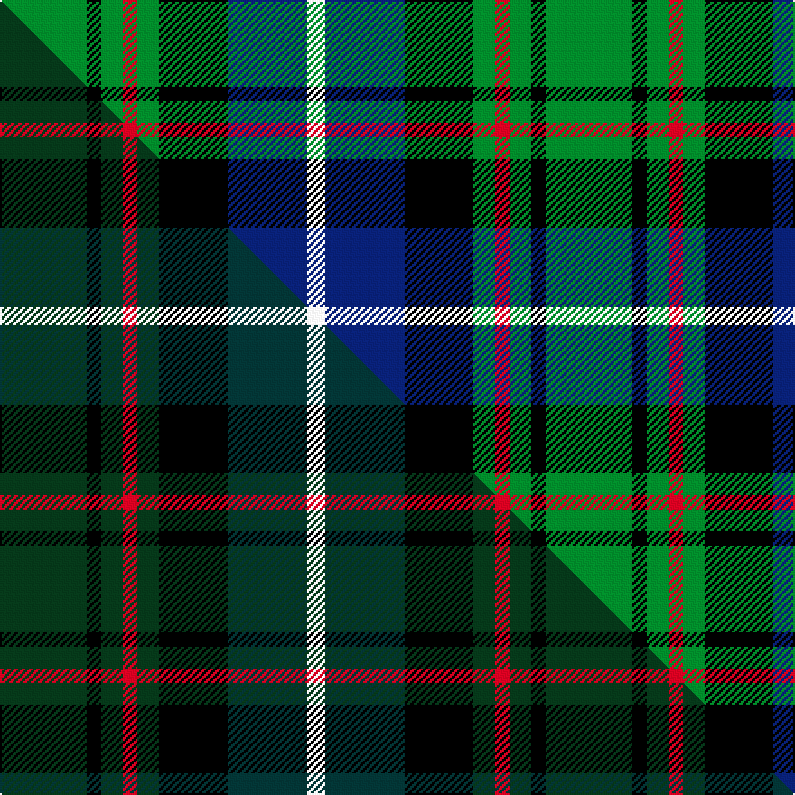

This is one **variant** — a specific cloth: this exact thread count and colourway, with its own
provenance below. It is one weaving of the [sett](/tartans/m/ma/macrae-hunting/) (the scale-free proportion — the
same cloth at any scale or shade), whose colour order is pattern [GKGRGKBW](/stripes/gkgrgkbw/).

Part of the [MacRae Hunting](/tartans/m/ma/macrae-hunting/) tartan — the named design grouping this sett with its other cloths.

Sourced from weddslist.  It is a [8 stripe tartan](/stripes/stripes8/).

Original link [http://www.weddslist.com/cgi-bin/tartans/pg.pl?source=sts](http://www.weddslist.com/cgi-bin/tartans/pg.pl?source=sts)

Dataset <small>— provenance for this record, inherited from the source manifest</small>

<dl class="dataset-prov">
<dt>source</dt><dd><a href="/sources/weddslist/">Weddslist</a></dd>
<dt>data captured from</dt><dd><a href="https://github.com/thetartan/tartan-database/blob/master/data/weddslist/data.csv">https://github.com/thetartan/tartan-database/blob/master/data/weddslist/data.csv</a></dd>
<dt>data date</dt><dd>2016-11-17 <small>(dataset default)</small></dd>
<dt>licence</dt><dd><a href="https://creativecommons.org/licenses/by-nc-nd/4.0/">CC BY-NC-ND 4.0</a></dd>
</dl>

Capture chain <small>— the hands this data passed through, oldest first; each capture carries its own licence</small>

<ol class="capture-chain">
<li><a href="https://www.weddslist.com/tartans/">Weddslist</a> <small>the living privately compiled reference</small></li>
<li><a href="https://github.com/thetartan/tartan-database">thetartan/tartan-database</a> <small>2016-2017</small> · <a href="https://creativecommons.org/licenses/by-nc-nd/4.0/">CC BY-NC-ND 4.0</a> <small>Levko Kravets's frozen compilation — the capture we vendored, and where its CC licence text came from</small></li>
<li>this dictionary <small>captured 2026-06-10 · commit 5bf86c7566</small> <small>each re-capture is a git commit to data/sources</small></li>
</ol>

## Thread count
G/48 K8 G12 R8 G12 K38 DB44 W/10

One full sett is **302 threads**.

## Palette
<table><thead><tr><th>Colour</th><th>Shade</th><th>OKLCh</th></tr></thead><tbody><tr><td>DB</td><td><code style="background-color:#082077;">#082077</code> <small style="color:#888">#082077</small></td><td><small style="color:#888">oklch(30.0% 0.149 265.1)</small></td></tr><tr><td>G</td><td><code style="background-color:#008B2A;">#008B2A</code> <small style="color:#888">#008B2A</small></td><td><small style="color:#888">oklch(55.4% 0.170 145.9)</small></td></tr><tr><td>K</td><td><code style="background-color:#000000;">#000000</code> <small style="color:#888">#000000</small></td><td><small style="color:#888">oklch(0.0% 0.000 0.0)</small></td></tr><tr><td>W</td><td><code style="background-color:#F7F7F7;">#F7F7F7</code> <small style="color:#888">#F7F7F7</small></td><td><small style="color:#888">oklch(97.6% 0.000 89.9)</small></td></tr><tr><td>R</td><td><code style="background-color:#D60020;">#D60020</code> <small style="color:#888">#D60020</small></td><td><small style="color:#888">oklch(55.2% 0.224 25.5)</small></td></tr></tbody></table>

# Sample pattern

## Compared to the master

This cloth is one sett of its design; the master sett (the exemplar the design is anchored on) is below for comparison.

Its **ΔTartan distance** from the master is **3.07** — the same measure the nearest-tartans table ranks by (0 is identical; a re-scale of the same cloth is near 0, a recolour or a different proportion further).

<figure class="master-compare" style="margin:0">

this sett
master sett ★

<figcaption style="color:#888;font-size:smaller">One weave of this sett against the <a href="/setts/dg24k4dg6r4dg6k19dt22w5/">master sett ★</a>, split on the diagonal: a shared proportion runs seamlessly across it with only the shades shifting; a different proportion breaks on it.</figcaption>
</figure>

## Nearest tartan variants

The nearest existing variants by ΔTartan distance, with this cloth at the top so the swatches line up against it.

ΔTartan

Threads

Variant

Sett

—

302

<a href="/variants/s8/g24k4g6r4g6k19db22w5~x2/">MacRae, Ancient hunting</a>

<a href="/ttd/edit/#slug=r5db15k15g15w2g15k15g15w2~x2&amp;base=g24k4g6r4g6k19db22w5~x2" title="compare in the TTD">1.13</a>

382

<a href="/variants/s9/r5db15k15g15w2g15k15g15w2~x2/">Arrol Corporate Tartan</a>

<a href="/ttd/edit/#slug=lr8g33k21db6k6db33r6db6&amp;base=g24k4g6r4g6k19db22w5~x2" title="compare in the TTD">1.84</a>

224

<a href="/variants/s8/lr8g33k21db6k6db33r6db6/">Royal Highland Corporate Tartan</a>

<a href="/ttd/edit/#slug=g1db6k6g6r1g1~x6&amp;base=g24k4g6r4g6k19db22w5~x2" title="compare in the TTD">1.88</a>

240

<a href="/variants/s6/g1db6k6g6r1g1~x6/">Callum Beg (Fashion)</a>

<a href="/ttd/edit/#slug=r4g12k12g2db12g3~x2&amp;base=g24k4g6r4g6k19db22w5~x2" title="compare in the TTD">1.90</a>

166

<a href="/variants/s6/r4g12k12g2db12g3~x2/">Gunn - 1810 (Clan)</a>

<a href="/ttd/edit/#slug=g52lb7g9k35db35k7&amp;base=g24k4g6r4g6k19db22w5~x2" title="compare in the TTD">2.01</a>

231

<a href="/variants/s6/g52lb7g9k35db35k7/">Redland</a>

<a href="/ttd/edit/#slug=db18r3k9r3g23y3~x2&amp;base=g24k4g6r4g6k19db22w5~x2" title="compare in the TTD">2.06</a>

194

<a href="/variants/s6/db18r3k9r3g23y3~x2/">Royal College of Physicians (Corp)</a>

<a href="/ttd/edit/#slug=g8lb1g1k6db6k1~x4&amp;base=g24k4g6r4g6k19db22w5~x2" title="compare in the TTD">2.12</a>

148

<a href="/variants/s6/g8lb1g1k6db6k1~x4/">Graham of Menteith</a>

<a href="/ttd/edit/#slug=g16lb3g3k10db12dr2db3~x2&amp;base=g24k4g6r4g6k19db22w5~x2" title="compare in the TTD">2.15</a>

158

<a href="/variants/s7/g16lb3g3k10db12dr2db3~x2/">MacLean, Donald (Personal)</a>

<a href="/ttd/edit/#slug=dr3g2dr3g18k14w2db16g3~x2&amp;base=g24k4g6r4g6k19db22w5~x2" title="compare in the TTD">2.16</a>

232

<a href="/variants/s8/dr3g2dr3g18k14w2db16g3~x2/">Mantle (Personal)</a>

<a href="/ttd/edit/#slug=y1g6k5g1db5g1~x2&amp;base=g24k4g6r4g6k19db22w5~x2" title="compare in the TTD">2.17</a>

72

<a href="/variants/s6/y1g6k5g1db5g1~x2/">MacKay (Bonner)</a>

## Neighbour map

Every grey dot is one of 13662 variants placed by the first two principal components of the ΔTartan feature space (42% of its variance). Red is this tartan; blue dots are its nearest — click one to open its page. The map is a flat projection of a many-dimensional space — [how to read it](/posts/neighbourhood-maps/).

<svg viewBox="0 0 640 380" role="img" style="max-width:100%;height:auto;border:1px solid #e0e0e0;border-radius:4px;display:block" xmlns="http://www.w3.org/2000/svg"><image href="/nn/cloud.v1.png" width="640" height="380"/><a href="/variants/s9/r5db15k15g15w2g15k15g15w2~x2/"><circle cx="122.9" cy="208.5" r="4" fill="#3465a4"><title>Arrol Corporate Tartan</title></circle></a><a href="/variants/s8/lr8g33k21db6k6db33r6db6/"><circle cx="110.2" cy="199.2" r="4" fill="#3465a4"><title>Royal Highland Corporate Tartan</title></circle></a><a href="/variants/s6/g1db6k6g6r1g1~x6/"><circle cx="142.1" cy="227.1" r="4" fill="#3465a4"><title>Callum Beg (Fashion)</title></circle></a><a href="/variants/s6/r4g12k12g2db12g3~x2/"><circle cx="125.3" cy="237.5" r="4" fill="#3465a4"><title>Gunn - 1810 (Clan)</title></circle></a><a href="/variants/s6/g52lb7g9k35db35k7/"><circle cx="161.1" cy="219.0" r="4" fill="#3465a4"><title>Redland</title></circle></a><a href="/variants/s6/db18r3k9r3g23y3~x2/"><circle cx="138.0" cy="195.9" r="4" fill="#3465a4"><title>Royal College of Physicians (Corp)</title></circle></a><a href="/variants/s6/g8lb1g1k6db6k1~x4/"><circle cx="156.4" cy="213.2" r="4" fill="#3465a4"><title>Graham of Menteith</title></circle></a><a href="/variants/s7/g16lb3g3k10db12dr2db3~x2/"><circle cx="130.9" cy="197.7" r="4" fill="#3465a4"><title>MacLean, Donald (Personal)</title></circle></a><a href="/variants/s8/dr3g2dr3g18k14w2db16g3~x2/"><circle cx="128.5" cy="175.3" r="4" fill="#3465a4"><title>Mantle (Personal)</title></circle></a><a href="/variants/s6/y1g6k5g1db5g1~x2/"><circle cx="156.7" cy="231.0" r="4" fill="#3465a4"><title>MacKay (Bonner)</title></circle></a><circle cx="108.0" cy="198.1" r="5" fill="#c00000"/><text x="320" y="376" text-anchor="middle" font-size="11" fill="#999">ground</text><text x="11" y="190" text-anchor="middle" font-size="11" fill="#999" transform="rotate(-90 11 190)">complexity</text></svg>

ID: /variants/s8/g24k4g6r4g6k19db22w5~x2/
