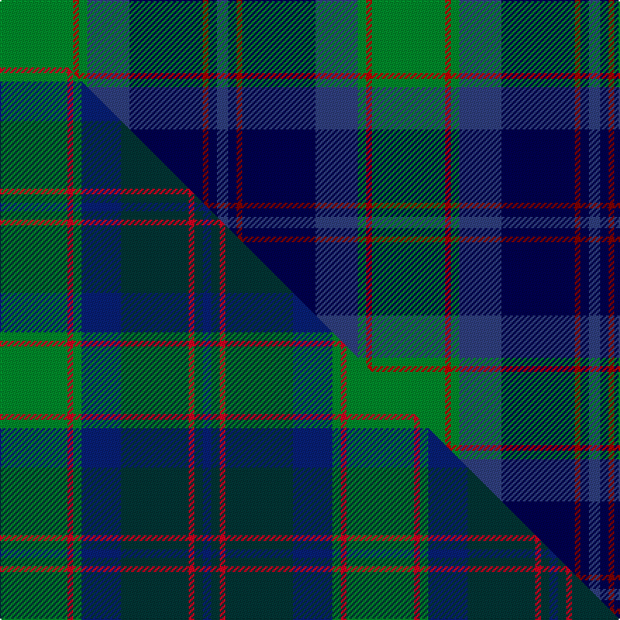

This is one **variant** — a specific cloth: this exact thread count and colourway, with its own
provenance below. It is one weaving of the [sett](/tartans/g/gr/grampian/) (the scale-free proportion — the
same cloth at any scale or shade), whose colour order is pattern [BBRBBGRG](/stripes/bbrbbgrg/).

Part of the [Grampian](/tartans/g/gr/grampian/) tartan — the named design grouping this sett with its other cloths.

Sourced from weddslist.  It is a [8 stripe tartan](/stripes/stripes8/).

Original link [http://www.weddslist.com/cgi-bin/tartans/pg.pl?source=sts](http://www.weddslist.com/cgi-bin/tartans/pg.pl?source=sts)

Dataset <small>— provenance for this record, inherited from the source manifest</small>

<dl class="dataset-prov">
<dt>source</dt><dd><a href="/sources/weddslist/">Weddslist</a></dd>
<dt>data captured from</dt><dd><a href="https://github.com/thetartan/tartan-database/blob/master/data/weddslist/data.csv">https://github.com/thetartan/tartan-database/blob/master/data/weddslist/data.csv</a></dd>
<dt>data date</dt><dd>2016-11-17 <small>(dataset default)</small></dd>
<dt>licence</dt><dd><a href="https://creativecommons.org/licenses/by-nc-nd/4.0/">CC BY-NC-ND 4.0</a></dd>
</dl>

Capture chain <small>— the hands this data passed through, oldest first; each capture carries its own licence</small>

<ol class="capture-chain">
<li><a href="https://www.weddslist.com/tartans/">Weddslist</a> <small>the living privately compiled reference</small></li>
<li><a href="https://github.com/thetartan/tartan-database">thetartan/tartan-database</a> <small>2016-2017</small> · <a href="https://creativecommons.org/licenses/by-nc-nd/4.0/">CC BY-NC-ND 4.0</a> <small>Levko Kravets's frozen compilation — the capture we vendored, and where its CC licence text came from</small></li>
<li>this dictionary <small>captured 2026-06-10 · commit 5bf86c7566</small> <small>each re-capture is a git commit to data/sources</small></li>
</ol>

## Thread count
G/52 Ri4 G6 DBi30 DB52 R4 DB6 DBi/8

One full sett is **264 threads**.

## Palette
<table><thead><tr><th>Colour</th><th>Shade</th><th>OKLCh</th></tr></thead><tbody><tr><td>DB</td><td><code style="background-color:#304080;">#304080</code> <small style="color:#888">#304080</small></td><td><small style="color:#888">oklch(39.4% 0.109 270.2)</small></td></tr><tr><td>DB</td><td><code style="background-color:#000050;">#000050</code> <small style="color:#888">#000050</small></td><td><small style="color:#888">oklch(19.5% 0.135 264.1)</small></td></tr><tr><td>R</td><td><code style="background-color:#800000;">#800000</code> <small style="color:#888">#800000</small></td><td><small style="color:#888">oklch(37.7% 0.155 29.2)</small></td></tr><tr><td>G</td><td><code style="background-color:#008B2A;">#008B2A</code> <small style="color:#888">#008B2A</small></td><td><small style="color:#888">oklch(55.4% 0.170 145.9)</small></td></tr><tr><td>R</td><td><code style="background-color:#C00000;">#C00000</code> <small style="color:#888">#C00000</small></td><td><small style="color:#888">oklch(50.7% 0.208 29.2)</small></td></tr></tbody></table>

# Sample pattern

## Compared to the master

This cloth is one sett of its design; the master sett (the exemplar the design is anchored on) is below for comparison.

Its **ΔTartan distance** from the master is **3.01** — the same measure the nearest-tartans table ranks by (0 is identical; a re-scale of the same cloth is near 0, a recolour or a different proportion further).

<figure class="master-compare" style="margin:0">

this sett
master sett ★

<figcaption style="color:#888;font-size:smaller">One weave of this sett against the <a href="/setts/g24r2g3db14dt24r2dt3db3/">master sett ★</a>, split on the diagonal: a shared proportion runs seamlessly across it with only the shades shifting; a different proportion breaks on it.</figcaption>
</figure>

## Nearest tartan variants

The nearest existing variants by ΔTartan distance, with this cloth at the top so the swatches line up against it.

ΔTartan

Threads

Variant

Sett

—

264

<a href="/variants/s8/g26ri2g3dbi15db26r2db3dbi4~x2~ri2008029-dbi1604274-db0805267-r1506028/">Grampian</a>

<a href="/ttd/edit/#slug=db4dt3dr2dt26k3db3g3db3g17ly3~x2~db1406275-dt1204274&amp;base=g26ri2g3dbi15db26r2db3dbi4~x2~ri2008029-dbi1604274-db0805267-r1506028" title="compare in the TTD">1.68</a>

254

<a href="/variants/s10/dbi4db3dr2db26k3dbi3g3dbi3g17ly3~x2~dbi1406275-db1204274/">Boyle (Personal)</a>

<a href="/ttd/edit/#slug=g2db14lg6n1g1n6r1~x4~db0906265-lg2704216&amp;base=g26ri2g3dbi15db26r2db3dbi4~x2~ri2008029-dbi1604274-db0805267-r1506028" title="compare in the TTD">2.51</a>

236

<a href="/variants/s7/g2db14lg6n1g1n6r1~x4~db0906265-lg2704216/">Loch Ness in Scotland</a>

<a href="/ttd/edit/#slug=g11r4g4r7g41dy11lb4db41r4db8&amp;base=g26ri2g3dbi15db26r2db3dbi4~x2~ri2008029-dbi1604274-db0805267-r1506028" title="compare in the TTD">2.53</a>

251

<a href="/variants/s10/g11r4g4r7g41dy11lb4db41r4db8/">Stewart of Appin Hunting Clan Tartan</a>

<a href="/ttd/edit/#slug=g11r4g4r7g41o11lb4db41r4db8&amp;base=g26ri2g3dbi15db26r2db3dbi4~x2~ri2008029-dbi1604274-db0805267-r1506028" title="compare in the TTD">2.58</a>

251

<a href="/variants/s10/g11r4g4r7g41o11lb4db41r4db8/">Stewart of Appin, Ancient hunting</a>

<a href="/ttd/edit/#slug=db30y3dy11y3g33r6~x2&amp;base=g26ri2g3dbi15db26r2db3dbi4~x2~ri2008029-dbi1604274-db0805267-r1506028" title="compare in the TTD">2.60</a>

272

<a href="/variants/s6/db30y3dy11y3g33r6~x2/">Balfour Hunting</a>

<a href="/ttd/edit/#slug=y15db8r25db72dg98w15&amp;base=g26ri2g3dbi15db26r2db3dbi4~x2~ri2008029-dbi1604274-db0805267-r1506028" title="compare in the TTD">2.62</a>

436

<a href="/variants/s6/y15db8r25db72dg98w15/">Afternoon Tea / Darjeeling</a>

<a href="/ttd/edit/#slug=dr4dg27o2db25ly5dg3o3~x2&amp;base=g26ri2g3dbi15db26r2db3dbi4~x2~ri2008029-dbi1604274-db0805267-r1506028" title="compare in the TTD">2.64</a>

262

<a href="/variants/s7/dr4dg27o2db25ly5dg3o3~x2/">Kilkenny, County (District)</a>

<a href="/ttd/edit/#slug=dg6r2db1r3db16g20w2~x2&amp;base=g26ri2g3dbi15db26r2db3dbi4~x2~ri2008029-dbi1604274-db0805267-r1506028" title="compare in the TTD">2.69</a>

184

<a href="/variants/s7/dg6r2db1r3db16g20w2~x2/">MacCord / McCord (Personal)</a>

<a href="/ttd/edit/#slug=db60lb5w4o12g42dp12lb5dp12&amp;base=g26ri2g3dbi15db26r2db3dbi4~x2~ri2008029-dbi1604274-db0805267-r1506028" title="compare in the TTD">2.69</a>

232

<a href="/variants/s8/db60lb5w4o12g42dp12lb5dp12/">St Columba</a>

<a href="/ttd/edit/#slug=db10y3db30y5k8g16b4g16b2~x2&amp;base=g26ri2g3dbi15db26r2db3dbi4~x2~ri2008029-dbi1604274-db0805267-r1506028" title="compare in the TTD">2.71</a>

352

<a href="/variants/s9/db10y3db30y5k8g16b4g16b2~x2/">MacMillan, hunting</a>

## Neighbour map

Every grey dot is one of 13656 variants placed by the first two principal components of the ΔTartan feature space (42% of its variance). Red is this tartan; blue dots are its nearest — click one to open its page. The map is a flat projection of a many-dimensional space — [how to read it](/posts/neighbourhood-maps/).

<svg viewBox="0 0 640 380" role="img" style="max-width:100%;height:auto;border:1px solid #e0e0e0;border-radius:4px;display:block" xmlns="http://www.w3.org/2000/svg"><image href="/nn/cloud.v1.png" width="640" height="380"/><a href="/variants/s10/dbi4db3dr2db26k3dbi3g3dbi3g17ly3~x2~dbi1406275-db1204274/"><circle cx="202.8" cy="132.0" r="4" fill="#3465a4"><title>Boyle (Personal)</title></circle></a><a href="/variants/s7/g2db14lg6n1g1n6r1~x4~db0906265-lg2704216/"><circle cx="239.6" cy="175.3" r="4" fill="#3465a4"><title>Loch Ness in Scotland</title></circle></a><a href="/variants/s10/g11r4g4r7g41dy11lb4db41r4db8/"><circle cx="217.0" cy="170.9" r="4" fill="#3465a4"><title>Stewart of Appin Hunting Clan Tartan</title></circle></a><a href="/variants/s10/g11r4g4r7g41o11lb4db41r4db8/"><circle cx="217.4" cy="170.7" r="4" fill="#3465a4"><title>Stewart of Appin, Ancient hunting</title></circle></a><a href="/variants/s6/db30y3dy11y3g33r6~x2/"><circle cx="216.6" cy="207.2" r="4" fill="#3465a4"><title>Balfour Hunting</title></circle></a><a href="/variants/s6/y15db8r25db72dg98w15/"><circle cx="227.3" cy="195.7" r="4" fill="#3465a4"><title>Afternoon Tea / Darjeeling</title></circle></a><a href="/variants/s7/dr4dg27o2db25ly5dg3o3~x2/"><circle cx="278.1" cy="184.1" r="4" fill="#3465a4"><title>Kilkenny, County (District)</title></circle></a><a href="/variants/s7/dg6r2db1r3db16g20w2~x2/"><circle cx="225.5" cy="163.6" r="4" fill="#3465a4"><title>MacCord / McCord (Personal)</title></circle></a><a href="/variants/s8/db60lb5w4o12g42dp12lb5dp12/"><circle cx="188.0" cy="152.1" r="4" fill="#3465a4"><title>St Columba</title></circle></a><a href="/variants/s9/db10y3db30y5k8g16b4g16b2~x2/"><circle cx="192.6" cy="165.4" r="4" fill="#3465a4"><title>MacMillan, hunting</title></circle></a><circle cx="213.2" cy="179.4" r="5" fill="#c00000"/><text x="320" y="376" text-anchor="middle" font-size="11" fill="#999">ground</text><text x="11" y="190" text-anchor="middle" font-size="11" fill="#999" transform="rotate(-90 11 190)">complexity</text></svg>

ID: /variants/s8/g26ri2g3dbi15db26r2db3dbi4~x2~ri2008029-dbi1604274-db0805267-r1506028/
