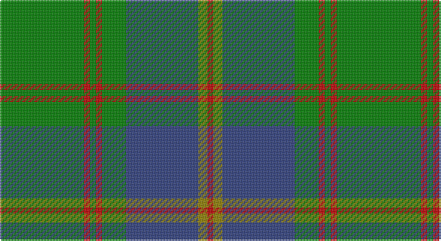

This page is one **sett** — a single exact thread-count. It belongs to the [tartan](/setts/g28r2g2r2g8db24y3r2/)
(the same proportion at any scale), whose colour order is pattern [GRGRGBGR](/stripes/grgrgbgr/).

Sourced from weddslist.  It is a [8 stripe tartan](/stripes/stripes8/).

Original link http://www.weddslist.com/cgi-bin/tartans/pg.pl?source=sts

## Thread count
G/56 R4 G4 R4 G16 B48 LG6 R/4

One full sett is **224 threads**.

## Palette

Palette: <strong>custom</strong>
<table><thead><tr><th>Colour</th><th>Threads</th><th>Shade</th><th>Base</th><th>OKLCh</th></tr></thead><tbody><tr><td>G/</td><td style="text-align:right;font-variant-numeric:tabular-nums">56</td><td><code style="background-color:#008000;">#008000</code> <small style="color:#888">#008000</small></td><td>G <code style="background-color:#006100;">#006100</code></td><td><small style="color:#888">oklch(52.0% 0.177 142.5)</small></td></tr><tr><td>R</td><td style="text-align:right;font-variant-numeric:tabular-nums">4</td><td><code style="background-color:#C00000;">#C00000</code> <small style="color:#888">#C00000</small></td><td>R <code style="background-color:#CC0000;">#CC0000</code></td><td><small style="color:#888">oklch(50.7% 0.208 29.2)</small></td></tr><tr><td>G</td><td style="text-align:right;font-variant-numeric:tabular-nums">4</td><td><code style="background-color:#008000;">#008000</code> <small style="color:#888">#008000</small></td><td>G <code style="background-color:#006100;">#006100</code></td><td><small style="color:#888">oklch(52.0% 0.177 142.5)</small></td></tr><tr><td>R</td><td style="text-align:right;font-variant-numeric:tabular-nums">4</td><td><code style="background-color:#C00000;">#C00000</code> <small style="color:#888">#C00000</small></td><td>R <code style="background-color:#CC0000;">#CC0000</code></td><td><small style="color:#888">oklch(50.7% 0.208 29.2)</small></td></tr><tr><td>G</td><td style="text-align:right;font-variant-numeric:tabular-nums">16</td><td><code style="background-color:#008000;">#008000</code> <small style="color:#888">#008000</small></td><td>G <code style="background-color:#006100;">#006100</code></td><td><small style="color:#888">oklch(52.0% 0.177 142.5)</small></td></tr><tr><td>B</td><td style="text-align:right;font-variant-numeric:tabular-nums">48</td><td><code style="background-color:#304080;">#304080</code> <small style="color:#888">#304080</small></td><td>B <code style="background-color:#2A418A;">#2A418A</code></td><td><small style="color:#888">oklch(39.4% 0.109 270.2)</small></td></tr><tr><td>LG</td><td style="text-align:right;font-variant-numeric:tabular-nums">6</td><td><code style="background-color:#908000;">#908000</code> <small style="color:#888">#908000</small></td><td>G <code style="background-color:#006100;">#006100</code></td><td><small style="color:#888">oklch(59.6% 0.124 100.6)</small></td></tr><tr><td>R/</td><td style="text-align:right;font-variant-numeric:tabular-nums">4</td><td><code style="background-color:#C00000;">#C00000</code> <small style="color:#888">#C00000</small></td><td>R <code style="background-color:#CC0000;">#CC0000</code></td><td><small style="color:#888">oklch(50.7% 0.208 29.2)</small></td></tr></tbody></table>

# Sample pattern

## Nearest tartans

The nearest existing variants by ΔTartan distance, with this tartan at the top so the swatches line up against it.

ΔTartan

Tartan

Sett

—

<a href="/ttd/edit/#slug=g28r2g2r2g8db24y3r2~x2">Leatherneck, U.S.Marine Corps</a> <a class="nn-out" href="/variants/s8/g28r2g2r2g8db24y3r2~x2/" title="open its dictionary page">↗</a>

0.73

<a href="/ttd/edit/#slug=g40r3g4r3g12db32lo4r3~x2&amp;base=g28r2g2r2g8db24y3r2~x2">US Marine Corps</a> <a class="nn-out" href="/variants/s8/g40r3g4r3g12db32lo4r3~x2/" title="open its dictionary page">↗</a>

0.87

<a href="/ttd/edit/#slug=g28r2g2r2g8db24ly3r2~x2&amp;base=g28r2g2r2g8db24y3r2~x2">Leatherneck U.S.Marine Corps Corporate Tartan</a> <a class="nn-out" href="/variants/s8/g28r2g2r2g8db24ly3r2~x2/" title="open its dictionary page">↗</a>

0.96

<a href="/ttd/edit/#slug=dg40r3dg4r3dg12db32ly4r3~x2&amp;base=g28r2g2r2g8db24y3r2~x2">U.S. Marine Corps (Military?)</a> <a class="nn-out" href="/variants/s8/dg40r3dg4r3dg12db32ly4r3~x2/" title="open its dictionary page">↗</a>

1.05

<a href="/ttd/edit/#slug=g2k3ly1k3g2db8g16k1~x4&amp;base=g28r2g2r2g8db24y3r2~x2">Harley (Leslie), Robert</a> <a class="nn-out" href="/variants/s8/g2k3ly1k3g2db8g16k1~x4/" title="open its dictionary page">↗</a>

1.08

<a href="/ttd/edit/#slug=dg38w2dg6db24o6db2o3db2~x2&amp;base=g28r2g2r2g8db24y3r2~x2">MacAuliffe/McAucliffe</a> <a class="nn-out" href="/variants/s8/dg38w2dg6db24o6db2o3db2~x2/" title="open its dictionary page">↗</a>

1.09

<a href="/ttd/edit/#slug=g24k2db3k2db8r2~x2&amp;base=g28r2g2r2g8db24y3r2~x2">Shaw (Clan 1)</a> <a class="nn-out" href="/variants/s6/g24k2db3k2db8r2~x2/" title="open its dictionary page">↗</a>

1.15

<a href="/ttd/edit/#slug=g28r12g4db20ly2db3ly2db3g7~x2&amp;base=g28r2g2r2g8db24y3r2~x2">Cork</a> <a class="nn-out" href="/variants/s9/g28r12g4db20ly2db3ly2db3g7~x2/" title="open its dictionary page">↗</a>

1.18

<a href="/ttd/edit/#slug=dt16g4dt3g3lo2g24r2~x2&amp;base=g28r2g2r2g8db24y3r2~x2">St Andrews Links</a> <a class="nn-out" href="/variants/s7/dt16g4dt3g3lo2g24r2~x2/" title="open its dictionary page">↗</a>

1.21

<a href="/ttd/edit/#slug=g17t2y2t2k21t2k3g30k2t2k4~x2&amp;base=g28r2g2r2g8db24y3r2~x2">Fort William (District?)</a> <a class="nn-out" href="/variants/s11/g17t2y2t2k21t2k3g30k2t2k4~x2/" title="open its dictionary page">↗</a>

1.24

<a href="/ttd/edit/#slug=g47r3g6db35ly3~x2&amp;base=g28r2g2r2g8db24y3r2~x2">Gracie</a> <a class="nn-out" href="/variants/s5/g47r3g6db35ly3~x2/" title="open its dictionary page">↗</a>

## Neighbour map

Every grey dot is one of 14360 variants placed by the first two principal components of the ΔTartan feature space (44% of its variance). Red is this tartan; blue dots are its nearest — click one to open its page.

<svg viewBox="0 0 640 380" role="img" style="max-width:100%;height:auto;border:1px solid #e0e0e0;border-radius:4px;display:block" xmlns="http://www.w3.org/2000/svg"><image href="/nn/cloud.v1.png" width="640" height="380"/><a href="/variants/s8/g40r3g4r3g12db32lo4r3~x2/"><circle cx="343.4" cy="189.5" r="4" fill="#3465a4"><title>US Marine Corps</title></circle></a><a href="/variants/s8/g28r2g2r2g8db24ly3r2~x2/"><circle cx="330.0" cy="181.0" r="4" fill="#3465a4"><title>Leatherneck U.S.Marine Corps Corporate Tartan</title></circle></a><a href="/variants/s8/dg40r3dg4r3dg12db32ly4r3~x2/"><circle cx="342.1" cy="189.2" r="4" fill="#3465a4"><title>U.S. Marine Corps (Military?)</title></circle></a><a href="/variants/s8/g2k3ly1k3g2db8g16k1~x4/"><circle cx="337.6" cy="189.5" r="4" fill="#3465a4"><title>Harley (Leslie), Robert</title></circle></a><a href="/variants/s8/dg38w2dg6db24o6db2o3db2~x2/"><circle cx="364.2" cy="179.5" r="4" fill="#3465a4"><title>MacAuliffe/McAucliffe</title></circle></a><a href="/variants/s6/g24k2db3k2db8r2~x2/"><circle cx="369.4" cy="209.1" r="4" fill="#3465a4"><title>Shaw (Clan 1)</title></circle></a><a href="/variants/s9/g28r12g4db20ly2db3ly2db3g7~x2/"><circle cx="273.9" cy="178.4" r="4" fill="#3465a4"><title>Cork</title></circle></a><a href="/variants/s7/dt16g4dt3g3lo2g24r2~x2/"><circle cx="383.6" cy="221.5" r="4" fill="#3465a4"><title>St Andrews Links</title></circle></a><a href="/variants/s11/g17t2y2t2k21t2k3g30k2t2k4~x2/"><circle cx="339.7" cy="170.8" r="4" fill="#3465a4"><title>Fort William (District?)</title></circle></a><a href="/variants/s5/g47r3g6db35ly3~x2/"><circle cx="363.9" cy="213.0" r="4" fill="#3465a4"><title>Gracie</title></circle></a><circle cx="340.8" cy="187.4" r="5" fill="#c00000"/></svg>

ID: /variants/s8/g28r2g2r2g8db24y3r2~x2/
