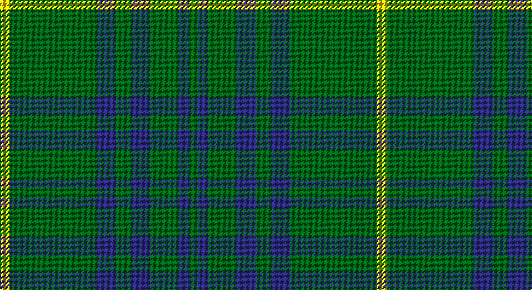

This page is one **sett** — a single exact thread-count. It belongs to the [tartan](/setts/g2db2g6db4g3db4g18ly2/)
(the same proportion at any scale), whose colour order is pattern [GBGBGBGY](/stripes/gbgbgbgy/).

Sourced from tartans-authority.  It is a [8 stripe tartan](/stripes/stripes8/).

Original link http://www.tartansauthority.com/tartan-ferret/display/8571/

## Register references

External register numbers recorded for this tartan.

- Scottish Tartans Authority (ITI): 8571

## Thread count
Y/8 G72 DB16 G12 DB16 G24 DB8 G/8

One full sett is **312 threads**.

## Palette

Palette: <strong>Tartan Register</strong>
<table><thead><tr><th>Colour</th><th>Threads</th><th>Shade</th><th>Base</th><th>OKLCh</th></tr></thead><tbody><tr><td>Y/</td><td style="text-align:right;font-variant-numeric:tabular-nums">8</td><td><code style="background-color:#FCCC00;">#FCCC00</code> <small style="color:#888">#FCCC00</small></td><td>Y <code style="background-color:#F2BF00;">#F2BF00</code></td><td><small style="color:#888">oklch(86.2% 0.176 91.5)</small></td></tr><tr><td>G</td><td style="text-align:right;font-variant-numeric:tabular-nums">72</td><td><code style="background-color:#006818;">#006818</code> <small style="color:#888">#006818</small></td><td>G <code style="background-color:#006100;">#006100</code></td><td><small style="color:#888">oklch(45.0% 0.142 145.0)</small></td></tr><tr><td>DB</td><td style="text-align:right;font-variant-numeric:tabular-nums">16</td><td><code style="background-color:#2C2C80;">#2C2C80</code> <small style="color:#888">#2C2C80</small></td><td>B <code style="background-color:#2A418A;">#2A418A</code></td><td><small style="color:#888">oklch(35.0% 0.138 276.6)</small></td></tr><tr><td>G</td><td style="text-align:right;font-variant-numeric:tabular-nums">12</td><td><code style="background-color:#006818;">#006818</code> <small style="color:#888">#006818</small></td><td>G <code style="background-color:#006100;">#006100</code></td><td><small style="color:#888">oklch(45.0% 0.142 145.0)</small></td></tr><tr><td>DB</td><td style="text-align:right;font-variant-numeric:tabular-nums">16</td><td><code style="background-color:#2C2C80;">#2C2C80</code> <small style="color:#888">#2C2C80</small></td><td>B <code style="background-color:#2A418A;">#2A418A</code></td><td><small style="color:#888">oklch(35.0% 0.138 276.6)</small></td></tr><tr><td>G</td><td style="text-align:right;font-variant-numeric:tabular-nums">24</td><td><code style="background-color:#006818;">#006818</code> <small style="color:#888">#006818</small></td><td>G <code style="background-color:#006100;">#006100</code></td><td><small style="color:#888">oklch(45.0% 0.142 145.0)</small></td></tr><tr><td>DB</td><td style="text-align:right;font-variant-numeric:tabular-nums">8</td><td><code style="background-color:#2C2C80;">#2C2C80</code> <small style="color:#888">#2C2C80</small></td><td>B <code style="background-color:#2A418A;">#2A418A</code></td><td><small style="color:#888">oklch(35.0% 0.138 276.6)</small></td></tr><tr><td>G/</td><td style="text-align:right;font-variant-numeric:tabular-nums">8</td><td><code style="background-color:#006818;">#006818</code> <small style="color:#888">#006818</small></td><td>G <code style="background-color:#006100;">#006100</code></td><td><small style="color:#888">oklch(45.0% 0.142 145.0)</small></td></tr></tbody></table>

# Sample pattern

## Nearest tartans

The nearest existing variants by ΔTartan distance, with this tartan at the top so the swatches line up against it.

ΔTartan

Tartan

Sett

—

<a href="/ttd/edit/#slug=g2db2g6db4g3db4g18ly2~x4">Crow (Name)</a> <a class="nn-out" href="/variants/s8/g2db2g6db4g3db4g18ly2~x4/" title="open its dictionary page">↗</a>

1.08

<a href="/variants/s8/k8g3k4g20r3~x2/">MacArthur-Fox (Personal)</a>

1.12

<a href="/ttd/edit/#slug=g34m4g4m4g4m12g20w5~x2&amp;base=g2db2g6db4g3db4g18ly2~x4">Leeds, University of (Dance)</a> <a class="nn-out" href="/variants/s8/g34m4g4m4g4m12g20w5~x2/" title="open its dictionary page">↗</a>

1.16

<a href="/ttd/edit/#slug=dg10o1dg1o1lr2dg1o1~x4&amp;base=g2db2g6db4g3db4g18ly2~x4">Green Watch</a> <a class="nn-out" href="/variants/s7/dg10o1dg1o1lr2dg1o1~x4/" title="open its dictionary page">↗</a>

1.23

<a href="/ttd/edit/#slug=g24r4g3k14g5r2g10~x2&amp;base=g2db2g6db4g3db4g18ly2~x4">Northcroft (Personal)</a> <a class="nn-out" href="/variants/s7/g24r4g3k14g5r2g10~x2/" title="open its dictionary page">↗</a>

1.46

<a href="/ttd/edit/#slug=g18ly2g18k4g2k15~x2&amp;base=g2db2g6db4g3db4g18ly2~x4">MacArthur (Highland Society)</a> <a class="nn-out" href="/variants/s6/g18ly2g18k4g2k15~x2/" title="open its dictionary page">↗</a>

1.46

<a href="/ttd/edit/#slug=dg6do2m1dg15m3do1dg15g6m1~x2&amp;base=g2db2g6db4g3db4g18ly2~x4">McCall, F W (Personal)</a> <a class="nn-out" href="/variants/s9/dg6do2m1dg15m3do1dg15g6m1~x2/" title="open its dictionary page">↗</a>

1.46

<a href="/ttd/edit/#slug=g18r6g75b6g13dy35g12b6&amp;base=g2db2g6db4g3db4g18ly2~x4">Glenlivet</a> <a class="nn-out" href="/variants/s8/g18r6g75b6g13dy35g12b6/" title="open its dictionary page">↗</a>

1.47

<a href="/ttd/edit/#slug=g9n1g2k4g2~x4&amp;base=g2db2g6db4g3db4g18ly2~x4">Peterhead (Personal)</a> <a class="nn-out" href="/variants/s5/g9n1g2k4g2~x4/" title="open its dictionary page">↗</a>

1.48

<a href="/ttd/edit/#slug=dg18r6dg75b6dg13lo35dg12b6&amp;base=g2db2g6db4g3db4g18ly2~x4">Glenlivet Check (Corporate)</a> <a class="nn-out" href="/variants/s8/dg18r6dg75b6dg13lo35dg12b6/" title="open its dictionary page">↗</a>

1.52

<a href="/ttd/edit/#slug=m2g1m1g10w1~x4&amp;base=g2db2g6db4g3db4g18ly2~x4">Welsh National District Tartan</a> <a class="nn-out" href="/variants/s5/m2g1m1g10w1~x4/" title="open its dictionary page">↗</a>

## Neighbour map

Every grey dot is one of 14360 variants placed by the first two principal components of the ΔTartan feature space (44% of its variance). Red is this tartan; blue dots are its nearest — click one to open its page.

<svg viewBox="0 0 640 380" role="img" style="max-width:100%;height:auto;border:1px solid #e0e0e0;border-radius:4px;display:block" xmlns="http://www.w3.org/2000/svg"><image href="/nn/cloud.v1.png" width="640" height="380"/><a href="/variants/s8/k8g3k4g20r3~x2/"><circle cx="435.6" cy="263.8" r="4" fill="#3465a4"><title>MacArthur-Fox (Personal)</title></circle></a><a href="/variants/s8/g34m4g4m4g4m12g20w5~x2/"><circle cx="429.5" cy="226.9" r="4" fill="#3465a4"><title>Leeds, University of (Dance)</title></circle></a><a href="/variants/s7/dg10o1dg1o1lr2dg1o1~x4/"><circle cx="458.6" cy="214.8" r="4" fill="#3465a4"><title>Green Watch</title></circle></a><a href="/variants/s7/g24r4g3k14g5r2g10~x2/"><circle cx="417.4" cy="240.0" r="4" fill="#3465a4"><title>Northcroft (Personal)</title></circle></a><a href="/variants/s6/g18ly2g18k4g2k15~x2/"><circle cx="386.0" cy="265.9" r="4" fill="#3465a4"><title>MacArthur (Highland Society)</title></circle></a><a href="/variants/s9/dg6do2m1dg15m3do1dg15g6m1~x2/"><circle cx="452.6" cy="206.2" r="4" fill="#3465a4"><title>McCall, F W (Personal)</title></circle></a><a href="/variants/s8/g18r6g75b6g13dy35g12b6/"><circle cx="418.6" cy="200.2" r="4" fill="#3465a4"><title>Glenlivet</title></circle></a><a href="/variants/s5/g9n1g2k4g2~x4/"><circle cx="461.0" cy="275.1" r="4" fill="#3465a4"><title>Peterhead (Personal)</title></circle></a><a href="/variants/s8/dg18r6dg75b6dg13lo35dg12b6/"><circle cx="423.6" cy="201.9" r="4" fill="#3465a4"><title>Glenlivet Check (Corporate)</title></circle></a><a href="/variants/s5/m2g1m1g10w1~x4/"><circle cx="478.5" cy="228.8" r="4" fill="#3465a4"><title>Welsh National District Tartan</title></circle></a><circle cx="438.9" cy="235.6" r="5" fill="#c00000"/></svg>

ID: /variants/s8/g2db2g6db4g3db4g18ly2~x4/
