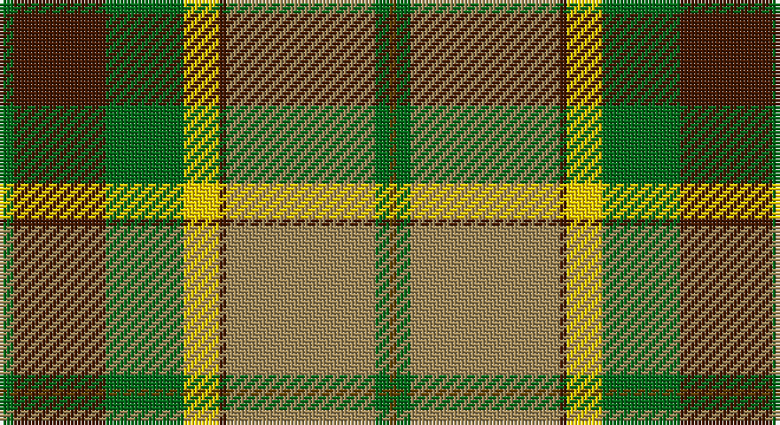

This page is one **sett** — a single exact thread-count. It belongs to the [tartan](/setts/g2do13g11ly5do1lo21g2dy1/)
(the same proportion at any scale), whose colour order is pattern [GBGYBYGG](/stripes/gbgybygg/).

Sourced from tartans-authority.  It is a [8 stripe tartan](/stripes/stripes8/).

Original link http://www.tartansauthority.com/tartan-ferret/display/2540/

## Register references

External register numbers recorded for this tartan.

- Scottish Tartans Authority (ITI): 2540

## Thread count
G/4 DR26 G22 Y10 DR2 LT42 G4 T/2

One full sett is **218 threads**.

## Palette

Palette: <strong>Tartan Register</strong>
<table><thead><tr><th>Colour</th><th>Threads</th><th>Shade</th><th>Base</th><th>OKLCh</th></tr></thead><tbody><tr><td>G/</td><td style="text-align:right;font-variant-numeric:tabular-nums">4</td><td><code style="background-color:#006818;">#006818</code> <small style="color:#888">#006818</small></td><td>G <code style="background-color:#006100;">#006100</code></td><td><small style="color:#888">oklch(45.0% 0.142 145.0)</small></td></tr><tr><td>DR</td><td style="text-align:right;font-variant-numeric:tabular-nums">26</td><td><code style="background-color:#441800;">#441800</code> <small style="color:#888">#441800</small></td><td>B <code style="background-color:#2A418A;">#2A418A</code></td><td><small style="color:#888">oklch(27.3% 0.076 46.3)</small></td></tr><tr><td>G</td><td style="text-align:right;font-variant-numeric:tabular-nums">22</td><td><code style="background-color:#006818;">#006818</code> <small style="color:#888">#006818</small></td><td>G <code style="background-color:#006100;">#006100</code></td><td><small style="color:#888">oklch(45.0% 0.142 145.0)</small></td></tr><tr><td>Y</td><td style="text-align:right;font-variant-numeric:tabular-nums">10</td><td><code style="background-color:#FCCC00;">#FCCC00</code> <small style="color:#888">#FCCC00</small></td><td>Y <code style="background-color:#F2BF00;">#F2BF00</code></td><td><small style="color:#888">oklch(86.2% 0.176 91.5)</small></td></tr><tr><td>DR</td><td style="text-align:right;font-variant-numeric:tabular-nums">2</td><td><code style="background-color:#441800;">#441800</code> <small style="color:#888">#441800</small></td><td>B <code style="background-color:#2A418A;">#2A418A</code></td><td><small style="color:#888">oklch(27.3% 0.076 46.3)</small></td></tr><tr><td>LT</td><td style="text-align:right;font-variant-numeric:tabular-nums">42</td><td><code style="background-color:#A08858;">#A08858</code> <small style="color:#888">#A08858</small></td><td>Y <code style="background-color:#F2BF00;">#F2BF00</code></td><td><small style="color:#888">oklch(63.7% 0.071 84.0)</small></td></tr><tr><td>G</td><td style="text-align:right;font-variant-numeric:tabular-nums">4</td><td><code style="background-color:#006818;">#006818</code> <small style="color:#888">#006818</small></td><td>G <code style="background-color:#006100;">#006100</code></td><td><small style="color:#888">oklch(45.0% 0.142 145.0)</small></td></tr><tr><td>T/</td><td style="text-align:right;font-variant-numeric:tabular-nums">2</td><td><code style="background-color:#604000;">#604000</code> <small style="color:#888">#604000</small></td><td>G <code style="background-color:#006100;">#006100</code></td><td><small style="color:#888">oklch(39.8% 0.083 76.8)</small></td></tr></tbody></table>

# Sample pattern

## Nearest tartans

The nearest existing variants by ΔTartan distance, with this tartan at the top so the swatches line up against it.

ΔTartan

Tartan

Sett

—

<a href="/ttd/edit/#slug=g2do13g11ly5do1lo21g2dy1~x2">St. Lawrence #2 (Fashion)</a> <a class="nn-out" href="/variants/s8/g2do13g11ly5do1lo21g2dy1~x2/" title="open its dictionary page">↗</a>

0.68

<a href="/ttd/edit/#slug=dg2dr13dg11ly5dr1oi21dg2o1~x2&amp;base=g2do13g11ly5do1lo21g2dy1~x2">St Lawrence Trade</a> <a class="nn-out" href="/variants/s8/dg2dr13dg11ly5dr1oi21dg2o1~x2/" title="open its dictionary page">↗</a>

1.08

<a href="/ttd/edit/#slug=r2lo24r2lo3r2g24k8ly2~x2&amp;base=g2do13g11ly5do1lo21g2dy1~x2">Botherston (Name)</a> <a class="nn-out" href="/variants/s8/r2lo24r2lo3r2g24k8ly2~x2/" title="open its dictionary page">↗</a>

1.12

<a href="/ttd/edit/#slug=w1db4o8r4w1r4w1r4g16db2w1~x2&amp;base=g2do13g11ly5do1lo21g2dy1~x2">Stuart / Stewart, Riding Cloak</a> <a class="nn-out" href="/variants/s11/w1db4o8r4w1r4w1r4g16db2w1~x2/" title="open its dictionary page">↗</a>

1.19

<a href="/ttd/edit/#slug=r8lo44k32w2o52k7o7w3&amp;base=g2do13g11ly5do1lo21g2dy1~x2">Golden Wedding (Fashion)</a> <a class="nn-out" href="/variants/s8/r8lo44k32w2o52k7o7w3/" title="open its dictionary page">↗</a>

1.27

<a href="/ttd/edit/#slug=dg1dy7dg7o2dy1ly15w1~x4&amp;base=g2do13g11ly5do1lo21g2dy1~x2">Regalia</a> <a class="nn-out" href="/variants/s7/dg1dy7dg7o2dy1ly15w1~x4/" title="open its dictionary page">↗</a>

1.27

<a href="/ttd/edit/#slug=lo16k7w1g7k1ly3~x4&amp;base=g2do13g11ly5do1lo21g2dy1~x2">Hamilton of Brandon (Fashion)</a> <a class="nn-out" href="/variants/s6/lo16k7w1g7k1ly3~x4/" title="open its dictionary page">↗</a>

1.28

<a href="/ttd/edit/#slug=lo15k1lo2k1lo2k10y14w2~x2&amp;base=g2do13g11ly5do1lo21g2dy1~x2">Buccleuch (Fashion)</a> <a class="nn-out" href="/variants/s8/lo15k1lo2k1lo2k10y14w2~x2/" title="open its dictionary page">↗</a>

1.29

<a href="/ttd/edit/#slug=dy12o2k2o42k13g25o6k2r4k10~x2&amp;base=g2do13g11ly5do1lo21g2dy1~x2">Dinwoodie (Name)</a> <a class="nn-out" href="/variants/s10/dy12o2k2o42k13g25o6k2r4k10~x2/" title="open its dictionary page">↗</a>

1.32

<a href="/ttd/edit/#slug=r4n12k18n4y22lb1y2lb2y3lb2~x4&amp;base=g2do13g11ly5do1lo21g2dy1~x2">Windsor</a> <a class="nn-out" href="/variants/s10/r4n12k18n4y22lb1y2lb2y3lb2~x4/" title="open its dictionary page">↗</a>

1.33

<a href="/ttd/edit/#slug=k2w1dg25dy11r12w1ly12k1w2~x2&amp;base=g2do13g11ly5do1lo21g2dy1~x2">Leaf Peeper</a> <a class="nn-out" href="/variants/s9/k2w1dg25dy11r12w1ly12k1w2~x2/" title="open its dictionary page">↗</a>

## Neighbour map

Every grey dot is one of 14360 variants placed by the first two principal components of the ΔTartan feature space (44% of its variance). Red is this tartan; blue dots are its nearest — click one to open its page.

<svg viewBox="0 0 640 380" role="img" style="max-width:100%;height:auto;border:1px solid #e0e0e0;border-radius:4px;display:block" xmlns="http://www.w3.org/2000/svg"><image href="/nn/cloud.v1.png" width="640" height="380"/><a href="/variants/s8/dg2dr13dg11ly5dr1oi21dg2o1~x2/"><circle cx="207.7" cy="141.1" r="4" fill="#3465a4"><title>St Lawrence Trade</title></circle></a><a href="/variants/s8/r2lo24r2lo3r2g24k8ly2~x2/"><circle cx="226.4" cy="162.5" r="4" fill="#3465a4"><title>Botherston (Name)</title></circle></a><a href="/variants/s11/w1db4o8r4w1r4w1r4g16db2w1~x2/"><circle cx="177.7" cy="134.1" r="4" fill="#3465a4"><title>Stuart / Stewart, Riding Cloak</title></circle></a><a href="/variants/s8/r8lo44k32w2o52k7o7w3/"><circle cx="207.6" cy="124.2" r="4" fill="#3465a4"><title>Golden Wedding (Fashion)</title></circle></a><a href="/variants/s7/dg1dy7dg7o2dy1ly15w1~x4/"><circle cx="210.4" cy="145.1" r="4" fill="#3465a4"><title>Regalia</title></circle></a><a href="/variants/s6/lo16k7w1g7k1ly3~x4/"><circle cx="215.3" cy="163.5" r="4" fill="#3465a4"><title>Hamilton of Brandon (Fashion)</title></circle></a><a href="/variants/s8/lo15k1lo2k1lo2k10y14w2~x2/"><circle cx="229.8" cy="169.6" r="4" fill="#3465a4"><title>Buccleuch (Fashion)</title></circle></a><a href="/variants/s10/dy12o2k2o42k13g25o6k2r4k10~x2/"><circle cx="228.7" cy="136.3" r="4" fill="#3465a4"><title>Dinwoodie (Name)</title></circle></a><a href="/variants/s10/r4n12k18n4y22lb1y2lb2y3lb2~x4/"><circle cx="214.6" cy="133.4" r="4" fill="#3465a4"><title>Windsor</title></circle></a><a href="/variants/s9/k2w1dg25dy11r12w1ly12k1w2~x2/"><circle cx="166.6" cy="96.8" r="4" fill="#3465a4"><title>Leaf Peeper</title></circle></a><circle cx="210.1" cy="143.0" r="5" fill="#c00000"/></svg>

ID: /variants/s8/g2do13g11ly5do1lo21g2dy1~x2/
