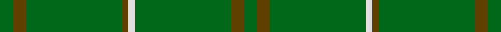
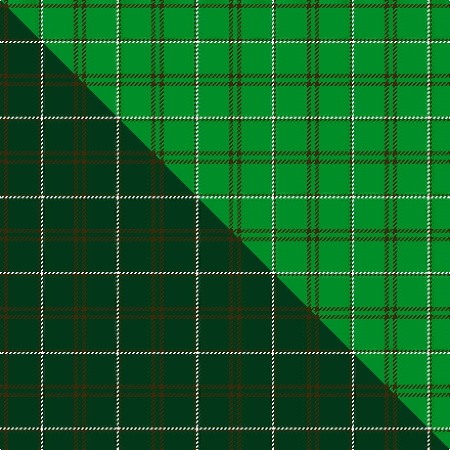

This page is one **sett** — a single exact thread-count. It belongs to the [tartan](/setts/g2dy2g15dy1w1g15dy2g2/)
(the same proportion at any scale), whose colour order is pattern [GGGGWGGG](/stripes/ggggwggg/).

Part of the [Bannockbane Hunting](/tartans/bannockbane-hunting/) tartan — the named design grouping this sett with its other cloths.

Sourced from house-of-tartan.  It is a [8 stripe tartan](/stripes/stripes8/).

Original link http://www.house-of-tartan.scotland.net/house/TartanViewjs.asp?colr=Def&tnam=909

## Provenance

Earliest known date: c.1984 Nothing

## Thread count
G/4 DY4 G30 DY2 W2 G30 DY4 G/4

One full sett is **152 threads**.

## Palette
<table><thead><tr><th>Colour</th><th>Shade</th><th>OKLCh</th></tr></thead><tbody><tr><td>G</td><td><code style="background-color:#008B2A;">#008B2A</code> <small style="color:#888">#008B2A</small></td><td><small style="color:#888">oklch(55.4% 0.170 145.9)</small></td></tr><tr><td>W</td><td><code style="background-color:#F7F7F7;">#F7F7F7</code> <small style="color:#888">#F7F7F7</small></td><td><small style="color:#888">oklch(97.6% 0.000 89.9)</small></td></tr><tr><td>DY</td><td><code style="background-color:#3A2B0D;">#3A2B0D</code> <small style="color:#888">#3A2B0D</small></td><td><small style="color:#888">oklch(30.0% 0.049 82.0)</small></td></tr></tbody></table>

# Sample pattern

## Compared to the master

This cloth is one sett of its design; the master sett (the exemplar the design is anchored on) is below for comparison.

Its **ΔTartan distance** from the master is **4.05** — the same measure the nearest-tartans table ranks by (0 is identical; a re-scale of the same cloth is near 0, a recolour or a different proportion further).

<figure class="master-compare" style="margin:0">

this sett
master sett ★

<figcaption style="color:#888;font-size:smaller">One weave of this sett against the <a href="/setts/dg2dy2dg15dy1w1dg15dy2dg2/">master sett ★</a>, split on the diagonal: a shared proportion runs seamlessly across it with only the shades shifting; a different proportion breaks on it.</figcaption>
</figure>

## Nearest tartan variants

The nearest existing variants by ΔTartan distance, with this cloth at the top so the swatches line up against it.

ΔTartan

Threads

Variant

Sett

—

152

<a href="/variants/s8/g2dy2g15dy1w1g15dy2g2~x2/">Bannockbane Hunting Trade Tartan</a>

<a href="/ttd/edit/#slug=g2o2g15o1w1g15o2g2~x2&amp;base=g2dy2g15dy1w1g15dy2g2~x2" title="compare in the TTD">0.90</a>

152

<a href="/variants/s8/g2o2g15o1w1g15o2g2~x2/">Bannockbane, hunting</a>

<a href="/ttd/edit/#slug=r8dg3r4dg44w4~x2&amp;base=g2dy2g15dy1w1g15dy2g2~x2" title="compare in the TTD">1.34</a>

228

<a href="/variants/s5/r8dg3r4dg44w4~x2/">Welsh National</a>

<a href="/ttd/edit/#slug=g18r6g75db6g13dy35g12db6&amp;base=g2dy2g15dy1w1g15dy2g2~x2" title="compare in the TTD">1.75</a>

318

<a href="/variants/s8/g18r6g75db6g13dy35g12db6/">Glenlivet</a>

<a href="/ttd/edit/#slug=g5n9g4w5g30r2g4r2~x2&amp;base=g2dy2g15dy1w1g15dy2g2~x2" title="compare in the TTD">1.79</a>

230

<a href="/variants/s8/g5n9g4w5g30r2g4r2~x2/">Welsh Assembly (Fashion)</a>

<a href="/ttd/edit/#slug=g14w2g14r1g14y2g30lb2g2lb4~x2&amp;base=g2dy2g15dy1w1g15dy2g2~x2" title="compare in the TTD">2.15</a>

304

<a href="/variants/s10/g14w2g14r1g14y2g30lb2g2lb4~x2/">Holmston Primary (School)</a>

<a href="/ttd/edit/#slug=dg30dr2dg8dr1dg5w2&amp;base=g2dy2g15dy1w1g15dy2g2~x2" title="compare in the TTD">2.44</a>

64

<a href="/variants/s6/dg30dr2dg8dr1dg5w2/">Dewi Sant</a>

<a href="/ttd/edit/#slug=dg9lb3dg6lb3dg20y2~x2&amp;base=g2dy2g15dy1w1g15dy2g2~x2" title="compare in the TTD">2.45</a>

150

<a href="/variants/s6/dg9lb3dg6lb3dg20y2~x2/">Oman, Sultanate of..</a>

<a href="/ttd/edit/#slug=g32dy2g2dy2g2dy12g22w1g1w3~x2&amp;base=g2dy2g15dy1w1g15dy2g2~x2" title="compare in the TTD">2.50</a>

246

<a href="/variants/s10/g32dy2g2dy2g2dy12g22w1g1w3~x2/">Unidentified Plaid #2</a>

<a href="/ttd/edit/#slug=dg2dp2dg24g1~x4~dg1806142-g2408144&amp;base=g2dy2g15dy1w1g15dy2g2~x2" title="compare in the TTD">2.60</a>

220

<a href="/variants/s4/dg2dp2dg24g1~x4~dg1806142-g2408144/">Walters (Personal)</a>

<a href="/ttd/edit/#slug=g18r6g75db6g13o35g12db6&amp;base=g2dy2g15dy1w1g15dy2g2~x2" title="compare in the TTD">2.75</a>

318

<a href="/variants/s8/g18r6g75db6g13o35g12db6/">Glenlivet</a>

## Neighbour map

Every grey dot is one of 13620 variants placed by the first two principal components of the ΔTartan feature space (42% of its variance). Red is this tartan; blue dots are its nearest — click one to open its page.

<svg viewBox="0 0 640 380" role="img" style="max-width:100%;height:auto;border:1px solid #e0e0e0;border-radius:4px;display:block" xmlns="http://www.w3.org/2000/svg"><image href="/nn/cloud.v1.png" width="640" height="380"/><a href="/variants/s8/g2o2g15o1w1g15o2g2~x2/"><circle cx="626.0" cy="223.4" r="4" fill="#3465a4"><title>Bannockbane, hunting</title></circle></a><a href="/variants/s5/r8dg3r4dg44w4~x2/"><circle cx="542.5" cy="173.3" r="4" fill="#3465a4"><title>Welsh National</title></circle></a><a href="/variants/s8/g18r6g75db6g13dy35g12db6/"><circle cx="436.4" cy="198.3" r="4" fill="#3465a4"><title>Glenlivet</title></circle></a><a href="/variants/s8/g5n9g4w5g30r2g4r2~x2/"><circle cx="451.6" cy="184.4" r="4" fill="#3465a4"><title>Welsh Assembly (Fashion)</title></circle></a><a href="/variants/s10/g14w2g14r1g14y2g30lb2g2lb4~x2/"><circle cx="622.6" cy="156.3" r="4" fill="#3465a4"><title>Holmston Primary (School)</title></circle></a><a href="/variants/s6/dg30dr2dg8dr1dg5w2/"><circle cx="626.0" cy="183.1" r="4" fill="#3465a4"><title>Dewi Sant</title></circle></a><a href="/variants/s6/dg9lb3dg6lb3dg20y2~x2/"><circle cx="522.8" cy="238.1" r="4" fill="#3465a4"><title>Oman, Sultanate of..</title></circle></a><a href="/variants/s10/g32dy2g2dy2g2dy12g22w1g1w3~x2/"><circle cx="539.8" cy="161.7" r="4" fill="#3465a4"><title>Unidentified Plaid #2</title></circle></a><a href="/variants/s4/dg2dp2dg24g1~x4~dg1806142-g2408144/"><circle cx="626.0" cy="231.4" r="4" fill="#3465a4"><title>Walters (Personal)</title></circle></a><a href="/variants/s8/g18r6g75db6g13o35g12db6/"><circle cx="470.6" cy="209.5" r="4" fill="#3465a4"><title>Glenlivet</title></circle></a><circle cx="626.0" cy="217.5" r="5" fill="#c00000"/><text x="320" y="376" text-anchor="middle" font-size="11" fill="#999">ground</text><text x="11" y="190" text-anchor="middle" font-size="11" fill="#999" transform="rotate(-90 11 190)">complexity</text></svg>

ID: /variants/s8/g2dy2g15dy1w1g15dy2g2~x2/
