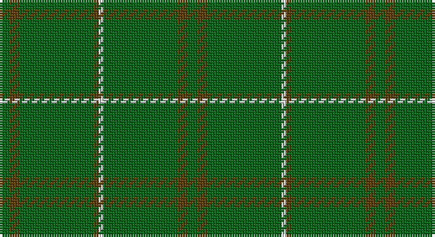

This page is one **sett** — a single exact thread-count. It belongs to the [tartan](/setts/g2dy2g15dy1w1g15dy2g2/)
(the same proportion at any scale), whose colour order is pattern [GGGGWGGG](/stripes/ggggwggg/).

Sourced from house-of-tartan.  It is a [8 stripe tartan](/stripes/stripes8/).

Original link http://www.house-of-tartan.scotland.net/house/TartanViewjs.asp?colr=Def&tnam=909

## Provenance

Earliest known date: c.1984 Nothing

## Thread count
G/4 T4 G30 T2 LN2 G30 T4 G/4

One full sett is **152 threads**.

## Palette

Palette: <strong>Tartan Register</strong>
<table><thead><tr><th>Colour</th><th>Threads</th><th>Shade</th><th>Base</th><th>OKLCh</th></tr></thead><tbody><tr><td>G/</td><td style="text-align:right;font-variant-numeric:tabular-nums">4</td><td><code style="background-color:#006818;">#006818</code> <small style="color:#888">#006818</small></td><td>G <code style="background-color:#006100;">#006100</code></td><td><small style="color:#888">oklch(45.0% 0.142 145.0)</small></td></tr><tr><td>T</td><td style="text-align:right;font-variant-numeric:tabular-nums">4</td><td><code style="background-color:#604000;">#604000</code> <small style="color:#888">#604000</small></td><td>G <code style="background-color:#006100;">#006100</code></td><td><small style="color:#888">oklch(39.8% 0.083 76.8)</small></td></tr><tr><td>G</td><td style="text-align:right;font-variant-numeric:tabular-nums">30</td><td><code style="background-color:#006818;">#006818</code> <small style="color:#888">#006818</small></td><td>G <code style="background-color:#006100;">#006100</code></td><td><small style="color:#888">oklch(45.0% 0.142 145.0)</small></td></tr><tr><td>T</td><td style="text-align:right;font-variant-numeric:tabular-nums">2</td><td><code style="background-color:#604000;">#604000</code> <small style="color:#888">#604000</small></td><td>G <code style="background-color:#006100;">#006100</code></td><td><small style="color:#888">oklch(39.8% 0.083 76.8)</small></td></tr><tr><td>LN</td><td style="text-align:right;font-variant-numeric:tabular-nums">2</td><td><code style="background-color:#E0E0E0;">#E0E0E0</code> <small style="color:#888">#E0E0E0</small></td><td>W <code style="background-color:#F7F7F7;">#F7F7F7</code></td><td><small style="color:#888">oklch(90.7% 0.000 89.9)</small></td></tr><tr><td>G</td><td style="text-align:right;font-variant-numeric:tabular-nums">30</td><td><code style="background-color:#006818;">#006818</code> <small style="color:#888">#006818</small></td><td>G <code style="background-color:#006100;">#006100</code></td><td><small style="color:#888">oklch(45.0% 0.142 145.0)</small></td></tr><tr><td>T</td><td style="text-align:right;font-variant-numeric:tabular-nums">4</td><td><code style="background-color:#604000;">#604000</code> <small style="color:#888">#604000</small></td><td>G <code style="background-color:#006100;">#006100</code></td><td><small style="color:#888">oklch(39.8% 0.083 76.8)</small></td></tr><tr><td>G/</td><td style="text-align:right;font-variant-numeric:tabular-nums">4</td><td><code style="background-color:#006818;">#006818</code> <small style="color:#888">#006818</small></td><td>G <code style="background-color:#006100;">#006100</code></td><td><small style="color:#888">oklch(45.0% 0.142 145.0)</small></td></tr></tbody></table>

# Sample pattern

## Nearest tartans

The nearest existing variants by ΔTartan distance, with this tartan at the top so the swatches line up against it.

ΔTartan

Tartan

Sett

—

<a href="/ttd/edit/#slug=g2dy2g15dy1w1g15dy2g2~x2">Bannockbane Hunting Trade Tartan</a> <a class="nn-out" href="/variants/s8/g2dy2g15dy1w1g15dy2g2~x2/" title="open its dictionary page">↗</a>

1.02

<a href="/ttd/edit/#slug=g2o2g15o1w1g15o2g2~x2&amp;base=g2dy2g15dy1w1g15dy2g2~x2">Bannockbane, hunting</a> <a class="nn-out" href="/variants/s8/g2o2g15o1w1g15o2g2~x2/" title="open its dictionary page">↗</a>

1.59

<a href="/ttd/edit/#slug=lo3g14dy1g14lo3~x4&amp;base=g2dy2g15dy1w1g15dy2g2~x2">Pearson Family Tartan</a> <a class="nn-out" href="/variants/s5/lo3g14dy1g14lo3~x4/" title="open its dictionary page">↗</a>

2.06

<a href="/variants/s10/gi2dp2gi20gi2gi2g1~x4/">Walters (Personal)</a>

2.09

<a href="/ttd/edit/#slug=r2g19g2g2g19g2lo2~x2&amp;base=g2dy2g15dy1w1g15dy2g2~x2">Kenmore Hunting</a> <a class="nn-out" href="/variants/s7/r2g19g2g2g19g2lo2~x2/" title="open its dictionary page">↗</a>

2.15

<a href="/ttd/edit/#slug=o3g14oi1g14o3~x4&amp;base=g2dy2g15dy1w1g15dy2g2~x2">Pearson</a> <a class="nn-out" href="/variants/s5/o3g14oi1g14o3~x4/" title="open its dictionary page">↗</a>

2.24

<a href="/ttd/edit/#slug=dg2dy2dg15dy1w1dg15dy2dg2~x2&amp;base=g2dy2g15dy1w1g15dy2g2~x2">Bannockbane Hunting</a> <a class="nn-out" href="/variants/s8/dg2dy2dg15dy1w1dg15dy2dg2~x2/" title="open its dictionary page">↗</a>

2.30

<a href="/ttd/edit/#slug=g2dp2g20g2g2dp1~x4&amp;base=g2dy2g15dy1w1g15dy2g2~x2">Walters (Personal)</a> <a class="nn-out" href="/variants/s6/g2dp2g20g2g2dp1~x4/" title="open its dictionary page">↗</a>

2.34

<a href="/ttd/edit/#slug=g3db2g40db1g2db1g9r4g3r2~x4&amp;base=g2dy2g15dy1w1g15dy2g2~x2">Braveheart Htg (Fashion)</a> <a class="nn-out" href="/variants/s10/g3db2g40db1g2db1g9r4g3r2~x4/" title="open its dictionary page">↗</a>

2.52

<a href="/ttd/edit/#slug=g3dt1g2r1g3db3g2db2g18dt2~x2&amp;base=g2dy2g15dy1w1g15dy2g2~x2">Owen Welsh Name Tartan</a> <a class="nn-out" href="/variants/s10/g3dt1g2r1g3db3g2db2g18dt2~x2/" title="open its dictionary page">↗</a>

2.54

<a href="/ttd/edit/#slug=gi3lo1gi3r1gi14dg2gi3dg1gi3g1gi2g1gi2g2~x4&amp;base=g2dy2g15dy1w1g15dy2g2~x2">New South Wales</a> <a class="nn-out" href="/variants/s14/gi3lo1gi3r1gi14dg2gi3dg1gi3g1gi2g1gi2g2~x4/" title="open its dictionary page">↗</a>

## Neighbour map

Every grey dot is one of 14360 variants placed by the first two principal components of the ΔTartan feature space (44% of its variance). Red is this tartan; blue dots are its nearest — click one to open its page.

<svg viewBox="0 0 640 380" role="img" style="max-width:100%;height:auto;border:1px solid #e0e0e0;border-radius:4px;display:block" xmlns="http://www.w3.org/2000/svg"><image href="/nn/cloud.v1.png" width="640" height="380"/><a href="/variants/s8/g2o2g15o1w1g15o2g2~x2/"><circle cx="626.0" cy="248.8" r="4" fill="#3465a4"><title>Bannockbane, hunting</title></circle></a><a href="/variants/s5/lo3g14dy1g14lo3~x4/"><circle cx="608.6" cy="298.3" r="4" fill="#3465a4"><title>Pearson Family Tartan</title></circle></a><a href="/variants/s10/gi2dp2gi20gi2gi2g1~x4/"><circle cx="626.0" cy="218.8" r="4" fill="#3465a4"><title>Walters (Personal)</title></circle></a><a href="/variants/s7/r2g19g2g2g19g2lo2~x2/"><circle cx="626.0" cy="276.2" r="4" fill="#3465a4"><title>Kenmore Hunting</title></circle></a><a href="/variants/s5/o3g14oi1g14o3~x4/"><circle cx="626.0" cy="316.5" r="4" fill="#3465a4"><title>Pearson</title></circle></a><a href="/variants/s8/dg2dy2dg15dy1w1dg15dy2dg2~x2/"><circle cx="626.0" cy="241.8" r="4" fill="#3465a4"><title>Bannockbane Hunting</title></circle></a><a href="/variants/s6/g2dp2g20g2g2dp1~x4/"><circle cx="626.0" cy="226.0" r="4" fill="#3465a4"><title>Walters (Personal)</title></circle></a><a href="/variants/s10/g3db2g40db1g2db1g9r4g3r2~x4/"><circle cx="626.0" cy="170.8" r="4" fill="#3465a4"><title>Braveheart Htg (Fashion)</title></circle></a><a href="/variants/s10/g3dt1g2r1g3db3g2db2g18dt2~x2/"><circle cx="536.1" cy="193.3" r="4" fill="#3465a4"><title>Owen Welsh Name Tartan</title></circle></a><a href="/variants/s14/gi3lo1gi3r1gi14dg2gi3dg1gi3g1gi2g1gi2g2~x4/"><circle cx="553.7" cy="208.9" r="4" fill="#3465a4"><title>New South Wales</title></circle></a><circle cx="626.0" cy="258.4" r="5" fill="#c00000"/></svg>

ID: /variants/s8/g2dy2g15dy1w1g15dy2g2~x2/
