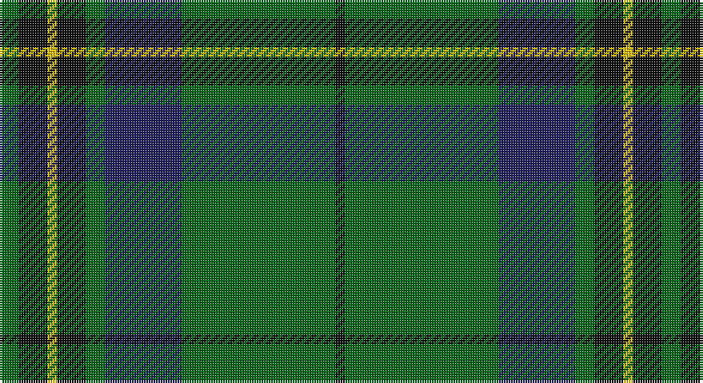

This page is one **sett** — a single exact thread-count. It belongs to the [tartan](/setts/g2k3ly1k3g2db8g16k1/)
(the same proportion at any scale), whose colour order is pattern [GKYKGBGK](/stripes/gkykgbgk/).

Sourced from tartans-authority.  It is a [8 stripe tartan](/stripes/stripes8/).

Original link http://www.tartansauthority.com/tartan-ferret/display/10986/

## Register references

External register numbers recorded for this tartan.

- Scottish Register of Tartans: [10986](https://www.tartanregister.gov.uk/tartanDetails?ref=10986)
- Scottish Tartans Authority (ITI): 10986

## Thread count
G/8 K12 Y4 K12 G8 DB32 G64 K/4

One full sett is **276 threads**.

## Palette

Palette: <strong>Tartan Register</strong>
<table><thead><tr><th>Colour</th><th>Threads</th><th>Shade</th><th>Base</th><th>OKLCh</th></tr></thead><tbody><tr><td>G/</td><td style="text-align:right;font-variant-numeric:tabular-nums">8</td><td><code style="background-color:#006818;">#006818</code> <small style="color:#888">#006818</small></td><td>G <code style="background-color:#006100;">#006100</code></td><td><small style="color:#888">oklch(45.0% 0.142 145.0)</small></td></tr><tr><td>K</td><td style="text-align:right;font-variant-numeric:tabular-nums">12</td><td><code style="background-color:#101010;">#101010</code> <small style="color:#888">#101010</small></td><td>K <code style="background-color:#000000;">#000000</code></td><td><small style="color:#888">oklch(17.3% 0.000 89.9)</small></td></tr><tr><td>Y</td><td style="text-align:right;font-variant-numeric:tabular-nums">4</td><td><code style="background-color:#E8C000;">#E8C000</code> <small style="color:#888">#E8C000</small></td><td>Y <code style="background-color:#F2BF00;">#F2BF00</code></td><td><small style="color:#888">oklch(81.9% 0.168 93.7)</small></td></tr><tr><td>K</td><td style="text-align:right;font-variant-numeric:tabular-nums">12</td><td><code style="background-color:#101010;">#101010</code> <small style="color:#888">#101010</small></td><td>K <code style="background-color:#000000;">#000000</code></td><td><small style="color:#888">oklch(17.3% 0.000 89.9)</small></td></tr><tr><td>G</td><td style="text-align:right;font-variant-numeric:tabular-nums">8</td><td><code style="background-color:#006818;">#006818</code> <small style="color:#888">#006818</small></td><td>G <code style="background-color:#006100;">#006100</code></td><td><small style="color:#888">oklch(45.0% 0.142 145.0)</small></td></tr><tr><td>DB</td><td style="text-align:right;font-variant-numeric:tabular-nums">32</td><td><code style="background-color:#202060;">#202060</code> <small style="color:#888">#202060</small></td><td>B <code style="background-color:#2A418A;">#2A418A</code></td><td><small style="color:#888">oklch(28.9% 0.111 276.9)</small></td></tr><tr><td>G</td><td style="text-align:right;font-variant-numeric:tabular-nums">64</td><td><code style="background-color:#006818;">#006818</code> <small style="color:#888">#006818</small></td><td>G <code style="background-color:#006100;">#006100</code></td><td><small style="color:#888">oklch(45.0% 0.142 145.0)</small></td></tr><tr><td>K/</td><td style="text-align:right;font-variant-numeric:tabular-nums">4</td><td><code style="background-color:#101010;">#101010</code> <small style="color:#888">#101010</small></td><td>K <code style="background-color:#000000;">#000000</code></td><td><small style="color:#888">oklch(17.3% 0.000 89.9)</small></td></tr></tbody></table>

# Sample pattern

## Nearest tartans

The nearest existing variants by ΔTartan distance, with this tartan at the top so the swatches line up against it.

ΔTartan

Tartan

Sett

—

<a href="/ttd/edit/#slug=g2k3ly1k3g2db8g16k1~x4">Harley (Leslie), Robert</a> <a class="nn-out" href="/variants/s8/g2k3ly1k3g2db8g16k1~x4/" title="open its dictionary page">↗</a>

0.73

<a href="/ttd/edit/#slug=dg2k3ly1k3dg2db8dg16k1~x4&amp;base=g2k3ly1k3g2db8g16k1~x4">Harley (Leslie), Robert</a> <a class="nn-out" href="/variants/s8/dg2k3ly1k3dg2db8dg16k1~x4/" title="open its dictionary page">↗</a>

0.78

<a href="/ttd/edit/#slug=dg40r3dg4r3dg12db32ly4r3~x2&amp;base=g2k3ly1k3g2db8g16k1~x4">U.S. Marine Corps (Military?)</a> <a class="nn-out" href="/variants/s8/dg40r3dg4r3dg12db32ly4r3~x2/" title="open its dictionary page">↗</a>

0.81

<a href="/ttd/edit/#slug=g40r3g4r3g12db32lo4r3~x2&amp;base=g2k3ly1k3g2db8g16k1~x4">US Marine Corps</a> <a class="nn-out" href="/variants/s8/g40r3g4r3g12db32lo4r3~x2/" title="open its dictionary page">↗</a>

0.84

<a href="/ttd/edit/#slug=g17t2y2t2k21t2k3g30k2t2k4~x2&amp;base=g2k3ly1k3g2db8g16k1~x4">Fort William (District?)</a> <a class="nn-out" href="/variants/s11/g17t2y2t2k21t2k3g30k2t2k4~x2/" title="open its dictionary page">↗</a>

0.86

<a href="/ttd/edit/#slug=g28r2g2r2g8db24ly3r2~x2&amp;base=g2k3ly1k3g2db8g16k1~x4">Leatherneck U.S.Marine Corps Corporate Tartan</a> <a class="nn-out" href="/variants/s8/g28r2g2r2g8db24ly3r2~x2/" title="open its dictionary page">↗</a>

0.88

<a href="/ttd/edit/#slug=gi17t2g2t2k21t2k3gi30k2t2k4~x2&amp;base=g2k3ly1k3g2db8g16k1~x4">Fort William District Tartan</a> <a class="nn-out" href="/variants/s11/gi17t2g2t2k21t2k3gi30k2t2k4~x2/" title="open its dictionary page">↗</a>

0.94

<a href="/ttd/edit/#slug=r4g4k2g31k10ly3g5k11g6k3~x2&amp;base=g2k3ly1k3g2db8g16k1~x4">MacArthur-Fox Green</a> <a class="nn-out" href="/variants/s10/r4g4k2g31k10ly3g5k11g6k3~x2/" title="open its dictionary page">↗</a>

0.99

<a href="/ttd/edit/#slug=g24k2db3k2db8r2~x2&amp;base=g2k3ly1k3g2db8g16k1~x4">Shaw (Clan 1)</a> <a class="nn-out" href="/variants/s6/g24k2db3k2db8r2~x2/" title="open its dictionary page">↗</a>

0.99

<a href="/ttd/edit/#slug=dg46k18dg6k13r4k4w4~x2&amp;base=g2k3ly1k3g2db8g16k1~x4">Page</a> <a class="nn-out" href="/variants/s7/dg46k18dg6k13r4k4w4~x2/" title="open its dictionary page">↗</a>

1.01

<a href="/ttd/edit/#slug=g2k1db6k11g26k1g1lo2~x2&amp;base=g2k3ly1k3g2db8g16k1~x4">Mackie (2016)</a> <a class="nn-out" href="/variants/s8/g2k1db6k11g26k1g1lo2~x2/" title="open its dictionary page">↗</a>

## Neighbour map

Every grey dot is one of 14360 variants placed by the first two principal components of the ΔTartan feature space (44% of its variance). Red is this tartan; blue dots are its nearest — click one to open its page.

<svg viewBox="0 0 640 380" role="img" style="max-width:100%;height:auto;border:1px solid #e0e0e0;border-radius:4px;display:block" xmlns="http://www.w3.org/2000/svg"><image href="/nn/cloud.v1.png" width="640" height="380"/><a href="/variants/s8/dg2k3ly1k3dg2db8dg16k1~x4/"><circle cx="346.1" cy="196.8" r="4" fill="#3465a4"><title>Harley (Leslie), Robert</title></circle></a><a href="/variants/s8/dg40r3dg4r3dg12db32ly4r3~x2/"><circle cx="342.1" cy="189.2" r="4" fill="#3465a4"><title>U.S. Marine Corps (Military?)</title></circle></a><a href="/variants/s8/g40r3g4r3g12db32lo4r3~x2/"><circle cx="343.4" cy="189.5" r="4" fill="#3465a4"><title>US Marine Corps</title></circle></a><a href="/variants/s11/g17t2y2t2k21t2k3g30k2t2k4~x2/"><circle cx="339.7" cy="170.8" r="4" fill="#3465a4"><title>Fort William (District?)</title></circle></a><a href="/variants/s8/g28r2g2r2g8db24ly3r2~x2/"><circle cx="330.0" cy="181.0" r="4" fill="#3465a4"><title>Leatherneck U.S.Marine Corps Corporate Tartan</title></circle></a><a href="/variants/s11/gi17t2g2t2k21t2k3gi30k2t2k4~x2/"><circle cx="336.1" cy="169.2" r="4" fill="#3465a4"><title>Fort William District Tartan</title></circle></a><a href="/variants/s10/r4g4k2g31k10ly3g5k11g6k3~x2/"><circle cx="349.3" cy="176.5" r="4" fill="#3465a4"><title>MacArthur-Fox Green</title></circle></a><a href="/variants/s6/g24k2db3k2db8r2~x2/"><circle cx="369.4" cy="209.1" r="4" fill="#3465a4"><title>Shaw (Clan 1)</title></circle></a><a href="/variants/s7/dg46k18dg6k13r4k4w4~x2/"><circle cx="343.8" cy="210.4" r="4" fill="#3465a4"><title>Page</title></circle></a><a href="/variants/s8/g2k1db6k11g26k1g1lo2~x2/"><circle cx="380.2" cy="157.7" r="4" fill="#3465a4"><title>Mackie (2016)</title></circle></a><circle cx="337.6" cy="189.5" r="5" fill="#c00000"/></svg>

ID: /variants/s8/g2k3ly1k3g2db8g16k1~x4/
