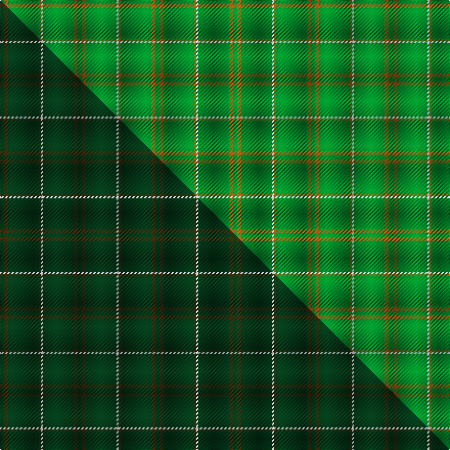

This is one **variant** — a specific cloth: this exact thread count and colourway, with its own
provenance below. It is one weaving of the [sett](/tartans/b/ba/bannockbane-hunting-2/) (the scale-free proportion — the
same cloth at any scale or shade), whose colour order is pattern [GRGRWGRG](/stripes/grgrwgrg/).

Part of the [Bannockbane Hunting](/tartans/b/ba/bannockbane-hunting-2/) tartan — the named design grouping this sett with its other cloths.

Sourced from weddslist.  It is a [8 stripe tartan](/stripes/stripes8/).

Original link [http://www.weddslist.com/cgi-bin/tartans/pg.pl?source=sts](http://www.weddslist.com/cgi-bin/tartans/pg.pl?source=sts)

Dataset <small>— provenance for this record, inherited from the source manifest</small>

<dl class="dataset-prov">
<dt>source</dt><dd><a href="/sources/weddslist/">Weddslist</a></dd>
<dt>data captured from</dt><dd><a href="https://github.com/thetartan/tartan-database/blob/master/data/weddslist/data.csv">https://github.com/thetartan/tartan-database/blob/master/data/weddslist/data.csv</a></dd>
<dt>data date</dt><dd>2016-11-17 <small>(dataset default)</small></dd>
<dt>licence</dt><dd><a href="https://creativecommons.org/licenses/by-nc-nd/4.0/">CC BY-NC-ND 4.0</a></dd>
</dl>

Capture chain <small>— the hands this data passed through, oldest first; each capture carries its own licence</small>

<ol class="capture-chain">
<li><a href="https://www.weddslist.com/tartans/">Weddslist</a> <small>the living privately compiled reference</small></li>
<li><a href="https://github.com/thetartan/tartan-database">thetartan/tartan-database</a> <small>2016-2017</small> · <a href="https://creativecommons.org/licenses/by-nc-nd/4.0/">CC BY-NC-ND 4.0</a> <small>Levko Kravets's frozen compilation — the capture we vendored, and where its CC licence text came from</small></li>
<li>this dictionary <small>captured 2026-06-10 · commit 5bf86c7566</small> <small>each re-capture is a git commit to data/sources</small></li>
</ol>

## Thread count
G/4 O4 G30 O2 W2 G30 O4 G/4

One full sett is **152 threads**.

## Palette
<table><thead><tr><th>Colour</th><th>Shade</th><th>OKLCh</th></tr></thead><tbody><tr><td>G</td><td><code style="background-color:#008B2A;">#008B2A</code> <small style="color:#888">#008B2A</small></td><td><small style="color:#888">oklch(55.4% 0.170 145.9)</small></td></tr><tr><td>W</td><td><code style="background-color:#F7F7F7;">#F7F7F7</code> <small style="color:#888">#F7F7F7</small></td><td><small style="color:#888">oklch(97.6% 0.000 89.9)</small></td></tr><tr><td>O</td><td><code style="background-color:#A65C11;">#A65C11</code> <small style="color:#888">#A65C11</small></td><td><small style="color:#888">oklch(55.0% 0.125 58.3)</small></td></tr></tbody></table>

# Sample pattern

## Compared to the master

This cloth is one sett of its design; the master sett (the exemplar the design is anchored on) is below for comparison.

Its **ΔTartan distance** from the master is **0.92** — the same measure the nearest-tartans table ranks by (0 is identical; a re-scale of the same cloth is near 0, a recolour or a different proportion further).

<figure class="master-compare" style="margin:0">

this sett
master sett ★

<figcaption style="color:#888;font-size:smaller">One weave of this sett against the <a href="/setts/dg2dy2dg15dy1w1dg15dy2dg2/">master sett ★</a>, split on the diagonal: a shared proportion runs seamlessly across it with only the shades shifting; a different proportion breaks on it.</figcaption>
</figure>

## Nearest tartan variants

The nearest existing variants by ΔTartan distance, with this cloth at the top so the swatches line up against it.

ΔTartan

Threads

Variant

Sett

—

152

<a href="/variants/s8/g2o2g15o1w1g15o2g2~x2/">Bannockbane, hunting</a>

<a href="/ttd/edit/#slug=g2dy2g15dy1w1g15dy2g2~x2&amp;base=g2o2g15o1w1g15o2g2~x2" title="compare in the TTD">0.90</a>

152

<a href="/variants/s8/g2dy2g15dy1w1g15dy2g2~x2/">Bannockbane Hunting Trade Tartan</a>

<a href="/ttd/edit/#slug=dg2dy2dg15dy1w1dg15dy2dg2~x2&amp;base=g2o2g15o1w1g15o2g2~x2" title="compare in the TTD">0.92</a>

152

<a href="/variants/s8/dg2dy2dg15dy1w1dg15dy2dg2~x2/">Bannockbane Hunting</a>

<a href="/ttd/edit/#slug=dt30dy2dt1w1dt10w1dt2dy2~x2&amp;base=g2o2g15o1w1g15o2g2~x2" title="compare in the TTD">1.79</a>

132

<a href="/variants/s8/dt30dy2dt1w1dt10w1dt2dy2~x2/">Royal Warrant Holders (Corporate)</a>

<a href="/ttd/edit/#slug=g5n9g4w5g30r2g4r2~x2&amp;base=g2o2g15o1w1g15o2g2~x2" title="compare in the TTD">1.79</a>

230

<a href="/variants/s8/g5n9g4w5g30r2g4r2~x2/">Welsh Assembly (Fashion)</a>

<a href="/ttd/edit/#slug=dg6dy2o1dg15o3dy1dg15g6o1~x2&amp;base=g2o2g15o1w1g15o2g2~x2" title="compare in the TTD">1.85</a>

186

<a href="/variants/s9/dg6dy2o1dg15o3dy1dg15g6o1~x2/">McCall, F W (Personal)</a>

<a href="/ttd/edit/#slug=g18r6g75db6g13o35g12db6&amp;base=g2o2g15o1w1g15o2g2~x2" title="compare in the TTD">1.87</a>

318

<a href="/variants/s8/g18r6g75db6g13o35g12db6/">Glenlivet</a>

<a href="/ttd/edit/#slug=o20g40w5g40o20g9~x2&amp;base=g2o2g15o1w1g15o2g2~x2" title="compare in the TTD">1.96</a>

478

<a href="/variants/s6/o20g40w5g40o20g9~x2/">O'Neill (Australia)</a>

<a href="/ttd/edit/#slug=dt4k2dt16k2dt16k1~x4&amp;base=g2o2g15o1w1g15o2g2~x2" title="compare in the TTD">2.11</a>

308

<a href="/variants/s6/dt4k2dt16k2dt16k1~x4/">Ben Dubh (The Black Mount)</a>

<a href="/ttd/edit/#slug=g46o20g9o20g46lg5~x2&amp;base=g2o2g15o1w1g15o2g2~x2" title="compare in the TTD">2.73</a>

482

<a href="/variants/s6/g46o20g9o20g46lg5~x2/">O'Neill, Red</a>

<a href="/ttd/edit/#slug=o1g1o5g8lg1g1lg1~x4&amp;base=g2o2g15o1w1g15o2g2~x2" title="compare in the TTD">2.96</a>

136

<a href="/variants/s7/o1g1o5g8lg1g1lg1~x4/">O'Neill Pipe Band 1983 (Corporate)</a>

## Neighbour map

Every grey dot is one of 13656 variants placed by the first two principal components of the ΔTartan feature space (42% of its variance). Red is this tartan; blue dots are its nearest — click one to open its page. The map is a flat projection of a many-dimensional space — [how to read it](/posts/neighbourhood-maps/).

<svg viewBox="0 0 640 380" role="img" style="max-width:100%;height:auto;border:1px solid #e0e0e0;border-radius:4px;display:block" xmlns="http://www.w3.org/2000/svg"><image href="/nn/cloud.v1.png" width="640" height="380"/><a href="/variants/s8/g2dy2g15dy1w1g15dy2g2~x2/"><circle cx="626.0" cy="217.4" r="4" fill="#3465a4"><title>Bannockbane Hunting Trade Tartan</title></circle></a><a href="/variants/s8/dg2dy2dg15dy1w1dg15dy2dg2~x2/"><circle cx="626.0" cy="243.2" r="4" fill="#3465a4"><title>Bannockbane Hunting</title></circle></a><a href="/variants/s8/dt30dy2dt1w1dt10w1dt2dy2~x2/"><circle cx="626.0" cy="165.4" r="4" fill="#3465a4"><title>Royal Warrant Holders (Corporate)</title></circle></a><a href="/variants/s8/g5n9g4w5g30r2g4r2~x2/"><circle cx="451.8" cy="184.3" r="4" fill="#3465a4"><title>Welsh Assembly (Fashion)</title></circle></a><a href="/variants/s9/dg6dy2o1dg15o3dy1dg15g6o1~x2/"><circle cx="516.1" cy="208.7" r="4" fill="#3465a4"><title>McCall, F W (Personal)</title></circle></a><a href="/variants/s8/g18r6g75db6g13o35g12db6/"><circle cx="470.7" cy="209.4" r="4" fill="#3465a4"><title>Glenlivet</title></circle></a><a href="/variants/s6/o20g40w5g40o20g9~x2/"><circle cx="462.5" cy="294.4" r="4" fill="#3465a4"><title>O'Neill (Australia)</title></circle></a><a href="/variants/s6/dt4k2dt16k2dt16k1~x4/"><circle cx="626.0" cy="230.7" r="4" fill="#3465a4"><title>Ben Dubh (The Black Mount)</title></circle></a><a href="/variants/s6/g46o20g9o20g46lg5~x2/"><circle cx="532.6" cy="298.8" r="4" fill="#3465a4"><title>O'Neill, Red</title></circle></a><a href="/variants/s7/o1g1o5g8lg1g1lg1~x4/"><circle cx="430.2" cy="258.2" r="4" fill="#3465a4"><title>O'Neill Pipe Band 1983 (Corporate)</title></circle></a><circle cx="626.0" cy="223.4" r="5" fill="#c00000"/><text x="320" y="376" text-anchor="middle" font-size="11" fill="#999">ground</text><text x="11" y="190" text-anchor="middle" font-size="11" fill="#999" transform="rotate(-90 11 190)">complexity</text></svg>

ID: /variants/s8/g2o2g15o1w1g15o2g2~x2/
