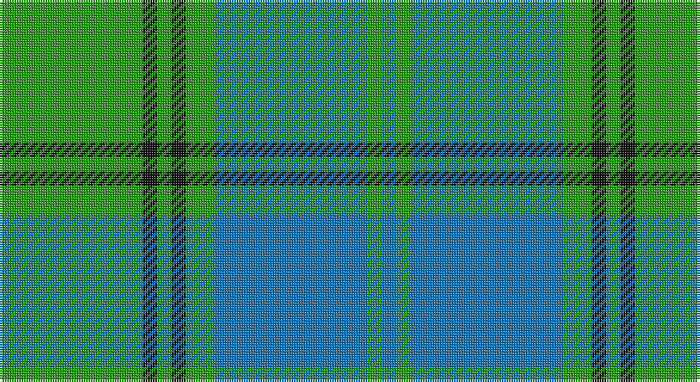

This page is one **sett** — a single exact thread-count. It belongs to the [tartan](/setts/g30k3g3k3g6b32g3b3/)
(the same proportion at any scale), whose colour order is pattern [BGBGKGKG](/stripes/bgbgkgkg/).

Part of the [Holmes](/tartans/holmes/) tartan — the named design grouping this sett with its other cloths.

Sourced from tartans-authority.  It is a [8 stripe tartan](/stripes/stripes8/).

Original link http://www.tartansauthority.com/tartan-ferret/display/125/

## Also known as

This cloth is also recorded under:

- Kennedy

## Register references

External register numbers recorded for this tartan.

- Scottish Tartans Authority (ITI): 125

## Thread count
Ga/60 K6 Ga6 K6 Ga12 B64 G6 B/6

One full sett is **266 threads**.

## Palette

Palette: <strong>Tartan Register</strong>
<table><thead><tr><th>Colour</th><th>Threads</th><th>Shade</th><th>Base</th><th>OKLCh</th></tr></thead><tbody><tr><td>Ga/</td><td style="text-align:right;font-variant-numeric:tabular-nums">60</td><td><code style="background-color:#289C18;">#289C18</code> <small style="color:#888">#289C18</small></td><td>G <code style="background-color:#006100;">#006100</code></td><td><small style="color:#888">oklch(60.6% 0.191 141.6)</small></td></tr><tr><td>K</td><td style="text-align:right;font-variant-numeric:tabular-nums">6</td><td><code style="background-color:#101010;">#101010</code> <small style="color:#888">#101010</small></td><td>K <code style="background-color:#000000;">#000000</code></td><td><small style="color:#888">oklch(17.3% 0.000 89.9)</small></td></tr><tr><td>Ga</td><td style="text-align:right;font-variant-numeric:tabular-nums">6</td><td><code style="background-color:#289C18;">#289C18</code> <small style="color:#888">#289C18</small></td><td>G <code style="background-color:#006100;">#006100</code></td><td><small style="color:#888">oklch(60.6% 0.191 141.6)</small></td></tr><tr><td>K</td><td style="text-align:right;font-variant-numeric:tabular-nums">6</td><td><code style="background-color:#101010;">#101010</code> <small style="color:#888">#101010</small></td><td>K <code style="background-color:#000000;">#000000</code></td><td><small style="color:#888">oklch(17.3% 0.000 89.9)</small></td></tr><tr><td>Ga</td><td style="text-align:right;font-variant-numeric:tabular-nums">12</td><td><code style="background-color:#289C18;">#289C18</code> <small style="color:#888">#289C18</small></td><td>G <code style="background-color:#006100;">#006100</code></td><td><small style="color:#888">oklch(60.6% 0.191 141.6)</small></td></tr><tr><td>B</td><td style="text-align:right;font-variant-numeric:tabular-nums">64</td><td><code style="background-color:#1474B4;">#1474B4</code> <small style="color:#888">#1474B4</small></td><td>B <code style="background-color:#2A418A;">#2A418A</code></td><td><small style="color:#888">oklch(54.0% 0.129 245.1)</small></td></tr><tr><td>G</td><td style="text-align:right;font-variant-numeric:tabular-nums">6</td><td><code style="background-color:#289C18;">#289C18</code> <small style="color:#888">#289C18</small></td><td>G <code style="background-color:#006100;">#006100</code></td><td><small style="color:#888">oklch(60.6% 0.191 141.6)</small></td></tr><tr><td>B/</td><td style="text-align:right;font-variant-numeric:tabular-nums">6</td><td><code style="background-color:#1474B4;">#1474B4</code> <small style="color:#888">#1474B4</small></td><td>B <code style="background-color:#2A418A;">#2A418A</code></td><td><small style="color:#888">oklch(54.0% 0.129 245.1)</small></td></tr></tbody></table>

# Sample pattern

## Compared to the master

This cloth is one sett of its design; the master sett (the exemplar the design is anchored on) is below for comparison.

<figure style="margin:0"><figcaption style="color:#888;font-size:smaller">this sett</figcaption></figure>
<figure style="margin:0"><figcaption style="color:#888;font-size:smaller"><a href="/setts/ly4g39db9k3db5k3db9g32r2g3r2g5ly2g3r3/">master sett →</a></figcaption></figure>

## Nearest tartans

The nearest existing variants by ΔTartan distance, with this tartan at the top so the swatches line up against it.

ΔTartan

Tartan

Sett

—

<a href="/ttd/edit/#slug=g30k3g3k3g6b32g3b3~x2">Holmes (Clan?)</a> <a class="nn-out" href="/variants/s8/g30k3g3k3g6b32g3b3~x2/" title="open its dictionary page">↗</a>

1.32

<a href="/ttd/edit/#slug=g28r2g2r2g8db24y3r2~x2&amp;base=g30k3g3k3g6b32g3b3~x2">Leatherneck, U.S.Marine Corps</a> <a class="nn-out" href="/variants/s8/g28r2g2r2g8db24y3r2~x2/" title="open its dictionary page">↗</a>

1.33

<a href="/ttd/edit/#slug=r2t1r1t11g16dg1w1~x2&amp;base=g30k3g3k3g6b32g3b3~x2">Gift of Life Michigan (Corporate)</a> <a class="nn-out" href="/variants/s7/r2t1r1t11g16dg1w1~x2/" title="open its dictionary page">↗</a>

1.38

<a href="/ttd/edit/#slug=g14db1g1db1g3db6gi12r2~x2&amp;base=g30k3g3k3g6b32g3b3~x2">Cranstoun Clan Tartan</a> <a class="nn-out" href="/variants/s8/g14db1g1db1g3db6gi12r2~x2/" title="open its dictionary page">↗</a>

1.43

<a href="/ttd/edit/#slug=k6g3k3g28b4g4b10g4b4g4b24g5w3~x2&amp;base=g30k3g3k3g6b32g3b3~x2">Mayhew (Personal)</a> <a class="nn-out" href="/variants/s13/k6g3k3g28b4g4b10g4b4g4b24g5w3~x2/" title="open its dictionary page">↗</a>

1.47

<a href="/ttd/edit/#slug=b12lo1b2lo1b3k5g10lo1g2~x4&amp;base=g30k3g3k3g6b32g3b3~x2">Marie Curie Fields Of Hope</a> <a class="nn-out" href="/variants/s9/b12lo1b2lo1b3k5g10lo1g2~x4/" title="open its dictionary page">↗</a>

1.47

<a href="/ttd/edit/#slug=k3r1ly1t11g13t5r1ly1~x4&amp;base=g30k3g3k3g6b32g3b3~x2">Snodgrass (Clan)</a> <a class="nn-out" href="/variants/s8/k3r1ly1t11g13t5r1ly1~x4/" title="open its dictionary page">↗</a>

1.49

<a href="/ttd/edit/#slug=g2r2t23db2t2db6t2db2g33r2t2~x2&amp;base=g30k3g3k3g6b32g3b3~x2">Maine State</a> <a class="nn-out" href="/variants/s11/g2r2t23db2t2db6t2db2g33r2t2~x2/" title="open its dictionary page">↗</a>

1.50

<a href="/ttd/edit/#slug=ly4g3r2g36b30k3b3k3~x2&amp;base=g30k3g3k3g6b32g3b3~x2">Chartered Accountants of Scotland</a> <a class="nn-out" href="/variants/s8/ly4g3r2g36b30k3b3k3~x2/" title="open its dictionary page">↗</a>

1.50

<a href="/ttd/edit/#slug=g6n2g25n4t25n2t6~x2&amp;base=g30k3g3k3g6b32g3b3~x2">Lennox Dress, Purple (Dance)</a> <a class="nn-out" href="/variants/s7/g6n2g25n4t25n2t6~x2/" title="open its dictionary page">↗</a>

1.51

<a href="/ttd/edit/#slug=db5ly2db17g14w1g1w1g4ly2~x2&amp;base=g30k3g3k3g6b32g3b3~x2">MacOrrell</a> <a class="nn-out" href="/variants/s9/db5ly2db17g14w1g1w1g4ly2~x2/" title="open its dictionary page">↗</a>

## Neighbour map

Every grey dot is one of 14360 variants placed by the first two principal components of the ΔTartan feature space (44% of its variance). Red is this tartan; blue dots are its nearest — click one to open its page.

<svg viewBox="0 0 640 380" role="img" style="max-width:100%;height:auto;border:1px solid #e0e0e0;border-radius:4px;display:block" xmlns="http://www.w3.org/2000/svg"><image href="/nn/cloud.v1.png" width="640" height="380"/><a href="/variants/s8/g28r2g2r2g8db24y3r2~x2/"><circle cx="340.8" cy="187.4" r="4" fill="#3465a4"><title>Leatherneck, U.S.Marine Corps</title></circle></a><a href="/variants/s7/r2t1r1t11g16dg1w1~x2/"><circle cx="289.0" cy="156.9" r="4" fill="#3465a4"><title>Gift of Life Michigan (Corporate)</title></circle></a><a href="/variants/s8/g14db1g1db1g3db6gi12r2~x2/"><circle cx="265.8" cy="195.1" r="4" fill="#3465a4"><title>Cranstoun Clan Tartan</title></circle></a><a href="/variants/s13/k6g3k3g28b4g4b10g4b4g4b24g5w3~x2/"><circle cx="281.2" cy="193.3" r="4" fill="#3465a4"><title>Mayhew (Personal)</title></circle></a><a href="/variants/s9/b12lo1b2lo1b3k5g10lo1g2~x4/"><circle cx="254.1" cy="193.5" r="4" fill="#3465a4"><title>Marie Curie Fields Of Hope</title></circle></a><a href="/variants/s8/k3r1ly1t11g13t5r1ly1~x4/"><circle cx="225.9" cy="163.8" r="4" fill="#3465a4"><title>Snodgrass (Clan)</title></circle></a><a href="/variants/s11/g2r2t23db2t2db6t2db2g33r2t2~x2/"><circle cx="288.8" cy="142.1" r="4" fill="#3465a4"><title>Maine State</title></circle></a><a href="/variants/s8/ly4g3r2g36b30k3b3k3~x2/"><circle cx="303.9" cy="159.7" r="4" fill="#3465a4"><title>Chartered Accountants of Scotland</title></circle></a><a href="/variants/s7/g6n2g25n4t25n2t6~x2/"><circle cx="314.4" cy="223.3" r="4" fill="#3465a4"><title>Lennox Dress, Purple (Dance)</title></circle></a><a href="/variants/s9/db5ly2db17g14w1g1w1g4ly2~x2/"><circle cx="281.9" cy="161.4" r="4" fill="#3465a4"><title>MacOrrell</title></circle></a><circle cx="293.5" cy="194.1" r="5" fill="#c00000"/></svg>

ID: /variants/s8/g30k3g3k3g6b32g3b3~x2/
