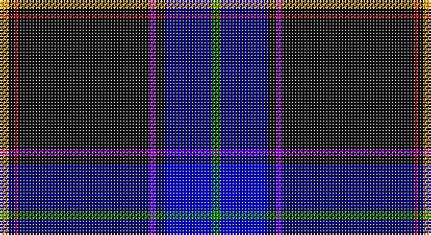

This page is one **sett** — a single exact thread-count. It belongs to the [tartan](/setts/g3db16k3p2k45r1k2lo3/)
(the same proportion at any scale), whose colour order is pattern [GBKBKRKY](/stripes/gbkbkrky/).

Sourced from register-of-tartans.  It is a [8 stripe tartan](/stripes/stripes8/).

Original link https://www.tartanregister.gov.uk/tartanDetails.aspx?ref=10436

## Register references

External register numbers recorded for this tartan.

- Scottish Register of Tartans: [10436](https://www.tartanregister.gov.uk/tartanDetails.aspx?ref=10436)

## Thread count
Y/6 K4 R2 K90 P4 K6 B32 G/6

One full sett is **288 threads**.

## Palette

Palette: <strong>Tartan Register</strong> <small style="color:#888">(5 of 6 colours)</small>
<table><thead><tr><th>Colour</th><th>Threads</th><th>Shade</th><th>Base</th><th>OKLCh</th></tr></thead><tbody><tr><td>Y/</td><td style="text-align:right;font-variant-numeric:tabular-nums">6</td><td><code style="background-color:#FFA500;">#FFA500</code> <small style="color:#888">#FFA500</small></td><td>Y <code style="background-color:#F2BF00;">#F2BF00</code></td><td><small style="color:#888">oklch(79.3% 0.171 70.7)</small></td></tr><tr><td>K</td><td style="text-align:right;font-variant-numeric:tabular-nums">4</td><td><code style="background-color:#101010;">#101010</code> <small style="color:#888">#101010</small></td><td>K <code style="background-color:#000000;">#000000</code></td><td><small style="color:#888">oklch(17.3% 0.000 89.9)</small></td></tr><tr><td>R</td><td style="text-align:right;font-variant-numeric:tabular-nums">2</td><td><code style="background-color:#FF0000;">#FF0000</code> <small style="color:#888">#FF0000</small></td><td>R <code style="background-color:#CC0000;">#CC0000</code></td><td><small style="color:#888">oklch(62.8% 0.258 29.2)</small></td></tr><tr><td>K</td><td style="text-align:right;font-variant-numeric:tabular-nums">90</td><td><code style="background-color:#101010;">#101010</code> <small style="color:#888">#101010</small></td><td>K <code style="background-color:#000000;">#000000</code></td><td><small style="color:#888">oklch(17.3% 0.000 89.9)</small></td></tr><tr><td>P</td><td style="text-align:right;font-variant-numeric:tabular-nums">4</td><td><code style="background-color:#AA00FF;">#AA00FF</code> <small style="color:#888">#AA00FF</small></td><td>B <code style="background-color:#2A418A;">#2A418A</code></td><td><small style="color:#888">oklch(58.1% 0.299 307.0)</small></td></tr><tr><td>K</td><td style="text-align:right;font-variant-numeric:tabular-nums">6</td><td><code style="background-color:#101010;">#101010</code> <small style="color:#888">#101010</small></td><td>K <code style="background-color:#000000;">#000000</code></td><td><small style="color:#888">oklch(17.3% 0.000 89.9)</small></td></tr><tr><td>B</td><td style="text-align:right;font-variant-numeric:tabular-nums">32</td><td><code style="background-color:#0000CD;">#0000CD</code> <small style="color:#888">#0000CD</small></td><td>B <code style="background-color:#2A418A;">#2A418A</code></td><td><small style="color:#888">oklch(38.3% 0.266 264.1)</small></td></tr><tr><td>G/</td><td style="text-align:right;font-variant-numeric:tabular-nums">6</td><td><code style="background-color:#008B00;">#008B00</code> <small style="color:#888">#008B00</small></td><td>G <code style="background-color:#006100;">#006100</code></td><td><small style="color:#888">oklch(55.2% 0.188 142.5)</small></td></tr></tbody></table>

# Sample pattern

## Nearest tartans

The nearest existing variants by ΔTartan distance, with this tartan at the top so the swatches line up against it.

ΔTartan

Tartan

Sett

—

<a href="/ttd/edit/#slug=g3db16k3p2k45r1k2lo3~x2">Cumnock</a> <a class="nn-out" href="/variants/s8/g3db16k3p2k45r1k2lo3~x2/" title="open its dictionary page">↗</a>

0.97

<a href="/ttd/edit/#slug=g3db16k3dp2k45r1k2lo3~x2&amp;base=g3db16k3p2k45r1k2lo3~x2">Cumnock (District)</a> <a class="nn-out" href="/variants/s8/g3db16k3dp2k45r1k2lo3~x2/" title="open its dictionary page">↗</a>

1.26

<a href="/ttd/edit/#slug=db60w1db6g10r1g7k2lo2w2~x2&amp;base=g3db16k3p2k45r1k2lo3~x2">Mohammed, Abu Hassan (Personal)</a> <a class="nn-out" href="/variants/s9/db60w1db6g10r1g7k2lo2w2~x2/" title="open its dictionary page">↗</a>

1.26

<a href="/variants/s10/db62r1db2r1db4k14g4ki2g6k4~x2/">Park</a>

1.28

<a href="/ttd/edit/#slug=db62r1db2r1db4k14g4w2g6k4~x2&amp;base=g3db16k3p2k45r1k2lo3~x2">Parr</a> <a class="nn-out" href="/variants/s10/db62r1db2r1db4k14g4w2g6k4~x2/" title="open its dictionary page">↗</a>

1.33

<a href="/ttd/edit/#slug=k53b3k2w1k2b3k5b32ly1r3~x2&amp;base=g3db16k3p2k45r1k2lo3~x2">Estonian National Tartan (District)</a> <a class="nn-out" href="/variants/s10/k53b3k2w1k2b3k5b32ly1r3~x2/" title="open its dictionary page">↗</a>

1.38

<a href="/ttd/edit/#slug=db46lyi1ly3dg13lyi1r7g3lyi1~x2&amp;base=g3db16k3p2k45r1k2lo3~x2">Victorian Highland Pipe Band Assoc</a> <a class="nn-out" href="/variants/s8/db46lyi1ly3dg13lyi1r7g3lyi1~x2/" title="open its dictionary page">↗</a>

1.40

<a href="/ttd/edit/#slug=k49r1lp4db5dg5ly5~x2&amp;base=g3db16k3p2k45r1k2lo3~x2">CREATeGlasgow</a> <a class="nn-out" href="/variants/s6/k49r1lp4db5dg5ly5~x2/" title="open its dictionary page">↗</a>

1.41

<a href="/ttd/edit/#slug=w3dt9ly1lb3dp9lb1dt40dp2~x2&amp;base=g3db16k3p2k45r1k2lo3~x2">Parkin</a> <a class="nn-out" href="/variants/s8/w3dt9ly1lb3dp9lb1dt40dp2~x2/" title="open its dictionary page">↗</a>

1.44

<a href="/ttd/edit/#slug=db108w6k10w3k3w3k3g12r12w4&amp;base=g3db16k3p2k45r1k2lo3~x2">Racing Stewart</a> <a class="nn-out" href="/variants/s10/db108w6k10w3k3w3k3g12r12w4/" title="open its dictionary page">↗</a>

1.47

<a href="/ttd/edit/#slug=g20r10ly2db100w1y10&amp;base=g3db16k3p2k45r1k2lo3~x2">Ravetta (Name)</a> <a class="nn-out" href="/variants/s6/g20r10ly2db100w1y10/" title="open its dictionary page">↗</a>

## Neighbour map

Every grey dot is one of 14360 variants placed by the first two principal components of the ΔTartan feature space (44% of its variance). Red is this tartan; blue dots are its nearest — click one to open its page.

<svg viewBox="0 0 640 380" role="img" style="max-width:100%;height:auto;border:1px solid #e0e0e0;border-radius:4px;display:block" xmlns="http://www.w3.org/2000/svg"><image href="/nn/cloud.v1.png" width="640" height="380"/><a href="/variants/s8/g3db16k3dp2k45r1k2lo3~x2/"><circle cx="438.3" cy="96.2" r="4" fill="#3465a4"><title>Cumnock (District)</title></circle></a><a href="/variants/s9/db60w1db6g10r1g7k2lo2w2~x2/"><circle cx="487.5" cy="77.3" r="4" fill="#3465a4"><title>Mohammed, Abu Hassan (Personal)</title></circle></a><a href="/variants/s10/db62r1db2r1db4k14g4ki2g6k4~x2/"><circle cx="457.3" cy="82.2" r="4" fill="#3465a4"><title>Park</title></circle></a><a href="/variants/s10/db62r1db2r1db4k14g4w2g6k4~x2/"><circle cx="450.6" cy="78.1" r="4" fill="#3465a4"><title>Parr</title></circle></a><a href="/variants/s10/k53b3k2w1k2b3k5b32ly1r3~x2/"><circle cx="408.9" cy="86.2" r="4" fill="#3465a4"><title>Estonian National Tartan (District)</title></circle></a><a href="/variants/s8/db46lyi1ly3dg13lyi1r7g3lyi1~x2/"><circle cx="390.7" cy="88.4" r="4" fill="#3465a4"><title>Victorian Highland Pipe Band Assoc</title></circle></a><a href="/variants/s6/k49r1lp4db5dg5ly5~x2/"><circle cx="432.9" cy="90.5" r="4" fill="#3465a4"><title>CREATeGlasgow</title></circle></a><a href="/variants/s8/w3dt9ly1lb3dp9lb1dt40dp2~x2/"><circle cx="473.4" cy="109.7" r="4" fill="#3465a4"><title>Parkin</title></circle></a><a href="/variants/s10/db108w6k10w3k3w3k3g12r12w4/"><circle cx="399.0" cy="77.2" r="4" fill="#3465a4"><title>Racing Stewart</title></circle></a><a href="/variants/s6/g20r10ly2db100w1y10/"><circle cx="469.7" cy="109.2" r="4" fill="#3465a4"><title>Ravetta (Name)</title></circle></a><circle cx="415.0" cy="86.6" r="5" fill="#c00000"/></svg>

ID: /variants/s8/g3db16k3p2k45r1k2lo3~x2/
