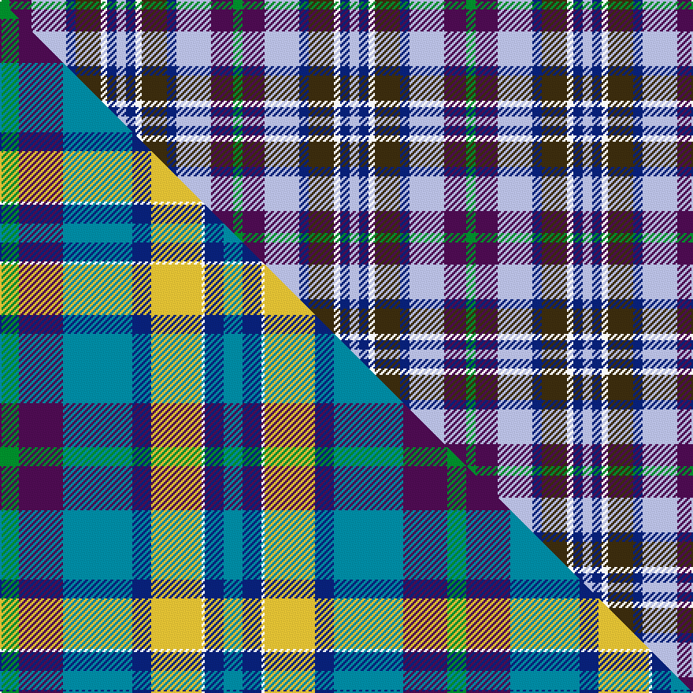

This is one **variant** — a specific cloth: this exact thread count and colourway, with its own
provenance below. It is one weaving of the [sett](/setts/g3dp7lb11db3dy8w2db3lb3/) (the scale-free proportion — the
same cloth at any scale or shade), whose colour order is pattern [GBWBGWBW](/stripes/gbwbgwbw/).

Part of the [Scotia](/tartans/s/sc/scotia-4/) tartan — the named design grouping this sett with its other cloths.

Sourced from house-of-tartan.  It is a [8 stripe tartan](/stripes/stripes8/).

Original link [http://www.house-of-tartan.scotland.net/house/TartanViewjs.asp?colr=Def&tnam=89](http://www.house-of-tartan.scotland.net/house/TartanViewjs.asp?colr=Def&tnam=89)

## Provenance

Earliest known date: 1968 Originally designed by James Allan of East Kilbride and woven by him in 1850. The sett was reconstructed by David Easton, Galashiels, as a National tartan for Scotland. It did not catch on and the tartan is rarely seen today.

Dataset <small>— provenance for this record, inherited from the source manifest</small>

<dl class="dataset-prov">
<dt>source</dt><dd><a href="/sources/house-of-tartan/">House of Tartan</a></dd>
<dt>data captured from</dt><dd><a href="https://github.com/thetartan/tartan-database/blob/master/data/house-of-tartan/data.csv">https://github.com/thetartan/tartan-database/blob/master/data/house-of-tartan/data.csv</a></dd>
<dt>data date</dt><dd>1968 <small>(this record)</small></dd>
<dt>licence</dt><dd><a href="https://creativecommons.org/licenses/by-nc-nd/4.0/">CC BY-NC-ND 4.0</a></dd>
</dl>

Capture chain <small>— the hands this data passed through, oldest first; each capture carries its own licence</small>

<ol class="capture-chain">
<li><a href="http://www.house-of-tartan.scotland.net/">House of Tartan</a> <small>the weaver/retailer's database — the site is now offline; the URL is kept as the ultimate source's identity</small></li>
<li><a href="https://github.com/thetartan/tartan-database">thetartan/tartan-database</a> <small>2016-2017</small> · <a href="https://creativecommons.org/licenses/by-nc-nd/4.0/">CC BY-NC-ND 4.0</a> <small>Levko Kravets's frozen compilation — the capture we vendored, and where its CC licence text came from</small></li>
<li>this dictionary <small>captured 2026-06-10 · commit 5bf86c7566</small> <small>each re-capture is a git commit to data/sources</small></li>
</ol>

## Thread count
G/6 DP14 LB22 DB6 DY16 W4 DB6 LB/6

One full sett is **148 threads**.

## Palette
<table><thead><tr><th>Colour</th><th>Shade</th><th>OKLCh</th></tr></thead><tbody><tr><td>LB</td><td><code style="background-color:#B5BBDE;">#B5BBDE</code> <small style="color:#888">#B5BBDE</small></td><td><small style="color:#888">oklch(79.9% 0.050 277.6)</small></td></tr><tr><td>DB</td><td><code style="background-color:#082077;">#082077</code> <small style="color:#888">#082077</small></td><td><small style="color:#888">oklch(30.0% 0.149 265.1)</small></td></tr><tr><td>G</td><td><code style="background-color:#008B2A;">#008B2A</code> <small style="color:#888">#008B2A</small></td><td><small style="color:#888">oklch(55.4% 0.170 145.9)</small></td></tr><tr><td>W</td><td><code style="background-color:#F7F7F7;">#F7F7F7</code> <small style="color:#888">#F7F7F7</small></td><td><small style="color:#888">oklch(97.6% 0.000 89.9)</small></td></tr><tr><td>DP</td><td><code style="background-color:#4B0B4F;">#4B0B4F</code> <small style="color:#888">#4B0B4F</small></td><td><small style="color:#888">oklch(30.1% 0.125 325.4)</small></td></tr><tr><td>DY</td><td><code style="background-color:#3A2B0D;">#3A2B0D</code> <small style="color:#888">#3A2B0D</small></td><td><small style="color:#888">oklch(30.0% 0.049 82.0)</small></td></tr></tbody></table>

# Sample pattern

## Compared to the master

This cloth is one sett of its design; the master sett (the exemplar the design is anchored on) is below for comparison.

Its **ΔTartan distance** from the master is **0.67** — the same measure the nearest-tartans table ranks by (0 is identical; a re-scale of the same cloth is near 0, a recolour or a different proportion further).

<figure class="master-compare" style="margin:0">

this sett
master sett ★

<figcaption style="color:#888;font-size:smaller">One weave of this sett against the <a href="/setts/g6dp14t22db6ly16w1db6t6/">master sett ★</a>, split on the diagonal: a shared proportion runs seamlessly across it with only the shades shifting; a different proportion breaks on it.</figcaption>
</figure>

## Nearest tartan variants

The nearest existing variants by ΔTartan distance, with this cloth at the top so the swatches line up against it.

ΔTartan

Threads

Variant

Sett

—

148

<a href="/variants/s8/g3dp7lb11db3dy8w2db3lb3~x2/">Scotia Trade Tartan</a>

<a href="/ttd/edit/#slug=g3dp7b11db3o8w2db3b3~x2&amp;base=g3dp7lb11db3dy8w2db3lb3~x2" title="compare in the TTD">1.40</a>

148

<a href="/variants/s8/g3dp7b11db3o8w2db3b3~x2/">Scotia</a>

<a href="/ttd/edit/#slug=w8db5dbi30lb4db13lb13g5ly5~x2~db1004274-dbi1406275&amp;base=g3dp7lb11db3dy8w2db3lb3~x2" title="compare in the TTD">2.30</a>

306

<a href="/variants/s8/w8db5dbi30lb4db13lb13g5ly5~x2~db1004274-dbi1406275/">Waterford County Crest (Fashion)</a>

<a href="/ttd/edit/#slug=w8db5dbi30lb4db13lb13g5dy5~x2~db1004274-dbi1406275&amp;base=g3dp7lb11db3dy8w2db3lb3~x2" title="compare in the TTD">2.53</a>

306

<a href="/variants/s8/w8db5dbi30lb4db13lb13g5dy5~x2~db1004274-dbi1406275/">Waterford County, Crest Range</a>

<a href="/ttd/edit/#slug=db2g2db11n2w8lb12ly2lb2~x2&amp;base=g3dp7lb11db3dy8w2db3lb3~x2" title="compare in the TTD">2.91</a>

156

<a href="/variants/s8/db2g2db11n2w8lb12ly2lb2~x2/">Elora (District)</a>

<a href="/ttd/edit/#slug=lb8dbi11w3dbi11db12g10dr2~x2~dbi1404245-db1106275&amp;base=g3dp7lb11db3dy8w2db3lb3~x2" title="compare in the TTD">3.00</a>

208

<a href="/variants/s7/lb8dbi11w3dbi11db12g10dr2~x2~dbi1404245-db1106275/">Loch Katrine</a>

<a href="/ttd/edit/#slug=lb14db9lb14lo4g3lbi3g3lo4db14lo2w3~x2~lb3203246-lbi3300000&amp;base=g3dp7lb11db3dy8w2db3lb3~x2" title="compare in the TTD">3.05</a>

258

<a href="/variants/s11/lb14db9lb14lo4g3lbi3g3lo4db14lo2w3~x2~lb3203246-lbi3300000/">Bouguet, Adrian (Personal)</a>

<a href="/ttd/edit/#slug=db5dy2dg4n3w1lb5~x8&amp;base=g3dp7lb11db3dy8w2db3lb3~x2" title="compare in the TTD">3.11</a>

240

<a href="/variants/s6/db5dy2dg4n3w1lb5~x8/">Heriot Bay Local (Quadra Island, British Columbia)</a>

<a href="/ttd/edit/#slug=lb18t18k10w3dy15y3ly8~x2~t2503227-k0705267&amp;base=g3dp7lb11db3dy8w2db3lb3~x2" title="compare in the TTD">3.19</a>

248

<a href="/variants/s7/lb18t18db10w3dy15y3ly8~x2~t2503227-db0705267/">Isle of Jura</a>

<a href="/ttd/edit/#slug=do4dbi2dy8dbi8db9lo2db9dbi8w4ly4w12ly2w4~x2~dbi1605267-db0804274&amp;base=g3dp7lb11db3dy8w2db3lb3~x2" title="compare in the TTD">3.41</a>

288

<a href="/variants/s13/do4dbi2dy8dbi8db9lo2db9dbi8w4ly4w12ly2w4~x2~dbi1605267-db0804274/">Unidentified Gordon variant</a>

<a href="/ttd/edit/#slug=g4do21ly10do5ly4dr4db10g6db30w4~x2&amp;base=g3dp7lb11db3dy8w2db3lb3~x2" title="compare in the TTD">3.47</a>

376

<a href="/variants/s10/g4do21ly10do5ly4dr4db10g6db30w4~x2/">State Seal of Arizona (Fashion)</a>

## Neighbour map

Every grey dot is one of 13621 variants placed by the first two principal components of the ΔTartan feature space (42% of its variance). Red is this tartan; blue dots are its nearest — click one to open its page.

<svg viewBox="0 0 640 380" role="img" style="max-width:100%;height:auto;border:1px solid #e0e0e0;border-radius:4px;display:block" xmlns="http://www.w3.org/2000/svg"><image href="/nn/cloud.v1.png" width="640" height="380"/><a href="/variants/s8/g3dp7b11db3o8w2db3b3~x2/"><circle cx="123.5" cy="232.0" r="4" fill="#3465a4"><title>Scotia</title></circle></a><a href="/variants/s8/w8db5dbi30lb4db13lb13g5ly5~x2~db1004274-dbi1406275/"><circle cx="138.8" cy="207.0" r="4" fill="#3465a4"><title>Waterford County Crest (Fashion)</title></circle></a><a href="/variants/s8/w8db5dbi30lb4db13lb13g5dy5~x2~db1004274-dbi1406275/"><circle cx="136.7" cy="203.7" r="4" fill="#3465a4"><title>Waterford County, Crest Range</title></circle></a><a href="/variants/s8/db2g2db11n2w8lb12ly2lb2~x2/"><circle cx="127.5" cy="211.1" r="4" fill="#3465a4"><title>Elora (District)</title></circle></a><a href="/variants/s7/lb8dbi11w3dbi11db12g10dr2~x2~dbi1404245-db1106275/"><circle cx="127.4" cy="260.8" r="4" fill="#3465a4"><title>Loch Katrine</title></circle></a><a href="/variants/s11/lb14db9lb14lo4g3lbi3g3lo4db14lo2w3~x2~lb3203246-lbi3300000/"><circle cx="142.8" cy="204.4" r="4" fill="#3465a4"><title>Bouguet, Adrian (Personal)</title></circle></a><a href="/variants/s6/db5dy2dg4n3w1lb5~x8/"><circle cx="60.7" cy="273.9" r="4" fill="#3465a4"><title>Heriot Bay Local (Quadra Island, British Columbia)</title></circle></a><a href="/variants/s7/lb18t18db10w3dy15y3ly8~x2~t2503227-db0705267/"><circle cx="44.7" cy="231.9" r="4" fill="#3465a4"><title>Isle of Jura</title></circle></a><a href="/variants/s13/do4dbi2dy8dbi8db9lo2db9dbi8w4ly4w12ly2w4~x2~dbi1605267-db0804274/"><circle cx="22.2" cy="202.7" r="4" fill="#3465a4"><title>Unidentified Gordon variant</title></circle></a><a href="/variants/s10/g4do21ly10do5ly4dr4db10g6db30w4~x2/"><circle cx="169.1" cy="191.1" r="4" fill="#3465a4"><title>State Seal of Arizona (Fashion)</title></circle></a><circle cx="105.4" cy="233.6" r="5" fill="#c00000"/><text x="320" y="376" text-anchor="middle" font-size="11" fill="#999">ground</text><text x="11" y="190" text-anchor="middle" font-size="11" fill="#999" transform="rotate(-90 11 190)">complexity</text></svg>

ID: /variants/s8/g3dp7lb11db3dy8w2db3lb3~x2/
