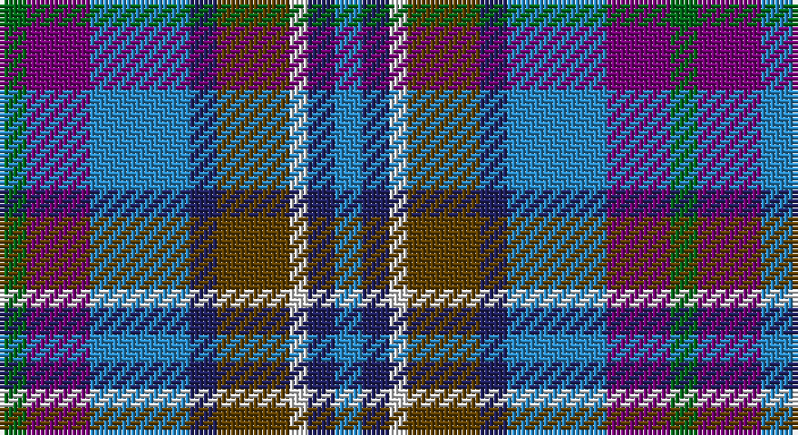

This page is one **sett** — a single exact thread-count. It belongs to the [tartan](/setts/g3dp7t11db3dy8w2db3t3/)
(the same proportion at any scale), whose colour order is pattern [BBWGBBBG](/stripes/bbwgbbbg/).

Part of the [Scotia](/tartans/scotia/) tartan — the named design grouping this sett with its other cloths.

Sourced from house-of-tartan.  It is a [8 stripe tartan](/stripes/stripes8/).

Original link http://www.house-of-tartan.scotland.net/house/TartanViewjs.asp?colr=Def&tnam=89

## Provenance

Earliest known date: 1968 Originally designed by James Allan of East Kilbride and woven by him in 1850. The sett was reconstructed by David Easton, Galashiels, as a National tartan for Scotland. It did not catch on and the tartan is rarely seen today.

## Thread count
G/6 P14 B22 DB6 T16 LN4 DB6 B/6

One full sett is **148 threads**.

## Palette

Palette: <strong>Tartan Register</strong>
<table><thead><tr><th>Colour</th><th>Threads</th><th>Shade</th><th>Base</th><th>OKLCh</th></tr></thead><tbody><tr><td>G/</td><td style="text-align:right;font-variant-numeric:tabular-nums">6</td><td><code style="background-color:#006818;">#006818</code> <small style="color:#888">#006818</small></td><td>G <code style="background-color:#006100;">#006100</code></td><td><small style="color:#888">oklch(45.0% 0.142 145.0)</small></td></tr><tr><td>P</td><td style="text-align:right;font-variant-numeric:tabular-nums">14</td><td><code style="background-color:#780078;">#780078</code> <small style="color:#888">#780078</small></td><td>B <code style="background-color:#2A418A;">#2A418A</code></td><td><small style="color:#888">oklch(40.2% 0.185 328.4)</small></td></tr><tr><td>B</td><td style="text-align:right;font-variant-numeric:tabular-nums">22</td><td><code style="background-color:#2888C4;">#2888C4</code> <small style="color:#888">#2888C4</small></td><td>B <code style="background-color:#2A418A;">#2A418A</code></td><td><small style="color:#888">oklch(60.1% 0.125 241.5)</small></td></tr><tr><td>DB</td><td style="text-align:right;font-variant-numeric:tabular-nums">6</td><td><code style="background-color:#202060;">#202060</code> <small style="color:#888">#202060</small></td><td>B <code style="background-color:#2A418A;">#2A418A</code></td><td><small style="color:#888">oklch(28.9% 0.111 276.9)</small></td></tr><tr><td>T</td><td style="text-align:right;font-variant-numeric:tabular-nums">16</td><td><code style="background-color:#604000;">#604000</code> <small style="color:#888">#604000</small></td><td>G <code style="background-color:#006100;">#006100</code></td><td><small style="color:#888">oklch(39.8% 0.083 76.8)</small></td></tr><tr><td>LN</td><td style="text-align:right;font-variant-numeric:tabular-nums">4</td><td><code style="background-color:#E0E0E0;">#E0E0E0</code> <small style="color:#888">#E0E0E0</small></td><td>W <code style="background-color:#F7F7F7;">#F7F7F7</code></td><td><small style="color:#888">oklch(90.7% 0.000 89.9)</small></td></tr><tr><td>DB</td><td style="text-align:right;font-variant-numeric:tabular-nums">6</td><td><code style="background-color:#202060;">#202060</code> <small style="color:#888">#202060</small></td><td>B <code style="background-color:#2A418A;">#2A418A</code></td><td><small style="color:#888">oklch(28.9% 0.111 276.9)</small></td></tr><tr><td>B/</td><td style="text-align:right;font-variant-numeric:tabular-nums">6</td><td><code style="background-color:#2888C4;">#2888C4</code> <small style="color:#888">#2888C4</small></td><td>B <code style="background-color:#2A418A;">#2A418A</code></td><td><small style="color:#888">oklch(60.1% 0.125 241.5)</small></td></tr></tbody></table>

# Sample pattern

## Compared to the master

This cloth is one sett of its design; the master sett (the exemplar the design is anchored on) is below for comparison.

<figure style="margin:0"><figcaption style="color:#888;font-size:smaller">this sett</figcaption></figure>
<figure style="margin:0"><figcaption style="color:#888;font-size:smaller"><a href="/setts/db58g28dy4w18db14r3db8k4db8r3db14w18dy4g28db58w4/">master sett →</a></figcaption></figure>

## Nearest tartans

The nearest existing variants by ΔTartan distance, with this tartan at the top so the swatches line up against it.

ΔTartan

Tartan

Sett

—

<a href="/ttd/edit/#slug=g3dp7t11db3dy8w2db3t3~x2">Scotia Trade Tartan</a> <a class="nn-out" href="/variants/s8/g3dp7t11db3dy8w2db3t3~x2/" title="open its dictionary page">↗</a>

0.78

<a href="/ttd/edit/#slug=g3p7b11db3o8w2db3b3~x2&amp;base=g3dp7t11db3dy8w2db3t3~x2">Scotia</a> <a class="nn-out" href="/variants/s8/g3p7b11db3o8w2db3b3~x2/" title="open its dictionary page">↗</a>

1.15

<a href="/ttd/edit/#slug=g4t2g9k4g2r6db12w2~x2&amp;base=g3dp7t11db3dy8w2db3t3~x2">Cherokee</a> <a class="nn-out" href="/variants/s8/g4t2g9k4g2r6db12w2~x2/" title="open its dictionary page">↗</a>

1.19

<a href="/ttd/edit/#slug=w8dbi5db30lr4dbi13lr13g5lo5~x2&amp;base=g3dp7t11db3dy8w2db3t3~x2">Waterford County Crest (Fashion)</a> <a class="nn-out" href="/variants/s8/w8dbi5db30lr4dbi13lr13g5lo5~x2/" title="open its dictionary page">↗</a>

1.25

<a href="/ttd/edit/#slug=db4t8k2t5lb2t5dg8dr7dg2dr7dg3~x2&amp;base=g3dp7t11db3dy8w2db3t3~x2">DunBroch</a> <a class="nn-out" href="/variants/s11/db4t8k2t5lb2t5dg8dr7dg2dr7dg3~x2/" title="open its dictionary page">↗</a>

1.26

<a href="/ttd/edit/#slug=w3t2n14o8t14db16n13t2w3~x2&amp;base=g3dp7t11db3dy8w2db3t3~x2">Caitriot</a> <a class="nn-out" href="/variants/s9/w3t2n14o8t14db16n13t2w3~x2/" title="open its dictionary page">↗</a>

1.26

<a href="/ttd/edit/#slug=y12k3w3k3w3k3y13n6db17r3~x2&amp;base=g3dp7t11db3dy8w2db3t3~x2">Mitsukoshi</a> <a class="nn-out" href="/variants/s10/y12k3w3k3w3k3y13n6db17r3~x2/" title="open its dictionary page">↗</a>

1.27

<a href="/ttd/edit/#slug=o5db4ly1db4k4dy4w1~x4&amp;base=g3dp7t11db3dy8w2db3t3~x2">Devon Companion</a> <a class="nn-out" href="/variants/s7/o5db4ly1db4k4dy4w1~x4/" title="open its dictionary page">↗</a>

1.28

<a href="/ttd/edit/#slug=dp2b6n1b3lb1b4k6g5k1g5dp2~x4&amp;base=g3dp7t11db3dy8w2db3t3~x2">Smithers (Name)</a> <a class="nn-out" href="/variants/s11/dp2b6n1b3lb1b4k6g5k1g5dp2~x4/" title="open its dictionary page">↗</a>

1.29

<a href="/ttd/edit/#slug=r9dt6db13dt21y18w4~x2&amp;base=g3dp7t11db3dy8w2db3t3~x2">Fox-Eves Wedding</a> <a class="nn-out" href="/variants/s6/r9dt6db13dt21y18w4~x2/" title="open its dictionary page">↗</a>

1.31

<a href="/ttd/edit/#slug=w3t2n14lr8t14db16n13t2w3~x2&amp;base=g3dp7t11db3dy8w2db3t3~x2">Caitriot</a> <a class="nn-out" href="/variants/s9/w3t2n14lr8t14db16n13t2w3~x2/" title="open its dictionary page">↗</a>

## Neighbour map

Every grey dot is one of 14360 variants placed by the first two principal components of the ΔTartan feature space (44% of its variance). Red is this tartan; blue dots are its nearest — click one to open its page.

<svg viewBox="0 0 640 380" role="img" style="max-width:100%;height:auto;border:1px solid #e0e0e0;border-radius:4px;display:block" xmlns="http://www.w3.org/2000/svg"><image href="/nn/cloud.v1.png" width="640" height="380"/><a href="/variants/s8/g3p7b11db3o8w2db3b3~x2/"><circle cx="79.1" cy="202.8" r="4" fill="#3465a4"><title>Scotia</title></circle></a><a href="/variants/s8/g4t2g9k4g2r6db12w2~x2/"><circle cx="90.2" cy="192.1" r="4" fill="#3465a4"><title>Cherokee</title></circle></a><a href="/variants/s8/w8dbi5db30lr4dbi13lr13g5lo5~x2/"><circle cx="99.2" cy="172.9" r="4" fill="#3465a4"><title>Waterford County Crest (Fashion)</title></circle></a><a href="/variants/s11/db4t8k2t5lb2t5dg8dr7dg2dr7dg3~x2/"><circle cx="55.5" cy="223.5" r="4" fill="#3465a4"><title>DunBroch</title></circle></a><a href="/variants/s9/w3t2n14o8t14db16n13t2w3~x2/"><circle cx="135.9" cy="205.0" r="4" fill="#3465a4"><title>Caitriot</title></circle></a><a href="/variants/s10/y12k3w3k3w3k3y13n6db17r3~x2/"><circle cx="96.5" cy="176.8" r="4" fill="#3465a4"><title>Mitsukoshi</title></circle></a><a href="/variants/s7/o5db4ly1db4k4dy4w1~x4/"><circle cx="52.9" cy="231.6" r="4" fill="#3465a4"><title>Devon Companion</title></circle></a><a href="/variants/s11/dp2b6n1b3lb1b4k6g5k1g5dp2~x4/"><circle cx="96.4" cy="208.0" r="4" fill="#3465a4"><title>Smithers (Name)</title></circle></a><a href="/variants/s6/r9dt6db13dt21y18w4~x2/"><circle cx="123.0" cy="255.8" r="4" fill="#3465a4"><title>Fox-Eves Wedding</title></circle></a><a href="/variants/s9/w3t2n14lr8t14db16n13t2w3~x2/"><circle cx="113.8" cy="194.8" r="4" fill="#3465a4"><title>Caitriot</title></circle></a><circle cx="86.2" cy="212.3" r="5" fill="#c00000"/></svg>

ID: /variants/s8/g3dp7t11db3dy8w2db3t3~x2/
