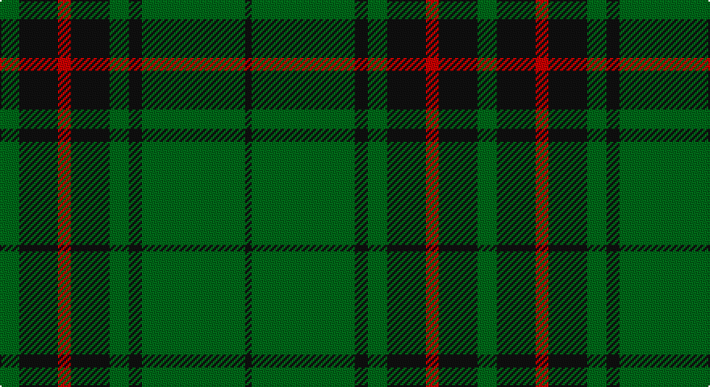

This page is one **sett** — a single exact thread-count. It belongs to the [tartan](/setts/g3k6r2k6g3k2g16k1/)
(the same proportion at any scale), whose colour order is pattern [GKRKGKGK](/stripes/gkrkgkgk/).

Sourced from register-of-tartans.  It is a [8 stripe tartan](/stripes/stripes8/).

Original link https://www.tartanregister.gov.uk/tartanDetails.aspx?ref=1405

2 attestations — the source records this cloth was collapsed from (oldest owns this page)

<ul>
<li>01/01/1983 — Glenbarr (register-of-tartans, <a href="https://www.tartanregister.gov.uk/tartanDetails.aspx?ref=1405">record</a>)</li>
<li>pre 2007 — Glenbarr (Corporate) (tartans-authority, <a href="http://www.tartansauthority.com/tartan-ferret/display/7366/">record</a>)</li>
</ul>

## Register references

External register numbers recorded for this tartan.

- Scottish Register of Tartans: [1405](https://www.tartanregister.gov.uk/tartanDetails.aspx?ref=1405)
- Scottish Tartans Authority (ITI): 7366
- Scottish Tartans World Register: 2785

## Thread count
G/12 K24 R8 K24 G12 K8 G64 K/4

One full sett is **296 threads**.

## Palette

Palette: <strong>Tartan Register</strong>
<table><thead><tr><th>Colour</th><th>Threads</th><th>Shade</th><th>Base</th><th>OKLCh</th></tr></thead><tbody><tr><td>G/</td><td style="text-align:right;font-variant-numeric:tabular-nums">12</td><td><code style="background-color:#006818;">#006818</code> <small style="color:#888">#006818</small></td><td>G <code style="background-color:#006100;">#006100</code></td><td><small style="color:#888">oklch(45.0% 0.142 145.0)</small></td></tr><tr><td>K</td><td style="text-align:right;font-variant-numeric:tabular-nums">24</td><td><code style="background-color:#101010;">#101010</code> <small style="color:#888">#101010</small></td><td>K <code style="background-color:#000000;">#000000</code></td><td><small style="color:#888">oklch(17.3% 0.000 89.9)</small></td></tr><tr><td>R</td><td style="text-align:right;font-variant-numeric:tabular-nums">8</td><td><code style="background-color:#C80000;">#C80000</code> <small style="color:#888">#C80000</small></td><td>R <code style="background-color:#CC0000;">#CC0000</code></td><td><small style="color:#888">oklch(52.3% 0.215 29.2)</small></td></tr><tr><td>K</td><td style="text-align:right;font-variant-numeric:tabular-nums">24</td><td><code style="background-color:#101010;">#101010</code> <small style="color:#888">#101010</small></td><td>K <code style="background-color:#000000;">#000000</code></td><td><small style="color:#888">oklch(17.3% 0.000 89.9)</small></td></tr><tr><td>G</td><td style="text-align:right;font-variant-numeric:tabular-nums">12</td><td><code style="background-color:#006818;">#006818</code> <small style="color:#888">#006818</small></td><td>G <code style="background-color:#006100;">#006100</code></td><td><small style="color:#888">oklch(45.0% 0.142 145.0)</small></td></tr><tr><td>K</td><td style="text-align:right;font-variant-numeric:tabular-nums">8</td><td><code style="background-color:#101010;">#101010</code> <small style="color:#888">#101010</small></td><td>K <code style="background-color:#000000;">#000000</code></td><td><small style="color:#888">oklch(17.3% 0.000 89.9)</small></td></tr><tr><td>G</td><td style="text-align:right;font-variant-numeric:tabular-nums">64</td><td><code style="background-color:#006818;">#006818</code> <small style="color:#888">#006818</small></td><td>G <code style="background-color:#006100;">#006100</code></td><td><small style="color:#888">oklch(45.0% 0.142 145.0)</small></td></tr><tr><td>K/</td><td style="text-align:right;font-variant-numeric:tabular-nums">4</td><td><code style="background-color:#101010;">#101010</code> <small style="color:#888">#101010</small></td><td>K <code style="background-color:#000000;">#000000</code></td><td><small style="color:#888">oklch(17.3% 0.000 89.9)</small></td></tr></tbody></table>

# Sample pattern

## Nearest tartans

The nearest existing variants by ΔTartan distance, with this tartan at the top so the swatches line up against it.

ΔTartan

Tartan

Sett

—

<a href="/ttd/edit/#slug=g3k6r2k6g3k2g16k1~x4">Glenbarr</a> <a class="nn-out" href="/variants/s8/g3k6r2k6g3k2g16k1~x4/" title="open its dictionary page">↗</a>

0.51

<a href="/ttd/edit/#slug=k22g5k2g5k11g33k2r4~x2&amp;base=g3k6r2k6g3k2g16k1~x4">MacArthur-Fox 1993 (Personal)</a> <a class="nn-out" href="/variants/s8/k22g5k2g5k11g33k2r4~x2/" title="open its dictionary page">↗</a>

0.96

<a href="/ttd/edit/#slug=g70k26g12k14db3k16~x2&amp;base=g3k6r2k6g3k2g16k1~x4">Duchess of Fife #2</a> <a class="nn-out" href="/variants/s6/g70k26g12k14db3k16~x2/" title="open its dictionary page">↗</a>

0.97

<a href="/ttd/edit/#slug=k13g3k4g3k3g19lo1g19k3g2lo4~x2&amp;base=g3k6r2k6g3k2g16k1~x4">American Monahan (Personal)</a> <a class="nn-out" href="/variants/s11/k13g3k4g3k3g19lo1g19k3g2lo4~x2/" title="open its dictionary page">↗</a>

0.98

<a href="/ttd/edit/#slug=gi18k3gi3k3gi3k21g2k21gi21k4~x2&amp;base=g3k6r2k6g3k2g16k1~x4">Guildry of Stirling</a> <a class="nn-out" href="/variants/s10/gi18k3gi3k3gi3k21g2k21gi21k4~x2/" title="open its dictionary page">↗</a>

1.00

<a href="/ttd/edit/#slug=lo1dg11k6dg3lo1dg1lo1~x4&amp;base=g3k6r2k6g3k2g16k1~x4">Angle, Green (Fashion)</a> <a class="nn-out" href="/variants/s7/lo1dg11k6dg3lo1dg1lo1~x4/" title="open its dictionary page">↗</a>

1.18

<a href="/ttd/edit/#slug=r4g4k2g31k10ly3g5k11g6k3~x2&amp;base=g3k6r2k6g3k2g16k1~x4">MacArthur-Fox Green</a> <a class="nn-out" href="/variants/s10/r4g4k2g31k10ly3g5k11g6k3~x2/" title="open its dictionary page">↗</a>

1.20

<a href="/ttd/edit/#slug=k6db1k6g4k10g20r2~x2&amp;base=g3k6r2k6g3k2g16k1~x4">MacKinross</a> <a class="nn-out" href="/variants/s7/k6db1k6g4k10g20r2~x2/" title="open its dictionary page">↗</a>

1.23

<a href="/ttd/edit/#slug=r1dg16k8dg4k4ly1~x2&amp;base=g3k6r2k6g3k2g16k1~x4">Forbes #6</a> <a class="nn-out" href="/variants/s6/r1dg16k8dg4k4ly1~x2/" title="open its dictionary page">↗</a>

1.23

<a href="/ttd/edit/#slug=r3g30k12g6k16ly2~x2&amp;base=g3k6r2k6g3k2g16k1~x4">MacArthur (Variant)</a> <a class="nn-out" href="/variants/s6/r3g30k12g6k16ly2~x2/" title="open its dictionary page">↗</a>

1.26

<a href="/ttd/edit/#slug=r3g20k20g20lo2g2lo2~x2&amp;base=g3k6r2k6g3k2g16k1~x4">Paton (Personal)</a> <a class="nn-out" href="/variants/s7/r3g20k20g20lo2g2lo2~x2/" title="open its dictionary page">↗</a>

## Neighbour map

Every grey dot is one of 14360 variants placed by the first two principal components of the ΔTartan feature space (44% of its variance). Red is this tartan; blue dots are its nearest — click one to open its page.

<svg viewBox="0 0 640 380" role="img" style="max-width:100%;height:auto;border:1px solid #e0e0e0;border-radius:4px;display:block" xmlns="http://www.w3.org/2000/svg"><image href="/nn/cloud.v1.png" width="640" height="380"/><a href="/variants/s8/k22g5k2g5k11g33k2r4~x2/"><circle cx="362.4" cy="209.2" r="4" fill="#3465a4"><title>MacArthur-Fox 1993 (Personal)</title></circle></a><a href="/variants/s6/g70k26g12k14db3k16~x2/"><circle cx="419.6" cy="222.1" r="4" fill="#3465a4"><title>Duchess of Fife #2</title></circle></a><a href="/variants/s11/k13g3k4g3k3g19lo1g19k3g2lo4~x2/"><circle cx="401.0" cy="193.8" r="4" fill="#3465a4"><title>American Monahan (Personal)</title></circle></a><a href="/variants/s10/gi18k3gi3k3gi3k21g2k21gi21k4~x2/"><circle cx="349.2" cy="232.4" r="4" fill="#3465a4"><title>Guildry of Stirling</title></circle></a><a href="/variants/s7/lo1dg11k6dg3lo1dg1lo1~x4/"><circle cx="396.3" cy="226.6" r="4" fill="#3465a4"><title>Angle, Green (Fashion)</title></circle></a><a href="/variants/s10/r4g4k2g31k10ly3g5k11g6k3~x2/"><circle cx="349.3" cy="176.5" r="4" fill="#3465a4"><title>MacArthur-Fox Green</title></circle></a><a href="/variants/s7/k6db1k6g4k10g20r2~x2/"><circle cx="332.8" cy="204.5" r="4" fill="#3465a4"><title>MacKinross</title></circle></a><a href="/variants/s6/r1dg16k8dg4k4ly1~x2/"><circle cx="388.3" cy="222.4" r="4" fill="#3465a4"><title>Forbes #6</title></circle></a><a href="/variants/s6/r3g30k12g6k16ly2~x2/"><circle cx="319.1" cy="214.6" r="4" fill="#3465a4"><title>MacArthur (Variant)</title></circle></a><a href="/variants/s7/r3g20k20g20lo2g2lo2~x2/"><circle cx="347.3" cy="222.0" r="4" fill="#3465a4"><title>Paton (Personal)</title></circle></a><circle cx="376.4" cy="215.7" r="5" fill="#c00000"/></svg>

ID: /variants/s8/g3k6r2k6g3k2g16k1~x4/
