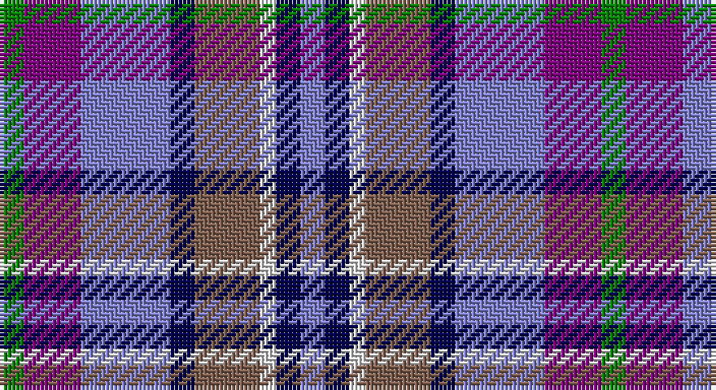

This page is one **sett** — a single exact thread-count. It belongs to the [tartan](/setts/g3p7b11db3o8w2db3b3/)
(the same proportion at any scale), whose colour order is pattern [BBWRBBBG](/stripes/bbwrbbbg/).

Part of the [Scotia](/tartans/scotia/) tartan — the named design grouping this sett with its other cloths.

Sourced from weddslist.  It is a [8 stripe tartan](/stripes/stripes8/).

Original link http://www.weddslist.com/cgi-bin/tartans/pg.pl?source=sts

## Thread count
G/6 P14 B22 DB6 LT16 LN4 DB6 B/6

One full sett is **148 threads**.

## Palette

Palette: <strong>Tartan Dictionary</strong> <small style="color:#888">(1 of 6 colours)</small>
<table><thead><tr><th>Colour</th><th>Threads</th><th>Shade</th><th>Base</th><th>OKLCh</th></tr></thead><tbody><tr><td>G/</td><td style="text-align:right;font-variant-numeric:tabular-nums">6</td><td><code style="background-color:#008000;">#008000</code> <small style="color:#888">#008000</small></td><td>G <code style="background-color:#006100;">#006100</code></td><td><small style="color:#888">oklch(52.0% 0.177 142.5)</small></td></tr><tr><td>P</td><td style="text-align:right;font-variant-numeric:tabular-nums">14</td><td><code style="background-color:#800080;">#800080</code> <small style="color:#888">#800080</small></td><td>B <code style="background-color:#2A418A;">#2A418A</code></td><td><small style="color:#888">oklch(42.1% 0.193 328.4)</small></td></tr><tr><td>B</td><td style="text-align:right;font-variant-numeric:tabular-nums">22</td><td><code style="background-color:#8080D0;">#8080D0</code> <small style="color:#888">#8080D0</small></td><td>B <code style="background-color:#2A418A;">#2A418A</code></td><td><small style="color:#888">oklch(63.4% 0.119 282.5)</small></td></tr><tr><td>DB</td><td style="text-align:right;font-variant-numeric:tabular-nums">6</td><td><code style="background-color:#000050;">#000050</code> <small style="color:#888">#000050</small></td><td>B <code style="background-color:#2A418A;">#2A418A</code></td><td><small style="color:#888">oklch(19.5% 0.135 264.1)</small></td></tr><tr><td>LT</td><td style="text-align:right;font-variant-numeric:tabular-nums">16</td><td><code style="background-color:#806050;">#806050</code> <small style="color:#888">#806050</small></td><td>R <code style="background-color:#CC0000;">#CC0000</code></td><td><small style="color:#888">oklch(51.7% 0.049 47.8)</small></td></tr><tr><td>LN</td><td style="text-align:right;font-variant-numeric:tabular-nums">4</td><td><code style="background-color:#E0E0E0;">#E0E0E0</code> <small style="color:#888">#E0E0E0</small></td><td>W <code style="background-color:#F7F7F7;">#F7F7F7</code></td><td><small style="color:#888">oklch(90.7% 0.000 89.9)</small></td></tr><tr><td>DB</td><td style="text-align:right;font-variant-numeric:tabular-nums">6</td><td><code style="background-color:#000050;">#000050</code> <small style="color:#888">#000050</small></td><td>B <code style="background-color:#2A418A;">#2A418A</code></td><td><small style="color:#888">oklch(19.5% 0.135 264.1)</small></td></tr><tr><td>B/</td><td style="text-align:right;font-variant-numeric:tabular-nums">6</td><td><code style="background-color:#8080D0;">#8080D0</code> <small style="color:#888">#8080D0</small></td><td>B <code style="background-color:#2A418A;">#2A418A</code></td><td><small style="color:#888">oklch(63.4% 0.119 282.5)</small></td></tr></tbody></table>

# Sample pattern

## Compared to the master

This cloth is one sett of its design; the master sett (the exemplar the design is anchored on) is below for comparison.

<figure style="margin:0"><figcaption style="color:#888;font-size:smaller">this sett</figcaption></figure>
<figure style="margin:0"><figcaption style="color:#888;font-size:smaller"><a href="/setts/db58g28dy4w18db14r3db8k4db8r3db14w18dy4g28db58w4/">master sett →</a></figcaption></figure>

## Nearest tartans

The nearest existing variants by ΔTartan distance, with this tartan at the top so the swatches line up against it.

ΔTartan

Tartan

Sett

—

<a href="/ttd/edit/#slug=g3p7b11db3o8w2db3b3~x2">Scotia</a> <a class="nn-out" href="/variants/s8/g3p7b11db3o8w2db3b3~x2/" title="open its dictionary page">↗</a>

0.78

<a href="/ttd/edit/#slug=g3dp7t11db3dy8w2db3t3~x2&amp;base=g3p7b11db3o8w2db3b3~x2">Scotia Trade Tartan</a> <a class="nn-out" href="/variants/s8/g3dp7t11db3dy8w2db3t3~x2/" title="open its dictionary page">↗</a>

1.14

<a href="/ttd/edit/#slug=db24r6w6r6w6r6db25k12b36ly6&amp;base=g3p7b11db3o8w2db3b3~x2">Lopatinsky (Personal)</a> <a class="nn-out" href="/variants/s10/db24r6w6r6w6r6db25k12b36ly6/" title="open its dictionary page">↗</a>

1.21

<a href="/ttd/edit/#slug=w8dbi5db30lr4dbi13lr13g5lo5~x2&amp;base=g3p7b11db3o8w2db3b3~x2">Waterford County Crest (Fashion)</a> <a class="nn-out" href="/variants/s8/w8dbi5db30lr4dbi13lr13g5lo5~x2/" title="open its dictionary page">↗</a>

1.36

<a href="/ttd/edit/#slug=g4t2g9k4g2r6db12w2~x2&amp;base=g3p7b11db3o8w2db3b3~x2">Cherokee</a> <a class="nn-out" href="/variants/s8/g4t2g9k4g2r6db12w2~x2/" title="open its dictionary page">↗</a>

1.37

<a href="/ttd/edit/#slug=db13ly2r4g2t8w2~x6&amp;base=g3p7b11db3o8w2db3b3~x2">Meh Dundee</a> <a class="nn-out" href="/variants/s6/db13ly2r4g2t8w2~x6/" title="open its dictionary page">↗</a>

1.41

<a href="/ttd/edit/#slug=w1dbi6g1dbi1g1dbi1db4r5lo1~x4&amp;base=g3p7b11db3o8w2db3b3~x2">McLion (Corporate)</a> <a class="nn-out" href="/variants/s9/w1dbi6g1dbi1g1dbi1db4r5lo1~x4/" title="open its dictionary page">↗</a>

1.42

<a href="/ttd/edit/#slug=db10t5lo2t2lb2t5o4t2o4lb2~x4&amp;base=g3p7b11db3o8w2db3b3~x2">Unidentified #47</a> <a class="nn-out" href="/variants/s10/db10t5lo2t2lb2t5o4t2o4lb2~x4/" title="open its dictionary page">↗</a>

1.43

<a href="/ttd/edit/#slug=o10t5db15k3db15k5r25k3w4~x2&amp;base=g3p7b11db3o8w2db3b3~x2">Galway County Crest (Fashion)</a> <a class="nn-out" href="/variants/s9/o10t5db15k3db15k5r25k3w4~x2/" title="open its dictionary page">↗</a>

1.43

<a href="/ttd/edit/#slug=o5db4ly1db4k4dy4w1~x4&amp;base=g3p7b11db3o8w2db3b3~x2">Devon Companion</a> <a class="nn-out" href="/variants/s7/o5db4ly1db4k4dy4w1~x4/" title="open its dictionary page">↗</a>

1.48

<a href="/ttd/edit/#slug=y12k3w3k3w3k3y13n6db17r3~x2&amp;base=g3p7b11db3o8w2db3b3~x2">Mitsukoshi</a> <a class="nn-out" href="/variants/s10/y12k3w3k3w3k3y13n6db17r3~x2/" title="open its dictionary page">↗</a>

## Neighbour map

Every grey dot is one of 14360 variants placed by the first two principal components of the ΔTartan feature space (44% of its variance). Red is this tartan; blue dots are its nearest — click one to open its page.

<svg viewBox="0 0 640 380" role="img" style="max-width:100%;height:auto;border:1px solid #e0e0e0;border-radius:4px;display:block" xmlns="http://www.w3.org/2000/svg"><image href="/nn/cloud.v1.png" width="640" height="380"/><a href="/variants/s8/g3dp7t11db3dy8w2db3t3~x2/"><circle cx="86.2" cy="212.3" r="4" fill="#3465a4"><title>Scotia Trade Tartan</title></circle></a><a href="/variants/s10/db24r6w6r6w6r6db25k12b36ly6/"><circle cx="91.1" cy="168.6" r="4" fill="#3465a4"><title>Lopatinsky (Personal)</title></circle></a><a href="/variants/s8/w8dbi5db30lr4dbi13lr13g5lo5~x2/"><circle cx="99.2" cy="172.9" r="4" fill="#3465a4"><title>Waterford County Crest (Fashion)</title></circle></a><a href="/variants/s8/g4t2g9k4g2r6db12w2~x2/"><circle cx="90.2" cy="192.1" r="4" fill="#3465a4"><title>Cherokee</title></circle></a><a href="/variants/s6/db13ly2r4g2t8w2~x6/"><circle cx="136.5" cy="190.0" r="4" fill="#3465a4"><title>Meh Dundee</title></circle></a><a href="/variants/s9/w1dbi6g1dbi1g1dbi1db4r5lo1~x4/"><circle cx="137.6" cy="186.6" r="4" fill="#3465a4"><title>McLion (Corporate)</title></circle></a><a href="/variants/s10/db10t5lo2t2lb2t5o4t2o4lb2~x4/"><circle cx="96.3" cy="206.8" r="4" fill="#3465a4"><title>Unidentified #47</title></circle></a><a href="/variants/s9/o10t5db15k3db15k5r25k3w4~x2/"><circle cx="124.2" cy="174.0" r="4" fill="#3465a4"><title>Galway County Crest (Fashion)</title></circle></a><a href="/variants/s7/o5db4ly1db4k4dy4w1~x4/"><circle cx="52.9" cy="231.6" r="4" fill="#3465a4"><title>Devon Companion</title></circle></a><a href="/variants/s10/y12k3w3k3w3k3y13n6db17r3~x2/"><circle cx="96.5" cy="176.8" r="4" fill="#3465a4"><title>Mitsukoshi</title></circle></a><circle cx="79.1" cy="202.8" r="5" fill="#c00000"/></svg>

ID: /variants/s8/g3p7b11db3o8w2db3b3~x2/
