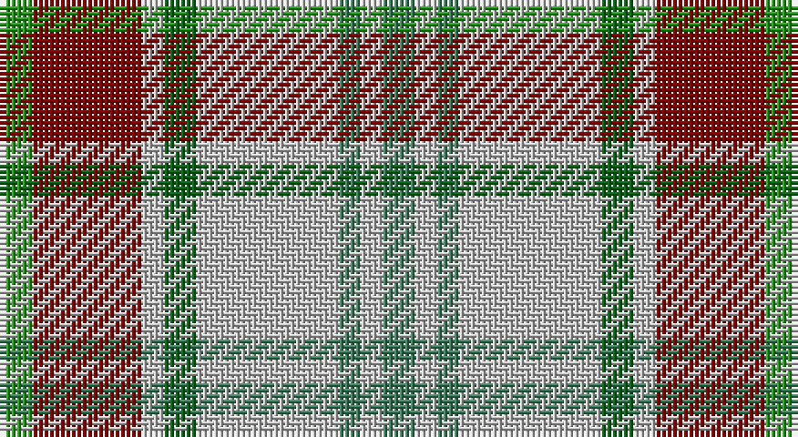

This page is one **sett** — a single exact thread-count. It belongs to the [tartan](/setts/g3r10lb2gii3lb13gi2lb2gi3/)
(the same proportion at any scale), whose colour order is pattern [GRWGWGWG](/stripes/grwgwgwg/).

Part of the [Manitoba Dress](/tartans/manitoba-dress/) tartan — the named design grouping this sett with its other cloths.

Sourced from register-of-tartans.  It is a [8 stripe tartan](/stripes/stripes8/).

Original link https://www.tartanregister.gov.uk/tartanDetails.aspx?ref=2806

## Register references

External register numbers recorded for this tartan.

- Scottish Register of Tartans: [2806](https://www.tartanregister.gov.uk/tartanDetails.aspx?ref=2806)
- Scottish Tartans Authority (ITI): 5699

## Thread count
Ga/6 DR20 N4 G6 N26 Gb4 N4 Gb/6

One full sett is **140 threads**.

## Palette

Palette: <strong>Tartan Register</strong>
<table><thead><tr><th>Colour</th><th>Threads</th><th>Shade</th><th>Base</th><th>OKLCh</th></tr></thead><tbody><tr><td>Ga/</td><td style="text-align:right;font-variant-numeric:tabular-nums">6</td><td><code style="background-color:#289C18;">#289C18</code> <small style="color:#888">#289C18</small></td><td>G <code style="background-color:#006100;">#006100</code></td><td><small style="color:#888">oklch(60.6% 0.191 141.6)</small></td></tr><tr><td>DR</td><td style="text-align:right;font-variant-numeric:tabular-nums">20</td><td><code style="background-color:#880000;">#880000</code> <small style="color:#888">#880000</small></td><td>R <code style="background-color:#CC0000;">#CC0000</code></td><td><small style="color:#888">oklch(39.4% 0.162 29.2)</small></td></tr><tr><td>N</td><td style="text-align:right;font-variant-numeric:tabular-nums">4</td><td><code style="background-color:#C0C0C0;">#C0C0C0</code> <small style="color:#888">#C0C0C0</small></td><td>W <code style="background-color:#F7F7F7;">#F7F7F7</code></td><td><small style="color:#888">oklch(80.8% 0.000 89.9)</small></td></tr><tr><td>G</td><td style="text-align:right;font-variant-numeric:tabular-nums">6</td><td><code style="background-color:#006818;">#006818</code> <small style="color:#888">#006818</small></td><td>G <code style="background-color:#006100;">#006100</code></td><td><small style="color:#888">oklch(45.0% 0.142 145.0)</small></td></tr><tr><td>N</td><td style="text-align:right;font-variant-numeric:tabular-nums">26</td><td><code style="background-color:#C0C0C0;">#C0C0C0</code> <small style="color:#888">#C0C0C0</small></td><td>W <code style="background-color:#F7F7F7;">#F7F7F7</code></td><td><small style="color:#888">oklch(80.8% 0.000 89.9)</small></td></tr><tr><td>Gb</td><td style="text-align:right;font-variant-numeric:tabular-nums">4</td><td><code style="background-color:#408060;">#408060</code> <small style="color:#888">#408060</small></td><td>G <code style="background-color:#006100;">#006100</code></td><td><small style="color:#888">oklch(54.8% 0.084 160.1)</small></td></tr><tr><td>N</td><td style="text-align:right;font-variant-numeric:tabular-nums">4</td><td><code style="background-color:#C0C0C0;">#C0C0C0</code> <small style="color:#888">#C0C0C0</small></td><td>W <code style="background-color:#F7F7F7;">#F7F7F7</code></td><td><small style="color:#888">oklch(80.8% 0.000 89.9)</small></td></tr><tr><td>Gb/</td><td style="text-align:right;font-variant-numeric:tabular-nums">6</td><td><code style="background-color:#408060;">#408060</code> <small style="color:#888">#408060</small></td><td>G <code style="background-color:#006100;">#006100</code></td><td><small style="color:#888">oklch(54.8% 0.084 160.1)</small></td></tr></tbody></table>

# Sample pattern

## Compared to the master

This cloth is one sett of its design; the master sett (the exemplar the design is anchored on) is below for comparison.

<figure style="margin:0"><figcaption style="color:#888;font-size:smaller">this sett</figcaption></figure>
<figure style="margin:0"><figcaption style="color:#888;font-size:smaller"><a href="/setts/db4w1db2w18g3w1r9ly4/">master sett →</a></figcaption></figure>

## Nearest tartans

The nearest existing variants by ΔTartan distance, with this tartan at the top so the swatches line up against it.

ΔTartan

Tartan

Sett

—

<a href="/ttd/edit/#slug=g3r10lb2gii3lb13gi2lb2gi3~x2">Manitoba Dress (Dance)</a> <a class="nn-out" href="/variants/s8/g3r10lb2gii3lb13gi2lb2gi3~x2/" title="open its dictionary page">↗</a>

0.85

<a href="/ttd/edit/#slug=g4lo7r9lo9b20w2b2~x2&amp;base=g3r10lb2gii3lb13gi2lb2gi3~x2">Tombow 140th Anniversary, The</a> <a class="nn-out" href="/variants/s7/g4lo7r9lo9b20w2b2~x2/" title="open its dictionary page">↗</a>

1.07

<a href="/ttd/edit/#slug=k4ly12n3ly3n3ly4lr17ly15dy4~x2&amp;base=g3r10lb2gii3lb13gi2lb2gi3~x2">Cotswolds Distillery</a> <a class="nn-out" href="/variants/s9/k4ly12n3ly3n3ly4lr17ly15dy4~x2/" title="open its dictionary page">↗</a>

1.08

<a href="/ttd/edit/#slug=db4o24g17o3w18o3w18o3g17o24r4~x2&amp;base=g3r10lb2gii3lb13gi2lb2gi3~x2">Fraser hunting, dress</a> <a class="nn-out" href="/variants/s11/db4o24g17o3w18o3w18o3g17o24r4~x2/" title="open its dictionary page">↗</a>

1.21

<a href="/ttd/edit/#slug=g7p3w1lg2g1lp2p1~x8&amp;base=g3r10lb2gii3lb13gi2lb2gi3~x2">Lindley-Highfield of Ballumbie Castle</a> <a class="nn-out" href="/variants/s7/g7p3w1lg2g1lp2p1~x8/" title="open its dictionary page">↗</a>

1.23

<a href="/ttd/edit/#slug=dy3lo1lb1dy1lo1dy3lb3ly6r1~x6&amp;base=g3r10lb2gii3lb13gi2lb2gi3~x2">Toorak Chapler (Fashion)</a> <a class="nn-out" href="/variants/s9/dy3lo1lb1dy1lo1dy3lb3ly6r1~x6/" title="open its dictionary page">↗</a>

1.24

<a href="/ttd/edit/#slug=r34w3gi4g23w24k3gi4~x2&amp;base=g3r10lb2gii3lb13gi2lb2gi3~x2">MacLachlan Dress Clan Tartan</a> <a class="nn-out" href="/variants/s7/r34w3gi4g23w24k3gi4~x2/" title="open its dictionary page">↗</a>

1.28

<a href="/ttd/edit/#slug=w4t32w12k5r9lo8r4w4~x2&amp;base=g3r10lb2gii3lb13gi2lb2gi3~x2">Brunnbauer (2015)</a> <a class="nn-out" href="/variants/s8/w4t32w12k5r9lo8r4w4~x2/" title="open its dictionary page">↗</a>

1.30

<a href="/ttd/edit/#slug=dg4g3dg24w15lo21gi3lo4~x2&amp;base=g3r10lb2gii3lb13gi2lb2gi3~x2">Bannockbane Dark Green</a> <a class="nn-out" href="/variants/s7/dg4g3dg24w15lo21gi3lo4~x2/" title="open its dictionary page">↗</a>

1.30

<a href="/ttd/edit/#slug=db4dy24g17dy3w18dy3w18dy3g17dy24r4~x2&amp;base=g3r10lb2gii3lb13gi2lb2gi3~x2">Fraser Hunting Dress Clan Tartan</a> <a class="nn-out" href="/variants/s11/db4dy24g17dy3w18dy3w18dy3g17dy24r4~x2/" title="open its dictionary page">↗</a>

1.31

<a href="/variants/s8/g6ly1r1t2r2~x4/">Wilson's No.179</a>

## Neighbour map

Every grey dot is one of 14360 variants placed by the first two principal components of the ΔTartan feature space (44% of its variance). Red is this tartan; blue dots are its nearest — click one to open its page.

<svg viewBox="0 0 640 380" role="img" style="max-width:100%;height:auto;border:1px solid #e0e0e0;border-radius:4px;display:block" xmlns="http://www.w3.org/2000/svg"><image href="/nn/cloud.v1.png" width="640" height="380"/><a href="/variants/s7/g4lo7r9lo9b20w2b2~x2/"><circle cx="181.7" cy="182.6" r="4" fill="#3465a4"><title>Tombow 140th Anniversary, The</title></circle></a><a href="/variants/s9/k4ly12n3ly3n3ly4lr17ly15dy4~x2/"><circle cx="201.8" cy="191.5" r="4" fill="#3465a4"><title>Cotswolds Distillery</title></circle></a><a href="/variants/s11/db4o24g17o3w18o3w18o3g17o24r4~x2/"><circle cx="161.3" cy="181.8" r="4" fill="#3465a4"><title>Fraser hunting, dress</title></circle></a><a href="/variants/s7/g7p3w1lg2g1lp2p1~x8/"><circle cx="169.8" cy="188.1" r="4" fill="#3465a4"><title>Lindley-Highfield of Ballumbie Castle</title></circle></a><a href="/variants/s9/dy3lo1lb1dy1lo1dy3lb3ly6r1~x6/"><circle cx="126.4" cy="194.0" r="4" fill="#3465a4"><title>Toorak Chapler (Fashion)</title></circle></a><a href="/variants/s7/r34w3gi4g23w24k3gi4~x2/"><circle cx="153.8" cy="156.0" r="4" fill="#3465a4"><title>MacLachlan Dress Clan Tartan</title></circle></a><a href="/variants/s8/w4t32w12k5r9lo8r4w4~x2/"><circle cx="151.1" cy="156.4" r="4" fill="#3465a4"><title>Brunnbauer (2015)</title></circle></a><a href="/variants/s7/dg4g3dg24w15lo21gi3lo4~x2/"><circle cx="144.3" cy="185.4" r="4" fill="#3465a4"><title>Bannockbane Dark Green</title></circle></a><a href="/variants/s11/db4dy24g17dy3w18dy3w18dy3g17dy24r4~x2/"><circle cx="147.7" cy="177.2" r="4" fill="#3465a4"><title>Fraser Hunting Dress Clan Tartan</title></circle></a><a href="/variants/s8/g6ly1r1t2r2~x4/"><circle cx="161.7" cy="213.9" r="4" fill="#3465a4"><title>Wilson's No.179</title></circle></a><circle cx="172.9" cy="181.8" r="5" fill="#c00000"/></svg>

ID: /variants/s8/g3r10lb2gii3lb13gi2lb2gi3~x2/
