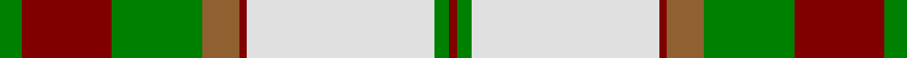
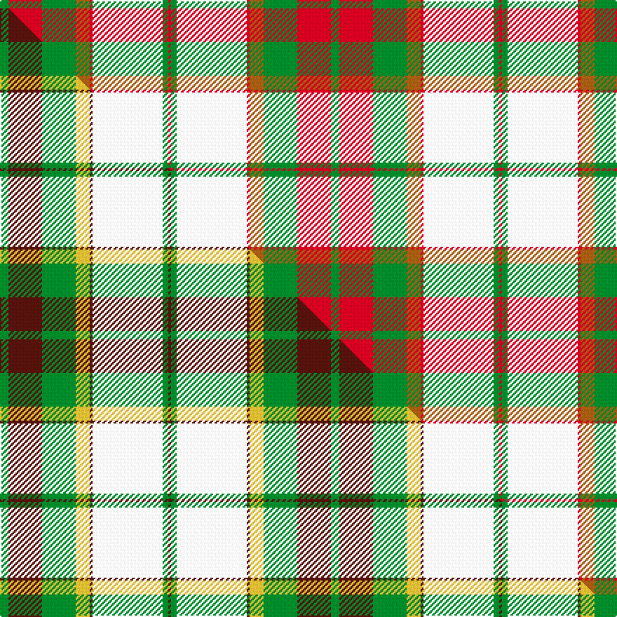

This is one **variant** — a specific cloth: this exact thread count and colourway, with its own
provenance below. It is one weaving of the [sett](/tartans/d/do/dogwood/) (the scale-free proportion — the
same cloth at any scale or shade), whose colour order is pattern [GRGRRWGR](/stripes/grgrrwgr/).

Part of the [Dogwood](/tartans/d/do/dogwood/) tartan — the named design grouping this sett with its other cloths.

Sourced from weddslist.  It is a [8 stripe tartan](/stripes/stripes8/).

Original link [http://www.weddslist.com/cgi-bin/tartans/pg.pl?source=sts](http://www.weddslist.com/cgi-bin/tartans/pg.pl?source=sts)

Dataset <small>— provenance for this record, inherited from the source manifest</small>

<dl class="dataset-prov">
<dt>source</dt><dd><a href="/sources/weddslist/">Weddslist</a></dd>
<dt>data captured from</dt><dd><a href="https://github.com/thetartan/tartan-database/blob/master/data/weddslist/data.csv">https://github.com/thetartan/tartan-database/blob/master/data/weddslist/data.csv</a></dd>
<dt>data date</dt><dd>2016-11-17 <small>(dataset default)</small></dd>
<dt>licence</dt><dd><a href="https://creativecommons.org/licenses/by-nc-nd/4.0/">CC BY-NC-ND 4.0</a></dd>
</dl>

Capture chain <small>— the hands this data passed through, oldest first; each capture carries its own licence</small>

<ol class="capture-chain">
<li><a href="https://www.weddslist.com/tartans/">Weddslist</a> <small>the living privately compiled reference</small></li>
<li><a href="https://github.com/thetartan/tartan-database">thetartan/tartan-database</a> <small>2016-2017</small> · <a href="https://creativecommons.org/licenses/by-nc-nd/4.0/">CC BY-NC-ND 4.0</a> <small>Levko Kravets's frozen compilation — the capture we vendored, and where its CC licence text came from</small></li>
<li>this dictionary <small>captured 2026-06-10 · commit 5bf86c7566</small> <small>each re-capture is a git commit to data/sources</small></li>
</ol>

## Thread count
G/6 R24 G24 O10 R2 W50 G4 R/2

One full sett is **236 threads**.

## Palette
<table><thead><tr><th>Colour</th><th>Shade</th><th>OKLCh</th></tr></thead><tbody><tr><td>R</td><td><code style="background-color:#D60020;">#D60020</code> <small style="color:#888">#D60020</small></td><td><small style="color:#888">oklch(55.2% 0.224 25.5)</small></td></tr><tr><td>G</td><td><code style="background-color:#008B2A;">#008B2A</code> <small style="color:#888">#008B2A</small></td><td><small style="color:#888">oklch(55.4% 0.170 145.9)</small></td></tr><tr><td>W</td><td><code style="background-color:#F7F7F7;">#F7F7F7</code> <small style="color:#888">#F7F7F7</small></td><td><small style="color:#888">oklch(97.6% 0.000 89.9)</small></td></tr><tr><td>O</td><td><code style="background-color:#A65C11;">#A65C11</code> <small style="color:#888">#A65C11</small></td><td><small style="color:#888">oklch(55.0% 0.125 58.3)</small></td></tr></tbody></table>

# Sample pattern

## Compared to the master

This cloth is one sett of its design; the master sett (the exemplar the design is anchored on) is below for comparison.

Its **ΔTartan distance** from the master is **0.39** — the same measure the nearest-tartans table ranks by (0 is identical; a re-scale of the same cloth is near 0, a recolour or a different proportion further).

<figure class="master-compare" style="margin:0">

this sett
master sett ★

<figcaption style="color:#888;font-size:smaller">One weave of this sett against the <a href="/setts/g3dr12g12ly5dr1w25g2dr1/">master sett ★</a>, split on the diagonal: a shared proportion runs seamlessly across it with only the shades shifting; a different proportion breaks on it.</figcaption>
</figure>

## Nearest tartan variants

The nearest existing variants by ΔTartan distance, with this cloth at the top so the swatches line up against it.

ΔTartan

Threads

Variant

Sett

—

236

<a href="/variants/s8/g3r12g12o5r1w25g2r1~x2/">Dogwood</a>

<a href="/ttd/edit/#slug=g3dr12g12ly5dr1w25g2dr1~x2&amp;base=g3r12g12o5r1w25g2r1~x2" title="compare in the TTD">0.39</a>

236

<a href="/variants/s8/g3dr12g12ly5dr1w25g2dr1~x2/">Dogwood Trade Tartan</a>

<a href="/ttd/edit/#slug=g4dr14g14ly6dr1w30g2dr1~x2&amp;base=g3r12g12o5r1w25g2r1~x2" title="compare in the TTD">0.57</a>

278

<a href="/variants/s8/g4dr14g14ly6dr1w30g2dr1~x2/">British Columbia #2</a>

<a href="/ttd/edit/#slug=g22dr2g4dr2g4dr18w24dr1lo3~x2&amp;base=g3r12g12o5r1w25g2r1~x2" title="compare in the TTD">1.72</a>

270

<a href="/variants/s9/g22dr2g4dr2g4dr18w24dr1lo3~x2/">Prince Edward Island, Dress</a>

<a href="/ttd/edit/#slug=g2o10g11y4o1w18g2o1~x2&amp;base=g3r12g12o5r1w25g2r1~x2" title="compare in the TTD">2.53</a>

190

<a href="/variants/s8/g2o10g11y4o1w18g2o1~x2/">Aviemore, Check</a>

<a href="/ttd/edit/#slug=y42db2w2db2y5lo12w32r4~x2&amp;base=g3r12g12o5r1w25g2r1~x2" title="compare in the TTD">2.57</a>

312

<a href="/variants/s8/y42db2w2db2y5lo12w32r4~x2/">Comrie, Gold (Dance)</a>

<a href="/ttd/edit/#slug=w5g1w1g33y3r24g3r4~x2&amp;base=g3r12g12o5r1w25g2r1~x2" title="compare in the TTD">2.60</a>

278

<a href="/variants/s8/w5g1w1g33y3r24g3r4~x2/">Sutherland de Albergaria Dress (Personal)</a>

<a href="/ttd/edit/#slug=w68o3w3o8w3o27dy16r3dy20o3~x2&amp;base=g3r12g12o5r1w25g2r1~x2" title="compare in the TTD">2.66</a>

474

<a href="/variants/s10/w68o3w3o8w3o27dy16r3dy20o3~x2/">Ben Cleuch (Fashion)</a>

<a href="/ttd/edit/#slug=do2w20r2w2do3w3y3r8y26w2~x2&amp;base=g3r12g12o5r1w25g2r1~x2" title="compare in the TTD">2.75</a>

276

<a href="/variants/s10/do2w20r2w2do3w3y3r8y26w2~x2/">Liama, The</a>

<a href="/ttd/edit/#slug=r5w36dp14r9g28r8dp2~x2&amp;base=g3r12g12o5r1w25g2r1~x2" title="compare in the TTD">2.84</a>

394

<a href="/variants/s7/r5w36dp14r9g28r8dp2~x2/">MacKintosh, Arisaid</a>

<a href="/ttd/edit/#slug=dy2w19r2w2dy3w3dy3r6ly25w2~x2&amp;base=g3r12g12o5r1w25g2r1~x2" title="compare in the TTD">2.91</a>

260

<a href="/variants/s10/dy2w19r2w2dy3w3dy3r6ly25w2~x2/">Llama (Fashion)</a>

## Neighbour map

Every grey dot is one of 13657 variants placed by the first two principal components of the ΔTartan feature space (42% of its variance). Red is this tartan; blue dots are its nearest — click one to open its page. The map is a flat projection of a many-dimensional space — [how to read it](/posts/neighbourhood-maps/).

<svg viewBox="0 0 640 380" role="img" style="max-width:100%;height:auto;border:1px solid #e0e0e0;border-radius:4px;display:block" xmlns="http://www.w3.org/2000/svg"><image href="/nn/cloud.v1.png" width="640" height="380"/><a href="/variants/s8/g3dr12g12ly5dr1w25g2dr1~x2/"><circle cx="244.5" cy="164.9" r="4" fill="#3465a4"><title>Dogwood Trade Tartan</title></circle></a><a href="/variants/s8/g4dr14g14ly6dr1w30g2dr1~x2/"><circle cx="254.0" cy="157.1" r="4" fill="#3465a4"><title>British Columbia #2</title></circle></a><a href="/variants/s9/g22dr2g4dr2g4dr18w24dr1lo3~x2/"><circle cx="233.7" cy="164.0" r="4" fill="#3465a4"><title>Prince Edward Island, Dress</title></circle></a><a href="/variants/s8/g2o10g11y4o1w18g2o1~x2/"><circle cx="219.5" cy="178.3" r="4" fill="#3465a4"><title>Aviemore, Check</title></circle></a><a href="/variants/s8/y42db2w2db2y5lo12w32r4~x2/"><circle cx="268.4" cy="138.1" r="4" fill="#3465a4"><title>Comrie, Gold (Dance)</title></circle></a><a href="/variants/s8/w5g1w1g33y3r24g3r4~x2/"><circle cx="346.3" cy="133.8" r="4" fill="#3465a4"><title>Sutherland de Albergaria Dress (Personal)</title></circle></a><a href="/variants/s10/w68o3w3o8w3o27dy16r3dy20o3~x2/"><circle cx="265.9" cy="123.1" r="4" fill="#3465a4"><title>Ben Cleuch (Fashion)</title></circle></a><a href="/variants/s10/do2w20r2w2do3w3y3r8y26w2~x2/"><circle cx="236.4" cy="157.5" r="4" fill="#3465a4"><title>Liama, The</title></circle></a><a href="/variants/s7/r5w36dp14r9g28r8dp2~x2/"><circle cx="176.5" cy="181.2" r="4" fill="#3465a4"><title>MacKintosh, Arisaid</title></circle></a><a href="/variants/s10/dy2w19r2w2dy3w3dy3r6ly25w2~x2/"><circle cx="226.3" cy="161.9" r="4" fill="#3465a4"><title>Llama (Fashion)</title></circle></a><circle cx="236.1" cy="149.2" r="5" fill="#c00000"/><text x="320" y="376" text-anchor="middle" font-size="11" fill="#999">ground</text><text x="11" y="190" text-anchor="middle" font-size="11" fill="#999" transform="rotate(-90 11 190)">complexity</text></svg>

ID: /variants/s8/g3r12g12o5r1w25g2r1~x2/
