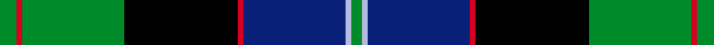

This page is one **sett** — a single exact thread-count. It belongs to the [tartan](/setts/g3r1g18k20r1db18lb1g2/)
(the same proportion at any scale), whose colour order is pattern [GRGKRBWG](/stripes/grgkrbwg/).

Sourced from register-of-tartans.  It is a [8 stripe tartan](/stripes/stripes8/).

Original link https://www.tartanregister.gov.uk/tartanDetails.aspx?ref=2160

2 attestations — the source records this cloth was collapsed from (oldest owns this page)

<ul>
<li>undated — Lochaber #2 (register-of-tartans, <a href="https://www.tartanregister.gov.uk/tartanDetails.aspx?ref=2160">record</a>)  <em>Fort William museum. James Mackinlay pattern book of Tartan stripes.</em></li>
<li>undated — Lochaber (weddslist, <a href="http://www.weddslist.com/cgi-bin/tartans/pg.pl?source=sts">record</a>) </li>
</ul>

## Register references

External register numbers recorded for this tartan.

- Scottish Register of Tartans: [2160](https://www.tartanregister.gov.uk/tartanDetails.aspx?ref=2160)
- Scottish Tartans World Register: 686

## Thread count
G/12 R4 G72 K80 R4 DB72 LB4 G/8

One full sett is **492 threads**.

## Palette
<table><thead><tr><th>Colour</th><th>Shade</th><th>OKLCh</th></tr></thead><tbody><tr><td>LB</td><td><code style="background-color:#B5BBDE;">#B5BBDE</code> <small style="color:#888">#B5BBDE</small></td><td><small style="color:#888">oklch(79.9% 0.050 277.6)</small></td></tr><tr><td>DB</td><td><code style="background-color:#082077;">#082077</code> <small style="color:#888">#082077</small></td><td><small style="color:#888">oklch(30.0% 0.149 265.1)</small></td></tr><tr><td>G</td><td><code style="background-color:#008B2A;">#008B2A</code> <small style="color:#888">#008B2A</small></td><td><small style="color:#888">oklch(55.4% 0.170 145.9)</small></td></tr><tr><td>K</td><td><code style="background-color:#000000;">#000000</code> <small style="color:#888">#000000</small></td><td><small style="color:#888">oklch(0.0% 0.000 0.0)</small></td></tr><tr><td>R</td><td><code style="background-color:#D60020;">#D60020</code> <small style="color:#888">#D60020</small></td><td><small style="color:#888">oklch(55.2% 0.224 25.5)</small></td></tr></tbody></table>

# Sample pattern

## Nearest variants

The nearest existing variants by ΔTartan distance, with this cloth at the top so the swatches line up against it.

ΔTartan

Threads

Variant

Sett

—

492

<a href="/variants/s8/g3r1g18k20r1db18lb1g2~x4/">Lochaber #2</a>

<a href="/ttd/edit/#slug=g3db12b1k12g13r2g2~x2&amp;base=g3r1g18k20r1db18lb1g2~x4" title="compare in the TTD">1.12</a>

170

<a href="/variants/s7/g3db12b1k12g13r2g2~x2/">MacPhadran</a>

<a href="/ttd/edit/#slug=g3db12w1k12g13r2g2~x4&amp;base=g3r1g18k20r1db18lb1g2~x4" title="compare in the TTD">1.12</a>

340

<a href="/variants/s7/g3db12w1k12g13r2g2~x4/">MacFadzean/MacPhedran</a>

<a href="/ttd/edit/#slug=db4r1db18k20g18r1g4~x2&amp;base=g3r1g18k20r1db18lb1g2~x4" title="compare in the TTD">1.64</a>

248

<a href="/variants/s7/db4r1db18k20g18r1g4~x2/">Blair (Name)</a>

<a href="/ttd/edit/#slug=db2g1db16r1k12g16r1g2~x2&amp;base=g3r1g18k20r1db18lb1g2~x4" title="compare in the TTD">1.75</a>

196

<a href="/variants/s8/db2g1db16r1k12g16r1g2~x2/">Lochaber District</a>

<a href="/ttd/edit/#slug=db18k10g6r4g6k1w2~x2&amp;base=g3r1g18k20r1db18lb1g2~x4" title="compare in the TTD">2.21</a>

148

<a href="/variants/s7/db18k10g6r4g6k1w2~x2/">Ferguson - 1830 of Atholl (Clan)</a>

<a href="/ttd/edit/#slug=g12k1g2dr1g2k10db10lo1~x4&amp;base=g3r1g18k20r1db18lb1g2~x4" title="compare in the TTD">2.28</a>

260

<a href="/variants/s8/g12k1g2dr1g2k10db10lo1~x4/">Guelph, City Of</a>

<a href="/ttd/edit/#slug=db16r5db30r2k33g30r5g2r2g7w2~x2&amp;base=g3r1g18k20r1db18lb1g2~x4" title="compare in the TTD">2.32</a>

500

<a href="/variants/s11/db16r5db30r2k33g30r5g2r2g7w2~x2/">MacDonell of Glengarry</a>

<a href="/ttd/edit/#slug=db16r5db30r2k33g30r5g2r2g7w4&amp;base=g3r1g18k20r1db18lb1g2~x4" title="compare in the TTD">2.32</a>

252

<a href="/variants/s11/db16r5db30r2k33g30r5g2r2g7w4/">MacDonell of Glengarry #3</a>

<a href="/ttd/edit/#slug=r12db68w7k39g75r6g6&amp;base=g3r1g18k20r1db18lb1g2~x4" title="compare in the TTD">2.39</a>

408

<a href="/variants/s7/r12db68w7k39g75r6g6/">Rhun (Fashion)</a>

<a href="/ttd/edit/#slug=g8r1g1r3g16k16r1db16r3db8y2~x2&amp;base=g3r1g18k20r1db18lb1g2~x4" title="compare in the TTD">2.47</a>

280

<a href="/variants/s11/g8r1g1r3g16k16r1db16r3db8y2~x2/">Cameron of Erracht (Clan)</a>

## Neighbour map

Every grey dot is one of 13620 variants placed by the first two principal components of the ΔTartan feature space (42% of its variance). Red is this tartan; blue dots are its nearest — click one to open its page.

<svg viewBox="0 0 640 380" role="img" style="max-width:100%;height:auto;border:1px solid #e0e0e0;border-radius:4px;display:block" xmlns="http://www.w3.org/2000/svg"><image href="/nn/cloud.v1.png" width="640" height="380"/><a href="/variants/s7/g3db12b1k12g13r2g2~x2/"><circle cx="156.0" cy="171.6" r="4" fill="#3465a4"><title>MacPhadran</title></circle></a><a href="/variants/s7/g3db12w1k12g13r2g2~x4/"><circle cx="151.1" cy="170.1" r="4" fill="#3465a4"><title>MacFadzean/MacPhedran</title></circle></a><a href="/variants/s7/db4r1db18k20g18r1g4~x2/"><circle cx="176.7" cy="165.9" r="4" fill="#3465a4"><title>Blair (Name)</title></circle></a><a href="/variants/s8/db2g1db16r1k12g16r1g2~x2/"><circle cx="189.3" cy="154.9" r="4" fill="#3465a4"><title>Lochaber District</title></circle></a><a href="/variants/s7/db18k10g6r4g6k1w2~x2/"><circle cx="147.9" cy="156.3" r="4" fill="#3465a4"><title>Ferguson - 1830 of Atholl (Clan)</title></circle></a><a href="/variants/s8/g12k1g2dr1g2k10db10lo1~x4/"><circle cx="164.8" cy="159.0" r="4" fill="#3465a4"><title>Guelph, City Of</title></circle></a><a href="/variants/s11/db16r5db30r2k33g30r5g2r2g7w2~x2/"><circle cx="136.2" cy="126.4" r="4" fill="#3465a4"><title>MacDonell of Glengarry</title></circle></a><a href="/variants/s11/db16r5db30r2k33g30r5g2r2g7w4/"><circle cx="127.8" cy="127.6" r="4" fill="#3465a4"><title>MacDonell of Glengarry #3</title></circle></a><a href="/variants/s7/r12db68w7k39g75r6g6/"><circle cx="149.5" cy="161.7" r="4" fill="#3465a4"><title>Rhun (Fashion)</title></circle></a><a href="/variants/s11/g8r1g1r3g16k16r1db16r3db8y2~x2/"><circle cx="128.7" cy="137.7" r="4" fill="#3465a4"><title>Cameron of Erracht (Clan)</title></circle></a><circle cx="166.3" cy="130.6" r="5" fill="#c00000"/><text x="320" y="376" text-anchor="middle" font-size="11" fill="#999">ground</text><text x="11" y="190" text-anchor="middle" font-size="11" fill="#999" transform="rotate(-90 11 190)">complexity</text></svg>

ID: /variants/s8/g3r1g18k20r1db18lb1g2~x4/
