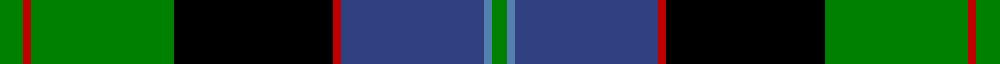
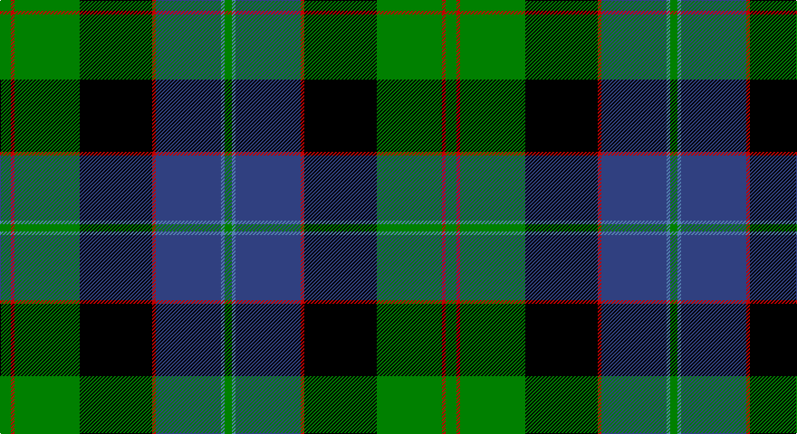

This page is one **sett** — a single exact thread-count. It belongs to the [tartan](/setts/g3r1g18k20r1db18t1g2/)
(the same proportion at any scale), whose colour order is pattern [GBBRKGRG](/stripes/gbbrkgrg/).

Part of the [Lochaber](/tartans/lochaber/) tartan — the named design grouping this sett with its other cloths.

Sourced from weddslist.  It is a [8 stripe tartan](/stripes/stripes8/).

Original link http://www.weddslist.com/cgi-bin/tartans/pg.pl?source=sts

## Also known as

This cloth is also recorded under:

- Lochaber #2
- Lochaber #3

## Thread count
G/12 R4 G72 K80 R4 B72 Ba4 G/8

One full sett is **492 threads**.

## Palette

Palette: <strong>Ingles Buchan</strong> <small style="color:#888">(1 of 5 colours)</small>
<table><thead><tr><th>Colour</th><th>Threads</th><th>Shade</th><th>Base</th><th>OKLCh</th></tr></thead><tbody><tr><td>G/</td><td style="text-align:right;font-variant-numeric:tabular-nums">12</td><td><code style="background-color:#008000;">#008000</code> <small style="color:#888">#008000</small></td><td>G <code style="background-color:#006100;">#006100</code></td><td><small style="color:#888">oklch(52.0% 0.177 142.5)</small></td></tr><tr><td>R</td><td style="text-align:right;font-variant-numeric:tabular-nums">4</td><td><code style="background-color:#C00000;">#C00000</code> <small style="color:#888">#C00000</small></td><td>R <code style="background-color:#CC0000;">#CC0000</code></td><td><small style="color:#888">oklch(50.7% 0.208 29.2)</small></td></tr><tr><td>G</td><td style="text-align:right;font-variant-numeric:tabular-nums">72</td><td><code style="background-color:#008000;">#008000</code> <small style="color:#888">#008000</small></td><td>G <code style="background-color:#006100;">#006100</code></td><td><small style="color:#888">oklch(52.0% 0.177 142.5)</small></td></tr><tr><td>K</td><td style="text-align:right;font-variant-numeric:tabular-nums">80</td><td><code style="background-color:#000000;">#000000</code> <small style="color:#888">#000000</small></td><td>K <code style="background-color:#000000;">#000000</code></td><td><small style="color:#888">oklch(0.0% 0.000 0.0)</small></td></tr><tr><td>R</td><td style="text-align:right;font-variant-numeric:tabular-nums">4</td><td><code style="background-color:#C00000;">#C00000</code> <small style="color:#888">#C00000</small></td><td>R <code style="background-color:#CC0000;">#CC0000</code></td><td><small style="color:#888">oklch(50.7% 0.208 29.2)</small></td></tr><tr><td>B</td><td style="text-align:right;font-variant-numeric:tabular-nums">72</td><td><code style="background-color:#304080;">#304080</code> <small style="color:#888">#304080</small></td><td>B <code style="background-color:#2A418A;">#2A418A</code></td><td><small style="color:#888">oklch(39.4% 0.109 270.2)</small></td></tr><tr><td>Ba</td><td style="text-align:right;font-variant-numeric:tabular-nums">4</td><td><code style="background-color:#5480B0;">#5480B0</code> <small style="color:#888">#5480B0</small></td><td>B <code style="background-color:#2A418A;">#2A418A</code></td><td><small style="color:#888">oklch(58.8% 0.089 251.5)</small></td></tr><tr><td>G/</td><td style="text-align:right;font-variant-numeric:tabular-nums">8</td><td><code style="background-color:#008000;">#008000</code> <small style="color:#888">#008000</small></td><td>G <code style="background-color:#006100;">#006100</code></td><td><small style="color:#888">oklch(52.0% 0.177 142.5)</small></td></tr></tbody></table>

# Sample pattern

## Compared to the master

This cloth is one sett of its design; the master sett (the exemplar the design is anchored on) is below for comparison.

<figure style="margin:0"><figcaption style="color:#888;font-size:smaller">this sett</figcaption></figure>
<figure style="margin:0"><figcaption style="color:#888;font-size:smaller"><a href="/setts/g4t2db33r2k35g33k1r2k1g4/">master sett →</a></figcaption></figure>

## Nearest tartans

The nearest existing variants by ΔTartan distance, with this tartan at the top so the swatches line up against it.

ΔTartan

Tartan

Sett

—

<a href="/ttd/edit/#slug=g3r1g18k20r1db18t1g2~x4">Lochaber</a> <a class="nn-out" href="/variants/s8/g3r1g18k20r1db18t1g2~x4/" title="open its dictionary page">↗</a>

0.70

<a href="/ttd/edit/#slug=w4k1g18k17db13r1db3r1~x2&amp;base=g3r1g18k20r1db18t1g2~x4">Whitson</a> <a class="nn-out" href="/variants/s8/w4k1g18k17db13r1db3r1~x2/" title="open its dictionary page">↗</a>

0.71

<a href="/ttd/edit/#slug=k2r1g15k15db15ly1k2~x2&amp;base=g3r1g18k20r1db18t1g2~x4">MacCaskill</a> <a class="nn-out" href="/variants/s7/k2r1g15k15db15ly1k2~x2/" title="open its dictionary page">↗</a>

0.74

<a href="/ttd/edit/#slug=dy3k3dy3k18n28w1g22k2dy2~x2&amp;base=g3r1g18k20r1db18t1g2~x4">Black Gold</a> <a class="nn-out" href="/variants/s9/dy3k3dy3k18n28w1g22k2dy2~x2/" title="open its dictionary page">↗</a>

0.82

<a href="/ttd/edit/#slug=db24ly2k8g16k1g3k1g3r4~x2&amp;base=g3r1g18k20r1db18t1g2~x4">Ogilvie 1</a> <a class="nn-out" href="/variants/s9/db24ly2k8g16k1g3k1g3r4~x2/" title="open its dictionary page">↗</a>

0.90

<a href="/ttd/edit/#slug=db4k2db16w1k8g24r4~x2&amp;base=g3r1g18k20r1db18t1g2~x4">Colquhoun</a> <a class="nn-out" href="/variants/s7/db4k2db16w1k8g24r4~x2/" title="open its dictionary page">↗</a>

0.98

<a href="/ttd/edit/#slug=db16r5db30r2k33g30r5g2r2g7w2~x2&amp;base=g3r1g18k20r1db18t1g2~x4">MacDonell of Glengarry</a> <a class="nn-out" href="/variants/s11/db16r5db30r2k33g30r5g2r2g7w2~x2/" title="open its dictionary page">↗</a>

0.99

<a href="/ttd/edit/#slug=t3g3k4g14k4g3k14db18r1db4r2~x2&amp;base=g3r1g18k20r1db18t1g2~x4">Clerke of Ulva</a> <a class="nn-out" href="/variants/s11/t3g3k4g14k4g3k14db18r1db4r2~x2/" title="open its dictionary page">↗</a>

1.03

<a href="/ttd/edit/#slug=r7g3r2g33k31db31k3db3&amp;base=g3r1g18k20r1db18t1g2~x4">Baird</a> <a class="nn-out" href="/variants/s8/r7g3r2g33k31db31k3db3/" title="open its dictionary page">↗</a>

1.04

<a href="/ttd/edit/#slug=db24ly2k8dg16k1dg3k1dg3r4~x2&amp;base=g3r1g18k20r1db18t1g2~x4">Ogilvy Hunting</a> <a class="nn-out" href="/variants/s9/db24ly2k8dg16k1dg3k1dg3r4~x2/" title="open its dictionary page">↗</a>

1.05

<a href="/ttd/edit/#slug=r7db2g5db2k24db2g10db28g10w3~x2&amp;base=g3r1g18k20r1db18t1g2~x4">Colgan, USA, Robert James</a> <a class="nn-out" href="/variants/s10/r7db2g5db2k24db2g10db28g10w3~x2/" title="open its dictionary page">↗</a>

## Neighbour map

Every grey dot is one of 14360 variants placed by the first two principal components of the ΔTartan feature space (44% of its variance). Red is this tartan; blue dots are its nearest — click one to open its page.

<svg viewBox="0 0 640 380" role="img" style="max-width:100%;height:auto;border:1px solid #e0e0e0;border-radius:4px;display:block" xmlns="http://www.w3.org/2000/svg"><image href="/nn/cloud.v1.png" width="640" height="380"/><a href="/variants/s8/w4k1g18k17db13r1db3r1~x2/"><circle cx="143.1" cy="145.2" r="4" fill="#3465a4"><title>Whitson</title></circle></a><a href="/variants/s7/k2r1g15k15db15ly1k2~x2/"><circle cx="178.1" cy="168.3" r="4" fill="#3465a4"><title>MacCaskill</title></circle></a><a href="/variants/s9/dy3k3dy3k18n28w1g22k2dy2~x2/"><circle cx="190.0" cy="123.6" r="4" fill="#3465a4"><title>Black Gold</title></circle></a><a href="/variants/s9/db24ly2k8g16k1g3k1g3r4~x2/"><circle cx="210.0" cy="127.2" r="4" fill="#3465a4"><title>Ogilvie 1</title></circle></a><a href="/variants/s7/db4k2db16w1k8g24r4~x2/"><circle cx="212.5" cy="149.3" r="4" fill="#3465a4"><title>Colquhoun</title></circle></a><a href="/variants/s11/db16r5db30r2k33g30r5g2r2g7w2~x2/"><circle cx="157.9" cy="135.1" r="4" fill="#3465a4"><title>MacDonell of Glengarry</title></circle></a><a href="/variants/s11/t3g3k4g14k4g3k14db18r1db4r2~x2/"><circle cx="148.1" cy="145.9" r="4" fill="#3465a4"><title>Clerke of Ulva</title></circle></a><a href="/variants/s8/r7g3r2g33k31db31k3db3/"><circle cx="179.0" cy="170.9" r="4" fill="#3465a4"><title>Baird</title></circle></a><a href="/variants/s9/db24ly2k8dg16k1dg3k1dg3r4~x2/"><circle cx="225.7" cy="140.0" r="4" fill="#3465a4"><title>Ogilvy Hunting</title></circle></a><a href="/variants/s10/r7db2g5db2k24db2g10db28g10w3~x2/"><circle cx="149.0" cy="142.8" r="4" fill="#3465a4"><title>Colgan, USA, Robert James</title></circle></a><circle cx="189.4" cy="144.3" r="5" fill="#c00000"/></svg>

ID: /variants/s8/g3r1g18k20r1db18t1g2~x4/
