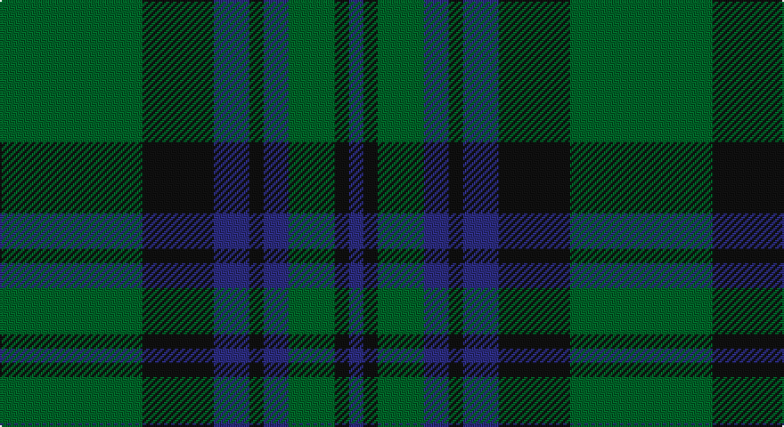

This page is one **sett** — a single exact thread-count. It belongs to the [tartan](/setts/g40k20db10k4db7g13k4db4/)
(the same proportion at any scale), whose colour order is pattern [BKGBKBKG](/stripes/bkgbkbkg/).

Part of the [Letham](/tartans/letham/) tartan — the named design grouping this sett with its other cloths.

Sourced from house-of-tartan.  It is a [8 stripe tartan](/stripes/stripes8/).

Original link http://www.house-of-tartan.scotland.net/house/TartanViewjs.asp?colr=Def&tnam=6718

## Provenance

Earliest known date: pre 2005 Jimmy said, in his recording application, "To allow my family to wear a single tartan"

## Also known as

This cloth is also recorded under:

- Letham Personal

## Thread count
G/80 K40 DB20 K8 DB14 G26 K8 DB/8

One full sett is **320 threads**.

## Palette

Palette: <strong>Tartan Register</strong> <small style="color:#888">(2 of 3 colours)</small>
<table><thead><tr><th>Colour</th><th>Threads</th><th>Shade</th><th>Base</th><th>OKLCh</th></tr></thead><tbody><tr><td>G/</td><td style="text-align:right;font-variant-numeric:tabular-nums">80</td><td><code style="background-color:#006428;">#006428</code> <small style="color:#888">#006428</small></td><td>G <code style="background-color:#006100;">#006100</code></td><td><small style="color:#888">oklch(43.9% 0.124 149.0)</small></td></tr><tr><td>K</td><td style="text-align:right;font-variant-numeric:tabular-nums">40</td><td><code style="background-color:#101010;">#101010</code> <small style="color:#888">#101010</small></td><td>K <code style="background-color:#000000;">#000000</code></td><td><small style="color:#888">oklch(17.3% 0.000 89.9)</small></td></tr><tr><td>DB</td><td style="text-align:right;font-variant-numeric:tabular-nums">20</td><td><code style="background-color:#2C2C80;">#2C2C80</code> <small style="color:#888">#2C2C80</small></td><td>B <code style="background-color:#2A418A;">#2A418A</code></td><td><small style="color:#888">oklch(35.0% 0.138 276.6)</small></td></tr><tr><td>K</td><td style="text-align:right;font-variant-numeric:tabular-nums">8</td><td><code style="background-color:#101010;">#101010</code> <small style="color:#888">#101010</small></td><td>K <code style="background-color:#000000;">#000000</code></td><td><small style="color:#888">oklch(17.3% 0.000 89.9)</small></td></tr><tr><td>DB</td><td style="text-align:right;font-variant-numeric:tabular-nums">14</td><td><code style="background-color:#2C2C80;">#2C2C80</code> <small style="color:#888">#2C2C80</small></td><td>B <code style="background-color:#2A418A;">#2A418A</code></td><td><small style="color:#888">oklch(35.0% 0.138 276.6)</small></td></tr><tr><td>G</td><td style="text-align:right;font-variant-numeric:tabular-nums">26</td><td><code style="background-color:#006428;">#006428</code> <small style="color:#888">#006428</small></td><td>G <code style="background-color:#006100;">#006100</code></td><td><small style="color:#888">oklch(43.9% 0.124 149.0)</small></td></tr><tr><td>K</td><td style="text-align:right;font-variant-numeric:tabular-nums">8</td><td><code style="background-color:#101010;">#101010</code> <small style="color:#888">#101010</small></td><td>K <code style="background-color:#000000;">#000000</code></td><td><small style="color:#888">oklch(17.3% 0.000 89.9)</small></td></tr><tr><td>DB/</td><td style="text-align:right;font-variant-numeric:tabular-nums">8</td><td><code style="background-color:#2C2C80;">#2C2C80</code> <small style="color:#888">#2C2C80</small></td><td>B <code style="background-color:#2A418A;">#2A418A</code></td><td><small style="color:#888">oklch(35.0% 0.138 276.6)</small></td></tr></tbody></table>

# Sample pattern

## Compared to the master

This cloth is one sett of its design; the master sett (the exemplar the design is anchored on) is below for comparison.

<figure style="margin:0"><figcaption style="color:#888;font-size:smaller">this sett</figcaption></figure>
<figure style="margin:0"><figcaption style="color:#888;font-size:smaller"><a href="/setts/g40k20t10k4t7g13k4t4/">master sett →</a></figcaption></figure>

## Nearest tartans

The nearest existing variants by ΔTartan distance, with this tartan at the top so the swatches line up against it.

ΔTartan

Tartan

Sett

—

<a href="/ttd/edit/#slug=g40k20db10k4db7g13k4db4~x2">Letham Personal Tartan</a> <a class="nn-out" href="/variants/s8/g40k20db10k4db7g13k4db4~x2/" title="open its dictionary page">↗</a>

1.11

<a href="/ttd/edit/#slug=r2db10g1db2g1db2g8r1g2~x4&amp;base=g40k20db10k4db7g13k4db4~x2">Brown, Barnaby (Personal)</a> <a class="nn-out" href="/variants/s9/r2db10g1db2g1db2g8r1g2~x4/" title="open its dictionary page">↗</a>

1.19

<a href="/ttd/edit/#slug=g40k20t10k4t7g13k4t4~x2&amp;base=g40k20db10k4db7g13k4db4~x2">Letham (S.Australia)</a> <a class="nn-out" href="/variants/s8/g40k20t10k4t7g13k4t4~x2/" title="open its dictionary page">↗</a>

1.22

<a href="/ttd/edit/#slug=db5k9g7k3g7k3g7k25g3~x2&amp;base=g40k20db10k4db7g13k4db4~x2">Menez Du</a> <a class="nn-out" href="/variants/s9/db5k9g7k3g7k3g7k25g3~x2/" title="open its dictionary page">↗</a>

1.28

<a href="/ttd/edit/#slug=g14r2g2r3g7db12g2dr2~x2&amp;base=g40k20db10k4db7g13k4db4~x2">Glen Nevis #3</a> <a class="nn-out" href="/variants/s8/g14r2g2r3g7db12g2dr2~x2/" title="open its dictionary page">↗</a>

1.29

<a href="/variants/s10/g25db10dy3db2dy2db6~x2/">Inkster</a>

1.34

<a href="/ttd/edit/#slug=dg2r1dg8db2dg1db2dg1db10r2~x4&amp;base=g40k20db10k4db7g13k4db4~x2">Barnaby Brown Pibroch</a> <a class="nn-out" href="/variants/s9/dg2r1dg8db2dg1db2dg1db10r2~x4/" title="open its dictionary page">↗</a>

1.35

<a href="/ttd/edit/#slug=r1k6g1k1g8k1g8db1g1db6r1~x2&amp;base=g40k20db10k4db7g13k4db4~x2">Davidson</a> <a class="nn-out" href="/variants/s11/r1k6g1k1g8k1g8db1g1db6r1~x2/" title="open its dictionary page">↗</a>

1.35

<a href="/ttd/edit/#slug=r1k6g1k1g8k1g8db1g1db6r1~x4&amp;base=g40k20db10k4db7g13k4db4~x2">Davidson - 1842 (Clan)</a> <a class="nn-out" href="/variants/s11/r1k6g1k1g8k1g8db1g1db6r1~x4/" title="open its dictionary page">↗</a>

1.37

<a href="/ttd/edit/#slug=dg2k3ly1k3dg2db8dg16k1~x4&amp;base=g40k20db10k4db7g13k4db4~x2">Harley (Leslie), Robert</a> <a class="nn-out" href="/variants/s8/dg2k3ly1k3dg2db8dg16k1~x4/" title="open its dictionary page">↗</a>

1.37

<a href="/ttd/edit/#slug=dg4db12r3db12dg32w4~x2&amp;base=g40k20db10k4db7g13k4db4~x2">MacIntyre</a> <a class="nn-out" href="/variants/s6/dg4db12r3db12dg32w4~x2/" title="open its dictionary page">↗</a>

## Neighbour map

Every grey dot is one of 14360 variants placed by the first two principal components of the ΔTartan feature space (44% of its variance). Red is this tartan; blue dots are its nearest — click one to open its page.

<svg viewBox="0 0 640 380" role="img" style="max-width:100%;height:auto;border:1px solid #e0e0e0;border-radius:4px;display:block" xmlns="http://www.w3.org/2000/svg"><image href="/nn/cloud.v1.png" width="640" height="380"/><a href="/variants/s9/r2db10g1db2g1db2g8r1g2~x4/"><circle cx="319.2" cy="220.1" r="4" fill="#3465a4"><title>Brown, Barnaby (Personal)</title></circle></a><a href="/variants/s8/g40k20t10k4t7g13k4t4~x2/"><circle cx="299.3" cy="227.5" r="4" fill="#3465a4"><title>Letham (S.Australia)</title></circle></a><a href="/variants/s9/db5k9g7k3g7k3g7k25g3~x2/"><circle cx="364.9" cy="252.0" r="4" fill="#3465a4"><title>Menez Du</title></circle></a><a href="/variants/s8/g14r2g2r3g7db12g2dr2~x2/"><circle cx="322.2" cy="242.1" r="4" fill="#3465a4"><title>Glen Nevis #3</title></circle></a><a href="/variants/s10/g25db10dy3db2dy2db6~x2/"><circle cx="313.6" cy="206.6" r="4" fill="#3465a4"><title>Inkster</title></circle></a><a href="/variants/s9/dg2r1dg8db2dg1db2dg1db10r2~x4/"><circle cx="328.0" cy="230.3" r="4" fill="#3465a4"><title>Barnaby Brown Pibroch</title></circle></a><a href="/variants/s11/r1k6g1k1g8k1g8db1g1db6r1~x2/"><circle cx="271.9" cy="208.2" r="4" fill="#3465a4"><title>Davidson</title></circle></a><a href="/variants/s11/r1k6g1k1g8k1g8db1g1db6r1~x4/"><circle cx="271.9" cy="208.2" r="4" fill="#3465a4"><title>Davidson - 1842 (Clan)</title></circle></a><a href="/variants/s8/dg2k3ly1k3dg2db8dg16k1~x4/"><circle cx="346.1" cy="196.8" r="4" fill="#3465a4"><title>Harley (Leslie), Robert</title></circle></a><a href="/variants/s6/dg4db12r3db12dg32w4~x2/"><circle cx="323.0" cy="226.7" r="4" fill="#3465a4"><title>MacIntyre</title></circle></a><circle cx="331.2" cy="243.3" r="5" fill="#c00000"/></svg>

ID: /variants/s8/g40k20db10k4db7g13k4db4~x2/
