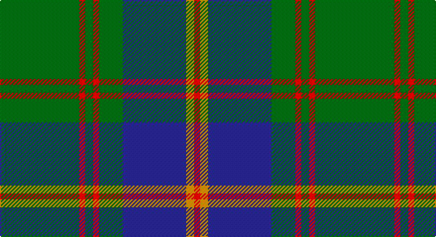

This page is one **sett** — a single exact thread-count. It belongs to the [tartan](/setts/g40r3g4r3g12db32lo4r3/)
(the same proportion at any scale), whose colour order is pattern [GRGRGBYR](/stripes/grgrgbyr/).

Sourced from register-of-tartans.  It is a [8 stripe tartan](/stripes/stripes8/).

Original link https://www.tartanregister.gov.uk/tartanDetails.aspx?ref=4187

## Also known as

This cloth is also recorded under:

- U.S. Marine Corps
- US Marine Corps

2 attestations — the source records this cloth was collapsed from (oldest owns this page)

<ul>
<li>01/01/1986 — US Marine Corps (register-of-tartans, <a href="https://www.tartanregister.gov.uk/tartanDetails.aspx?ref=4187">record</a>)</li>
<li>undated — Leatherneck (register-of-tartans, <a href="https://www.tartanregister.gov.uk/tartanDetails.aspx?ref=5022">record</a>)</li>
</ul>

## Register references

External register numbers recorded for this tartan.

- Scottish Register of Tartans: [5022](https://www.tartanregister.gov.uk/tartanDetails.aspx?ref=5022)
- Scottish Tartans Authority (ITI): 3612
- Scottish Tartans World Register: 975

## Thread count
G/80 R6 G8 R6 G24 DB64 DY8 R/6

One full sett is **318 threads**.

## Palette

Palette: <strong>Tartan Register</strong> <small style="color:#888">(3 of 4 colours)</small>
<table><thead><tr><th>Colour</th><th>Threads</th><th>Shade</th><th>Base</th><th>OKLCh</th></tr></thead><tbody><tr><td>G/</td><td style="text-align:right;font-variant-numeric:tabular-nums">80</td><td><code style="background-color:#006818;">#006818</code> <small style="color:#888">#006818</small></td><td>G <code style="background-color:#006100;">#006100</code></td><td><small style="color:#888">oklch(45.0% 0.142 145.0)</small></td></tr><tr><td>R</td><td style="text-align:right;font-variant-numeric:tabular-nums">6</td><td><code style="background-color:#C80000;">#C80000</code> <small style="color:#888">#C80000</small></td><td>R <code style="background-color:#CC0000;">#CC0000</code></td><td><small style="color:#888">oklch(52.3% 0.215 29.2)</small></td></tr><tr><td>G</td><td style="text-align:right;font-variant-numeric:tabular-nums">8</td><td><code style="background-color:#006818;">#006818</code> <small style="color:#888">#006818</small></td><td>G <code style="background-color:#006100;">#006100</code></td><td><small style="color:#888">oklch(45.0% 0.142 145.0)</small></td></tr><tr><td>R</td><td style="text-align:right;font-variant-numeric:tabular-nums">6</td><td><code style="background-color:#C80000;">#C80000</code> <small style="color:#888">#C80000</small></td><td>R <code style="background-color:#CC0000;">#CC0000</code></td><td><small style="color:#888">oklch(52.3% 0.215 29.2)</small></td></tr><tr><td>G</td><td style="text-align:right;font-variant-numeric:tabular-nums">24</td><td><code style="background-color:#006818;">#006818</code> <small style="color:#888">#006818</small></td><td>G <code style="background-color:#006100;">#006100</code></td><td><small style="color:#888">oklch(45.0% 0.142 145.0)</small></td></tr><tr><td>DB</td><td style="text-align:right;font-variant-numeric:tabular-nums">64</td><td><code style="background-color:#2C2C80;">#2C2C80</code> <small style="color:#888">#2C2C80</small></td><td>B <code style="background-color:#2A418A;">#2A418A</code></td><td><small style="color:#888">oklch(35.0% 0.138 276.6)</small></td></tr><tr><td>DY</td><td style="text-align:right;font-variant-numeric:tabular-nums">8</td><td><code style="background-color:#D09800;">#D09800</code> <small style="color:#888">#D09800</small></td><td>Y <code style="background-color:#F2BF00;">#F2BF00</code></td><td><small style="color:#888">oklch(71.4% 0.147 82.1)</small></td></tr><tr><td>R/</td><td style="text-align:right;font-variant-numeric:tabular-nums">6</td><td><code style="background-color:#C80000;">#C80000</code> <small style="color:#888">#C80000</small></td><td>R <code style="background-color:#CC0000;">#CC0000</code></td><td><small style="color:#888">oklch(52.3% 0.215 29.2)</small></td></tr></tbody></table>

# Sample pattern

## Nearest tartans

The nearest existing variants by ΔTartan distance, with this tartan at the top so the swatches line up against it.

ΔTartan

Tartan

Sett

—

<a href="/ttd/edit/#slug=g40r3g4r3g12db32lo4r3~x2">US Marine Corps</a> <a class="nn-out" href="/variants/s8/g40r3g4r3g12db32lo4r3~x2/" title="open its dictionary page">↗</a>

0.26

<a href="/ttd/edit/#slug=dg40r3dg4r3dg12db32ly4r3~x2&amp;base=g40r3g4r3g12db32lo4r3~x2">U.S. Marine Corps (Military?)</a> <a class="nn-out" href="/variants/s8/dg40r3dg4r3dg12db32ly4r3~x2/" title="open its dictionary page">↗</a>

0.36

<a href="/ttd/edit/#slug=g28r2g2r2g8db24ly3r2~x2&amp;base=g40r3g4r3g12db32lo4r3~x2">Leatherneck U.S.Marine Corps Corporate Tartan</a> <a class="nn-out" href="/variants/s8/g28r2g2r2g8db24ly3r2~x2/" title="open its dictionary page">↗</a>

0.73

<a href="/ttd/edit/#slug=g28r2g2r2g8db24y3r2~x2&amp;base=g40r3g4r3g12db32lo4r3~x2">Leatherneck, U.S.Marine Corps</a> <a class="nn-out" href="/variants/s8/g28r2g2r2g8db24y3r2~x2/" title="open its dictionary page">↗</a>

0.81

<a href="/ttd/edit/#slug=g2k3ly1k3g2db8g16k1~x4&amp;base=g40r3g4r3g12db32lo4r3~x2">Harley (Leslie), Robert</a> <a class="nn-out" href="/variants/s8/g2k3ly1k3g2db8g16k1~x4/" title="open its dictionary page">↗</a>

0.83

<a href="/ttd/edit/#slug=g24k2db3k2db8r2~x2&amp;base=g40r3g4r3g12db32lo4r3~x2">Shaw (Clan 1)</a> <a class="nn-out" href="/variants/s6/g24k2db3k2db8r2~x2/" title="open its dictionary page">↗</a>

0.88

<a href="/ttd/edit/#slug=r2db12w1db1g1r1g7db1g12w1~x4&amp;base=g40r3g4r3g12db32lo4r3~x2">Tennessee State (US State)</a> <a class="nn-out" href="/variants/s10/r2db12w1db1g1r1g7db1g12w1~x4/" title="open its dictionary page">↗</a>

0.89

<a href="/ttd/edit/#slug=dg38w2dg6db24o6db2o3db2~x2&amp;base=g40r3g4r3g12db32lo4r3~x2">MacAuliffe/McAucliffe</a> <a class="nn-out" href="/variants/s8/dg38w2dg6db24o6db2o3db2~x2/" title="open its dictionary page">↗</a>

1.04

<a href="/ttd/edit/#slug=y17t2ly2t2k21t2k3y30k2t2k4~x2&amp;base=g40r3g4r3g12db32lo4r3~x2">Fort William</a> <a class="nn-out" href="/variants/s11/y17t2ly2t2k21t2k3y30k2t2k4~x2/" title="open its dictionary page">↗</a>

1.07

<a href="/ttd/edit/#slug=r4g4k2g31k10ly3g5k11g6k3~x2&amp;base=g40r3g4r3g12db32lo4r3~x2">MacArthur-Fox Green</a> <a class="nn-out" href="/variants/s10/r4g4k2g31k10ly3g5k11g6k3~x2/" title="open its dictionary page">↗</a>

1.11

<a href="/ttd/edit/#slug=db16w1db1w1db8g16r1db2~x2&amp;base=g40r3g4r3g12db32lo4r3~x2">Roxburgh</a> <a class="nn-out" href="/variants/s8/db16w1db1w1db8g16r1db2~x2/" title="open its dictionary page">↗</a>

## Neighbour map

Every grey dot is one of 14360 variants placed by the first two principal components of the ΔTartan feature space (44% of its variance). Red is this tartan; blue dots are its nearest — click one to open its page.

<svg viewBox="0 0 640 380" role="img" style="max-width:100%;height:auto;border:1px solid #e0e0e0;border-radius:4px;display:block" xmlns="http://www.w3.org/2000/svg"><image href="/nn/cloud.v1.png" width="640" height="380"/><a href="/variants/s8/dg40r3dg4r3dg12db32ly4r3~x2/"><circle cx="342.1" cy="189.2" r="4" fill="#3465a4"><title>U.S. Marine Corps (Military?)</title></circle></a><a href="/variants/s8/g28r2g2r2g8db24ly3r2~x2/"><circle cx="330.0" cy="181.0" r="4" fill="#3465a4"><title>Leatherneck U.S.Marine Corps Corporate Tartan</title></circle></a><a href="/variants/s8/g28r2g2r2g8db24y3r2~x2/"><circle cx="340.8" cy="187.4" r="4" fill="#3465a4"><title>Leatherneck, U.S.Marine Corps</title></circle></a><a href="/variants/s8/g2k3ly1k3g2db8g16k1~x4/"><circle cx="337.6" cy="189.5" r="4" fill="#3465a4"><title>Harley (Leslie), Robert</title></circle></a><a href="/variants/s6/g24k2db3k2db8r2~x2/"><circle cx="369.4" cy="209.1" r="4" fill="#3465a4"><title>Shaw (Clan 1)</title></circle></a><a href="/variants/s10/r2db12w1db1g1r1g7db1g12w1~x4/"><circle cx="300.8" cy="173.4" r="4" fill="#3465a4"><title>Tennessee State (US State)</title></circle></a><a href="/variants/s8/dg38w2dg6db24o6db2o3db2~x2/"><circle cx="364.2" cy="179.5" r="4" fill="#3465a4"><title>MacAuliffe/McAucliffe</title></circle></a><a href="/variants/s11/y17t2ly2t2k21t2k3y30k2t2k4~x2/"><circle cx="339.5" cy="161.8" r="4" fill="#3465a4"><title>Fort William</title></circle></a><a href="/variants/s10/r4g4k2g31k10ly3g5k11g6k3~x2/"><circle cx="349.3" cy="176.5" r="4" fill="#3465a4"><title>MacArthur-Fox Green</title></circle></a><a href="/variants/s8/db16w1db1w1db8g16r1db2~x2/"><circle cx="368.9" cy="181.2" r="4" fill="#3465a4"><title>Roxburgh</title></circle></a><circle cx="343.4" cy="189.5" r="5" fill="#c00000"/></svg>

ID: /variants/s8/g40r3g4r3g12db32lo4r3~x2/
