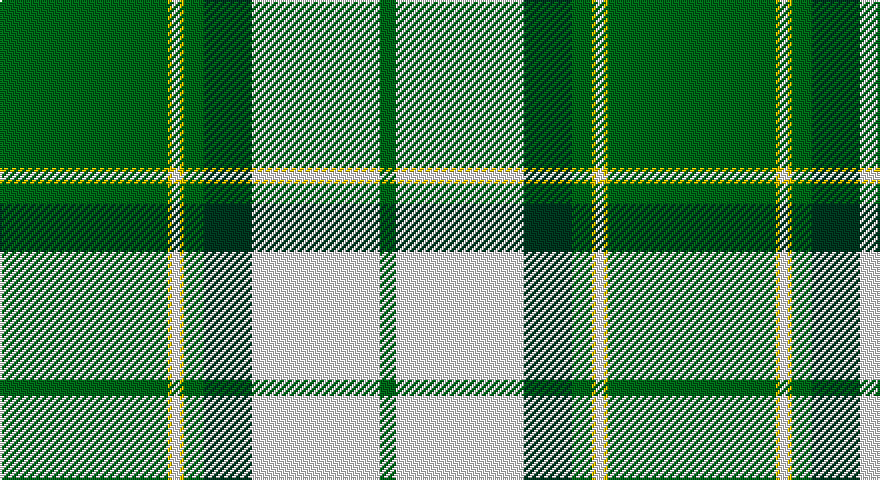

This page is one **sett** — a single exact thread-count. It belongs to the [tartan](/setts/g42ly1w2ly1g5dg12w32g4/)
(the same proportion at any scale), whose colour order is pattern [GWGGYWYG](/stripes/gwggywyg/).

Part of the [Longniddry](/tartans/longniddry/) tartan — the named design grouping this sett with its other cloths.

Sourced from register-of-tartans.  It is a [8 stripe tartan](/stripes/stripes8/).

Original link https://www.tartanregister.gov.uk/tartanDetails.aspx?ref=2209

## Also known as

This cloth is also recorded under:

- Longniddry Green
- Longniddry Green Error
- Longniddry, Green
- Longniddry, Green Error

2 attestations — the source records this cloth was collapsed from (oldest owns this page)

<ul>
<li>01/01/2002 — Longniddry Green Error (Dance) (register-of-tartans, <a href="https://www.tartanregister.gov.uk/tartanDetails.aspx?ref=2209">record</a>)</li>
<li>pre 2002 — Longniddry, Green Error (Dance) (tartans-authority, <a href="http://www.tartansauthority.com/tartan-ferret/display/6520/">record</a>)</li>
</ul>

## Register references

External register numbers recorded for this tartan.

- Scottish Register of Tartans: [2209](https://www.tartanregister.gov.uk/tartanDetails.aspx?ref=2209)
- Scottish Tartans Authority (ITI): 6520

## Thread count
G/84 Y2 W4 Y2 G10 DG24 W64 G/8

One full sett is **304 threads**.

## Palette

Palette: <strong>Tartan Register</strong>
<table><thead><tr><th>Colour</th><th>Threads</th><th>Shade</th><th>Base</th><th>OKLCh</th></tr></thead><tbody><tr><td>G/</td><td style="text-align:right;font-variant-numeric:tabular-nums">84</td><td><code style="background-color:#006818;">#006818</code> <small style="color:#888">#006818</small></td><td>G <code style="background-color:#006100;">#006100</code></td><td><small style="color:#888">oklch(45.0% 0.142 145.0)</small></td></tr><tr><td>Y</td><td style="text-align:right;font-variant-numeric:tabular-nums">2</td><td><code style="background-color:#E8C000;">#E8C000</code> <small style="color:#888">#E8C000</small></td><td>Y <code style="background-color:#F2BF00;">#F2BF00</code></td><td><small style="color:#888">oklch(81.9% 0.168 93.7)</small></td></tr><tr><td>W</td><td style="text-align:right;font-variant-numeric:tabular-nums">4</td><td><code style="background-color:#FCFCFC;">#FCFCFC</code> <small style="color:#888">#FCFCFC</small></td><td>W <code style="background-color:#F7F7F7;">#F7F7F7</code></td><td><small style="color:#888">oklch(99.1% 0.000 89.9)</small></td></tr><tr><td>Y</td><td style="text-align:right;font-variant-numeric:tabular-nums">2</td><td><code style="background-color:#E8C000;">#E8C000</code> <small style="color:#888">#E8C000</small></td><td>Y <code style="background-color:#F2BF00;">#F2BF00</code></td><td><small style="color:#888">oklch(81.9% 0.168 93.7)</small></td></tr><tr><td>G</td><td style="text-align:right;font-variant-numeric:tabular-nums">10</td><td><code style="background-color:#006818;">#006818</code> <small style="color:#888">#006818</small></td><td>G <code style="background-color:#006100;">#006100</code></td><td><small style="color:#888">oklch(45.0% 0.142 145.0)</small></td></tr><tr><td>DG</td><td style="text-align:right;font-variant-numeric:tabular-nums">24</td><td><code style="background-color:#003820;">#003820</code> <small style="color:#888">#003820</small></td><td>G <code style="background-color:#006100;">#006100</code></td><td><small style="color:#888">oklch(30.0% 0.070 158.3)</small></td></tr><tr><td>W</td><td style="text-align:right;font-variant-numeric:tabular-nums">64</td><td><code style="background-color:#FCFCFC;">#FCFCFC</code> <small style="color:#888">#FCFCFC</small></td><td>W <code style="background-color:#F7F7F7;">#F7F7F7</code></td><td><small style="color:#888">oklch(99.1% 0.000 89.9)</small></td></tr><tr><td>G/</td><td style="text-align:right;font-variant-numeric:tabular-nums">8</td><td><code style="background-color:#006818;">#006818</code> <small style="color:#888">#006818</small></td><td>G <code style="background-color:#006100;">#006100</code></td><td><small style="color:#888">oklch(45.0% 0.142 145.0)</small></td></tr></tbody></table>

# Sample pattern

## Nearest tartans

The nearest existing variants by ΔTartan distance, with this tartan at the top so the swatches line up against it.

ΔTartan

Tartan

Sett

—

<a href="/ttd/edit/#slug=g42ly1w2ly1g5dg12w32g4~x2">Longniddry Green Error (Dance)</a> <a class="nn-out" href="/variants/s8/g42ly1w2ly1g5dg12w32g4~x2/" title="open its dictionary page">↗</a>

1.07

<a href="/ttd/edit/#slug=gi42g2w2g2gi5dt12w32gi4~x2&amp;base=g42ly1w2ly1g5dg12w32g4~x2">Longniddry Green (Dance)</a> <a class="nn-out" href="/variants/s8/gi42g2w2g2gi5dt12w32gi4~x2/" title="open its dictionary page">↗</a>

1.18

<a href="/ttd/edit/#slug=gi42g2w2g2gi5dg12w32gi4~x2&amp;base=g42ly1w2ly1g5dg12w32g4~x2">Longniddry Green District Tartan</a> <a class="nn-out" href="/variants/s8/gi42g2w2g2gi5dg12w32gi4~x2/" title="open its dictionary page">↗</a>

1.25

<a href="/ttd/edit/#slug=ly6dg36w5b4w30b1w2~x2&amp;base=g42ly1w2ly1g5dg12w32g4~x2">Pearce Scotch Plaid 4 (Fashion)</a> <a class="nn-out" href="/variants/s7/ly6dg36w5b4w30b1w2~x2/" title="open its dictionary page">↗</a>

1.29

<a href="/ttd/edit/#slug=dg44w18dg6w11dt1o4~x2&amp;base=g42ly1w2ly1g5dg12w32g4~x2">Westfalia (Corporate)</a> <a class="nn-out" href="/variants/s6/dg44w18dg6w11dt1o4~x2/" title="open its dictionary page">↗</a>

1.29

<a href="/ttd/edit/#slug=g42gi2w2gi2g5dg12w32g4~x2&amp;base=g42ly1w2ly1g5dg12w32g4~x2">Longniddry, Green</a> <a class="nn-out" href="/variants/s8/g42gi2w2gi2g5dg12w32g4~x2/" title="open its dictionary page">↗</a>

1.43

<a href="/ttd/edit/#slug=gi39r2w1r2db14w14gi2g10~x2&amp;base=g42ly1w2ly1g5dg12w32g4~x2">Southwell (Australian) (Personal)</a> <a class="nn-out" href="/variants/s8/gi39r2w1r2db14w14gi2g10~x2/" title="open its dictionary page">↗</a>

1.53

<a href="/ttd/edit/#slug=n4w2n1w36g21ly4~x2&amp;base=g42ly1w2ly1g5dg12w32g4~x2">Skye, Green (Dance)</a> <a class="nn-out" href="/variants/s6/n4w2n1w36g21ly4~x2/" title="open its dictionary page">↗</a>

1.53

<a href="/ttd/edit/#slug=k4ly1g2ly1g32lt1g3lt32db3~x2&amp;base=g42ly1w2ly1g5dg12w32g4~x2">McClurg, William Thomas (Personal)</a> <a class="nn-out" href="/variants/s9/k4ly1g2ly1g32lt1g3lt32db3~x2/" title="open its dictionary page">↗</a>

1.60

<a href="/ttd/edit/#slug=r6g2w21ly2k8ly2g32w1k3~x2&amp;base=g42ly1w2ly1g5dg12w32g4~x2">Fiander, Julian (Personal)</a> <a class="nn-out" href="/variants/s9/r6g2w21ly2k8ly2g32w1k3~x2/" title="open its dictionary page">↗</a>

1.64

<a href="/ttd/edit/#slug=g30k2w3k1w4t6w2~x4&amp;base=g42ly1w2ly1g5dg12w32g4~x2">Madras 2 (Fashion)</a> <a class="nn-out" href="/variants/s7/g30k2w3k1w4t6w2~x4/" title="open its dictionary page">↗</a>

## Neighbour map

Every grey dot is one of 14360 variants placed by the first two principal components of the ΔTartan feature space (44% of its variance). Red is this tartan; blue dots are its nearest — click one to open its page.

<svg viewBox="0 0 640 380" role="img" style="max-width:100%;height:auto;border:1px solid #e0e0e0;border-radius:4px;display:block" xmlns="http://www.w3.org/2000/svg"><image href="/nn/cloud.v1.png" width="640" height="380"/><a href="/variants/s8/gi42g2w2g2gi5dt12w32gi4~x2/"><circle cx="265.5" cy="129.7" r="4" fill="#3465a4"><title>Longniddry Green (Dance)</title></circle></a><a href="/variants/s8/gi42g2w2g2gi5dg12w32gi4~x2/"><circle cx="279.7" cy="138.8" r="4" fill="#3465a4"><title>Longniddry Green District Tartan</title></circle></a><a href="/variants/s7/ly6dg36w5b4w30b1w2~x2/"><circle cx="268.8" cy="114.9" r="4" fill="#3465a4"><title>Pearce Scotch Plaid 4 (Fashion)</title></circle></a><a href="/variants/s6/dg44w18dg6w11dt1o4~x2/"><circle cx="361.5" cy="127.7" r="4" fill="#3465a4"><title>Westfalia (Corporate)</title></circle></a><a href="/variants/s8/g42gi2w2gi2g5dg12w32g4~x2/"><circle cx="280.1" cy="139.1" r="4" fill="#3465a4"><title>Longniddry, Green</title></circle></a><a href="/variants/s8/gi39r2w1r2db14w14gi2g10~x2/"><circle cx="252.9" cy="101.7" r="4" fill="#3465a4"><title>Southwell (Australian) (Personal)</title></circle></a><a href="/variants/s6/n4w2n1w36g21ly4~x2/"><circle cx="335.6" cy="121.2" r="4" fill="#3465a4"><title>Skye, Green (Dance)</title></circle></a><a href="/variants/s9/k4ly1g2ly1g32lt1g3lt32db3~x2/"><circle cx="277.6" cy="91.3" r="4" fill="#3465a4"><title>McClurg, William Thomas (Personal)</title></circle></a><a href="/variants/s9/r6g2w21ly2k8ly2g32w1k3~x2/"><circle cx="216.3" cy="87.0" r="4" fill="#3465a4"><title>Fiander, Julian (Personal)</title></circle></a><a href="/variants/s7/g30k2w3k1w4t6w2~x4/"><circle cx="380.6" cy="130.6" r="4" fill="#3465a4"><title>Madras 2 (Fashion)</title></circle></a><circle cx="302.8" cy="103.9" r="5" fill="#c00000"/></svg>

ID: /variants/s8/g42ly1w2ly1g5dg12w32g4~x2/
