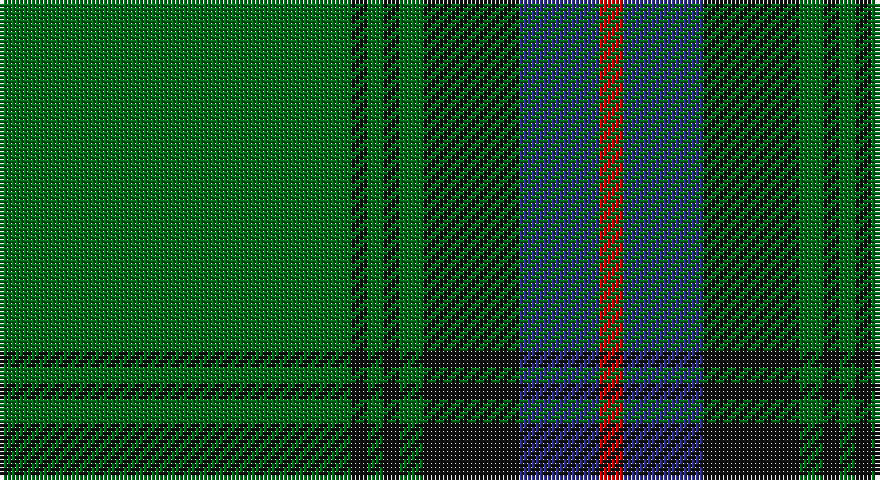

This page is one **sett** — a single exact thread-count. It belongs to the [tartan](/setts/g44k2g2k2g3k12db10r3/)
(the same proportion at any scale), whose colour order is pattern [GKGKGKBR](/stripes/gkgkgkbr/).

Sourced from house-of-tartan.  It is a [8 stripe tartan](/stripes/stripes8/).

Original link http://www.house-of-tartan.scotland.net/house/TartanViewjs.asp?colr=Def&tnam=2232

## Provenance

Earliest known date: 1842 Should have a white line (?).

## Thread count
G/88 K4 G4 K4 G6 K24 DB20 R/6

One full sett is **218 threads**.

## Palette

Palette: <strong>Tartan Register</strong>
<table><thead><tr><th>Colour</th><th>Threads</th><th>Shade</th><th>Base</th><th>OKLCh</th></tr></thead><tbody><tr><td>G/</td><td style="text-align:right;font-variant-numeric:tabular-nums">88</td><td><code style="background-color:#006818;">#006818</code> <small style="color:#888">#006818</small></td><td>G <code style="background-color:#006100;">#006100</code></td><td><small style="color:#888">oklch(45.0% 0.142 145.0)</small></td></tr><tr><td>K</td><td style="text-align:right;font-variant-numeric:tabular-nums">4</td><td><code style="background-color:#101010;">#101010</code> <small style="color:#888">#101010</small></td><td>K <code style="background-color:#000000;">#000000</code></td><td><small style="color:#888">oklch(17.3% 0.000 89.9)</small></td></tr><tr><td>G</td><td style="text-align:right;font-variant-numeric:tabular-nums">4</td><td><code style="background-color:#006818;">#006818</code> <small style="color:#888">#006818</small></td><td>G <code style="background-color:#006100;">#006100</code></td><td><small style="color:#888">oklch(45.0% 0.142 145.0)</small></td></tr><tr><td>K</td><td style="text-align:right;font-variant-numeric:tabular-nums">4</td><td><code style="background-color:#101010;">#101010</code> <small style="color:#888">#101010</small></td><td>K <code style="background-color:#000000;">#000000</code></td><td><small style="color:#888">oklch(17.3% 0.000 89.9)</small></td></tr><tr><td>G</td><td style="text-align:right;font-variant-numeric:tabular-nums">6</td><td><code style="background-color:#006818;">#006818</code> <small style="color:#888">#006818</small></td><td>G <code style="background-color:#006100;">#006100</code></td><td><small style="color:#888">oklch(45.0% 0.142 145.0)</small></td></tr><tr><td>K</td><td style="text-align:right;font-variant-numeric:tabular-nums">24</td><td><code style="background-color:#101010;">#101010</code> <small style="color:#888">#101010</small></td><td>K <code style="background-color:#000000;">#000000</code></td><td><small style="color:#888">oklch(17.3% 0.000 89.9)</small></td></tr><tr><td>DB</td><td style="text-align:right;font-variant-numeric:tabular-nums">20</td><td><code style="background-color:#2C2C80;">#2C2C80</code> <small style="color:#888">#2C2C80</small></td><td>B <code style="background-color:#2A418A;">#2A418A</code></td><td><small style="color:#888">oklch(35.0% 0.138 276.6)</small></td></tr><tr><td>R/</td><td style="text-align:right;font-variant-numeric:tabular-nums">6</td><td><code style="background-color:#C80000;">#C80000</code> <small style="color:#888">#C80000</small></td><td>R <code style="background-color:#CC0000;">#CC0000</code></td><td><small style="color:#888">oklch(52.3% 0.215 29.2)</small></td></tr></tbody></table>

# Sample pattern

## Nearest tartans

The nearest existing variants by ΔTartan distance, with this tartan at the top so the swatches line up against it.

ΔTartan

Tartan

Sett

—

<a href="/ttd/edit/#slug=g44k2g2k2g3k12db10r3~x2">Celtic (New) Corporate Sport Tartan</a> <a class="nn-out" href="/variants/s8/g44k2g2k2g3k12db10r3~x2/" title="open its dictionary page">↗</a>

0.76

<a href="/ttd/edit/#slug=g2k1db6k11g26k1g1lo2~x2&amp;base=g44k2g2k2g3k12db10r3~x2">Mackie (2016)</a> <a class="nn-out" href="/variants/s8/g2k1db6k11g26k1g1lo2~x2/" title="open its dictionary page">↗</a>

1.05

<a href="/ttd/edit/#slug=db1k2db1k6db1k1g1k6g21ly1~x2&amp;base=g44k2g2k2g3k12db10r3~x2">Grand Lodge of Scotland (Corporate)</a> <a class="nn-out" href="/variants/s10/db1k2db1k6db1k1g1k6g21ly1~x2/" title="open its dictionary page">↗</a>

1.10

<a href="/ttd/edit/#slug=g50db20k3db2o2db5~x2&amp;base=g44k2g2k2g3k12db10r3~x2">St Andrews Hotel, Golf Resort, and SPA</a> <a class="nn-out" href="/variants/s6/g50db20k3db2o2db5~x2/" title="open its dictionary page">↗</a>

1.19

<a href="/ttd/edit/#slug=g50db20k3db2dy2db5~x2&amp;base=g44k2g2k2g3k12db10r3~x2">St Andrews Old Course Hotel Corporate Tartan</a> <a class="nn-out" href="/variants/s6/g50db20k3db2dy2db5~x2/" title="open its dictionary page">↗</a>

1.24

<a href="/ttd/edit/#slug=g2k3ly1k3g2db8g16k1~x4&amp;base=g44k2g2k2g3k12db10r3~x2">Harley (Leslie), Robert</a> <a class="nn-out" href="/variants/s8/g2k3ly1k3g2db8g16k1~x4/" title="open its dictionary page">↗</a>

1.25

<a href="/ttd/edit/#slug=k6g4lb3g44k32g3k3lo3k2g3~x2&amp;base=g44k2g2k2g3k12db10r3~x2">Smeaton Hunting (Name)</a> <a class="nn-out" href="/variants/s10/k6g4lb3g44k32g3k3lo3k2g3~x2/" title="open its dictionary page">↗</a>

1.26

<a href="/ttd/edit/#slug=g17t2y2t2k21t2k3g30k2t2k4~x2&amp;base=g44k2g2k2g3k12db10r3~x2">Fort William (District?)</a> <a class="nn-out" href="/variants/s11/g17t2y2t2k21t2k3g30k2t2k4~x2/" title="open its dictionary page">↗</a>

1.28

<a href="/ttd/edit/#slug=dg78dt13ly6r3ly5dg6dt9ly6~x2&amp;base=g44k2g2k2g3k12db10r3~x2">Walterström (2014)</a> <a class="nn-out" href="/variants/s8/dg78dt13ly6r3ly5dg6dt9ly6~x2/" title="open its dictionary page">↗</a>

1.29

<a href="/ttd/edit/#slug=gi17t2g2t2k21t2k3gi30k2t2k4~x2&amp;base=g44k2g2k2g3k12db10r3~x2">Fort William District Tartan</a> <a class="nn-out" href="/variants/s11/gi17t2g2t2k21t2k3gi30k2t2k4~x2/" title="open its dictionary page">↗</a>

1.33

<a href="/ttd/edit/#slug=dg20r1ly1r1lb1dg1r1lb1db5~x4&amp;base=g44k2g2k2g3k12db10r3~x2">Scotts Valley</a> <a class="nn-out" href="/variants/s9/dg20r1ly1r1lb1dg1r1lb1db5~x4/" title="open its dictionary page">↗</a>

## Neighbour map

Every grey dot is one of 14360 variants placed by the first two principal components of the ΔTartan feature space (44% of its variance). Red is this tartan; blue dots are its nearest — click one to open its page.

<svg viewBox="0 0 640 380" role="img" style="max-width:100%;height:auto;border:1px solid #e0e0e0;border-radius:4px;display:block" xmlns="http://www.w3.org/2000/svg"><image href="/nn/cloud.v1.png" width="640" height="380"/><a href="/variants/s8/g2k1db6k11g26k1g1lo2~x2/"><circle cx="380.2" cy="157.7" r="4" fill="#3465a4"><title>Mackie (2016)</title></circle></a><a href="/variants/s10/db1k2db1k6db1k1g1k6g21ly1~x2/"><circle cx="365.5" cy="148.2" r="4" fill="#3465a4"><title>Grand Lodge of Scotland (Corporate)</title></circle></a><a href="/variants/s6/g50db20k3db2o2db5~x2/"><circle cx="416.1" cy="173.6" r="4" fill="#3465a4"><title>St Andrews Hotel, Golf Resort, and SPA</title></circle></a><a href="/variants/s6/g50db20k3db2dy2db5~x2/"><circle cx="446.9" cy="189.2" r="4" fill="#3465a4"><title>St Andrews Old Course Hotel Corporate Tartan</title></circle></a><a href="/variants/s8/g2k3ly1k3g2db8g16k1~x4/"><circle cx="337.6" cy="189.5" r="4" fill="#3465a4"><title>Harley (Leslie), Robert</title></circle></a><a href="/variants/s10/k6g4lb3g44k32g3k3lo3k2g3~x2/"><circle cx="360.1" cy="146.2" r="4" fill="#3465a4"><title>Smeaton Hunting (Name)</title></circle></a><a href="/variants/s11/g17t2y2t2k21t2k3g30k2t2k4~x2/"><circle cx="339.7" cy="170.8" r="4" fill="#3465a4"><title>Fort William (District?)</title></circle></a><a href="/variants/s8/dg78dt13ly6r3ly5dg6dt9ly6~x2/"><circle cx="426.6" cy="136.8" r="4" fill="#3465a4"><title>Walterström (2014)</title></circle></a><a href="/variants/s11/gi17t2g2t2k21t2k3gi30k2t2k4~x2/"><circle cx="336.1" cy="169.2" r="4" fill="#3465a4"><title>Fort William District Tartan</title></circle></a><a href="/variants/s9/dg20r1ly1r1lb1dg1r1lb1db5~x4/"><circle cx="402.4" cy="123.1" r="4" fill="#3465a4"><title>Scotts Valley</title></circle></a><circle cx="419.3" cy="165.0" r="5" fill="#c00000"/></svg>

ID: /variants/s8/g44k2g2k2g3k12db10r3~x2/
