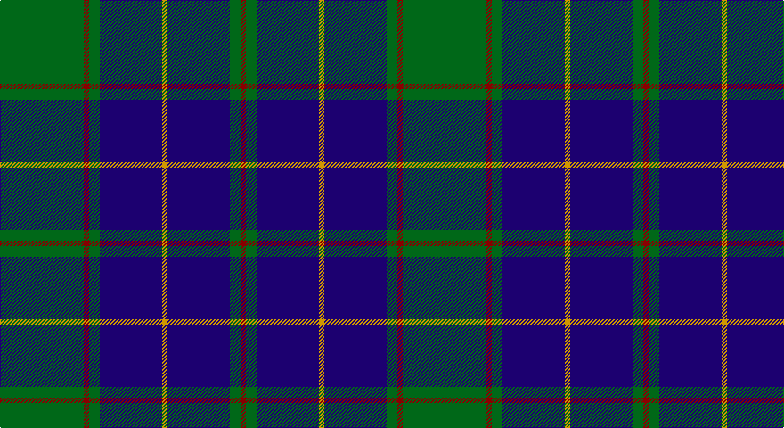

This page is one **sett** — a single exact thread-count. It belongs to the [tartan](/setts/g47r3g6db35lo3/)
(the same proportion at any scale), whose colour order is pattern [GRGBYBGR](/stripes/grgbybgr/).

Sourced from register-of-tartans.  It is a [8 stripe tartan](/stripes/stripes8/).

Original link https://www.tartanregister.gov.uk/tartanDetails.aspx?ref=1476

## Register references

External register numbers recorded for this tartan.

- Scottish Register of Tartans: [1476](https://www.tartanregister.gov.uk/tartanDetails.aspx?ref=1476)
- Scottish Tartans Authority (ITI): 2337
- Scottish Tartans World Register: 2337

## Thread count
G/94 DR6 G12 DB70 DY6 DB70 G12 DR/6

One full sett is **452 threads**.

## Palette

Palette: <strong>Tartan Register</strong> <small style="color:#888">(3 of 4 colours)</small>
<table><thead><tr><th>Colour</th><th>Threads</th><th>Shade</th><th>Base</th><th>OKLCh</th></tr></thead><tbody><tr><td>G/</td><td style="text-align:right;font-variant-numeric:tabular-nums">94</td><td><code style="background-color:#006818;">#006818</code> <small style="color:#888">#006818</small></td><td>G <code style="background-color:#006100;">#006100</code></td><td><small style="color:#888">oklch(45.0% 0.142 145.0)</small></td></tr><tr><td>DR</td><td style="text-align:right;font-variant-numeric:tabular-nums">6</td><td><code style="background-color:#880000;">#880000</code> <small style="color:#888">#880000</small></td><td>R <code style="background-color:#CC0000;">#CC0000</code></td><td><small style="color:#888">oklch(39.4% 0.162 29.2)</small></td></tr><tr><td>G</td><td style="text-align:right;font-variant-numeric:tabular-nums">12</td><td><code style="background-color:#006818;">#006818</code> <small style="color:#888">#006818</small></td><td>G <code style="background-color:#006100;">#006100</code></td><td><small style="color:#888">oklch(45.0% 0.142 145.0)</small></td></tr><tr><td>DB</td><td style="text-align:right;font-variant-numeric:tabular-nums">70</td><td><code style="background-color:#1C0070;">#1C0070</code> <small style="color:#888">#1C0070</small></td><td>B <code style="background-color:#2A418A;">#2A418A</code></td><td><small style="color:#888">oklch(26.3% 0.162 277.1)</small></td></tr><tr><td>DY</td><td style="text-align:right;font-variant-numeric:tabular-nums">6</td><td><code style="background-color:#D09800;">#D09800</code> <small style="color:#888">#D09800</small></td><td>Y <code style="background-color:#F2BF00;">#F2BF00</code></td><td><small style="color:#888">oklch(71.4% 0.147 82.1)</small></td></tr><tr><td>DB</td><td style="text-align:right;font-variant-numeric:tabular-nums">70</td><td><code style="background-color:#1C0070;">#1C0070</code> <small style="color:#888">#1C0070</small></td><td>B <code style="background-color:#2A418A;">#2A418A</code></td><td><small style="color:#888">oklch(26.3% 0.162 277.1)</small></td></tr><tr><td>G</td><td style="text-align:right;font-variant-numeric:tabular-nums">12</td><td><code style="background-color:#006818;">#006818</code> <small style="color:#888">#006818</small></td><td>G <code style="background-color:#006100;">#006100</code></td><td><small style="color:#888">oklch(45.0% 0.142 145.0)</small></td></tr><tr><td>DR/</td><td style="text-align:right;font-variant-numeric:tabular-nums">6</td><td><code style="background-color:#880000;">#880000</code> <small style="color:#888">#880000</small></td><td>R <code style="background-color:#CC0000;">#CC0000</code></td><td><small style="color:#888">oklch(39.4% 0.162 29.2)</small></td></tr></tbody></table>

# Sample pattern

## Nearest tartans

The nearest existing variants by ΔTartan distance, with this tartan at the top so the swatches line up against it.

ΔTartan

Tartan

Sett

—

<a href="/ttd/edit/#slug=g47r3g6db35lo3~x2">Gracie</a> <a class="nn-out" href="/variants/s8/g47r3g6db35lo3~x2/" title="open its dictionary page">↗</a>

0.58

<a href="/ttd/edit/#slug=db24g3db3g3lo2g18r2~x2&amp;base=g47r3g6db35lo3~x2">Greenways Marketing Intl (Corporate)</a> <a class="nn-out" href="/variants/s7/db24g3db3g3lo2g18r2~x2/" title="open its dictionary page">↗</a>

0.60

<a href="/ttd/edit/#slug=dg20db2g6db2dg4db27lo2db8~x2&amp;base=g47r3g6db35lo3~x2">Kinross (Fashion)</a> <a class="nn-out" href="/variants/s8/dg20db2g6db2dg4db27lo2db8~x2/" title="open its dictionary page">↗</a>

0.82

<a href="/ttd/edit/#slug=db36lb4db4lb4db16dg64r9db6~x2&amp;base=g47r3g6db35lo3~x2">Colvin</a> <a class="nn-out" href="/variants/s8/db36lb4db4lb4db16dg64r9db6~x2/" title="open its dictionary page">↗</a>

0.93

<a href="/ttd/edit/#slug=g26db10k3db2dy2db10~x4&amp;base=g47r3g6db35lo3~x2">St. Andrews Old Course Hotel (Corp)</a> <a class="nn-out" href="/variants/s6/g26db10k3db2dy2db10~x4/" title="open its dictionary page">↗</a>

0.93

<a href="/ttd/edit/#slug=k36r3k3r3k9b36g3b2~x2&amp;base=g47r3g6db35lo3~x2">Home (Clan)</a> <a class="nn-out" href="/variants/s8/k36r3k3r3k9b36g3b2~x2/" title="open its dictionary page">↗</a>

0.97

<a href="/ttd/edit/#slug=k1b17k17b1r1b1k17b17k1w1~x4&amp;base=g47r3g6db35lo3~x2">Sorbie</a> <a class="nn-out" href="/variants/s10/k1b17k17b1r1b1k17b17k1w1~x4/" title="open its dictionary page">↗</a>

0.99

<a href="/ttd/edit/#slug=r2db32g14db5g16w2~x2&amp;base=g47r3g6db35lo3~x2">Connacht Irish District Tartan</a> <a class="nn-out" href="/variants/s6/r2db32g14db5g16w2~x2/" title="open its dictionary page">↗</a>

1.00

<a href="/ttd/edit/#slug=n15k14t1ly2t1k14n15k2~x4&amp;base=g47r3g6db35lo3~x2">South African Air Force</a> <a class="nn-out" href="/variants/s8/n15k14t1ly2t1k14n15k2~x4/" title="open its dictionary page">↗</a>

1.02

<a href="/ttd/edit/#slug=g23db3k8db4g4db56ly8&amp;base=g47r3g6db35lo3~x2">Tern House</a> <a class="nn-out" href="/variants/s7/g23db3k8db4g4db56ly8/" title="open its dictionary page">↗</a>

1.04

<a href="/ttd/edit/#slug=db1k1db8k2lo1g12lo1db8k1db1~x4&amp;base=g47r3g6db35lo3~x2">Rowan (Name)</a> <a class="nn-out" href="/variants/s10/db1k1db8k2lo1g12lo1db8k1db1~x4/" title="open its dictionary page">↗</a>

## Neighbour map

Every grey dot is one of 14360 variants placed by the first two principal components of the ΔTartan feature space (44% of its variance). Red is this tartan; blue dots are its nearest — click one to open its page.

<svg viewBox="0 0 640 380" role="img" style="max-width:100%;height:auto;border:1px solid #e0e0e0;border-radius:4px;display:block" xmlns="http://www.w3.org/2000/svg"><image href="/nn/cloud.v1.png" width="640" height="380"/><a href="/variants/s7/db24g3db3g3lo2g18r2~x2/"><circle cx="312.1" cy="197.7" r="4" fill="#3465a4"><title>Greenways Marketing Intl (Corporate)</title></circle></a><a href="/variants/s8/dg20db2g6db2dg4db27lo2db8~x2/"><circle cx="333.8" cy="198.5" r="4" fill="#3465a4"><title>Kinross (Fashion)</title></circle></a><a href="/variants/s8/db36lb4db4lb4db16dg64r9db6~x2/"><circle cx="290.3" cy="178.2" r="4" fill="#3465a4"><title>Colvin</title></circle></a><a href="/variants/s6/g26db10k3db2dy2db10~x4/"><circle cx="315.5" cy="218.3" r="4" fill="#3465a4"><title>St. Andrews Old Course Hotel (Corp)</title></circle></a><a href="/variants/s8/k36r3k3r3k9b36g3b2~x2/"><circle cx="318.2" cy="161.4" r="4" fill="#3465a4"><title>Home (Clan)</title></circle></a><a href="/variants/s10/k1b17k17b1r1b1k17b17k1w1~x4/"><circle cx="315.2" cy="164.6" r="4" fill="#3465a4"><title>Sorbie</title></circle></a><a href="/variants/s6/r2db32g14db5g16w2~x2/"><circle cx="323.1" cy="202.9" r="4" fill="#3465a4"><title>Connacht Irish District Tartan</title></circle></a><a href="/variants/s8/n15k14t1ly2t1k14n15k2~x4/"><circle cx="310.9" cy="209.2" r="4" fill="#3465a4"><title>South African Air Force</title></circle></a><a href="/variants/s7/g23db3k8db4g4db56ly8/"><circle cx="370.7" cy="175.4" r="4" fill="#3465a4"><title>Tern House</title></circle></a><a href="/variants/s10/db1k1db8k2lo1g12lo1db8k1db1~x4/"><circle cx="300.2" cy="186.1" r="4" fill="#3465a4"><title>Rowan (Name)</title></circle></a><circle cx="326.0" cy="190.4" r="5" fill="#c00000"/></svg>

ID: /variants/s8/g47r3g6db35lo3~x2/
