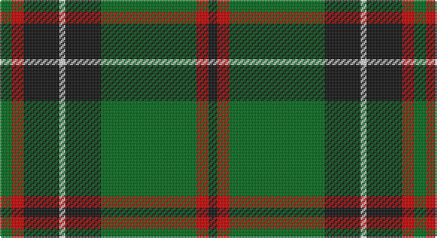

This page is one **sett** — a single exact thread-count. It belongs to the [tartan](/setts/g4r4k12w2k12g32r4k3/)
(the same proportion at any scale), whose colour order is pattern [GRKWKGRK](/stripes/grkwkgrk/).

Part of the [MacHardy](/tartans/machardy/) tartan — the named design grouping this sett with its other cloths.

Sourced from register-of-tartans.  It is a [8 stripe tartan](/stripes/stripes8/).

Original link https://www.tartanregister.gov.uk/tartanDetails.aspx?ref=2467

## Also known as

This cloth is also recorded under:

- MacHardy Black
- MacHardy, Blue

## Register references

External register numbers recorded for this tartan.

- Scottish Register of Tartans: [2467](https://www.tartanregister.gov.uk/tartanDetails.aspx?ref=2467)
- Scottish Tartans Authority (ITI): 1000
- Scottish Tartans World Register: 1000

## Thread count
G/8 R8 K24 LN4 K24 G64 R8 K/6

One full sett is **278 threads**.

## Palette

Palette: <strong>Tartan Register</strong>
<table><thead><tr><th>Colour</th><th>Threads</th><th>Shade</th><th>Base</th><th>OKLCh</th></tr></thead><tbody><tr><td>G/</td><td style="text-align:right;font-variant-numeric:tabular-nums">8</td><td><code style="background-color:#006818;">#006818</code> <small style="color:#888">#006818</small></td><td>G <code style="background-color:#006100;">#006100</code></td><td><small style="color:#888">oklch(45.0% 0.142 145.0)</small></td></tr><tr><td>R</td><td style="text-align:right;font-variant-numeric:tabular-nums">8</td><td><code style="background-color:#C80000;">#C80000</code> <small style="color:#888">#C80000</small></td><td>R <code style="background-color:#CC0000;">#CC0000</code></td><td><small style="color:#888">oklch(52.3% 0.215 29.2)</small></td></tr><tr><td>K</td><td style="text-align:right;font-variant-numeric:tabular-nums">24</td><td><code style="background-color:#101010;">#101010</code> <small style="color:#888">#101010</small></td><td>K <code style="background-color:#000000;">#000000</code></td><td><small style="color:#888">oklch(17.3% 0.000 89.9)</small></td></tr><tr><td>LN</td><td style="text-align:right;font-variant-numeric:tabular-nums">4</td><td><code style="background-color:#E0E0E0;">#E0E0E0</code> <small style="color:#888">#E0E0E0</small></td><td>W <code style="background-color:#F7F7F7;">#F7F7F7</code></td><td><small style="color:#888">oklch(90.7% 0.000 89.9)</small></td></tr><tr><td>K</td><td style="text-align:right;font-variant-numeric:tabular-nums">24</td><td><code style="background-color:#101010;">#101010</code> <small style="color:#888">#101010</small></td><td>K <code style="background-color:#000000;">#000000</code></td><td><small style="color:#888">oklch(17.3% 0.000 89.9)</small></td></tr><tr><td>G</td><td style="text-align:right;font-variant-numeric:tabular-nums">64</td><td><code style="background-color:#006818;">#006818</code> <small style="color:#888">#006818</small></td><td>G <code style="background-color:#006100;">#006100</code></td><td><small style="color:#888">oklch(45.0% 0.142 145.0)</small></td></tr><tr><td>R</td><td style="text-align:right;font-variant-numeric:tabular-nums">8</td><td><code style="background-color:#C80000;">#C80000</code> <small style="color:#888">#C80000</small></td><td>R <code style="background-color:#CC0000;">#CC0000</code></td><td><small style="color:#888">oklch(52.3% 0.215 29.2)</small></td></tr><tr><td>K/</td><td style="text-align:right;font-variant-numeric:tabular-nums">6</td><td><code style="background-color:#101010;">#101010</code> <small style="color:#888">#101010</small></td><td>K <code style="background-color:#000000;">#000000</code></td><td><small style="color:#888">oklch(17.3% 0.000 89.9)</small></td></tr></tbody></table>

# Sample pattern

## Compared to the master

This cloth is one sett of its design; the master sett (the exemplar the design is anchored on) is below for comparison.

<figure style="margin:0"><figcaption style="color:#888;font-size:smaller">this sett</figcaption></figure>
<figure style="margin:0"><figcaption style="color:#888;font-size:smaller"><a href="/setts/db1r1g6db6ly1db6r1g1/">master sett →</a></figcaption></figure>

## Nearest tartans

The nearest existing variants by ΔTartan distance, with this tartan at the top so the swatches line up against it.

ΔTartan

Tartan

Sett

—

<a href="/ttd/edit/#slug=g4r4k12w2k12g32r4k3~x2">MacHardy (Clans Originaux)</a> <a class="nn-out" href="/variants/s8/g4r4k12w2k12g32r4k3~x2/" title="open its dictionary page">↗</a>

0.80

<a href="/ttd/edit/#slug=k7g6ly3k12r19k12g62k62g12r7&amp;base=g4r4k12w2k12g32r4k3~x2">Danareth</a> <a class="nn-out" href="/variants/s10/k7g6ly3k12r19k12g62k62g12r7/" title="open its dictionary page">↗</a>

0.88

<a href="/ttd/edit/#slug=k60g64dg5g8dg5g64k60ly8k8ly8&amp;base=g4r4k12w2k12g32r4k3~x2">Sin-Cos (Corporate)</a> <a class="nn-out" href="/variants/s10/k60g64dg5g8dg5g64k60ly8k8ly8/" title="open its dictionary page">↗</a>

0.98

<a href="/ttd/edit/#slug=g5k2g28k10o26db4g4~x2&amp;base=g4r4k12w2k12g32r4k3~x2">John Telfar, Dunbar hunting</a> <a class="nn-out" href="/variants/s7/g5k2g28k10o26db4g4~x2/" title="open its dictionary page">↗</a>

1.04

<a href="/ttd/edit/#slug=k4g32k4g4k8w3k8t4~x2&amp;base=g4r4k12w2k12g32r4k3~x2">Hartmann (Personal)</a> <a class="nn-out" href="/variants/s8/k4g32k4g4k8w3k8t4~x2/" title="open its dictionary page">↗</a>

1.05

<a href="/ttd/edit/#slug=r3g14k2p2g14k36ly3~x2&amp;base=g4r4k12w2k12g32r4k3~x2">Vipont (Yellow line)</a> <a class="nn-out" href="/variants/s7/r3g14k2p2g14k36ly3~x2/" title="open its dictionary page">↗</a>

1.06

<a href="/ttd/edit/#slug=g36k2g2k2g3k12t10r20~x2&amp;base=g4r4k12w2k12g32r4k3~x2">Georgia, State of</a> <a class="nn-out" href="/variants/s8/g36k2g2k2g3k12t10r20~x2/" title="open its dictionary page">↗</a>

1.08

<a href="/ttd/edit/#slug=r3g30k12g6k16ly2~x2&amp;base=g4r4k12w2k12g32r4k3~x2">MacArthur (Variant)</a> <a class="nn-out" href="/variants/s6/r3g30k12g6k16ly2~x2/" title="open its dictionary page">↗</a>

1.08

<a href="/ttd/edit/#slug=k4gi13k4g8k44g8k4gi13k4w3~x2&amp;base=g4r4k12w2k12g32r4k3~x2">Childers</a> <a class="nn-out" href="/variants/s10/k4gi13k4g8k44g8k4gi13k4w3~x2/" title="open its dictionary page">↗</a>

1.10

<a href="/ttd/edit/#slug=k7r3k27g27ly3g3ly3g3~x2&amp;base=g4r4k12w2k12g32r4k3~x2">Brunton (Personal)</a> <a class="nn-out" href="/variants/s8/k7r3k27g27ly3g3ly3g3~x2/" title="open its dictionary page">↗</a>

1.12

<a href="/ttd/edit/#slug=r4g4k2g31k10ly3g5k11g6k3~x2&amp;base=g4r4k12w2k12g32r4k3~x2">MacArthur-Fox Green</a> <a class="nn-out" href="/variants/s10/r4g4k2g31k10ly3g5k11g6k3~x2/" title="open its dictionary page">↗</a>

## Neighbour map

Every grey dot is one of 14360 variants placed by the first two principal components of the ΔTartan feature space (44% of its variance). Red is this tartan; blue dots are its nearest — click one to open its page.

<svg viewBox="0 0 640 380" role="img" style="max-width:100%;height:auto;border:1px solid #e0e0e0;border-radius:4px;display:block" xmlns="http://www.w3.org/2000/svg"><image href="/nn/cloud.v1.png" width="640" height="380"/><a href="/variants/s10/k7g6ly3k12r19k12g62k62g12r7/"><circle cx="277.4" cy="151.3" r="4" fill="#3465a4"><title>Danareth</title></circle></a><a href="/variants/s10/k60g64dg5g8dg5g64k60ly8k8ly8/"><circle cx="282.1" cy="190.6" r="4" fill="#3465a4"><title>Sin-Cos (Corporate)</title></circle></a><a href="/variants/s7/g5k2g28k10o26db4g4~x2/"><circle cx="253.1" cy="191.6" r="4" fill="#3465a4"><title>John Telfar, Dunbar hunting</title></circle></a><a href="/variants/s8/k4g32k4g4k8w3k8t4~x2/"><circle cx="304.9" cy="191.4" r="4" fill="#3465a4"><title>Hartmann (Personal)</title></circle></a><a href="/variants/s7/r3g14k2p2g14k36ly3~x2/"><circle cx="303.4" cy="161.5" r="4" fill="#3465a4"><title>Vipont (Yellow line)</title></circle></a><a href="/variants/s8/g36k2g2k2g3k12t10r20~x2/"><circle cx="273.2" cy="166.1" r="4" fill="#3465a4"><title>Georgia, State of</title></circle></a><a href="/variants/s6/r3g30k12g6k16ly2~x2/"><circle cx="319.1" cy="214.6" r="4" fill="#3465a4"><title>MacArthur (Variant)</title></circle></a><a href="/variants/s10/k4gi13k4g8k44g8k4gi13k4w3~x2/"><circle cx="329.1" cy="171.7" r="4" fill="#3465a4"><title>Childers</title></circle></a><a href="/variants/s8/k7r3k27g27ly3g3ly3g3~x2/"><circle cx="251.8" cy="189.6" r="4" fill="#3465a4"><title>Brunton (Personal)</title></circle></a><a href="/variants/s10/r4g4k2g31k10ly3g5k11g6k3~x2/"><circle cx="349.3" cy="176.5" r="4" fill="#3465a4"><title>MacArthur-Fox Green</title></circle></a><circle cx="296.3" cy="177.0" r="5" fill="#c00000"/></svg>

ID: /variants/s8/g4r4k12w2k12g32r4k3~x2/
