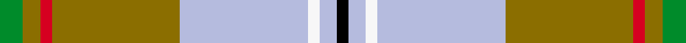

This is one **variant** — a specific cloth: this exact thread count and colourway, with its own
provenance below. It is one weaving of the [sett](/setts/g4y3r2y22lb22w2lb3k2/) (the scale-free proportion — the
same cloth at any scale or shade), whose colour order is pattern [GGRGWWWK](/stripes/ggrgwwwk/).

Part of the [Aguilar Pardo, Luis Alejandro](/tartans/a/ag/aguilar-pardo-luis-alejandro/) tartan — the named design grouping this sett with its other cloths.

Sourced from register-of-tartans.  It is a [8 stripe tartan](/stripes/stripes8/).

Original link [https://www.tartanregister.gov.uk/tartanDetails.aspx?ref=11147](https://www.tartanregister.gov.uk/tartanDetails.aspx?ref=11147)

Dataset <small>— provenance for this record, inherited from the source manifest</small>

<dl class="dataset-prov">
<dt>source</dt><dd><a href="/sources/register-of-tartans/">Scottish Register of Tartans</a></dd>
<dt>data captured from</dt><dd><a href="https://github.com/thetartan/tartan-database/blob/master/data/register-of-tartans/data.csv">https://github.com/thetartan/tartan-database/blob/master/data/register-of-tartans/data.csv</a></dd>
<dt>data date</dt><dd>16/02/2014 <small>(this record)</small></dd>
<dt>licence</dt><dd><a href="https://www.tartanregister.gov.uk/copyright">Crown copyright</a></dd>
</dl>

Capture chain <small>— the hands this data passed through, oldest first; each capture carries its own licence</small>

<ol class="capture-chain">
<li><a href="https://www.tartanregister.gov.uk/">Scottish Register of Tartans</a> · <a href="https://www.tartanregister.gov.uk/copyright">Crown copyright</a> <small>the living register — still published by National Records of Scotland</small></li>
<li><a href="https://github.com/thetartan/tartan-database">thetartan/tartan-database</a> <small>2016-2017</small> · <a href="https://creativecommons.org/licenses/by-nc-nd/4.0/">CC BY-NC-ND 4.0</a> <small>Levko Kravets's frozen compilation — the capture we vendored, and where its CC licence text came from</small></li>
<li>this dictionary <small>captured 2026-06-10 · commit 5bf86c7566</small> <small>each re-capture is a git commit to data/sources</small></li>
</ol>

## Register references

External register numbers recorded for this tartan.

- Scottish Register of Tartans: [11147](https://www.tartanregister.gov.uk/tartanDetails.aspx?ref=11147)

## Thread count
G/8 Y6 R4 Y44 LB44 W4 LB6 K/4

One full sett is **228 threads**.

## Palette
<table><thead><tr><th>Colour</th><th>Shade</th><th>OKLCh</th></tr></thead><tbody><tr><td>G</td><td><code style="background-color:#008B2A;">#008B2A</code> <small style="color:#888">#008B2A</small></td><td><small style="color:#888">oklch(55.4% 0.170 145.9)</small></td></tr><tr><td>K</td><td><code style="background-color:#000000;">#000000</code> <small style="color:#888">#000000</small></td><td><small style="color:#888">oklch(0.0% 0.000 0.0)</small></td></tr><tr><td>LB</td><td><code style="background-color:#B5BBDE;">#B5BBDE</code> <small style="color:#888">#B5BBDE</small></td><td><small style="color:#888">oklch(79.9% 0.050 277.6)</small></td></tr><tr><td>Y</td><td><code style="background-color:#8B6E00;">#8B6E00</code> <small style="color:#888">#8B6E00</small></td><td><small style="color:#888">oklch(55.1% 0.113 90.4)</small></td></tr><tr><td>R</td><td><code style="background-color:#D60020;">#D60020</code> <small style="color:#888">#D60020</small></td><td><small style="color:#888">oklch(55.2% 0.224 25.5)</small></td></tr><tr><td>W</td><td><code style="background-color:#F7F7F7;">#F7F7F7</code> <small style="color:#888">#F7F7F7</small></td><td><small style="color:#888">oklch(97.6% 0.000 89.9)</small></td></tr></tbody></table>

# Sample pattern

## Nearest tartan variants

The nearest existing variants by ΔTartan distance, with this cloth at the top so the swatches line up against it.

ΔTartan

Threads

Variant

Sett

—

228

<a href="/variants/s8/g4y3r2y22lb22w2lb3k2~x2/">Aguilar Pardo, Luis Alejandro (Personal)</a>

<a href="/ttd/edit/#slug=g4ly3r2ly22lb22w2lb3k2~x2&amp;base=g4y3r2y22lb22w2lb3k2~x2" title="compare in the TTD">0.16</a>

228

<a href="/variants/s8/g4ly3r2ly22lb22w2lb3k2~x2/">Pardo, Luis Alejandro Aguilar</a>

<a href="/ttd/edit/#slug=k2lg3w2lg3n4lg19o6n23r3ly2~x2~n1900000-o2500000&amp;base=g4y3r2y22lb22w2lb3k2~x2" title="compare in the TTD">2.90</a>

260

<a href="/variants/s10/k2lg3w2lg3n4lg19o6n23r3ly2~x2~n1900000-o2500000/">MacLeroy &amp; Troine</a>

<a href="/ttd/edit/#slug=lb3n1k1r12b1g9b1n1lb3~x2&amp;base=g4y3r2y22lb22w2lb3k2~x2" title="compare in the TTD">2.92</a>

116

<a href="/variants/s9/lb3n1k1r12b1g9b1n1lb3~x2/">Murray of Abercairney</a>

<a href="/ttd/edit/#slug=k3r1y1lb11g13lb5r1y1~x4&amp;base=g4y3r2y22lb22w2lb3k2~x2" title="compare in the TTD">2.96</a>

272

<a href="/variants/s8/k3r1y1lb11g13lb5r1y1~x4/">Snodgrass (Clan)</a>

<a href="/ttd/edit/#slug=w3lb25dr3r3dr3r8g21dr3k2~x2&amp;base=g4y3r2y22lb22w2lb3k2~x2" title="compare in the TTD">3.03</a>

274

<a href="/variants/s9/w3lb25dr3r3dr3r8g21dr3k2~x2/">Dunedin (USA) (District)</a>

<a href="/ttd/edit/#slug=lo4g2lo2g2lo2g24k2r16w9db3~x2~w3600000&amp;base=g4y3r2y22lb22w2lb3k2~x2" title="compare in the TTD">3.03</a>

250

<a href="/variants/s10/lo4g2lo2g2lo2g24k2r16w9db3~x2~w3600000/">North West Territories</a>

<a href="/ttd/edit/#slug=y4g2y2g2y2g24k2r16w9db3~x2&amp;base=g4y3r2y22lb22w2lb3k2~x2" title="compare in the TTD">3.08</a>

250

<a href="/variants/s10/y4g2y2g2y2g24k2r16w9db3~x2/">North West Territories Canadian District Tartan</a>

<a href="/ttd/edit/#slug=lb4r3y2r9lb3g24lb3r9k3r3w2~x2&amp;base=g4y3r2y22lb22w2lb3k2~x2" title="compare in the TTD">3.13</a>

248

<a href="/variants/s11/lb4r3y2r9lb3g24lb3r9k3r3w2~x2/">Wilson's, No 128</a>

<a href="/ttd/edit/#slug=k3r1ly1lb11g13lb5r1ly1~x4~r2109032-ly3307090-g2408144&amp;base=g4y3r2y22lb22w2lb3k2~x2" title="compare in the TTD">3.18</a>

272

<a href="/variants/s8/k3r1ly1lb11g13lb5r1ly1~x4~r2109032-ly3307090-g2408144/">Snodgrass</a>

<a href="/ttd/edit/#slug=lo4g2lo2g2lo2g24k2r16w9db3~x2&amp;base=g4y3r2y22lb22w2lb3k2~x2" title="compare in the TTD">3.23</a>

250

<a href="/variants/s10/lo4g2lo2g2lo2g24k2r16w9db3~x2/">North West Territories (District)</a>

## Neighbour map

Every grey dot is one of 13621 variants placed by the first two principal components of the ΔTartan feature space (42% of its variance). Red is this tartan; blue dots are its nearest — click one to open its page.

<svg viewBox="0 0 640 380" role="img" style="max-width:100%;height:auto;border:1px solid #e0e0e0;border-radius:4px;display:block" xmlns="http://www.w3.org/2000/svg"><image href="/nn/cloud.v1.png" width="640" height="380"/><a href="/variants/s8/g4ly3r2ly22lb22w2lb3k2~x2/"><circle cx="227.6" cy="153.4" r="4" fill="#3465a4"><title>Pardo, Luis Alejandro Aguilar</title></circle></a><a href="/variants/s10/k2lg3w2lg3n4lg19o6n23r3ly2~x2~n1900000-o2500000/"><circle cx="170.8" cy="129.6" r="4" fill="#3465a4"><title>MacLeroy &amp; Troine</title></circle></a><a href="/variants/s9/lb3n1k1r12b1g9b1n1lb3~x2/"><circle cx="161.0" cy="132.7" r="4" fill="#3465a4"><title>Murray of Abercairney</title></circle></a><a href="/variants/s8/k3r1y1lb11g13lb5r1y1~x4/"><circle cx="198.5" cy="151.5" r="4" fill="#3465a4"><title>Snodgrass (Clan)</title></circle></a><a href="/variants/s9/w3lb25dr3r3dr3r8g21dr3k2~x2/"><circle cx="134.8" cy="135.4" r="4" fill="#3465a4"><title>Dunedin (USA) (District)</title></circle></a><a href="/variants/s10/lo4g2lo2g2lo2g24k2r16w9db3~x2~w3600000/"><circle cx="159.5" cy="125.8" r="4" fill="#3465a4"><title>North West Territories</title></circle></a><a href="/variants/s10/y4g2y2g2y2g24k2r16w9db3~x2/"><circle cx="158.5" cy="126.6" r="4" fill="#3465a4"><title>North West Territories Canadian District Tartan</title></circle></a><a href="/variants/s11/lb4r3y2r9lb3g24lb3r9k3r3w2~x2/"><circle cx="153.5" cy="125.4" r="4" fill="#3465a4"><title>Wilson's, No 128</title></circle></a><a href="/variants/s8/k3r1ly1lb11g13lb5r1ly1~x4~r2109032-ly3307090-g2408144/"><circle cx="219.6" cy="139.0" r="4" fill="#3465a4"><title>Snodgrass</title></circle></a><a href="/variants/s10/lo4g2lo2g2lo2g24k2r16w9db3~x2/"><circle cx="152.7" cy="123.7" r="4" fill="#3465a4"><title>North West Territories (District)</title></circle></a><circle cx="216.0" cy="146.7" r="5" fill="#c00000"/><text x="320" y="376" text-anchor="middle" font-size="11" fill="#999">ground</text><text x="11" y="190" text-anchor="middle" font-size="11" fill="#999" transform="rotate(-90 11 190)">complexity</text></svg>

ID: /variants/s8/g4y3r2y22lb22w2lb3k2~x2/
